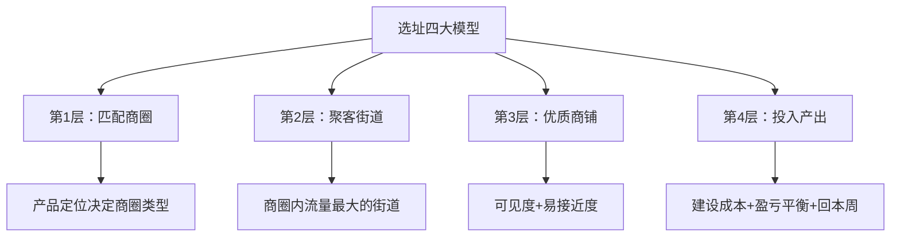
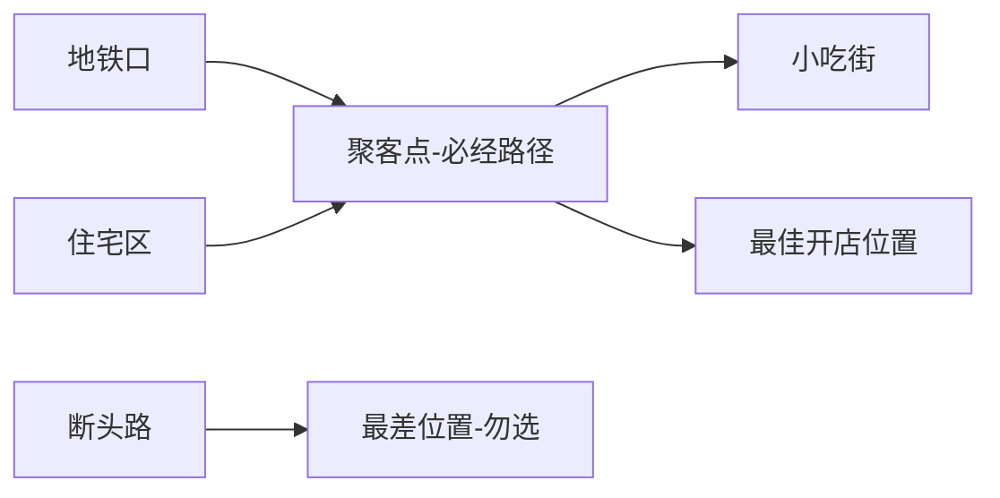

## 课程概览

餐饮人都知道：**选址定生死**。很多人愿意花几十万甚至上百万投资一个铺子，却不舍得花时间找个好位置。本节系统讲解选址的完整流程和评估体系。

---

## 一、选址四大模型

选址遵循从大到小的层级递进逻辑：

### 第一步：产品定位

先明确卖什么产品，再决定到什么位置开店。火锅去火锅该去的地方，小吃去小吃该去的地方。**不是人流量大的地方都适合做小吃**。

> [!warning] 常见误区
> 并非所有流量大的地方都适合小吃。医院周边不适合（病患无心品尝），火车站周边也不适合（旅客匆匆赶路）。必须找到小吃生态良好的位置。

### 小吃的定位特征

- 小吃不是刚需产品（不像中餐、面馆、米线）
- 需求是弹性的，针对特定人群、特定位置才需要
- 选址不能按照刚需逻辑（小区楼下不一定行）

---

## 二、优质商圈四大类型

| 类型 | 适合原因 | 注意事项 |
|------|---------|---------|
| 步行街/商场 | 逛街的人会逛饿、逛累，停下来品尝小吃 | 需分析商场客流动线 |
| 小吃街/夜市 | 品类聚集形成规模效应，消费者慕名而来 | 转让费有高有低，需评估合理性 |
| 景点 | 游客天然有吃吃喝喝的需求，对新奇特感兴趣 | 受疫情影响大，需提前考虑 |
| 学校社区（大学/大型初高中） | 学生聚集，消费频率高 | 客单价不高，寒暑假影响大 |

### 评估标准：销售推动

**销售推动**是指商圈吸引人流的驱动因素。一个商圈的好坏取决于：

- **销售推动的数量**：有几个驱动因素
- **销售推动的大小**：每个驱动因素的规模有多大

> [!note] 案例：万达广场的销售推动
> 1. 商场本身的购物推动（逛街人群）
> 2. 写字楼/CBD的办公推动（白领人群）
> 3. 周边居民的生活推动（小区居住人群）
>
> 销售推动越多，商圈抗风险能力越强。如果商圈只有景点这一个推动，遇到疫情就会全线崩塌。

### 建设路的销售推动分析

1. **品牌推动**：已成为知名旅游打卡景点（主要推动）
2. **学生推动**：电子科技大学万人公寓位于建设路正中间
3. **居民推动**：周边几个大型小区

---

## 三、聚客点与人流动线

### 判断人流的两种方法

**方法一：蹲守计数法**
- 根据产品属性确定蹲守时间段（小吃是下午到晚上）
- 使用计数器按时间分段记录人流
- 分别采集周一到周五和周末的数据
- 对比不同商圈、不同位置的数据

**方法二：热力图法**
- 打开百度地图或高德地图的热力图
- 颜色越深表示居住人口越多
- 结合商家密度综合判断

### 聚客点

聚客点是指人流流动的**中心汇聚点**，即绝大部分人会经过的位置。

> [!tip] 关键原则
> 选定商圈后，必须找到聚客点。同样一条街，不同的位置流量差异巨大——这就是"真口岸"和"假口岸"的区别。

**选址要的是确定性，不是概率。** 宁可选租金8000的聚客点位置，不选租金3000的死角。好的位置成就好生意，差的位置可能导致倒闭。

---

## 四、商铺两要素

### 要素一：可见度——金边银边草肚皮

"金边银边草肚皮"是商铺可见度的经典规律：

| 位置类型 | 可见度 | 适合程度 |
|---------|-------|---------|
| 金边（街角/拐角） | 最佳，两边都看得到 | 非常推荐 |
| 银边（街边两侧） | 良好 | 推荐 |
| 草肚皮（街道中间/深处） | 差 | 不推荐 |

> [!note] 经验分享
> 链家、德佑等房产中介喜欢把店开在拐角处，玻璃墙全打穿，就是为了最大化可见度。不过在小吃街，由于人流量足够大，消费者的寻宝心理会弥补可见度不足。"好吃嘴"会走遍各个角落找美食。

### 要素二：易接近度

> [!warning] 台阶是杀手
> 哪怕只有一级台阶，也会阻挡大量顾客。人的心理是：希望平顺地走到店铺前消费，不愿意爬台阶。

- 二楼商铺是餐饮杀手——可见度差、接近度差
- 尽量选择平层、无台阶的商铺

---

## 五、商铺具体问题分析

### 1. 证照办理

| 事项 | 说明 |
|------|------|
| 营业执照 | 个体工商户，一般5个工作日，免费办理 |
| 食品经营许可证 | 之前叫卫生许可证，同样5个工作日 |
| 三小备案 | 历史遗留问题的商铺可以办理，替代正式证照 |

> [!warning] 没有证照的后果
> 无法上美团、饿了么、抖音团购等平台，推广和外卖全部被挡在门外。执法部门检查时面临查封风险。

### 2. 排油烟

冬季产品多为煎炸焗炒类，需要有排烟设施。如果店铺无法排烟，会限制产品选择和换品灵活性。

### 3. 转让费评估

**转让费不属于投资，属于押金**——关键在于评估商圈未来3-5年是否能持续火热。

评估方法：
- 在周边摸查58同城、链家等平台同类铺子的转让费行情
- 了解是否有政府规划或开发商推动将提升商圈热度
- 观察商圈内大部分商家是否在赚钱，还是大面积转让
- 预期收益越高，需要准备的转让费越高

> [!tip] 预期与转让费的匹配
> 预期月赚15万 = 需准备约30万转让费（押金）。预期月赚3-5万 = 2-3万转让费即可。

---

## 六、竞品分析

| 分析维度 | 具体内容 |
|---------|---------|
| 竞争对手数量 | 是否已经白热化？数量太多就撤退 |
| 同品类经营数据 | 摸清商圈的营业额天花板：最赚钱的商家卖什么、最差的卖什么 |
| 自身竞争优势 | 装修、品牌、产品上能否比竞品更具优势 |

**跟随策略**：竞品销量好的品类，可以在其旁边开同类店分流市场。

---

## 七、投入产出计算

### 建设成本构成

| 成本类别 | 项目 |
|---------|------|
| 转让费 | 属于押金，不计入实际成本 |
| 固定成本 | 技术学习 + 装修 + 广告 + 设备 |
| 经营成本 | 首批物料 + 房租押金 + 4-6倍租金 + 人工 + 营销 |

### 盈亏平衡点计算

> [!tip] 核心公式
> **盈亏平衡点 = (房租 + 人工 + 能源成本 + 杂费) / 天数 / 毛利率**

**案例计算：**
- 房租：5000元/月
- 人工：8000元/月
- 能源+其他：1000元/月
- 毛利率：65%
- 每日盈亏平衡点 = (5000 + 8000 + 1000) / 30 / 0.65 = **718元/天**

> [!note] 盈亏平衡点的意义
> 每天卖718元就保本，超出部分都是利润。这是考核员工、设置奖励的基础数据。没有这个数据，每天卖多少、赚多少都是懵的。

### 回本周期计算

**回本周期 = 开业前总成本（不含转让费） / 每月净利润**

开业成本 = 技术培训费 + 装修 + 设备

> [!warning] 关键认知
> 在回本周期完成之前，赚的钱都不算"赚钱"，只是在回本。只有本金拿回来了，之后的才是真正的利润。

### 选址评估表格

一个完整的选址评估应包含：
- 商圈分析（销售推动类型、数量、规模）
- 人流统计（分时段、分工作日/周末）
- 人群占比（15-28岁占比、学生占比等）
- 街道分析（聚客点数量、人流动线方向）
- 竞争对手分析（数量、经营数据）
- 财务测算（毛利率、建设成本、盈亏平衡点、回本周期）

---

## 复习清单

- [ ] 能说出选址四大模型的具体内容
- [ ] 知道优质商圈的四大类型及各自注意事项
- [ ] 理解销售推动的概念及其对商圈评估的意义
- [ ] 掌握判断人流的两种方法（蹲守法、热力图法）
- [ ] 能解释"金边银边草肚皮"的含义
- [ ] 理解易接近度对顾客决策的影响
- [ ] 掌握转让费的评估方法
- [ ] 能独立计算盈亏平衡点和回本周期
- [ ] 记住需要办理的证照类型和办理流程

## 自测问题

1. 一个商圈有三个销售推动（商场、写字楼、居民区），另一个商圈只有一个推动（景点），在疫情波动的情况下，你会选哪个？为什么？
2. 你的盈亏平衡点是每天800元，毛利率是60%，房租6000元/月，人工6000元/月，那么你的能源和其他费用是多少？
3. 如果你看中一个铺子，转让费要20万，你预期月赚3万。这个铺子该不该拿？如果不拿，你的方案是什么？

## 下一步

- [[0005-kai-dian-san-yao-su|开店三要素]] - 选址确定后，如何高效低成本开店
- [[0003-xuan-pin-si-wei|选品思维]] - 回顾选品知识，确保品类与选址匹配
