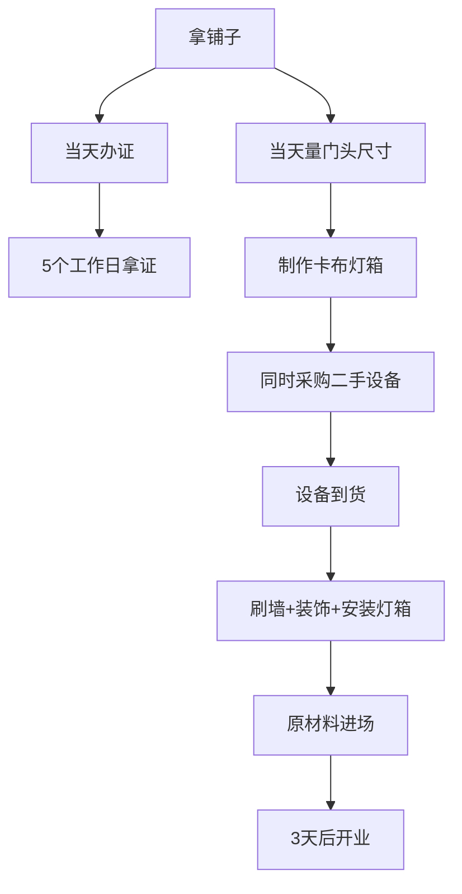

# 第05课：开店三要素 - 办证、装修装饰与采购

## 课程概览

> [!NOTE] 开店三要素
> 成功的开店 = **产品**（选对品类）+ **位置**（选对商圈和铺子）+ **团队**（选对人、有效管理）。其中选品和选址在前面已详述，本节聚焦开店落地的实操环节。

选品和选址完成后，就进入实际操作阶段。小吃店的开店周期可以压缩到**3天**，核心在于效率。本节从办证、装修装饰、设备与原材料采购三个方面讲解。

---

## 一、办证流程

### 需要办理的证照

| 证照 | 办理周期 | 是否收费 |
|------|---------|---------|
| 个体工商户营业执照 | 5个工作日（有的地方当天可取） | 免费 |
| 食品经营许可证 | 5个工作日 | 免费 |
| 三小备案（替代方案） | 视当地情况 | 免费 |

### 个体工商户营业执照所需材料

- 本人身份证原件及复印件
- 外来人员需居住证
- 经营场所租赁合同
- 房产证复印件
- 本人免冠一寸照片

> [!note] 各地差异
> 各地申请流程和材料要求可能有细微差异，以上为成都的通用流程。带着基本材料到当地工商所办理即可。

### 关键提示：提前办理

> [!tip] 不要等装修完再办证
> 店铺拿下来、拿到产权证后就应该立即提交办证资料。办理周期约5个工作日，要赶在开业前拿到。不然开业当天遇到执法部门检查，拿不出证照会很麻烦。

### 没有证照的后果

- 无法上美团、饿了么、抖音团购等平台
- 无法做外卖和线上推广
- 面临查封风险

---

## 二、轻装修重装饰实操

> [!warning] 核心原则
> 做小吃不是做酒楼，不需要富丽堂皇。顾客在门口买了就走，不会在你的店里坐着吃。**在装修上省钱，就是提升利润。**

### 为什么3天能开业

大型餐饮开店周期2-3个月甚至半年，小吃店3天搞定，原因就是不做重装修。

| 对比项 | 大型餐饮 | 小吃店 |
|-------|---------|-------|
| 装修周期 | 1-6个月 | 3天 |
| 装修投入 | 数十万到上百万 | 几百到几千 |
| 换品成本 | 需要重新装修 | 换块广告布即可 |

### 卡布灯箱广告（重中之重）

**这是换品的关键基础设施。**

| 优势 | 传统发光字 | 卡布灯箱 |
|------|----------|---------|
| 价格 | 按厘米计费，价格高 | 按平米计费，价格低 |
| 换品成本 | 需要整体更换 | 仅换一块布（约150元） |
| 更换时间 | 1-2天 | 5分钟 |
| 视觉效果 | 一般 | 灯光亮，远距离吸引人 |

> [!tip] 换品操作
> 卡布灯箱的底座不动，换品时只需扯下旧布，换上新项目的广告布，工人搭梯子5分钟搞定。一块布约150元。

### 吧台设计

吧台是固定设施，不论卖什么小吃都用得上。设计要点：

- **高度**：80厘米
- **移动性**：如需移动，底部加四个万向轮
- **储物**：下方做储物格，放日常用的小料
- **正面**：做卡布灯箱广告面

### 装修总成本参考

一间10平米左右的小吃店，简单装饰（刷白墙、贴装饰品、卡布灯箱门头、吧台）：

| 项目 | 预算参考 |
|------|---------|
| 墙面处理（刷白/扣板） | 几百元 |
| 装饰品（淘宝/拼多多） | 几百元 |
| 卡布灯箱门头（约2.4m宽） | 约3000元 |
| 吧台 | 约1000元 |
| **合计** | **约5000元** |

---

## 三、设备采购原则

### 核心原则：能用二手绝不用新

> [!note] 成本对比
> 带操作台的冰箱：二手400-500元 vs 全新2000-3000元。功能完全一样，省下的就是利润。

**为什么优先二手：**
1. 功能不受影响
2. 节省前期投入
3. 换品或转让时损失小（新设备转卖按废铁价称重）

### 二手设备购买渠道

| 渠道 | 说明 |
|------|------|
| 当地二手市场 | 直接去淘，有实物可看 |
| 咸鱼等二手平台 | 线上搜索，覆盖面广 |

### 设备投入参考

| 店铺类型 | 设备投入 |
|---------|---------|
| 建设路13家店中12家 | 设备不超过3000元 |
| 冰铺小店（唯一超1万的） | 约1.2-1.3万（进口刨冰机） |
| 脆皮五花/手打柠檬茶等 | 2000-3000元 |

---

## 四、原材料采购渠道

### 主要渠道：拼多多

> [!tip] 为什么是拼多多
> 淘宝等平台上的很多货源最终源头还是拼多多。拼多多上的厂家直销渠道价格最低。永哥团队已经对所有原材料供应商做过筛选，确保性价比最优。

**案例：冰汤圆**
- 单价14.8元/袋（同品质全网最低价）
- 学员自己做汤圆？不需要！用半成品，追求效率

### 原材料核心思路：能用半成品就用半成品

> [!warning] 效率第一
> 做小吃追求的是快速出餐、快速卖钱。把时间花在搓汤圆、熬红糖上毫无意义。市面上有成熟的半成品，直接采购使用即可。

例如：
- 冰汤圆：买现成的速冻汤圆
- 红糖水：买现成的红糖浆
- 酱料：买品牌成品酱料

只有必须现做现加工的（如现炸、现烤）才自己操作。

---

## 五、开店效率总结

一个标准小吃店的开业过程：
1. 拿铺子当天：提交办证资料 + 量门头尺寸做卡布灯箱
2. 第1-2天：刷白墙、做简单装饰、采购二手设备和原材料
3. 第3天：卡布灯箱安装、设备进场、物料摆放
4. **第3天开业**

> [!note] 轻装上阵的力量
> 因为投入低（设备几百到两三千），很多店开业第一周甚至第一天就能回本。去年脆皮五花店设备投入2000元，开业第一天营业额就超过1万。

---

## 复习清单

- [ ] 知道开办小吃店需要的证照类型和办理周期
- [ ] 理解"轻装修重装饰"的原则和原因
- [ ] 了解卡布灯箱的优势和操作方法
- [ ] 知道吧台的标准高度和设计要点
- [ ] 掌握设备采购的"二手优先"原则
- [ ] 了解原材料的主要采购渠道
- [ ] 理解"能用半成品就用半成品"的效率逻辑
- [ ] 能说出小吃店从拿铺子到开业的标准流程和时间表

## 自测问题

1. 为什么说"在装修上省钱就是提升利润"？请用具体数字说明。
2. 卡布灯箱相比传统发光字有哪些优势？为什么它特别适合小吃店换品的需求？
3. 你认为"能用半成品就不用自己动手"的原则会对出品质量有影响吗？如何平衡效率和品质？

## 下一步

- [[0006-yun-ying-guan-li|运营管理]] - 开店后如何管好财务、员工和执行换品
- [[0004-xuan-zhi-ti-xi|选址体系]] - 回顾选址知识，确保铺子选得对
