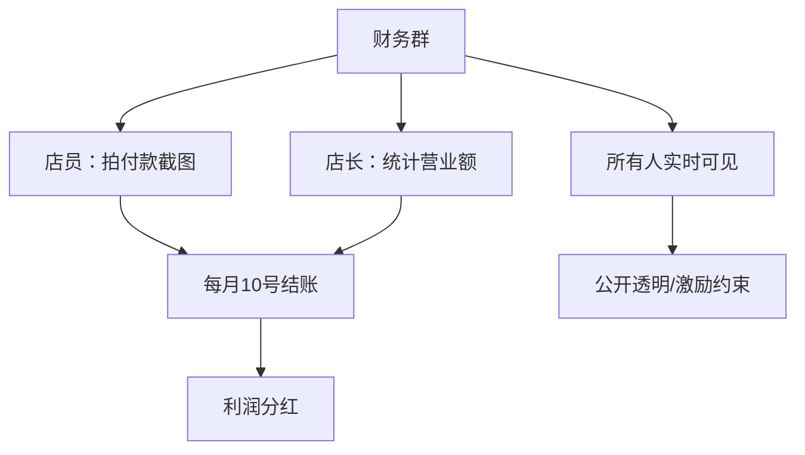
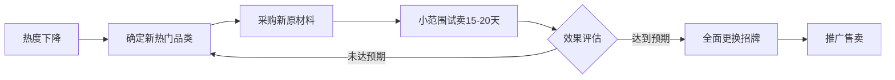
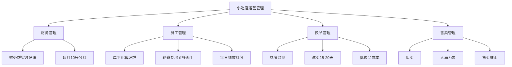

# 第06课：运营管理 - 财务、员工管理与售卖技巧

## 课程概览

从1家店到13家店、20多个员工、月流水几百万，勇哥走过很多弯路之后总结出适合小餐饮的科学管理方法。本节涵盖财务管理、员工管理、换品思维和售卖技巧四大板块。

---

## 一、财务管理：财务群记账与分红制度

### 财务群模式

每个店铺建立一个**财务群**，将店员、店长、股东都拉入群中。

**群内每天记录的内容：**
- 每一笔支出（无论大小）的付款截图
- 每天的总营业额统计
- 当天上班人员名单及各自销售业绩

### 财务群的优势

1. **数据实时可见**：管理人员可以实时看到店铺经营数据
2. **透明公开**：店员也能看到老板每天赚多少或赔多少
3. **激励与约束并存**：赚得多店员不好意思要奖金；赚得少也不好意思开口
4. **便于分红**：每月10号统一结算，上个月营业额减去所有支出得到利润，直接分红

> [!note] 为什么要公开
> 特别是合伙开店的情况，账目必须清楚。一个人管账、一个人管钱的方式容易乱。财务群模式让每个人随时都知道"钱花在哪、挣了多少"。

---

## 二、员工管理：扁平化管理+轮班制+绩效奖励

### 扁平化管理

将所有店员、店长、股东全部拉入一个群（总共约30-40人），不做复杂的内部管理系统。

**好处：**
- 沟通直接快速，有事群里一发大家都知道
- 不增加管理成本，不需要专门的办公软件
- 适合小团队规模

### 轮班制

让店员在不同店铺之间轮流上班，成为"多面手"。

**目的：**
- 每个店员学会不同品类的制作
- 有人调休或缺岗时，其他人能补上
- 节假日生意超忙时，可以从较闲的店铺调人手

> [!tip] 排班表
> 提前一周排出排班表，标明日期、店员姓名、所在店铺、休息日。店员提前知道每天在哪上班、找谁报到、准备什么物料。

### 工作日志

店员每天写简单的工作日志，记录：
- 当天的工作心态（开心的、难过的都可以写）
- 工作中发现的问题（产品、卫生、顾客反馈等）
- 对自己的评价和改进想法

> [!note] 工作日志的价值
> 通过日志了解员工心态是否正常、是否用心工作。不只是管理工具，也是团队关怀的方式。

### 绩效奖励制度

**核心逻辑：每日现金红包奖励，让店员为自己的收入而努力。**

| 业绩档位 | 每人每日奖励 |
|---------|------------|
| 达到目标（如7000元/天） | 30元 |
| 超过8000元 | 40-50元 |
| 超过9000元 | 50-60元 |
| 以此类推 | 逐档递增 |

> [!warning] 设定目标的关键原则
> - 目标不能太高：让大家觉得完不成，起不到激励作用
> - 目标不能太低：太容易拿到就失去挑战性
> - 区分周一到周五和周末：周末目标应高于工作日
> - 目的是让员工**能拿到**奖励，而不是拿不到

**为什么每天发红包：**
- 每天刺激才能保持积极性
- 月度结算激励效果远不如每日激励
- 节假日员工主动要求上班而不是休假——因为他们想多赚2000-5000元

**效果案例：**
- 如果当天目标8000元，卖到7800元时员工会主动加班，一定熬到8000元
- 每天多卖200元，10天多卖2000元，一个月多卖五六千元
- 店铺整体产值因此直接增加

---

## 三、换品思维

### 为什么要换品

小吃品类单一，不属于刚需产品。做的是当下热门的网红小吃，热度下降就必须换。

> [!warning] 常见思维误区
> 很多人做生意，直到一个项目干到头了、撞到南墙了才开始回头。不能这样。必须在产品热度下降、但还没亏钱的时候就及时调整。

### 换品的时机判断

- 每个店铺有预设的盈利预期（盈亏平衡点已算出）
- 当产品热度下降导致营业额不达预期时（如预期20万/月，降到10-15万），就要准备换
- 不需要等到亏钱再换

### 换品操作的流程

**具体操作步骤：**
1. **确定新品**：满足当下季节、网上热度高、辨识度高、颜值高、曝光量高的产品
2. **采购原材料**：利用已有的物资渠道采购新品材料
3. **试卖**：在现有招牌的角落挂一个小招牌，试卖15-20天
4. **评估效果**：如果每天增加1000-2000元营业额，说明可行
5. **全面更换**：效果OK就换掉卡布灯箱的布，效果不行继续找新品
6. **推广售卖**：参照之前的团购、推广方法进行营销

**成本控制：**
- 核心设备和吧台不变，无论卖什么产品都用得上
- 只需要换卡布灯箱的一块布（约150元）
- 试卖阶段零风险

> [!note] 案例：脆皮五花的换品
> 2021年10月上架脆皮五花，第一个月营业额42万、利润20多万。到2022年热度下降时果断换品，上了柠檬鸡爪、烧鸟等新品，持续保持盈利。

### 新品来源渠道

1. **互联网热度监测**：抖音、小红书、快手等平台的产品热度
2. **跟随勇哥步伐**：勇哥在卖什么、换什么品，学员可以同步
3. **实地考察**：到成都建设路或当地大型小吃街调研

---

## 四、三个售卖技巧

### 技巧一：叫卖

> [!tip] 数据驱动
> 假设一杯柠檬茶20元，叫卖多卖5单（每单约1.5杯=30元），一天多卖150元，一个月多卖4500元——这就是一个店员的工资。

**执行方法：**
1. 提炼产品的核心卖点，形成简短、朗朗上口的话术
2. 例："酸甜解腻的柠檬茶，要不要来一杯？解暑解渴，冰凉一夏！"
3. 喊得出来就真人叫卖，喊不出来用提前录好的小喇叭
4. 摆摊同样适用

### 技巧二：人满为患（排队效应）

利用人的**从众心理**——人们会本能地认为排队的店就是好吃的店。

**操作方法：**

| 情况 | 出餐策略 |
|------|---------|
| 顾客少（1-3人） | 做慢一点、做精致一点，让门口保持有人排队状态 |
| 顾客非常多（排长队） | 飞速出餐，快速卖钱，最大化营业额 |

> [!note] 关键控制
> 把出餐速度**做到可控**。人少的时候"制造排队"吸引新顾客，人多的时候追求效率。灵活调整。

### 技巧三：货卖堆山

把产品堆得满满的、看起来很壮观，给顾客视觉冲击。

- 菜农果农常用的技巧：把水果蔬菜堆得像山一样，看起来特别新鲜
- 小吃店同样适用：看起来量大、丰富、新鲜会刺激消费者的购买欲望
- 视觉上的"丰盛感"会让人觉得这家店生意好、东西好吃

---

## 运营管理全景图

---

## 复习清单

- [ ] 理解财务群记账模式的操作流程和优势
- [ ] 知道如何设定绩效奖励目标（不高不低、区分工作日和周末）
- [ ] 理解轮班制对培养"多面手"店员的重要性
- [ ] 掌握换品的时机判断标准（热度下降、营业额不达预期）
- [ ] 了解换品的操作流程和试卖方法
- [ ] 能说出三个售卖技巧及各自的操作要点
- [ ] 理解"出餐速度可控"在人满为患策略中的关键作用

## 自测问题

1. 财务群模式对合伙开店尤其重要，你能说出至少3个具体好处吗？
2. 如果你设定了一个月的绩效目标，但员工完全没有积极性，问题可能出在哪里？如何调整？
3. 假如你现在卖的一款小吃已经从月销20万降到了月销8万，盈亏平衡点是每天800元。你会怎么做？写出你的换品实施计划。

## 下一步

- 本课程是1.0基础篇的最后一课，如需深入学习，可进入2.0进阶课程
- [[0001-dao-yin-ke|引导课]] - 重新回顾种子计划的初心和整体框架
- 如果还没选好品，回顾 [[0003-xuan-pin-si-wei|选品思维]]；如果还没选好址，回顾 [[0004-xuan-zhi-ti-xi|选址体系]]
