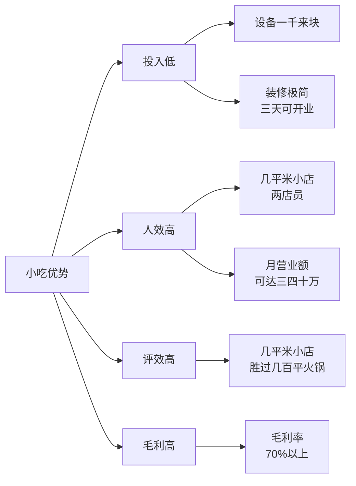
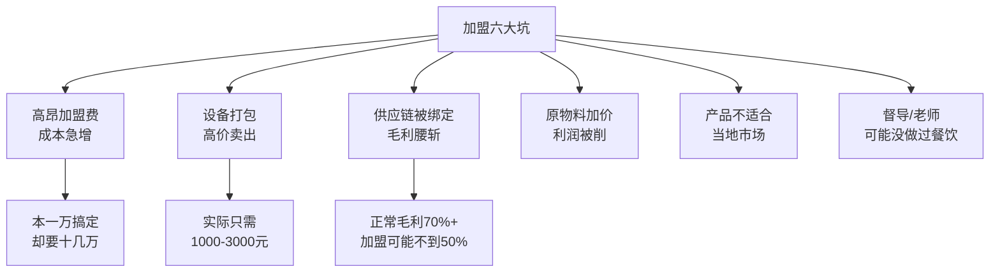
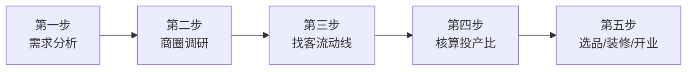

# 市场认知：小吃赛道与创业模式选择

## 课程概览

2.0进阶篇在第一课引导课中已经提出了"认知突破"的大方向。从本节课开始，我们将系统性地拆解小吃创业的每一个环节。第一步：搞清楚**小吃到底是一个什么赛道**、**什么样的人适合做**、以及**到底应该以什么模式进入**。

---

## 一、小吃赛道定义与市场规模

> [!NOTE] 核心定义
> 小吃有几千年的历史。以前是地方特色美食，随着时代进步逐渐进入全国视野。今天的小吃分为两大类：**传统小吃**和**网红小吃**。

### 小吃的品类属性

| 属性 | 说明 |
|------|------|
| 品类归属 | 休闲食品，非刚需食品 |
| 品类数量 | 成千上万，对应人群也成千上万 |
| 市场趋势 | 向四五线城市和县城发展 |
| 发展阶段 | 进入高速发展期 |

### 小吃的四大优势

> [!TIP] 关键认知
> 小吃之所以能造就如此多的致富案例，核心在于其**投入低、产出高、周转快**的商业模式特征。它不是刚需，但正因如此它依赖的是"冲动消费 + 规模人流"，选址逻辑和刚需餐饮完全不同。

---

## 二、适合做小吃的人群特征

> [!WARNING] 破除认知误区
> 很多人以为做小吃需要很好的技术、很多的资金、人脉资源。课程告诉你：**不是的**。即使没有钱、没有资源、没有人脉、没有技术、没有背景，仍然可以把小吃做起来。

### 小吃赛道的公平性

- 资金不够：花几千块做固定摊位，月入万二八千
- 资金充裕：找好位置，月入十万八万
- 投资曲线：**上升型**，快速落地、快速回款
- 早上采购的货物，晚上就能换成现金

### 必备素质

| 素质要求 | 说明 |
|----------|------|
| 执行力 | 搞定铺面、克服困难 |
| 吃苦准备 | 夏天高温、冬天寒冷 |
| 规划能力 | 不能想当然租个店铺就开 |

> [!NOTE] 课程核心主张
> 进入小吃行业，必须做好全局规划。不能想当然租个店铺、学个技术就开干。做好规划，小吃生意才会风风火火。后续课程将一步步教你如何规划。

---

## 三、加盟 vs 培训学校的本质分析

### 加盟的本质

> [!danger] 核心判断
> 课程**强烈反对加盟**。加盟的本质是你买一个"品牌"，但你以为的品牌只是你自己被广告洗脑了的品牌，不是消费者以为的品牌。品牌是对于消费者而言的，不是对于加盟商而言的。

### 加盟的六大坑

### 为什么明知有坑还去加盟

> [!WARNING] 核心原因
> 就一个原因：**认知不足 + 想躺赢**。没有专业的餐饮知识，老想着别人能帮扶自己，高枕无忧。结果往往事与愿违。

### 已经加盟了怎么办

| 步骤 | 行动 |
|------|------|
| 第一步 | 查询是否具备特许加盟资质（国家商务部官网） |
| 第二步 | 如无资质，可起诉要求退回加盟费及投入成本 |
| 第三步 | 及时止损 |

### 技术培训的本质

> [!WARNING] 技术只占10%
> 今天开好一家店，已经不是靠技术就能打天下的年代了。技术在整个开店成功的因素中，**只占10%**。你需要具备全面的综合能力——选址、选品、管理、运营、营销。

---

## 四、摆摊作为低风险试错方式

摆摊是进入小吃行业最低风险的试错方式。投入几千到一万，就能开始验证产品、积累经验。

### 摆摊 vs 开店对比

| 维度 | 摆摊 | 开店 |
|------|------|------|
| 投入 | 1-3万 | 5-20万+ |
| 风险 | 极低 | 中等 |
| 灵活性 | 高，可随时调整 | 低，合同制约 |
| 产品验证 | 快速测试市场 | 需提前确定 |
| 收入天花板 | 10-20万/年 | 20-100万+/年 |
| 适合人群 | 新手、资金有限者 | 有经验、资金充裕者 |

---

## 五、摆摊开店标准流程

> [!NOTE] 核心观点
> 开店/摆摊是一个系统工程，有一个**标准流程**。很多人想当然干——要么看到空铺就想拿，要么看到网上火的产品就想卖。这都是凭感觉、凭想象。

### 标准流程五步走

**第一步：需求分析（市场调研前置）**
- 在什么样的商圈做生意，就会成为什么样的人
- 调研整个区域，找哪个商圈更好、更赚钱、更符合小吃
- 调研越详细越好

**第二步：进入赚钱的商圈**
- 锁定商圈后想方设法进入
- 商圈很大，不是任何位置都能做

**第三步：找到客流动线**
- 即顾客都会经过的道路
- 经过的客人越多 = 消费越多 = 主动线

**第四步：核算投产比**
- 预估人流、预估日营业额
- 计算每天的成本
- 预估银额远大于成本 = 可以干
- 可核算出回本周期

**第五步：选品、装修、开业**
- 根据人群和竞品来规划产品
- 差异化选品或竞品选品
- 装修以节约、简单为目的
- 设备采买和开业

> [!TIP] 选址铁律
> 在一个商圈做生意，你的收入就是这个商圈老板的平均数。比如建设路商家每家一年赚100万，你到这里做，一年也能赚100万。这不是玄学，是数据验证的结果。

---

## 复习清单

- [ ] 能说出小吃的两大分类（传统小吃 vs 网红小吃）
- [ ] 能列出小吃的四大优势（投入低、人效高、评效高、毛利高）
- [ ] 理解小吃赛道的公平性：没钱没资源也能做
- [ ] 能解释为什么课程强烈反对加盟
- [ ] 记住技术只占开店成功因素的10%
- [ ] 能复述摆摊开店的标准五步流程
- [ ] 理解"选址前置"的重要性

## 自测问题

1. 小吃的品类属性是什么？它和刚需餐饮在选址上有何根本不同？
2. 如果你只有1万块资金，应该用什么方式进入小吃行业？
3. 加盟费为什么是"只消费不投资"？转让费和加盟费的本质区别是什么？
4. 请用自己的话描述摆摊开店的标准五步流程。

## 下一步

- 学习 [[0008-shang-quan-xuan-zhi|商圈选址进阶]] - 掌握小吃适配的商圈类型和市场调研方法
- 开始思考你所在的城市有哪些商圈可以初步勘察
