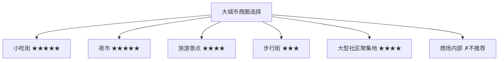
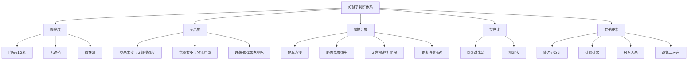

# 商圈选址进阶：从商圈到铺子的完整判断体系

## 课程概览

选址不是找铺面，而是**选商圈**。在错误的商圈里找到再好的铺子也无用。本节课将带你把选址拆解为"商圈类型判断 -> 市场调研 -> 人流动线分析 -> 好铺子三要素"四个递进环节。

---

## 一、小吃适配的商圈类型

### 大城市 vs 小地方的界定

| 类型 | 界定标准 |
|------|----------|
| 城市 | 地级市及以上市区 |
| 小地方 | 县城或乡镇 |

### 大城市推荐商圈（按推荐指数排序）

| 商圈类型 | 推荐指数 | 前期投入 | 预期年利润 | 发展方向 |
|----------|---------|---------|-----------|---------|
| 小吃街 | 五星 | 10-20万 | 20-40万 | 原地复制开店 |
| 夜市 | 五星 | 1-3万 | 10-20万 | 原地复制摊位 |
| 旅游景点 | 四星 | 20-40万 | 30-60万 | 多处拿摊位 |
| 步行街 | 三星 | 10-20万 | 10-20万 | 适合做品牌 |
| 大型社区聚集地 | 四星 | ~1万 | 10-20万 | 做口碑和复购 |
| 商场内部 | 不推荐 | — | — | — |

> [!WARNING] 商场为什么不推荐
> 小吃消费场景集中在晚上，而商场大多九点半或十点打烊。加上进场费、物业费高、要求多，对小吃人极不友好。

### 小地方推荐商圈

| 商圈类型 | 推荐指数 | 投入 | 年利润 | 发展建议 |
|----------|---------|------|-------|---------|
| 有小吃街/夜市 | 五星 | ~1万 | 10-15万 | 打造个人IP |
| 无人流聚集地 | 开店 | 数万 | 可做网红店 | 开大店，多品经营 |

> [!TIP] 小地方破局关键
> 在小县城，一定要成为当地的名人。打造IP属性——拍抖音，让大家知道你在卖什么，味道好。突破年收入10-15万天花板的唯一方式是把自己做成网红。

---

## 二、市场调研的两种方法

市场调研是整个生意的**第一步**。很多人一上来就找铺子，其实是赌博。

> [!WARNING] 调研不足的代价
> 你花1万、10万、20万开店，前期不做市场调研，和赌博没有区别。市场调研越精细、越完善，开店过程越轻松。

### 上法：销售推动分析

**什么是销售推动**：推动整个商圈去消费的人群。包括学生、居民、游客、白领、逛街人群等。

**如何判断商圈好坏**：
- 销售推动越多越好：多个人群支撑，抗风险能力强
- 销售推动越大越好：单个群体规模大，生意上限高

| 销售推动类型 | 如何判断 |
|-------------|---------|
| 写字楼白领 | 晚上看亮灯率，中午看外出吃饭人数 |
| 学生/游客 | 直接询问"你是这附近的还是外地来的" |
| 居民 | 看小区新旧程度（越新年轻人越多） |
| 季节影响 | 北方冬天和夏天的人流量差异 |

### 下法：店铺营业数据分析

| 数据维度 | 获取方法 |
|---------|---------|
| 营业额 | 问店员、看小票（早晚单号差）、蹲点数单量 |
| 客单价 | 看菜单和点餐 |
| 品类 | 统计整条街的店铺类型 |
| 口味偏向 | 观察消费者选择 |
| 营业时间 | 观察各时段经营情况 |

**蹲点方法论**：
- 周一到周四：挑2天统计
- 周五到周日：挑1天统计
- 统计每家店的进店人数、客单价
- 计算出整条街的平均营业额

> [!TIP] 获取数据的技巧
> 发挥"社交牛逼症"——买个东西后和店员聊，问一天能卖多少。看小票要注意起始单号，有些店从80号、100号开始叫号来营造生意好的假象。

---

## 三、人流动线判断技巧

> [!NOTE] 核心区分
> **人流不等于客流**。门口经过的人多不等于生意好。客流是符合消费场景、会进店消费的人。

### 人流 vs 客流的典型案例

| 场景 | 人流 | 客流 |
|------|------|------|
| 春熙路外围商铺 | 巨大 | 少（路过为主） |
| 地铁通道路边店 | 巨大（上班匆匆） | 少（不停留） |
| 小吃街中心位置 | 大且精准 | 高（目标明确） |

### 主动线 vs 次动线

| 维度 | 主动线 | 次动线 |
|------|-------|-------|
| 客流 | 更大 | 较小 |
| 租金 | 更贵 | 较便宜 |
| 生意 | 更好 | 可能一般 |
| 选择策略 | 优先考虑 | 算投产比后可考虑 |

### 聚客点

聚客点可以是网红店、商场、打卡点、景点。判断方法：**看哪个地方人流停留最多**。

> [!TIP] 找位置的核心逻辑
> 你的店铺越靠近聚客点，曝光量越好、可接近度越强。如果聚客点拿不到，就围绕聚客点旁边的位置延伸，越远客流越少。

---

## 四、好铺子三要素

判断一个铺子能否做，不能只看商圈和街道。需要评估以下核心要素：

### 曝光度

- 门头大小不能低于1.2米
- 被旁边大店遮挡的铺子谨慎考虑
- 需数店门口周一到周四、周五到周日的客流

### 竞品度

> [!WARNING] 极端情况
> 广州某大学城五六百家小吃商家，好的日卖1万，差的日卖四五百。竞品太多导致客流被极度分散。

### 易接近度

| 因素 | 影响 |
|------|------|
| 车辆停靠 | 方便停车才能截流 |
| 台阶 | 3-5个台阶就会让消费者觉得远 |
| 栏杆 | 一条马路+栏杆 = 生死的分界线 |
| 广场 | 距离消费者10米以上很难吸引过来 |

### 投产比计算

**日盈亏平衡点 = (日房租 + 日人工 + 日物业水电) / 毛利率**

> [!WARNING] 盈亏平衡点
> 无论商圈多好、位置多棒，算不过账的铺子坚决不能拿。房租再便宜，算不过账也没用；房租再贵，投产比划算就值得。

---

## 五、优质商圈的特征和优势

| 特征 | 说明 |
|------|------|
| 人满为患 | 好位置不可能空出来 |
| 商家稳定 | 大部分能盈利，不会轻易转让 |
| 经营轻松 | 客流充足，营销压力小 |
| 回本快 | 匹配好项目后快速起飞 |

### 新手找位置的误区

- 看到好商圈生意好，不知道从何下手
- 没有转让信息就放弃
- 不会深入商圈了解内部信息

> [!TIP] 正确做法
> 锁定好商圈后，一定要**深入进去**。把数据了解清楚——哪些商家不挣钱、哪些非餐饮业态、哪些快到期。精准打击、持续跟进。

---

## 复习清单

- [ ] 能说出大城市适合小吃的6种商圈类型及各自的推荐指数
- [ ] 能解释为什么商场内部不推荐做小吃
- [ ] 掌握销售推动分析方法
- [ ] 能说出获取店铺营业数据的三种方法（问、看小票、蹲点）
- [ ] 区分人流和客流
- [ ] 理解主动线和次动线的差异
- [ ] 能解释好铺子三要素（曝光度、竞品度、易接近度）
- [ ] 掌握盈亏平衡点的计算公式

## 自测问题

1. 一个商圈有5万人流但全是匆匆赶地铁的上班族，这是好人流还是好客流？为什么？
2. 你的理想商圈有200家小吃店，好还是不好？为什么？
3. 一个铺子门头只有0.8米宽，在主动线上，租金便宜50%，能拿吗？
4. 请写出日盈亏平衡点的计算公式，并解释每个变量的含义。

## 下一步

- 学习 [[0009-shang-wu-tan-pan|商务谈判]] - 如何在优质商圈用低成本拿到位置
- 拿起笔，开始调研你所在城市的3个商圈
