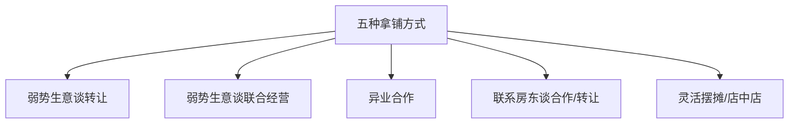
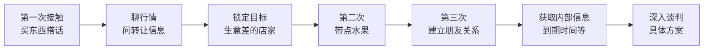
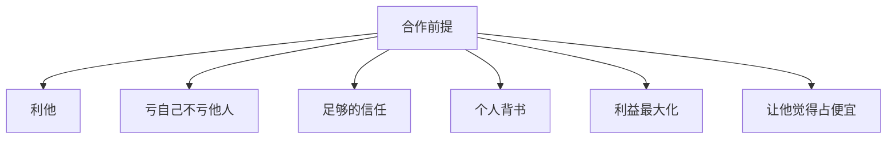

# 第09课：商务谈判 - 拿铺技巧与沟通策略

## 课程概览

优质商圈的好位置几乎不可能空出来。能空出来的基本都是位置很偏的。那么，如何在没有空铺的优质商圈拿到位置？答案是：**谈**。机会不是看出来的，是谈出来的。

---

## 一、优质商圈的现状

### 核心事实

- 好商圈一定人满为患
- 好位置不可能空出来
- 空出来的都是偏的、差的
- 大部分商家能盈利，即使赚得不多也不会走

### 新手找位置的两个误区

| 误区 | 问题 |
|------|------|
| 看到好商圈没转让就放弃 | 机会是谈出来的，不是看出来的 |
| 走一圈就完事 | 没有深入商圈了解内部信息 |

> [!WARNING] 正确做法
> 锁定商圈后，必须做到**精准打击、持续跟进**。了解哪些商家生意不好、哪些做得累、哪些快到到期，点对点去梳理情况。

---

## 二、商圈谈位置的五种方式

### 方式一：弱势生意谈转让

| 条件 | 操作 |
|------|------|
| 找生意做不好的商家 | 旁边日卖四五千，他只卖千八百 |
| 时机 | 他自信心受打击时 |
| 谈判要点 | 你不行，我来做 |
| 优势 | 位置在好商圈 |

### 方式二：弱势生意谈联合经营

| 优势 | 说明 |
|------|------|
| 省转让费 | 铺子是他的，不用给转让费 |
| 省装修 | 简单改造即可 |
| 双赢 | 他赚得比原来多，你拿到好位置 |

> [!TIP] 核心逻辑
> 他现在一月挣几千，你能帮他赚四五万。他一定愿意合作。你省了转让费，他赚了更多钱，双赢。

### 方式三：异业合作

非餐饮业态的店铺（水果店、小卖部、美容美甲、理发店）存在于好商圈中，他们的经营者可能：

- 不知道怎么做餐饮
- 觉得餐饮太复杂
- 没意识到可以赚更多

> [!NOTE] 机会点
> 如果你能告诉他"我有实力，我们可以一起来改造"，他就可能成为你的合作对象。

### 方式四：联系房东谈合作/转让

| 策略 | 操作 |
|------|------|
| 了解到期时间 | 调研哪些商铺快到期 |
| 直接谈涨租 | 在原租金基础上适当递增，拿下来自己做 |
| 谈利润分成 | 房东一年收租20-30万，你利润能到40-80万，可分他一份 |

### 方式五：灵活摆摊/店中店

| 形式 | 说明 |
|------|------|
| 店门口摆摊 | 和水果店、小卖部等合作，用门口空位 |
| 分摊租金 | 给他3000，你在他门口摆摊 |
| 稳定 | 比流动摊位稳定得多 |

---

## 三、谈判沟通技巧

### 获取信任的流程

### 沟通禁忌

> [!WARNING] 千万不要
> 不要一上来就问"老板你这个铺子转不转"或"你生意做得怎么样"。对方会非常反感，不会搭理你。

### 有效沟通方式

| 步骤 | 话术技巧 |
|------|---------|
| 搭话 | 他空闲时买他一个东西，放松他的防备 |
| 问信息 | "老板，这条街有没有铺子准备出租或转让的？" |
| 转话题 | "有没有哪些店做得比较辛苦的？" |
| 建立关系 | 第二天再去，带点水果，说"还在转，没找到" |
| 深入 | 让他觉得"这小伙子还不错，确实想在这做" |

> [!TIP] 耐心是关键
> 不可能一天谈好。两天三天，从沟通中让他知道你是认真的人。好的商圈一定有铺子流转——问题是你有没有耐心扎根进去。

---

## 四、合作案例详解

### 甘杂店合作案例

| 项目 | 内容 |
|------|------|
| 老板身份 | 原卖烟酒杂货 |
| 合作模式 | 永哥出项目+装修+设备，老板出铺子 |
| 股权 | 永哥60%，老板40% |
| 经营决策 | 永哥负责 |
| 分红 | 每月10号准时分红 |

### 合作六大原则

### 具体操作细节

| 项目 | 谁承担 | 效果 |
|------|--------|------|
| 装修广告设备 | 合作方出 | 他感觉占了便宜 |
| 换项目成本 | 合作方出 | 他觉得不用操心 |
| 项目推广 | 合作方出 | 花不了多少钱 |
| 经营决策 | 合作方定 | 专业人做专业事 |
| 工资 | 从营收支出 | 原有店员留下工作 |

> [!TIP] 吃亏是福
> 只有把你的很多利益让出去，整体的利益才会最大化。一个月赚5万，分2万给合作方，你还有3万。比起进不来这个商圈，3万就是赚的。

---

## 五、低成本拿铺技巧总结

| 技巧 | 说明 |
|------|------|
| 锁定一个商圈扎根 | 不要东看西看，像打井一样深挖 |
| 找弱势生意 | 生意差的才是你的机会 |
| 先交朋友再谈生意 | 建立信任比直接谈价格重要 |
| 利他思维 | 站在对方角度思考 |
| 做加法 | 帮他提高收入，而不是只压价 |
| 找非餐饮业态 | 水果店、小卖部、理发店都是潜在合作对象 |

> [!WARNING] 心态调整
> 很多人想"占便宜"去谈，谈不成。正确心态是：让他觉得他占了你的便宜。人都是喜欢占便宜的。

---

## 复习清单

- [ ] 能说出商圈拿位置的五种方式
- [ ] 理解弱势生意谈转让和联合经营的区别
- [ ] 理解异业合作的机会在哪里
- [ ] 掌握建立信任的沟通流程
- [ ] 记住"不要一上来就问转不转让"
- [ ] 理解合作六大原则
- [ ] 理解"让他觉得占便宜"的核心心态

## 自测问题

1. 如果你看中一个商圈但没有空铺，你会怎么做？
2. 一个生意很差的老板，你如何让他愿意把铺子交给你做？
3. 为什么说联合经营比直接转让更划算？
4. 如果老板一个月只赚2000，旁边的店赚5万，你和他谈合作的切入点是什么？

## 下一步

- 学习 [[0010-cheng-shi-ce-lue|城市策略]] - 了解大城市和小城市的不同开店策略
- 选定一个目标商圈，走一遍以上五种方式的调研
