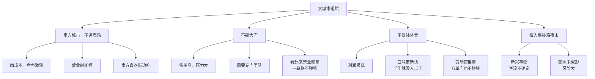
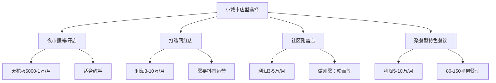

# 城市策略：大城市开小店，小城市做典型

## 课程概览

同样的餐饮项目，在大城市和小城市的开店策略完全不同。本节课帮你厘清：你在什么样的城市，应该做什么样的店型，以及千万不能碰什么。

---

## 一、大城市开小店

### 大城市的特点

| 特征 | 对创业的影响 |
|------|-------------|
| 人口密集 | 客流充足，但竞争激烈 |
| 租金高 | 成本压力大 |
| 竞争大 | 高手云集 |
| 风险大 | 租金高+竞争大=高风险 |

### 核心原则：面积不超过100平

> [!NOTE] 核心主张
> 不推荐新手在大城市开大店。运营能力不够、竞争激烈、风险太大。在大城市应该**开小店**。

### 推荐店型

| 店型 | 适用场景 | 优势 |
|------|---------|------|
| 小吃街店 | 网红小吃街 | 客流大，面积要求低 |
| 夜市摊位 | 固定摊位 | 投入1-3万，快速启动 |
| 社区刚需店 | 写字楼+社区 | 解决午餐和晚餐 |
| 夜宵店 | 南方社区 | 适合夜宵文化城市 |

### 千万不能碰的店型

### 大城市社区店的核心逻辑

> [!TIP] 刚需店选址逻辑
> 最佳组合是**写字楼+社区**。单纯写字楼只做中午一顿，营业额天花板低。有了社区补充晚餐，才能把一天的营业额做起来。

---

## 二、小城市做典型

### 小城市的客情

| 特征 | 影响 |
|------|------|
| 客流不足 | 营业额天花板有限 |
| 客流分散 | 难以形成规模聚集 |
| 人口少 | 县城人口通常3-5万 |

### 四种店型选择

### 重点：如何打造网红店

| 要素 | 要求 |
|------|------|
| 面积 | 有堂食空间 |
| 产品 | 1-2款爆品 + 附属菜品 |
| 装修 | 简约有风格（韩式、露营风等） |
| 推广 | 达人推广 + 自己拍抖音 |
| 定价 | 性价比高 |

> [!WARNING] 小城市的破局关键
> 人口基数决定了客流有限，但如果是**网红店**，可以吸引整个县城的客流。你要成为当地的名人——打造IP属性。

### 小城市开店的通用逻辑

| 原则 | 说明 |
|------|------|
| 向周边学习 | 找周边卖得好的店，直接复制已验证的模式 |
| 差异竞争 | 分析当地缺什么、差什么 |
| 多品经营 | 小城市适合做品种多的大店 |
| 网红思维 | 把自己做成打卡点 |

> [!TIP] 复制策略
> 到周边县城或乡镇找卖得好的同类产品，把它的菜品、店型、装修全部复制过来。被验证过的产品风险更低。

---

## 三、大城市 vs 小城市策略对比

| 维度 | 大城市 | 小城市 |
|------|--------|--------|
| 店型 | 小店（不超过100平） | 可开大店 |
| 产品 | 单品或少品 | 多品经营 |
| 选址 | 依赖商圈客流 | 可做运营引流 |
| 营销 | 自然流量为主 | 抖音+团购为主 |
| 回本周期 | 快（1-3个月） | 较慢（需养店） |
| 发展路径 | 原地复制 | 做当地标杆 |

---

## 复习清单

- [ ] 理解大城市为什么应该开小店
- [ ] 能说出大城市千万不能碰的三种店型
- [ ] 理解"写字楼+社区"组合的价值
- [ ] 能说出小城市四种店型的利润天花板
- [ ] 理解网红店在小城市的破局作用
- [ ] 掌握"向周边学习复制"的方法
- [ ] 能解释大城市和小城市策略的核心差异

## 自测问题

1. 你所在的城市属于大城市还是小城市？你的资金实力适合哪种店型？
2. 大城市为什么不能做纯外卖店？
3. 如果在一个5万人口的县城开店，什么店型最有可能突破年利润15万的天花板？
4. 请解释"复制已验证模式"在小城市开店中的价值。

## 下一步

- 学习 [[0011-xuan-pin-ti-xi|选品体系]] - 掌握选品分析四步法
- 根据你所在的城市类型，圈定2-3种可选店型
