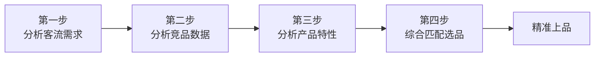
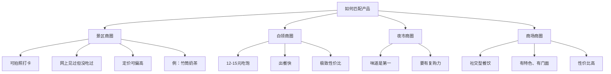
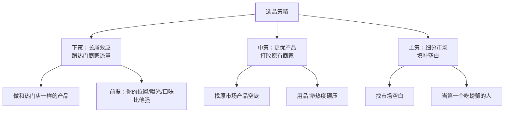
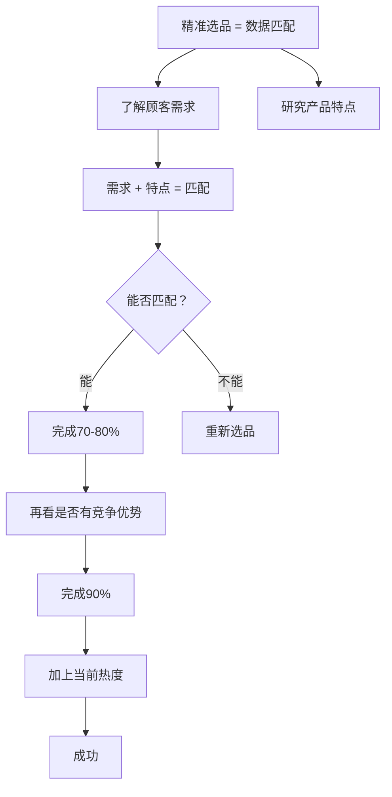

# 选品体系：选品分析四步法

## 课程概览

大多数人选品靠"我觉得"——我觉得这个味道好、我看到网上火、我看到某地卖得好。这些都是想象。真正的选品不是凭感觉，而是**通过数据精准匹配**。

> [!WARNING] 选品误区
> 很多做了多年餐饮的人，仍然没办法为自己的商圈精准选择适合的产品。原因就是：只凭感觉，不做数据分析。

---

## 选品四步法总览

---

## 第一步：分析客流的需求和兴趣

### 核心概念：销售推动

**销售推动** = 推动整个商圈去消费的人群。一个商圈的销售推动可能是多个群体的组合。

### 不同商圈的需求差异

> [!NOTE] 关键洞察
> **同样的一个人，在不同的消费场景中，需求完全不同。** 你不能把梳子卖给和尚。

| 商圈类型 | 顾客身份 | 主要需求 | 产品方向 |
|---------|---------|---------|---------|
| 景区 | 游客（本地+外地） | 打卡、拍照、新奇体验 | 有颜值的网红产品 |
| 写字楼 | 白领/上班族 | 果腹、快、性价比 | 刚需快餐、粉面 |
| 普通夜市 | 附近居民/工人 | 味道好、性价比 | 传统小吃加创新 |
| 商场 | 三五好友/家庭 | 社交、聚餐、有面 | 社交型餐饮 |
| 社区 | 居民 | 复购、口碑、便利 | 刚需+特色 |
| 小吃街 | 目标明确的食客 | 尝鲜、多样 | 新奇特色小吃 |

### 不同场景的具体产品策略

---

## 第二步：分析商圈的竞品数据

### 为什么要分析竞品

| 目的 | 具体内容 |
|------|---------|
| 推断商圈特征 | 大餐饮聚集=社交需求；快餐聚集=刚需 |
| 判断商户情况 | 了解竞争程度和饱和程度 |
| 挖掘商业机会 | 发现还缺什么，差什么品 |

### 竞品数据的获取方法

| 数据项 | 获取方式 |
|--------|---------|
| 品类 | 看一遍整条街的店 |
| 客单价 | 看菜单 |
| 堂食情况 | 观察就餐状态 |
| 每日营业额 | 问店员、看小票、（首尾单号差*客单价）、蹲点计数 |

> [!TIP] 如何判断营业额
> 看早上的起始单号（有些店不从1号开始）和晚上结束时的单号，单号差乘以客单价就是当日营业额。

### 通过竞品分析得到的结论

| 数据表现 | 结论 |
|---------|------|
| 商圈平均营业额高 | 消费水平高，商圈优质 |
| 营业额相差大（有的1万有的3000） | 竞争不激烈，有机会杀出 |
| 品类单一（全是小吃） | 商圈类型明确，只适合小吃 |
| 品类丰富 | 商圈成熟，需差异化突围 |

---

## 第三步：分析产品的特性

### 产品分析的维度

| 维度 | 说明 | 决策影响 |
|------|------|---------|
| 知名度 | 品类是否被市场验证 | 不需要教育用户 |
| 热度 | 当前是否是网红品类 | 自带流量 |
| 淡旺季 | 是否有季节性 | 冬天卖冰品很难 |
| 口味 | 是否适合当地 | 云贵川加鱼腥草，北方去掉 |
| 出餐速度 | 能否匹配消费场景 | 写字楼必须快 |
| 复购率 | 顾客是否会回头 | 社区店必须高复购 |
| 颜值 | 是否能拍照打卡 | 景区店必须高颜值 |

> [!WARNING] 选品铁律
> 永远要问自己：**我卖的产品，比同商圈竞品的优势在哪里？** 如果你的产品没有明显优势，就不要上。

---

## 第四步：综合匹配选品

### 三种选品策略

### 策略一：长尾效应（下策）

- 一条街上某家店排长队，其他店生意一般
- 说明这个品类已被验证有需求
- 你在他的动线前方、曝光比他好、卖同样产品
- 适合快速验证市场

### 策略二：更优产品（中策）

- 整条街都是杂牌奶茶，开一家品牌奶茶店
- 整条街全是煎炸炒，上一个饮品
- 用品牌力或品类热度碾压

### 策略三：细分市场（上策）

- 找到需求缺口
- 做竞品没有做或者做得不好的
- 在产品上做微创新（如：苕皮包小龙虾）

> [!TIP] 差异化创新的案例
> 同样是苕皮豆干，别人包牛肉肥肠，你做苕皮包小龙虾。一个品类的热度+差异化组合，就能把其他店的生意比下去。

---

## 选品四步法总结

> [!NOTE] 核心公式
> 所有精准匹配都来自**数据**。销售推动（消费人群）x 人群需求 x 消费场景 x 产品属性 = 成功的产品选择。

---

## 复习清单

- [ ] 能说出售卖推动的概念
- [ ] 能列出不同商圈（景区、写字楼、夜市、社区）各自适合的产品方向
- [ ] 掌握获取竞品营业数据的方法
- [ ] 能解释产品分析的8个维度
- [ ] 理解三种选品策略（长尾效应、更优产品、细分市场）
- [ ] 能说出"41码的脚穿40码的鞋"在选品中的含义
- [ ] 理解选品不是一个孤立环节，必须和商圈、位置结合

## 自测问题

1. 一个写字楼商圈，中午有大量白领，最适合卖什么类型的产品？
2. 一条小吃街，全是煎炸炒的店，没有一家饮品店，你会怎么选品？
3. 什么是长尾效应？什么条件下可以使用长尾效应选品？
4. 你觉得什么情况下"细分市场策略"比"蹭热门"更好？

## 下一步

- 学习 [[0012-zhuan-rang-fei|转让费评估]] - 评估转让费的实用方法
- 对你所在的目标商圈做一套完整的竞品数据统计
