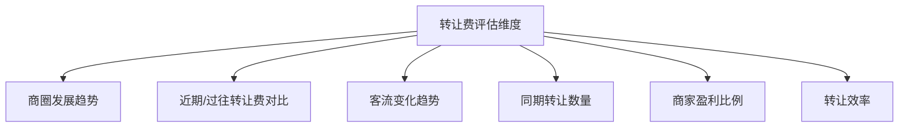

# 转让费评估：给多少、怎么给、哪些不能给

## 课程概览

很多人在找铺子时遇到转让费就懵了：该不该给？给多少？怎么谈？哪些铺子坚决不能给？本节课给你一套完整的转让费评估体系。

---

## 一、正确看待转让费

### 转让费的本质

> [!NOTE] 核心理解
> 转让费可以理解为上一个租客把他的**经营权**和**装修**卖给你。但本质上，转让费看的是**这个商圈和铺子潜在的价值**，而不是装修和设备值多少钱。

### 转让费 vs 加盟费

| 维度 | 转让费 | 加盟费 |
|------|--------|--------|
| 性质 | 押金/存款 | 消费 |
| 能否回收 | 能（再转出） | 不能 |
| 计算方式 | 会计上算押金 | 算沉没成本 |
| 升值可能 | 有 | 无 |

> [!WARNING] 击鼓传花
> 转让费是击鼓传花的游戏，肯定有最后一个人当接盘侠。你是不是那个接盘侠，取决于你的评估是否到位。

---

## 二、转让费的评估方法

### 六个评估维度

| 评估维度 | 具体判断 | 决策 |
|---------|---------|------|
| 商圈发展趋势 | 未来还有新商圈起来吗？ | 会被分流就谨慎 |
| 转让费对比 | 最近成交价、过往成交价趋势 | 下跌趋势要警惕 |
| 客流对比 | 现在客流 vs 之前客流 | 降了就应降价 |
| 同期转让数量 | 几十家在转让 vs 只有一两家 | 多=危险=不值钱 |
| 商家盈利比例 | 大部分赚钱还是赔钱 | 赔钱多=商圈走下坡 |
| 转让效率 | 挂出一周转 vs 挂出三个月转 | 转得慢=没人接盘 |

### 多商圈对比：转让费相同时怎么选

| 条件 | 首选 |
|------|------|
| 转让费相同 | 选客流更大的商圈 |
| 转让费相同 | 选营业额更高的商圈 |
| 转让费相同 | 选转让数量更少的商圈 |
| 转让费相同 | 宁做鸡头不做凤尾——选位置更好的商圈 |

### 参考标准

> [!TIP] 三个实操参考标准
> 1. 同等位置周围商铺**3-4个月的利润**如果能等于转让费，这钱就给得值
> 2. 转让费溢价**控制在月租金的15倍以内**
> 3. 同等位置周围商铺**当月的营业额能否达到转让费的二分之一及以上**

### 设备残值评估

| 设备类型 | 评估标准 |
|---------|---------|
| 通用设备（冰箱、空调等） | 二手平台报价的7-8折 |
| 桌椅、厨具 | 当破烂价（一折到两折） |
| 基础装修 | 尽量不考虑费用 |

---

## 三、哪些铺子不能给转让费

> [!danger] 三种坚决不碰的铺子

| 类型 | 风险 |
|------|------|
| 房东不允许转让的 | 私下转让注定打水漂 |
| 二/三房东收转让费的 | 原房东不认可，你随时被赶走 |
| 品牌/项目/技术一起转的 | 品牌溢价虚高，技术不值钱 |

### 合同必须包含的条款

- 明确写**房东允许经营权转让**
- 合同**三方见面**（你、房东、原租客）
- **租期越长越好**，加上**优先续租权**
- 如二房东转租，写清楚：原房东干扰经营，二房东需赔偿

---

## 四、转让费谈判技巧

### 谈判三步法

| 策略 | 操作 |
|------|------|
| 把你评估的数据告诉他 | 让他接受现实——现在大家都专业了 |
| 多人压价 | 让亲友分别出低价，给他心理压力 |
| 你出中间价 | 让他觉得你是给得最高的 |
| 摸清到期时间 | 快到期的人更着急，议价空间更大 |

> [!NOTE] 关于到期时间
> 如果租客快到期，转让费不高的情况下，他可能不续租直接走人。但如果是30万的高转让费，他一定续租等接盘侠。

---

## 五、转让费 vs 其他成本的综合考虑

### 建店成本公式

> 建店成本 = 转让费 + 房租押金 + 培训费 + 装修 + 广告 + 设备 + 首批物料 + 预留租金 + 人员工资 + 营销费用 + 预备资金

| 原则 | 说明 |
|------|------|
| 量力而行 | 有10块不做100块的事 |
| 建店成本越低 | 回本周期越短，风险越低 |
| 建店成本越高 | 回本周期越长，不确定性越多 |

### 转让费案例

> [!EXAMPLE] 抄底案例
> 特殊时期奶茶店转让，报价18万谈到16万成交。评估出正常情况下值25-30万。一个月后行情恢复，25.5万转出。**光转让费就赚了9万**。

---

## 复习清单

- [ ] 理解转让费的本质（经营权价值，不是设备价值）
- [ ] 能说出转让费评估的六个维度
- [ ] 掌握三种实操参考标准
- [ ] 记住三种不能给转让费的铺子
- [ ] 理解合同必须包含的条款
- [ ] 掌握谈判三步法
- [ ] 理解建店成本的构成

## 自测问题

1. 转让费和加盟费的本质区别是什么？
2. 一个商圈今年有10家在转让，去年只有1-2家，说明什么问题？
3. 转让费10万的铺子，周围同等店铺月利润2万，这个转让费值不值？
4. 如果房东不允许转让，你私下和租客签了转让协议，有什么风险？

## 下一步

- 学习 [[0013-pin-lei-zhuan-ti|品类专题]] - 早餐店、粉面馆、餐饮诊断等专题
- 如果正在找铺子，用今天学的评估方法重新审视目标铺子的转让费
