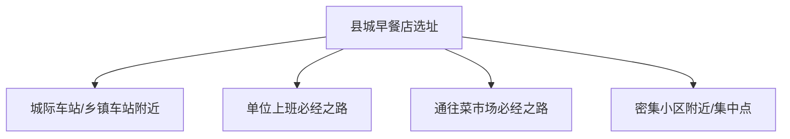
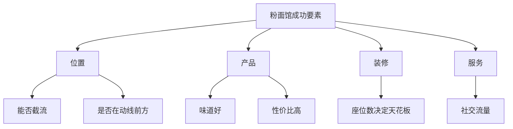
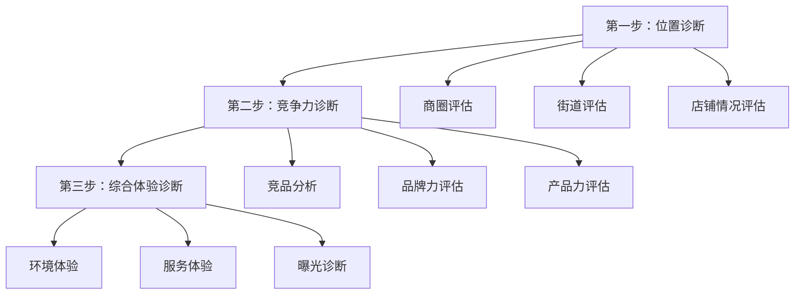

# 第13课：品类专题 - 早餐店、粉面馆与餐饮诊断

## 课程概览

本节课是四个专题的组合。每一类餐饮品类都有自己独特的选址逻辑和运营方法。理解了这些，你就知道在什么场景下适合做什么类型的餐饮。

---

## 专题一：早餐店选址逻辑

### 县城及以下城市早餐选址

#### 四个适合开早餐店的位置

#### 各位置分析

| 位置 | 优势 | 劣势 | 注意事项 |
|------|------|------|---------|
| 车站附近 | 客流大，每天不同人 | 竞争激烈，难有复购 | 看是否饱和 |
| 单位必经路 | 客户固定，易做口碑 | 对品质要求高 | 是否在动线上 |
| 菜市场附近 | 客户固定 | 中老年多，价格敏感 | 定价不能高 |
| 小区集中点 | 客户稳定 | 辐射范围有限 | 老店旁边尽量避开 |

#### 早餐店选址核心原则

> [!WARNING] 早餐店选址三大铁律
> 1. **能否截流**：你在他上班的必经之路上，并且在他前方
> 2. **易接近**：消费者不用多走一步路
> 3. **避免客流单一**：不要只靠一个学生群体，半小时的生意撑不起一家店

#### 县城早餐的特定优势

> [!NOTE] 县城早餐是刚需
> 小地方可以没有中午快餐需求、没有晚上宵夜需求，但一定有**早餐需求**。很多人不在家做早餐，而是外面"将就"吃一点。

#### 县城早餐店误区

| 误区 | 说明 |
|------|------|
| 销售推动太单一 | 只靠学生群体，经营时间太短 |
| 开在10年老店旁边 | 人情关系打不过 |
| 不好停车 | 开车的人不想停在远处买早餐 |

### 市区早餐选址

#### 评估方法

| 步骤 | 内容 |
|------|------|
| 建店成本评估 | 算清楚前期投入 |
| 预估市场份额 | 小区多少人？多少人出来吃？ |
| 竞品分析 | 现有早餐店每天卖多少？ |
| 盈亏平衡点 | 算每日成本 |

> [!TIP] 市场份额计算
> 小区1500户约4500人，出来上班上学的约1500人。十分之一在家吃早餐，剩下1350人。每人花10元，早餐市场总额约13500元/天。有3家店平分就是每家4500元。

---

## 专题二：粉面馆运营思路

### 产品特性和选址要求

### 适合的销售推动

| 消费群体 | 适合时段 | 说明 |
|---------|---------|------|
| 上班族 | 午餐为主 | 刚需，出餐要快 |
| 流动人口 | 全天 | 政务大厅、办事大厅周围 |
| 租客群体 | 晚餐 | 下班回家在楼下解决 |
| 酒店/民宿住客 | 不固定 | 解决到店后的温饱需求 |

> [!WARNING] 座位数决定天花板
> 10个座位，一碗面15元翻4轮，日营业额只有600元。如果盈亏平衡点是1000元，这个店就是亏的。

### 推荐和不推荐的商圈

| 推荐商圈 | 不推荐商圈 |
|---------|-----------|
| 写字楼+居民区组合 | 大餐饮聚集区（火锅烧烤旁边） |
| 有多个销售推动的地方 | 老店旁边（人情关系打不过） |
| 快餐聚集地 | 单独孤零零的位置 |

---

## 专题三：餐饮店三步诊断法

### 诊断流程

### 第一步：位置诊断

> [!NOTE] 选址病是店铺唯一的死因
> 选址错误就像天生缺陷，会伴随这家店的一生。营销再好也救不了位置错误的店。

**评估维度**：
- 商圈销售推动：是否充足、是否多样
- 客流动线：在主动线还是次动线
- 展示面：是否被遮挡
- 可接近程度：是否有台阶、栏杆

### 第二步：竞争诊断

| 维度 | 评估内容 |
|------|---------|
| 位置优势 | 早餐最看重可接近度 |
| 品牌力 | 奶茶店品牌力大于位置 |
| 产品力 | 学生更看重性价比和出餐速度 |
| 服务体验 | 社区店靠人情和复购 |

**产品力评估的三个维度**：
1. **产品结构**：SKU怎么组合、菜单如何搭配
2. **产品价格**：定价策略、成本定价 vs 竞品定价
3. **品控标准**：出餐流程、产品呈现、供应链

### 第三步：曝光诊断

当位置、竞争、产品都没问题时，就看曝光是否出问题了。

| 曝光渠道 | 适用场景 |
|---------|---------|
| 点评/团购 | 搜索流量 |
| 抖音短视频 | 同城推荐流量 |
| 达人推广 | 快速引爆 |
| 外卖 | 增加营收渠道 |

> [!WARNING] 曝光是把双刃剑
> 如果产品不行、位置不行，曝光越大会加速倒闭。因为更多的人会看到你的缺点。

---

## 专题四：社交型餐饮选址

### 什么是社交型餐饮

> 两个人以上需要坐下来边吃边喝边聊的餐饮形式（团餐、火锅、烧烤、中餐等）。

### 和小餐饮的区别

| 维度 | 小餐饮/小吃 | 社交型餐饮 |
|------|------------|-----------|
| 看重 | 商圈和位置 | 综合运营能力 |
| 面积 | 几平米到十几平 | 80-150平以上 |
| 投入 | 低 | 高 |
| 回本周期 | 1-3个月 | 3-6个月 |
| 客流依靠 | 自然客流 | 运营+自然客流 |

### 选址六个评估维度

| 维度 | 说明 |
|------|------|
| 销售推动 | 辐射3-5公里的人群 |
| 硬件情况 | 天然气、排烟、停车、门头宽度 |
| 财务分析 | 建店成本和回本周期 |
| 时效分析 | 能做几餐（午餐、晚餐、宵夜） |
| 评效分析 | 面积和接待能力的匹配 |
| 预估银额 | 通过竞品预估 |

### 推荐位置 vs 不推荐位置

| 推荐 | 不推荐 |
|------|--------|
| 成熟大型社区 | 刚需餐饮聚集区 |
| 餐饮一条街（氛围好） | 孤零零单独开店 |
| 有停车位 | 停车不方便 |

### 社交型餐饮选址核心

> [!TIP] 易接近程度 vs 运营能力
> 社交型餐饮更依靠运营能力，但位置仍然很重要。**不要拿二楼以上的铺子**，除非在商场。易接近程度直接影响自然客流。

---

## 复习清单

- [ ] 能说出县城早餐店的4个适合位置
- [ ] 理解"截流"在早餐店选址中的重要性
- [ ] 掌握市场份额的计算方法
- [ ] 理解座位数对粉面馆营业额的影响
- [ ] 能说出餐饮诊断的三步流程
- [ ] 理解"选址病是唯一死因"的含义
- [ ] 掌握社交型餐饮的六个评估维度
- [ ] 理解社交型餐饮和小餐饮选址的区别

## 自测问题

1. 为什么说"经营时间短"是早餐店选址的一大坑？如何避免？
2. 一个10年老早餐店旁边，你开了一家新店，味道更好，能做得过它吗？为什么？
3. 请写出餐饮诊断三步骤，并说明每一步的核心判断指标。
4. 社交型餐饮和小吃选址的核心区别是什么？

## 下一步

- 学习 [[0014-kai-ye-ying-xiao|开业营销]] - 做好开业活动的蓄客和推广
- 选择你感兴趣的品类，做一次完整的选址评估
