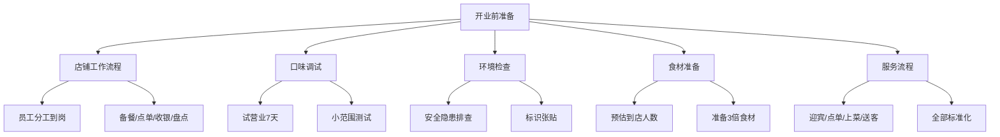
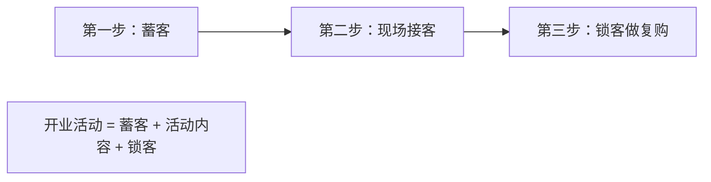
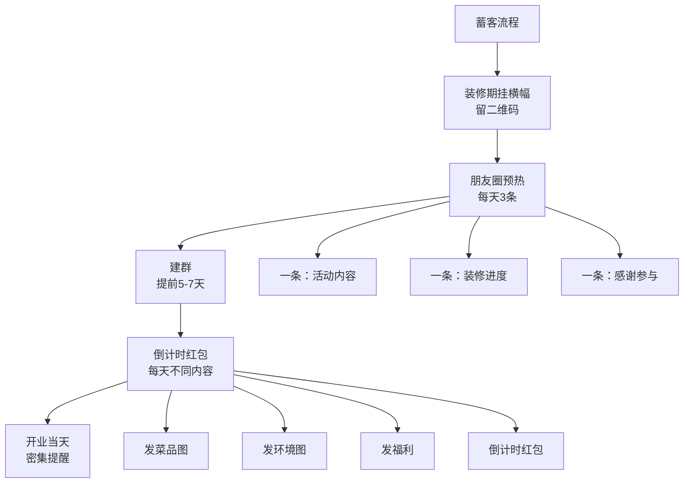
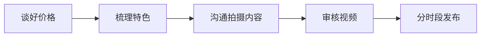
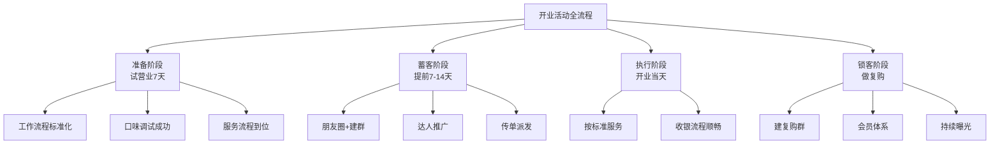

# 开业营销：从蓄客到达人推广的完整体系

## 课程概览

很多人以为开业活动就是在门口挂横幅、放喇叭、打五折。这些只做了开业活动的**内容**环节，但漏掉了两个更重要的环节：**人从哪里来**和**来了怎么锁客**。一个好的开业活动是**蓄客 -> 接客 -> 锁客**的完整闭环。

---

## 一、开业活动前的准备工作

> [!WARNING] 开业活动做不好就是闭店活动
> 如果开业活动真的爆了，但你的流程、口味、服务跟不上，消费者给你一次机会你浪费了，他再也不会来。**消费者给的机会只有一次。**

### 五个必须做好的准备工作

| 准备工作 | 具体内容 | 常见错误 |
|---------|---------|---------|
| 工作流程 | 每日分工到人，备餐-操作-点单-收银-盘点 | 一忙就乱 |
| 口味调试 | 试营业7天，收集反馈，融合当地口味 | 原封不动搬外地产品 |
| 环境检查 | 检查安全隐患、拐角、地面防滑 | 忽略安全 |
| 食材准备 | 按预估客流备3倍量 | 活动当天食材不够 |
| 服务流程 | 进店谁招呼、谁点单、谁上菜 | 没有标准随意操作 |

> [!TIP] 为什么必须试营业
> 7天试营业能暴露出一家店**所有可能存在的问题**。把所有问题在试营业期间解决掉再正式开业。

---

## 二、开业三步走之蓄客

### 开业活动的完整链条

> [!NOTE] 99%的老板只做了一个环节
> 大多数人只做了"现场接客活动"——在门口挂"全场五折"的横幅。但这只是让本来就会进店的人占了个便宜。开业活动的真正目的是把**更远的、不会知道这个地方的人**拉到店里。

### 常用蓄客方式

| 蓄客方式 | 适用店型 | 效果评估 |
|---------|---------|---------|
| 装修期间挂横幅 | 所有店型 | 低成本，长期曝光 |
| 朋友圈+建群+群发 | 堂食店、社区店 | 效果好，可统计 |
| 派发传单 | 社区店、学校周边 | 适合区域覆盖 |
| 抖音同城视频+直播 | 所有店型 | 效果好，需成本 |
| 小红书推广 | 网红店 | 适合年轻人 |

### 核心蓄客方法：建群+朋友圈运营

> [!TIP] 倒计时红包技巧
> 提前3天建群，每天一个红包标注"距XX店开业倒计时X天"。红包不用大（10-20元），目的不是发钱，是每天提醒大家你的店要开了。

---

## 三、达人推广策略

### 找达人前的准备

> [!WARNING] 前提条件
> 达人来拍之前，你的**产品、环境、服务**必须已经打磨好。流量只是一个放大器，不是雪中送碳。位置偏一点+产品好+流量=能做起来。位置偏+产品不好+流量=加速倒闭。

### 选达人标准

| 维度 | 标准 |
|------|------|
| 粉丝量 | 本地头部大号优先 |
| 基础播放量 | 看他平时视频的平均播放量 |
| 点赞量 | 每条视频点赞是否在大几千以上 |
| 评论区互动 | 是否真实用户互动 |
| 信任度 | 评论区对博主的信任感 |

> [!WARNING] 不要找太多小号
> 几百粉丝几千粉丝的达人，拍出的视频可能只有三五百播放量。找20个这样的不如找1个当地头部，一条视频可能30万-300万播放量。

### 推广频率建议

| 店铺类型 | 推广策略 |
|---------|---------|
| 社交型大店 | 每月拿出利润的10%持续投 |
| 社区店 | 第一次打透，之后降低频率 |
| 校园店 | 每学期开学必做一次 |
| 小吃店 | 好商圈里也要做，靠流量打差异化 |

### 达人推广的五个实操步骤

| 步骤 | 具体内容 |
|------|---------|
| 谈好价格 | 按当地行情，控制预算 |
| 梳理特色 | 食材、环境、打卡点、活动力度，一条一条列出来 |
| 沟通拍摄 | 告诉达人你的特色是什么，让他结合自己的风格 |
| 审核视频 | 自己看完有没有想去的冲动，让家人朋友看效果 |
| 分时段发布 | 大号提前2-4天发，小号提前1-2天发 |

### 达人拍摄内容要点

> [!TIP] 内容多样性
> 不要让所有达人都拍一样的内容。你店铺各个角落都是流量密码：招牌、菜品、出餐流程、环境、特色菜。不同达人拍不同角度，才能把店活灵活现呈现给消费者。

### 推了没效果？可能的问题

| 问题 | 原因 |
|------|------|
| 视频播放量低 | 达人选太小了 |
| 播放量高但没人来 | 没有加定位或定位不对 |
| 有人来但没复购 | 产品/服务/环境有问题 |
| 活动期生意好，过后不行 | 曝光没打透，积累的老客不够 |

> [!NOTE] 曝光是持续过程
> 把做流量当成交房租一样。你租铺子给租金理所应当，做流量也要持续投入。社交型大店必须每月拿利润的10%持续投。打透的标准是：你的老客基数足够大，每天的自然复购就能撑起生意。

---

## 四、开业活动全流程总结

---

## 复习清单

- [ ] 理解开业活动前必须做好的5项准备工作
- [ ] 记住"试营业7天"的重要性
- [ ] 理解开业活动的完整链条（蓄客-接客-锁客）
- [ ] 掌握建群蓄客的运营方法（倒计时红包等）
- [ ] 能说出本地头部达人的筛选标准
- [ ] 理解不同店型的推广频率策略
- [ ] 记住流量是放大器，不是雪中送炭

## 自测问题

1. 为什么说"开业活动如果没准备好，做成了就是闭店活动"？
2. 如果你是一家社区店的老板，请写出蓄客阶段从开业前14天到开业当天的完整计划。
3. 找30个500粉丝的达人拍，和找1个50万粉丝的头部达人拍，哪个更有效？为什么？
4. 社交型大店为什么必须每月拿利润的10%持续做推广？

## 下一步

你的2.0进阶篇课程学习已经完成！接下来可以：
- 回顾 [[reference/glossary|小餐饮术语表]] 巩固名词
- 开始 [[0015-dou-yin-yun-ying|短视频实操课]] - 学习如何自己拍抖音
- 复习整个2.0进阶篇，对照复习清单检查掌握情况
