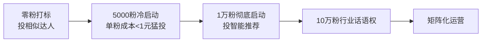

# 第15课：抖音运营实战 - 内容打造与投流策略

## 学习目标
- 理解抖音对餐饮店的定位：流量工具而非赚钱平台
- 识别做抖音的三大误区
- 掌握内容规划、文案结构和投流策略
- 了解账号冷启动和同城号运营方法

## 核心认知：抖音是什么

> [!NOTE] 抖音定位
> 抖音本身只是一个**流量工具**，帮你在原有的生意上获取更多流量。做抖音的根本原因是——抖音当下的流量非常便宜。公式：**变现能力 = 商业模式 x 流量 x 转化客单价**。

记住一句话：**不是在抖音赚钱，而是靠抖音赚钱。**

## 做抖音的三大误区

### 误区一：先涨粉再变现

**粉丝没有用，精准粉丝才有用。** 精准粉丝就是愿意为你付费的人。几百万泛粉不能变现的账号比比皆是，反而几千精准粉丝一个月变现几万几十万的案例很多。

内容的"靶向性"决定了你吸引什么人——你发什么内容，就吸引什么粉丝。

### 误区二：以上热门为荣

热门没有用，**行业热门才有用**。一千万播放的泛内容，不如十万播放的精准内容有价值。你发的每一条内容都应该问自己：这条能帮我赚钱吗？

### 误区三：投抖加可耻

带着生意思维做抖音，抖加就是正常投入。投抖加两个目的：
1. **花钱买时间**：快速完成冷启动
2. **赚更多钱**：花1块赚2块

## 变现逻辑六大拷问

做抖音前必须回答清楚这6个问题：

| 问题 | 核心要点 |
|------|---------|
| 1. 生意和抖音什么关系？ | 抖音是帮你获取流量的工具 |
| 2. 生意是否适合做抖音？ | 抖音上有做得好的同行就可以做 |
| 3. 靠什么赚钱？ | 产品 / 服务 / 机会三种形式 |
| 4. 卖点是什么？ | 为人买单 / 为商品买单 / 两者结合 |
| 5. 赚谁的钱？ | 清晰的用户画像（年龄、性别、地域、消费力） |
| 6. 没有项目怎么办？ | 自己找项目或找有项目的人合作 |

## 内容打造

### 个人主页四件套

| 要素 | 要求 |
|------|------|
| 头像 | 清晰、突出职业（如你和店铺的合影） |
| 背景 | 行业相关或背书（如获奖照片） |
| 名称 | 行业+名字，突出优势 |
| 简介 | 个人卖点+商品卖点+关键商业信息 |

### 内容规划三方向

1. **人设IP**：秀实力、专业性、权威性
2. **商品卖点**：占内容一半以上，说清解决什么痛点
3. **用户人群**：圈粉，吸引目标客户

### 十种开篇钩子

1. 对比反差法
2. 构建心理预期法
3. 颠覆认知法
4. 提供价值法（数据化呈现）
5. 蹭热点法
6. 名人效应法
7. 身份标签法
8. 夸张法
9. 转折法
10. 恐吓法

> [!TIP] 实操建议
> 不需要全部掌握，选2-3个适合自己的反复使用即可。

### "总分总"文案结构

```
总（提出论点/点题）→ 分（3-5条并列式论证）→ 总（升华观点/号召行动）
```

关键：并列式结构不要超过5条，用户不爱费脑子看复杂内容。

## 抖音运营机制

### 标签推荐机制

两套系统：
- **账号标签**：通过持续发布垂直内容让系统识别
- **用户标签**：通过用户行为建立

系统把账号标签的内容推荐给相同标签的用户。**账号标签一旦形成很难改变**，所以做号前就要想好变现模式。

### 赛马推流机制

不同层级流量池赛马：500 → 5000 → 1万 → 10万 → 100万...

数据越好（点赞/评论/完播率/转发/收藏），上热门概率越大。

## 抖加投流策略

### 账号起飞五阶段



### 打标阶段

五条视频每条投100元（投粉丝量、24小时、相似达人）。目标是打标不是涨粉，**不计投入产出比**。

### ROI计算

- 打标阶段：不计ROI
- 冷启动阶段：单粉成本<1元，超3小时数据不好立即隐藏止损（止损约30元）
- 追投策略：数据好则300→500→1000递进

> [!WARNING] 止损意识
> 单条视频投放不超过2000元。数据不好果断止损，不要恋战。

### 同城号运营

- 全国流量 > 同城流量，但门店曝光需做同城号
- 打标阶段选本地优秀同行相似达人
- 同城投放成本更高（2-3元/粉丝）
- 店铺曝光投"附近6000-25000米"
- 发布视频**带店铺定位**

## 内容质量提升

### 短视频拆片分析法

用拆片表格按维度分析竞品视频：

| 维度 | 分析内容 |
|------|---------|
| 基本信息 | 博主、音乐、时长、数据 |
| 文案结构 | 开头、论点、结尾 |
| 镜头描述 | 景别、拍摄角度、时长 |
| 特效 | 字幕、贴纸、转场 |

口播类重点拆文案，产品类重点拆镜头语言。

### AB测试法

控制变量法：每次只改变一个因素（文案/拍摄环境/音乐/时长），发布两条视频对比数据。

## 复习清单

- [ ] 我理解抖音是流量工具而非赚钱平台
- [ ] 我能说出三大误区并避免
- [ ] 我清楚自己的变现项目和用户画像
- [ ] 我掌握了"总分总"文案结构
- [ ] 我了解抖加投流的基本策略
- [ ] 我知道如何做同城号运营

## 自测

> [!QUESTION] 自测题
> 一个餐饮老板想在抖音上为自己的店引流，第一步应该做什么？

<details>
<summary>参考答案</summary>

第一步是**确认变现项目**（自己的店），然后明确**用户画像**（同城潜在顾客），再看抖音上有没有同城的同行在做了。然后按照打标→冷启动→同城投放的顺序操作。关键是以"获取同城流量"为目标，不是追求全国热门。
</details>

## 下一步

继续学习 [[../reference/glossary|术语表]] 巩固概念，或进入 [[0016-xia-ri-bing-tang-yuan|第16课：夏日冰汤圆]]。