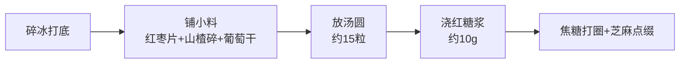

# 第16课：夏日冰汤圆

## 学习目标
- 了解冰汤圆的设备和原材料
- 掌握汤圆和芋圆的煮制与保存方法
- 理解通用组装流程
- 了解13种口味变化

## 设备与展台配置

| 设备 | 说明 | 参考价格 |
|------|------|---------|
| 定制展台 | 本地门窗店定做或二手 | 视情况 |
| 玻璃罩 | 显卫生、防尘 | - |
| 碎冰机 | 电动或手动 | 电动约500元 / 手动100+元 |
| 保温桶 | 装冰块不易化 | - |
| 制冰机 | 30kg容量 | 约300-400元（也可以买冰块） |

## 原材料采购原则

> [!TIP] 效率化采购原则
> 做小吃核心是**效率**。不影响口感的前提下：能用成品用成品，能用半成品用半成品。

**可采购成品的小料**：
- 葡萄干、酒酿、红枣片、山楂碎、桂花酱、白芝麻
- 焦糖装挤瓶（方便操作）
- 水果切黄豆大小丁

## 汤圆煮制与保存

1. 水沸后下**小汤圆**（非大汤圆、非夹心）
2. 煮3分钟至全部漂浮出锅
3. 纯净水或凉白开冷却
4. **必须用清水泡着**保持软糯
5. 刚出锅粘连时用手分开
6. 煮好可放6-8小时
7. 尽量当天用完保证新鲜

## 芋圆煮制与保存

- 芋圆煮好后过冷水
- 泡清水中备用
- 尽量当天制作当天用完
- 煮好的芋圆可保存一天

## 通用组装流程

> [!NOTE] 组装要点
> - 保温桶装冰块防晒化
> - 红糖浆均匀浇在冰上——方便搅拌
> - 选**不透明大盒子**让顾客觉得量足划算
> - 所有口味遵循同一结构，仅配料做加减法

## 口味变化一览

所有口味共用碎冰打底+小料+汤圆+红糖浆+焦糖+芝麻的基础结构。差异仅在额外配料：

| 口味 | 额外配料 | 特点 |
|------|---------|------|
| 彩虹冰汤圆 | 加小芋圆 | 色彩丰富 |
| 传统冰汤圆 | - | 经典款 |
| 桂花冰汤圆 | 加桂花酱 | 桂花香气 |
| 酒酿冰汤圆 | 加酒酿 | 微醺风味 |
| 水果冰汤圆 | 加西瓜/火龙果/芒果丁 | 清爽水果 |
| 熊猫斑斓冰汤圆 | 加椰奶、黑糖波波、斑斓叶 | 东南亚风味 |
| 熊猫水果多又多 | 加椰奶+多种水果 | 水果盛宴 |
| 杨梅冰汤圆 | 加杨梅果酱、酸梅果酱、新鲜杨梅 | 酸甜口 |

## 复习清单

- [ ] 我了解冰汤圆的设备和采购渠道
- [ ] 我掌握了汤圆煮制3分钟法则和清水保存
- [ ] 我理解了通用组装流程
- [ ] 我知道各口味变化的规律（基础结构+配料加减）

## 下一步

继续学习 [[0017-xia-ri-bing-fen|第17课：夏日冰粉]]。