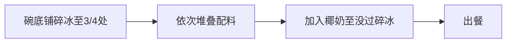

# 夏日清补凉

## 学习目标
- 了解清补凉的核心原料
- 掌握通用底座与椰奶组装法
- 了解三款口味的变化

## 核心原料清单

| 类别 | 原料 |
|------|------|
| 基础配料 | 椰果、西米、燕麦、红豆泥、芋泥 |
| Q弹配料 | 布丁、龟苓膏、芋圆 |
| 水果 | 西瓜、黄桃、火龙果、哈密瓜 |
| 装饰 | 椰丝、椰片 |
| 液体 | 椰奶 |

## 通用底座与椰奶组装法

**配料堆叠顺序**：
1. 先铺基料：芋泥、燕麦等
2. 中间放：布丁、龟苓膏、椰果
3. 最后装饰：水果、椰丝、椰片

> [!TIP] 关键
> 所有口味共用这一组装结构，差异只在配料组合不同。

## 三款口味变化

### 夏日椰椰

| 配料 | 用量建议 |
|------|---------|
| 燕麦 | 适量 |
| 芋泥 | 打底 |
| 椰果 | 适量 |
| 布丁 | 1块 |
| 龟苓膏 | 1块 |
| 火龙果 | 切丁装饰 |
| 椰丝+椰片 | 撒面 |
| 椰奶 | 没过冰沙 |

### 椰香西米

| 配料 | 用量建议 |
|------|---------|
| 芋泥 | 打底 |
| 燕麦 | 适量 |
| **西米** | 铺顶（特色） |
| 布丁 | 1块 |
| 龟苓膏 | 1块 |
| 椰果 | 适量 |
| 哈密瓜 | 切丁装饰 |
| 椰奶 | 没过冰沙 |

### 芋圆红豆

| 配料 | 用量建议 |
|------|---------|
| 红豆泥 | 打底 |
| 芋泥 | 打底 |
| 燕麦 | 适量 |
| 布丁 | 1块 |
| 龟苓膏 | 1块 |
| **芋圆** | 特色配料 |
| 椰果 | 适量 |
| 黄桃 | 切丁装饰 |
| 椰奶 | 没过冰沙 |

## 复习清单

- [ ] 我了解了清补凉的核心原料
- [ ] 我掌握了通用底座组装法（碎冰→配料→椰奶）
- [ ] 我了解了三款口味的配料差异

## 下一步

回顾 [[../reference/glossary|术语表]] 或返回 [[../index|课程首页]]。