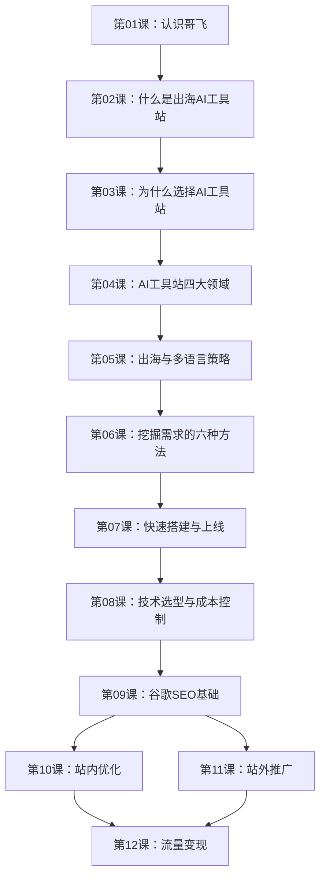

# 课程地图

## 学习路径

## 模块总览

| 模块 | 包含课程 | 学习目标 |
|---|---|---|
| 基础概念 | 01-02 | 理解出海AI工具站是什么 |
| 机会认知 | 03-05 | 知道机会在哪里，为什么有优势 |
| 实战方法 | 06-08 | 掌握从0到1建站的全流程 |
| 流量增长 | 09-11 | 学会谷歌SEO获取免费流量 |
| 商业变现 | 12 | 知道如何把流量变成收入 |

## 推荐学习节奏

- **新手**：按顺序学，每课做笔记和思考题
- **有经验者**：重点看第06-12课
- **复习**：多看第09-12课（SEO和变现是核心）