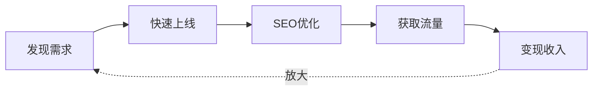

# 哥飞出海AI工具站 — 从零开始

> 一个关键词一个页面，分门别类罗列。

本课程基于哥飞的线下分享《出海AI工具站如何从零开始》整理而成。哥飞是千人付费出海社群发起人、出海AI工具创业者，以其通俗易懂的教学风格帮助了大量小白成功做出海工具站。

## 适合谁看

- 想做独立站/工具站但无从下手的新手
- 想利用AI浪潮出海赚美元的个人开发者
- 想系统学习谷歌SEO的小团队

## 课程结构

### 基础概念篇
- [[0001-intro|第01课：认识哥飞与出海社群]]
- [[0002-what-is-ai-tool-site|第02课：什么是出海AI工具站]]

### 机会认知篇
- [[0003-why-ai-tool-site|第03课：为什么选择AI工具站]]
- [[0004-ai-categories|第04课：AI工具站的四大领域]]
- [[0005-going-global|第05课：出海的意义与多语言策略]]

### 实战方法篇
- [[0006-find-needs|第06课：挖掘AI工具需求的六种方法]]
- [[0007-quick-launch|第07课：快速搭建与上线]]
- [[0008-build-tech|第08课：技术选型与成本控制]]

### 流量增长篇
- [[0009-seo-fundamentals|第09课：谷歌SEO基础与生态]]
- [[0010-onpage-seo|第10课：站内优化 — 分门别类罗列]]
- [[0011-offpage-seo|第11课：站外推广与外链建设]]

### 商业变现篇
- [[0012-monetize|第12课：流量变现与案例分析]]

## 核心理念

**一句话总结：** 找新词 → 做工具站 → 做多语言 → 做SEO → 变现。

> [!TIP] 哥飞六字真言
> 分门别类罗列 — 这是贯穿整个课程最重要的SEO心法。