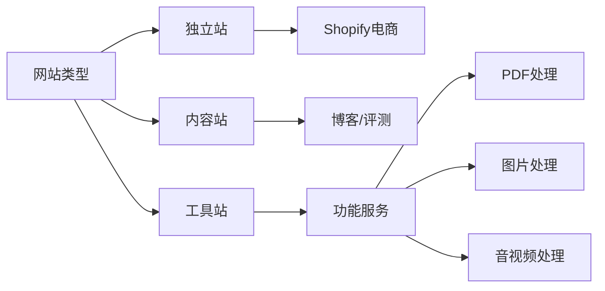

# 第02课：什么是出海AI工具站

## 三种网站类型

在出海建站领域，所有网站可以归纳为三种类型：

### 1. 独立站

独立站指通过 Shopify 等建站工具搭建的电商网站，区别于在 Amazon、eBay 等平台开店。

**特点**：
- 以销售实体或虚拟商品为核心
- 需要处理供应链、物流、支付等环节
- 流量获取依赖广告投放和品牌建设

### 2. 内容站

内容站通常基于 WordPress 搭建，通过撰写博客文章、产品评测等内容来吸引搜索引擎流量。

**特点**：
- 以内容创作和 SEO 为核心
- 靠广告（AdSense 等）或联盟营销（Affiliate）变现
- 需要持续输出高质量内容积累权重

### 3. 工具站

工具站提供具体的功能服务，用户访问网站是为了**使用工具**而非阅读内容或购买商品。

**常见案例**：
- PDF 压缩、PDF 合并、PDF 加水印
- 图片格式转换、图片压缩
- 在线二维码生成器
- 文字转语音工具

> [!TIP]
> 工具站的核心竞争力不在于内容本身，而在于**功能满足用户需求**的即时性。用户带着问题来，用完即走，停留时间虽短但意图明确。

## 工具站的独特性：不怕被 AI 替代

这是工具站区别于其他网站类型的最大优势。

### GPT 能替代的内容站

GPT 可以直接生成回答，替代了大量内容站的价值。用户问"iPhone 16 值得买吗？"，GPT 能直接给出分析，用户不需要再去内容站看评测。

### GPT 无法替代的工具站

但当用户需要**实际处理一个文件**时，GPT 无能为力：

- **"帮我压缩这个 PDF"** → GPT 无法操作文件，只能推荐工具网站
- **"把这张图片转成 PNG"** → GPT 无法执行格式转换
- **"提取这段视频的音频"** → GPT 无法处理多媒体文件

> [!WARNING]
> 不要低估"GPT 无法操作文件"这个限制的含金量。这意味着工具站从本质上与 AI 大模型是互补关系，而非替代关系。只要用户还需要处理文件，工具站就永远有存在的价值。

### 工具站的长期护城河

- **三五十年的生意**：PDF 压缩、图片处理等基础需求不会消失
- **AI 反而带来流量**：GPT 等 AI 产品会推荐用户使用工具站，成为免费的流量入口
- **功能可不断叠加**：在基础功能之上添加 AI 增强功能，形成差异化

## 总结

工具站提供功能服务而非内容或商品，其核心优势在于 AI 大模型无法直接操作文件，因此工具站与 AI 是互补关系而非替代关系。这一特性使得工具站成为出海赛道中最具长期价值的网站类型。

## 下一步

学习 [[0003-why-ai-tool-site|第03课：为什么选择AI工具站]]，了解 AI 工具站相比传统工具站的核心优势。

## 自测题

点击展开自测题

1. 三种网站类型分别是什么？
2. 为什么 GPT 无法替代工具站？
3. 工具站的长期护城河有哪些？

