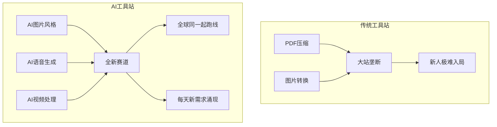

# 第03课：为什么选择AI工具站

## AI 工具站 vs 传统工具站

同样是工具站，AI 工具站与传统工具站之间存在根本性差异。

### 传统工具站的困境

传统工具站解决的是已经被充分验证的需求，例如：

- PDF 压缩、图片格式转换
- 在线二维码生成
- 文件格式转换

这些需求虽然稳定，但存在严重问题：

| 问题 | 说明 |
|------|------|
| **大站垄断** | Smallpdf、ILovePDF 等巨头占据了绝大多数搜索流量 |
| **竞争白热化** | SEO 难度极高，新人几乎不可能在短期内获得排名 |
| **技术门槛低** | 任何人都能做，导致供给过剩 |
| **利润空间被压缩** | 免费工具泛滥，用户付费意愿低 |

> [!WARNING]
> 如果你现在做一个"在线 PDF 压缩"工具，面对的将是 Smallpdf 这种月访问量数千万的庞然大物。在新站零权重的情况下，SEO 排名几乎不可能突破。

### AI 工具站的机会

AI 工具站解决的是**全新涌现的需求**，这些需求随着 AI 技术的普及而不断产生：

- AI 图片风格转换（泥塑风、像素风）
- AI 文字转语音（TTS）
- AI 视频剪辑与生成
- AI Logo 设计

## AI 工具站的核心优势

### 1. 全新赛道，全球同一起跑线

AI 工具站面向的是过去一两年才出现的新需求。无论是美国开发者还是中国开发者，面对的都是同样的市场空白。没有哪个巨头能提前占据所有 AI 工具的搜索排名。

### 2. 每天都有新需求产生

AI 技术迭代极快，几乎每周都有新的模型和应用场景出现。每一次技术突破都伴随着一批新工具的需求：

- 新模型发布 → 需要对应的 Web 界面工具
- 新的使用场景 → 需要专门的工具来满足
- 新的文件格式 → 需要转换和处理工具

### 3. 大站反应速度慢

大型成熟网站体量大、决策链条长，对新兴需求的响应速度远不如小团队。一个 4-5 人小团队可以在几天内上线一个新工具，而大站可能需要数月。

- **小团队优势**：快速试错、快速迭代
- **先发优势**：谁先上线并拿到搜索排名，谁就占据主动
- **持续优势**：排名一旦建立，后来者需要付出更高成本才能超越

### 4. 用户搜索意愿天然存在

AI 工具的使用场景决定了用户**本来就倾向于搜索**：

- "怎么把照片变成泥塑风格" → 搜索 → 找到你的工具站
- "在线 AI 文字转语音" → 搜索 → 找到你的工具站
- "视频自动添加字幕" → 搜索 → 找到你的工具站

> [!TIP]
> 每一波 AI 热潮都会带动大量的搜索需求。以"泥塑风"和"PS2 像素风"为例，相关关键词的搜索量在短期内暴增，谁先做出工具并做好 SEO，谁就能吃到这波红利。

## 总结

AI 工具站相比传统工具站的最大优势在于：**全新的赛道意味着没有垄断者，每天都在产生的新需求意味着持续的机会窗口**。小团队的快速响应能力在这个赛道中是一种碾压性的竞争优势。先上线、先拿排名，就能建立持续领先的壁垒。

## 下一步

学习 [[0004-ai-categories|第04课：AI工具站的四大领域]]，了解对话类、图片类、声音类、视频类 AI 工具站的具体机会。

## 自测题

点击展开自测题

1. 传统工具站面临的最大问题是什么？
2. AI 工具站相比传统工具站的优势有哪些？
3. 为什么小团队在 AI 工具站赛道具有竞争优势？

