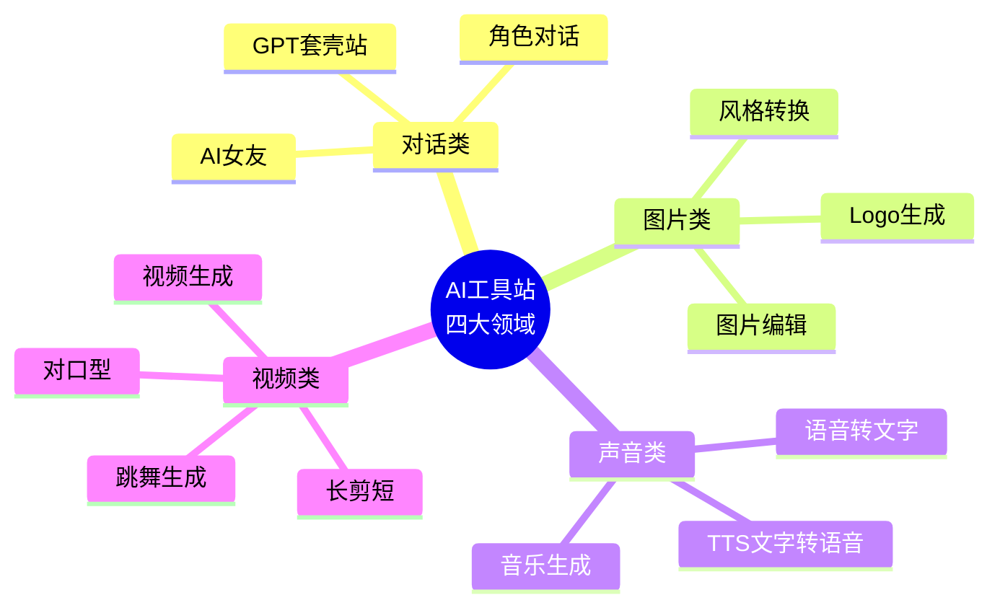
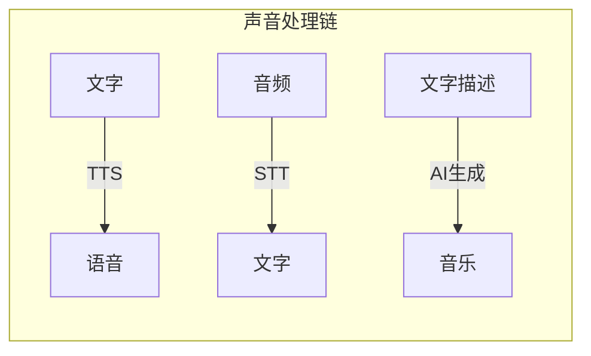

# 第04课：AI工具站的四大领域

AI 工具站的需求来源可以归纳为四大领域。每一个文件类型之间的相互转换，都是一个潜在的机会。

## 对话类

对话类工具站是最直接的 AI 工具形态，核心是提供基于大语言模型的对话能力。

### GPT 套壳站

虽然听起来不够"高端"，但 GPT 套壳站在海外仍有巨大市场。

> [!EXAMPLE] 市场现状
> 数据显示，大约 **50% 的美国人还不知道 GPT 是什么**，更不用说如何使用。这意味着仅仅提供一个包装好的 GPT 对话界面，就能满足大量用户的刚需。

**机会点**：
- 针对特定场景的定制对话界面
- 提供无需注册、即开即用的便捷体验
- 结合特定行业知识库的垂直对话工具

### 角色对话

用户可以与特定角色设定的 AI 进行对话，如：
- 语言学习伙伴
- 面试模拟官
- 心理咨询师
- 历史人物对话

### AI 女友 / 伴侣

> [!WARNING]
> 哥飞特别提示：**不建议碰 AI 女友这类灰色领域**。虽然此类需求确实存在，但涉及内容安全和道德风险，容易引发平台封禁、支付渠道冻结等问题，短期收益无法弥补长期风险。

## 图片类

图片处理是 AI 工具站中需求最旺盛、机会最多的领域之一。

### 风格转换

AI 可以将用户上传的图片转换为各种艺术风格。哥飞课程中提到的两个爆火案例：

- **泥塑风**：将真人照片转化为泥塑风格形象，在某段时间搜索量暴增
- **PS2 像素风**：将图片转换为 PlayStation 2 时代的低多边形像素风格，引发怀旧热潮

> [!TIP]
> 每一次 AI 图片风格在社交媒体上爆火，都会带动大量的搜索需求。你需要做的是：**在流行趋势出现时，快速上线对应的转换工具，占领 SEO 高地**。

### Logo 生成

AI Logo 生成器帮助用户快速生成品牌 Logo，面向中小企业和个人创业者。这类工具可以通过免费生成 + 付费下载高清版的模式变现。

### 其他图片机会

- AI 扩图（Outpainting）
- AI 图片修复（去水印、去噪点）
- AI 图片转 3D 模型
- AI 头像生成（职业照、动漫风）

## 声音类

声音类 AI 工具站覆盖从语音合成到语音识别的完整链条。

### TTS 文字转语音

将文本转换为自然语音的技术。主流工具和模型包括：

| 工具/模型 | 特点 | 适用场景 |
|-----------|------|---------|
| **ChatTTS** | 开源，中文效果优秀 | 自媒体配音、有声书 |
| **ElevenLabs** | 多语言、情感丰富 | 专业级配音、播客 |
| **Azure TTS** | 微软出品、稳定可靠 | 企业级应用 |

**变现模式**：免费限次使用 + 付费订阅更多字符数/更多语音风格

### 语音转文字 (STT)

将音频/视频中的语音转换为文字。哥飞分享了一个**日本市场案例**：

> [!EXAMPLE] Nota 日本市场案例
> 一款语音转文字工具（Nota），专门针对日本市场进行了优化。日本用户对文档处理的需求量大，且对本地化产品有偏好。通过在 SEO 中针对日语关键词布局，成功获取了大量日本用户的自然搜索流量。

**关键启示**：针对**非英语市场**（日语、韩语、西班牙语等）做本地化，竞争更小，用户获取成本更低。

### 音乐生成

AI 音乐生成工具（如 Suno、udio）允许用户通过文字描述生成完整的音乐作品。虽然技术门槛较高，但可以通过提供更便捷的 Web 界面、更多的风格预设来差异化竞争。

## 视频类

视频领域的 AI 工具站目前还处于早期阶段，但潜力巨大。

### 视频生成

- **Sora**（OpenAI）：文字生成视频
- 其他替代方案：Runway、Pika、Kling

### 长视频剪短视频

将长视频（讲座、直播、课程）自动剪辑为多个短视频片段，用于社交媒体分发。

### AI 对口型

上传人物照片/视频，输入音频，让画面中的人物"说出"指定的内容。适用于：
- 多语言配音（保持口型同步）
- 虚拟主播
- 影视二次创作

### 跳舞生成

让静态照片中的人物跟随音乐跳舞。这类工具在社交媒体上传播性极强，容易带来爆发式流量。

> [!TIP]
> 视频类工具站的用户需求增长更快，但技术实现难度也更高。建议优先从**音频转文字 / 文字转音频**这类实现难度较低的方向切入，逐步积累经验后再向视频领域拓展。

## 核心方法论：文件转换即机会

哥飞提出的一个重要思维框架：

> [!ABSTRACT] 每个文件类型的互相转换都是机会
>
> 图片、音频（mp3）、视频——这三种媒体文件之间的任意两两转换，都可以做成一个工具站：
>
> | 输入 | 输出 | 示例工具 |
> |------|------|---------|
> | 图片 | 图片 | 风格转换、格式转换 |
> | 图片 | 音频 | 图片转音乐（描述图片生成配乐） |
> | 图片 | 视频 | 图片生成视频、幻灯片视频 |
> | 音频 | 文字 | 语音转文字 |
> | 音频 | 音频 | 音频降噪、格式转换 |
> | 音频 | 视频 | 音频配波形视频 |
> | 视频 | 文字 | 视频转字幕 |
> | 视频 | 音频 | 提取视频音频 |
> | 视频 | 视频 | 剪辑、风格转换 |

## 总结

AI 工具站的四大领域——对话、图片、声音、视频——覆盖了绝大多数用户需求场景。每一个文件类型之间的转换都是一个独立的市场机会。对于新手，建议从技术实现难度较低的**图片类**或**声音类**（尤其是 TTS/STT）切入，选择非英语市场做本地化以获得更低的竞争环境，同时密切关注社交媒体上的流行趋势，在需求爆发时快速上线对应工具抢占 SEO 排名。

## 下一步

学习 [[0005-going-global|第05课：出海思维与全球化]]，了解如何跳出中国思维做全球市场，以及如何利用信息差发现机会。

## 自测题

点击展开自测题

1. AI 工具站的四大领域分别是什么？
2. 日本市场的 Nota 案例说明了什么道理？
3. 哥飞提到的"文件转换即机会"具体指什么？
4. 为什么建议新手从图片类或声音类工具站入手？

