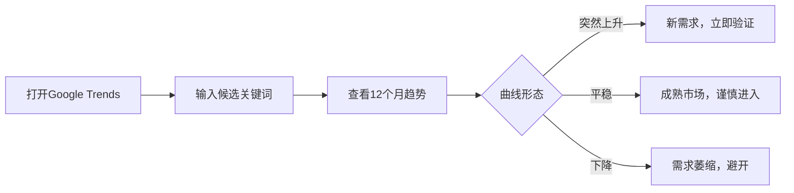
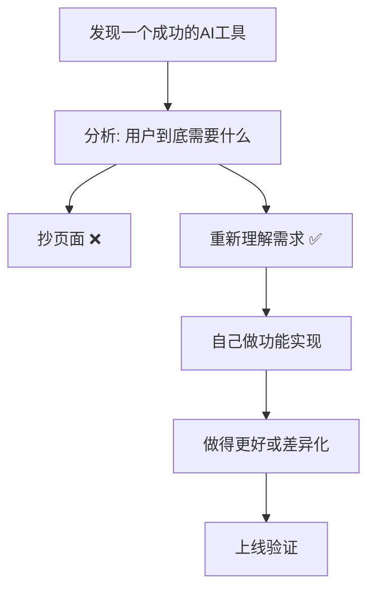

# 第06课：挖掘AI工具需求的六种方法

## 方法一：谷歌趋势 (Google Trends)

谷歌趋势是发现新兴需求最直接的工具。

### 用法

1. 拉取最近 **12个月** 的数据
2. 寻找 **突然上升** 的关键词
3. 上升曲线 = 新需求出现

> [!TIP] 判断标准
> - 平稳曲线：已有成熟市场，竞争激烈
> - 突然上升：新需求正在爆发，是入场的最佳时机
> - 持续上升：需求在增长，但需要判断是否已过窗口期

## 方法二：科技媒体

科技媒体是最新 AI 产品的信息源头。

### 推荐源

- **TechCrunch**：AI 创业公司报道
- **Product Hunt**：新产品每日发布
- **The Verge**：科技趋势报道

### 工作流

1. 订阅 RSS，每日刷新
2. 关注被报道的新产品和新的 AI 应用场景
3. 判断哪些方向可以做成独立工具站

> [!QUESTION] RSS是什么？
> RSS 是一种内容订阅协议，可以让你在不打开网页的情况下，通过一个阅读器集中获取多个网站的最新内容。推荐使用 Feedly、Inoreader 等工具。

## 方法三：AI大厂博客

直接关注 AI 领域头部公司的最新动态，从中发现新能力带来的新机会。

### 重点关注

- **OpenAI** 官方博客 — 新模型、新API发布
- **Stability AI** — 开源模型更新
- **Anthropic** — Claude 新能力
- **Meta AI** — LLaMA 系列
- **Google AI** — Gemini 等
- **Hugging Face** — 开源模型中心

### 思考方式

当一家大厂发布新模型时，思考三个问题：

1. 这个模型能做什么新的任务？
2. 现有工具有哪些做得不够好？
3. 我能不能基于这个能力做一个更简单的工具？

## 方法四：推特AI产品账号

推特（X）是 AI 产品发现和传播最快的平台。

### 关注对象

- **小户** 等 AI 产品发现类账号
- AI 产品的创始人账号
- AI 领域的独立开发者

### 价值

- 第一时间看到新产品发布
- 观察用户对新产品的反应和评价
- 发现用户吐槽的痛点 = 你的机会

## 方法五：SimilarWeb / SimilarSites

竞品分析工具，直接"抄作业"。

### 用法

1. 找到已成功的 AI 工具站
2. 用 **SimilarWeb** 查看流量数据：
   - 月访问量
   - 流量来源
   - 用户地域分布
   - 停留时间、跳出率
3. 用 **SimilarSites** 找同类网站
4. 用 **流量排行榜** 和 **收入排行榜** 发现高价值赛道

> [!EXAMPLE] 分析框架
> | 指标 | 判断 |
> |------|------|
> | 月访问量 > 100万 | 已验证的大市场 |
> | 月访问量 10万-100万 | 中型市场，适合切入 |
> | 月访问量 < 10万 | 小众市场，需确认需求真实性 |
> | 有付费功能 | 验证了付费意愿 |
> | 跳出率低 | 产品有粘性 |

## 方法六：导航站模式

导航站（Directory Site）是一个特殊但有效的模式。

### 原理

- 做一个 **工具导航站**（如 wvoc.ai）
- 收集市面上已有的 AI 工具，分类整理
- 借别人的产品流量，为你的导航站导流
- 导航站本身可以通过广告或推荐佣金变现

### 优势

- 不需要自己开发产品
- 内容更新以收集和整理为主
- 可以通过 SEO 获取大量长尾流量
- 积累用户后可以推荐自己的工具

## 核心原则：不要抄页面

> [!WARNING] 危险行为
> **不要直接抄别人的页面。** 看到别人的产品页面，不要复制粘贴。你需要做的是：
> 1. 理解用户真正的需求是什么
> 2. 自己重新实现功能
> 3. 做得更好或差异化

别人验证了能赚钱的需求，**反而更值得做**——它证明了市场存在。你的任务是提供更好的解决方案。

## 六种方法组合使用流程

1. **谷歌趋势** + **科技媒体** → 发现新方向
2. **AI大厂博客** → 确认技术可行性
3. **推特** → 观察市场反馈
4. **SimilarWeb** → 验证市场规模
5. **导航站** → 侧翼获取流量

> [!ABSTRACT] 日常信息流配置建议
> - **早晨**：刷 RSS 科技媒体 + 推特
> - **每周**：看一次 Google Trends 趋势
> - **每月**：用 SimilarWeb 做一次竞品扫描
> - **随时**：记录灵感，建立需求池

## 总结

挖掘需求的本质是持续观察和快速验证。谷歌趋势帮你发现"什么在变热"，科技媒体和博客告诉你"有什么新东西"，社交平台让你看到"用户怎么说"，竞品分析让你知道"什么已经赚钱了"。六种方法组合使用，形成持续的需求发现管道。

## 下一步

找到需求后，下一步是快速上线验证。下一课 [[0007-quick-launch]] 将学习2小时上站流程和 MVProduct 理念。

## 自测

> [!QUESTION] 检查理解
> 1. Google Trends 中什么样的曲线形态代表新需求爆发？
> 2. 说出至少3个应该关注的科技媒体或AI大厂博客。
> 3. 为什么说"不要抄页面"？正确的做法是什么？
> 4. SimilarWeb 可以分析哪些关键指标？如何判断一个市场是否值得进入？
> 5. 导航站模式的优势是什么？它适合什么阶段？

参考答案

1. 突然上升的曲线代表新需求爆发，是入场的最佳时机。
2. TechCrunch、Product Hunt、OpenAI博客、Stability AI博客、Google AI博客（任意3个即可）。
3. 抄页面只能复制表面，无法理解用户真实需求。正确的做法是重新理解需求，自己实现功能并做得更好。
4. 关键指标：月访问量、流量来源、用户地域、跳出率。月访问量10万以上通常说明市场已验证。
5. 导航站不需要自己开发产品，通过收集整理获取流量。适合初期积累用户和发现需求阶段。

