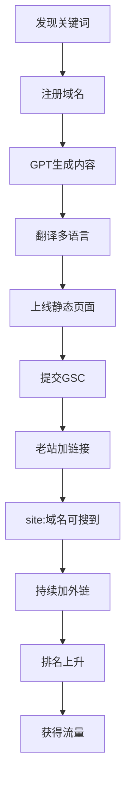
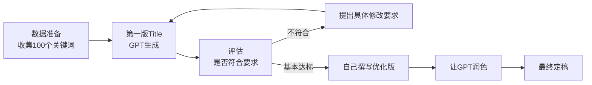
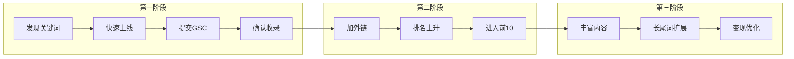

# 第07课：快速搭建与上线

## 2小时上站：一个真实案例

以下是一位学员的真实经历，展示了什么是真正的"快速验证"：

### 时间线

| 时间 | 动作 |
|------|------|
| 早上 | 刷手机发现一个上升关键词 |
| 10:00 | 到公司立即注册域名 |
| 10:00-11:30 | GPT 生成页面内容 + 多语言翻译 |
| 11:30-12:00 | 上线静态页面 |
| 12:00 | 提交 Google Search Console (GSC) |
| 12:00 | 在已有老网站添加链接，让谷歌爬虫更快发现新站 |
| 14:00 | 搜索 `site:域名` 已能搜到 |
| 持续 | 不断加外链，排名从第80名 → 第40名 → 前10 → 前3 |
| **第3天** | **达到 8000+ UV，14000+ PV** |

> [!WARNING] 关键前提
> 2小时上站的前提是你已经拥有一个或多个**老网站**可以快速加链接引流。没有老网站的情况下，发现和排名速度会慢一些，但不影响这个流程的参考价值。积累自己的网站矩阵是长期工作。



## MVProduct 理念

### 核心思想

> **先上线一个 0.1 版本，后面再迭代。**

不要等产品做"完美"了再发布。0.1 版本只需要：

- **一个列表页**：展示你的工具能做什么
- **一个详情页**：展示工具的具体功能和使用方式

就这两个页面，就可以上线了。

### 为什么这样做

| 理念 | 解释 |
|------|------|
| **速度优先** | 需求窗口期有限，先上线先占位 |
| **真实反馈** | 上线后用户的实际行为比任何调研都真实 |
| **SEO 时间差** | 谷歌收录和排名需要时间，越早上线越早开始积累 |
| **迭代方向** | 有真实数据才知道该优化什么 |

> [!TIP] 迭代节奏
> 0.1 版本上线 → 观察数据 → 根据用户行为迭代 → 0.2 版本 → 观察 → 迭代……循环往复。

## 用GPT生成SEO友好的Title和Description

上线前，Title（标题）和Description（描述）是决定SEO表现的关键因素。以下是哥飞的实操方法。

### 数据准备

> [!WARNING] 不要直接让GPT凭空生成
> 要让生成的Title真正有SEO价值，必须先把**真实用户搜索的关键词**输入给GPT。

操作步骤：

1. 打开 **Similarweb** 或 **Semrush** 的关键词生成器
2. 输入核心关键词，获取相关的关键词列表
3. 将"语句匹配"和"相关关键词"列表导出为Excel
4. 合并、去重，按搜索量从高到低排序
5. **取前100个关键词**，只要关键词本身，不要附带数据

### Prompt 模板

```
我正在做一个网站：[网站名称]，网址：[网址]。
这是一个[网站功能描述]的工具类网站。
请给我写出符合SEO的首页Title，要求SEO友好，
包含网站名称和核心关键词 [核心关键词]。
请参考以下用户在谷歌搜索的关键词（按搜索量从高到低排序）：
[这里粘贴100个关键词列表]
```

### 迭代优化流程



> [!EXAMPLE] 实操案例
> **网站**：ChineseNames.ai（AI起中文名工具）
> **第一版GPT输出**：`Chinese Names | Discover Chinese Names and Meanings | ChineseNames.ai`
> **优化后最终版**：`AI Chinese Names Generator | Explore Chinese Names & Meanings | ChineseNames.ai`
>
> 关键改进：加入了"AI"和"Generator"突出产品特色，使用了"&"节省字符空间。

### Title 和 Description 的最佳实践

| 要素 | 说明 |
|------|------|
| **关键词前置** | 最重要的关键词放在标题开头 |
| **品牌名结尾** | 网站名放在标题末尾（用 `|` 分隔） |
| **字符限制** | Title ≤60字符，Description ≤160字符 |
| **独特性** | 每个页面的Title和Description必须不同 |
| **吸引点击** | 包含价值主张，让用户想点击 |
| **避免关键词堆砌** | 自然融入，而非生硬堆叠 |

## 新词验证三阶段

一个新关键词从发现到稳定获利的完整路径：

### 第一阶段：发现与验证

- 通过 [[0006-find-needs|需求挖掘方法]] 发现新词
- 谷歌趋势确认上升趋势
- **快速上线静态页面**，提交 GSC
- 目标是：**确认谷歌是否会收录和排名**

### 第二阶段：排名优化

- 谷歌已收录，但排名靠后（如第80名）
- **加外链**：老网站链接、社交分享、论坛发帖
- 观察排名变化：80 → 40 → 前10
- 目标是：**进入前10名获得流量**

### 第三阶段：规模放大

- 已进入前10，获得稳定流量
- 丰富页面内容，增加功能
- 扩展到更多长尾关键词
- 增加变现手段
- 目标是：**最大化收入和流量**



## 静态页面部署

### 为什么用静态页面

- **速度快**：无需服务器端渲染，CDN 直接分发
- **成本低**：GitHub Pages / Vercel / Netlify 都有免费额度
- **安全性高**：没有后端，攻击面小
- **SEO友好**：静态 HTML 对搜索引擎爬虫最友好

### 快速部署选项

| 平台 | 特点 |
|------|------|
| GitHub Pages | 免费，支持自定义域名 |
| Vercel | 免费，自动 HTTPS，部署简单 |
| Netlify | 免费，表单支持，部署简单 |
| Cloudflare Pages | 免费，全球 CDN，速度极快 |

### 让谷歌更快发现新站

1. **提交 GSC**：手动提交 sitemap
2. **老网站加链接**：在已有的、已被收录的网站上添加指向新站的链接
3. **社交分享**：在 Twitter、Reddit 等平台分享
4. **外链策略**：持续获取高质量外链

> [!EXAMPLE] 老网站引流的具体操作
> 假设你已有 5 个被谷歌收录的网站，新站上线后：
> 1. 在 5 个老站的合适位置添加新站的链接（如博客文章、资源推荐页）
> 2. 谷歌爬虫在爬取老站时，通过链接发现新站
> 3. 因为老站权重高，新站获得"链接投票"，排名起点更高
> 4. 新站收录后，老站链接继续帮助提升排名

## 总结

快速上线的核心是**速度**和**迭代**。2小时上站不是神话，而是可复用的方法论。先以 0.1 版本上线占位，通过三阶段逐步从收录走向稳定流量。静态页面是初期最佳选择，建立自己的网站矩阵可以加速整个过程。

## 下一步

上线之后需要关注技术成本。下一课 [[0008-build-tech]] 将学习如何选择技术栈和控制成本。

## 自测

> [!QUESTION] 检查理解
> 1. 2小时上站的案例中，从注册域名到谷歌收录用了多长时间？
> 2. MVProduct 的 0.1 版本至少需要哪两个页面？
> 3. 新词验证三阶段分别是什么？每个阶段的核心目标是什么？
> 4. 为什么初期选择静态页面部署？
> 5. 老网站在新站上线过程中起什么作用？

<details>
<summary>参考答案</summary>

1. 早上10点注册域名，下午2点 site:域名 已可搜到，约4小时。
2. 一个列表页 + 一个详情页。
3. 第一阶段：发现与验证（确认收录），第二阶段：排名优化（进入前10），第三阶段：规模放大（最大化收入）。
4. 速度快、成本低、安全性高、SEO友好。
5. 老网站通过链接帮助谷歌爬虫更快发现新站，并传递权重提升新站排名起点。

</details>