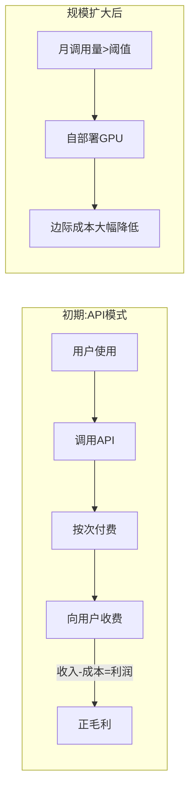
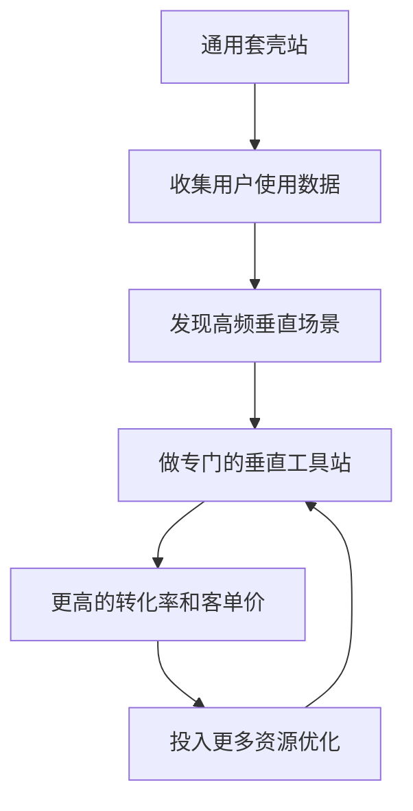

# 第08课：技术选型与成本控制

## 核心理念：按需付费，避免前期重投入

做 AI 工具站最大的陷阱是：**一开始就租 GPU 服务器自部署模型**。

> [!WARNING] 常见误区
> 很多新手做 AI 工具站，第一件事就是租 GPU 服务器。一台 GPU 服务器每月成本几千到上万元，如果网站还没有流量，这笔钱完全是浪费。

正确做法：**先使用按次付费的 API 平台，等流量大了再考虑自部署。**

## 按次付费 API 平台

### 推荐平台

| 平台 | 特点 | 适用场景 |
|------|------|----------|
| **replicate.com** | 按次计费，模型丰富 | 图片生成、视频生成 |
| **fal.ai** | 按次计费，速度快 | 实时推理场景 |
| **Hugging Face Inference API** | 开源模型多 | 各种 AI 任务 |
| **OpenAI API** | 质量高 | 文本生成、对话 |
| **Stability AI API** | 图片模型强 | 图片生成 |

### 成本优势

- 没有流量时成本为 **0**
- 有少量流量时，按次付费，成本可控
- 用户为你的工具付费后，你才需要向 API 平台付费
- **毛利模型清晰**：只要单次收入 > 单次 API 成本，就能盈利

## 站在巨人肩膀上

做 AI 工具站不需要自己训练模型。你的角色是**桥梁**：

> 研究团队发布模型 → 你将其封装成好用的工具 → 让普通用户能轻松使用

### 具体操作

1. 关注开源模型发布（[[0006-find-needs|需求挖掘方法]]中的大厂博客）
2. 理解模型的能力边界
3. 思考：普通用户用这个模型想解决什么问题？
4. 封装成简单的 Web 工具
5. 通过 API 平台调用模型，快速上线

> [!TIP] 桥梁价值
> 研究团队擅长做模型，但不擅长做产品。你不需要会训练模型，你只需要会用模型做产品。这就是你的价值所在。

## 成本控制的演进路径

### 阶段一：纯 API（0 - 10万次/月调用）

- 完全使用 replicate、fal.ai 等 API
- 零固定成本，按次付费
- 适用场景：验证需求期

### 阶段二：混合模式（10万 - 100万次/月调用）

- 核心高频功能自部署 GPU
- 长尾低频功能继续用 API
- 开始降低边际成本

### 阶段三：自部署（100万次以上/月调用）

- 租 GPU 服务器自部署模型
- 多个网站共享一台 GPU 服务器
- 边际成本降到最低

> [!EXAMPLE] 共享GPU服务器策略
> 假设你做了 5 个 AI 工具站：
> - 每个站单独租 GPU：5 × 5000元/月 = **25000元/月**
> - 5个站共享一台 GPU：**5000元/月**
> - 前提是各站流量高峰不重叠，或使用队列调度
>
> 通过共享策略，GPU 成本降低 **80%**。

## 从套壳到垂直场景

### 发展路径

1. **通用套壳**：对现有 AI 模型做简单的界面封装
2. **观察数据**：通过用户使用数据发现高频、高价值的垂直场景
3. **垂直工具站**：针对特定场景做专门的工具站
4. **更高利润**：垂直工具站的转化率和客单价通常高于通用套壳

### 为什么要这样演进

| 阶段 | 优势 | 风险 |
|------|------|------|
| 通用套壳 | 上得快，验证成本低 | 竞争激烈，利润薄 |
| 垂直工具站 | 需求明确，转化率高 | 市场小（但利润高） |
| 自部署 | 成本低，可控性强 | 需要资金和技术投入 |

> [!ABSTRACT] 关键洞察
> 套壳不是终点，而是起点。通过套壳积累的用户数据，是你发现垂直场景的最佳情报来源。用户用你的套壳工具做了什么？什么功能用得最多？什么场景下用户愿意付费？这些数据指引你走向利润更高的垂直市场。

## 总结

技术选型的核心原则是**用最小的成本验证需求**。初期使用按次付费 API，零固定成本起步；流量增长后逐步过渡到混合模式和自部署。你的价值不在于训练模型，而在于把模型能力封装成好用的产品。从通用套壳起步，通过用户数据发现垂直场景，是已验证的进化路径。

## 下一步

技术选型完成后，下一课 [[0009-seo-fundamentals]] 将进入 SEO 基础篇，学习如何让搜索引擎更好地收录和排名你的网站。

## 自测

> [!QUESTION] 检查理解
> 1. 为什么初期不建议自租 GPU 服务器？
> 2. 列举至少 3 个按次付费的 AI API 平台。
> 3. 成本控制的三个演进阶段分别是什么？
> 4. 多个网站共享 GPU 服务器可以降低多少成本？前提是什么？
> 5. 为什么说"套壳不是终点，而是起点"？

参考答案

1. GPU 服务器月成本高，在流量验证前是纯浪费。应该先用 API 按次付费验证需求。
2. replicate.com、fal.ai、Hugging Face Inference API（或 OpenAI API、Stability AI API）。
3. 阶段一：纯 API；阶段二：混合模式（核心自部署 + 长尾API）；阶段三：完全自部署。
4. 可降低约 80% 成本。前提是各站流量高峰不重叠或使用队列调度。
5. 套壳是验证需求和积累用户数据的起点。通过用户使用数据发现高频垂直场景，才能做利润更高的垂直工具站。

