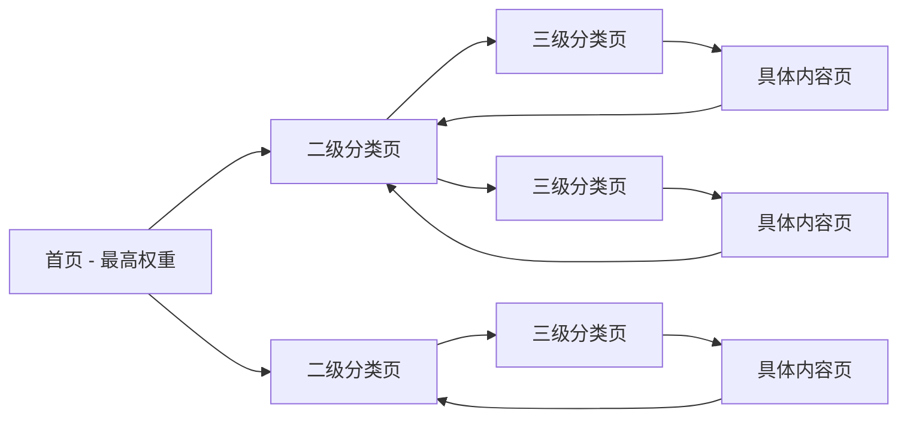
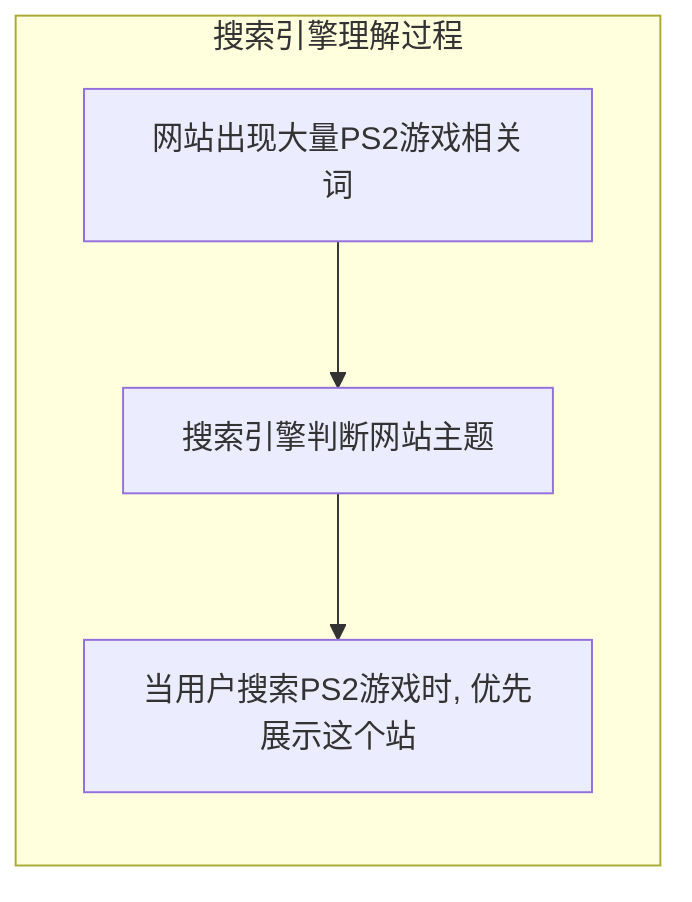

# 第10课：站内优化 — 分门别类罗列

## 六字真言

站内优化的核心方法论可以浓缩为六个字：

> [!EXAMPLE]
> **分门别类罗列**

这六个字贯穿了整个站内优化体系。展开来说就是：

1. **分门** — 将内容按大类划分
2. **别类** — 在各大类下细分小类
3. **罗列** — 将每个细分项用独立页面展示出来

搜索引擎的爬虫和算法，本质上是在阅读你网站的信息架构。当你把内容"分门别类罗列"清楚，搜索引擎就能理解你的网站擅长什么。

---

## 10个重要SEO元标签

每个页面头部的 `<head>` 区域是你和搜索引擎沟通的"第一现场"。以下是最重要的SEO元标签详解：

### 1. Title 标签（最重要）

```html
<title>AI Chinese Names Generator | Explore Chinese Names & Meanings</title>
```

- **最核心的SEO排名因素之一**
- 建议 ≤60个字符
- 关键词前置，品牌名放末尾
- 每个页面必须不同

### 2. Meta Description

```html
<meta name="description" content="用AI生成有意义的中国名字。输入你的英文名，获取个性化中文名字推荐。">
```

- 虽不是直接排名因素，但**影响点击率**
- 建议 ≤160个字符
- 包含关键词和行动号召
- 写得好的描述可显著提升CTR

### 3. Canonical 标签

```html
<link rel="canonical" href="https://example.com/page/">
```

- 指定页面的"权威版本"
- 解决重复内容问题
- 多个URL指向同一内容时，告诉搜索引擎哪个是主版本

### 4. Hreflang（多语言标签）

```html
<link rel="alternate" hreflang="en" href="https://example.com/en/">
<link rel="alternate" hreflang="ja" href="https://example.com/ja/">
<link rel="alternate" hreflang="x-default" href="https://example.com/">
```

- **出海多语言站必须使用**
- 告诉谷歌不同语言版本的关系
- 避免多语言内容被视为重复内容

### 5. Headings（H1-H6）

```html
<h1>AI Chinese Names Generator</h1>
<h2>How It Works</h2>
<h3>Step 1: Enter Your English Name</h3>
```

- **H1是页面的第二大信号**（仅次于Title）
- 每个页面有且只有一个H1
- H1应包含主关键词
- H2-H3组织内容层次，帮助搜索引擎理解页面结构

### 6. Image Alt 属性

```html

```

- 图片无法显示时提供给用户的替代文本
- 盲人读屏软件会读出alt内容
- **搜索引擎通过alt理解图片内容**
- 在正确上下文中使用关键词，但不要堆砌

### 7. Nofollow 属性

```html
<a href="https://example.com" rel="nofollow">链接文字</a>
```

- 告诉搜索引擎不要传递权重给目标链接
- 适用于：付费链接、用户生成内容的链接、不可信的来源
- 虽然谷歌不完全遵守nofollow，但**有一个链接总比没有好**

### 8. Meta Robots

```html
<meta name="robots" content="index, follow">
```

- `index`：允许搜索引擎收录此页面（默认）
- `noindex`：禁止收录
- `follow`：允许爬取页面上的链接
- `nofollow`：禁止爬取链接
- `noarchive`：禁止在搜索结果中显示缓存链接

### 9. Open Graph (OG) 标签

```html
<meta property="og:title" content="AI Chinese Names Generator">
<meta property="og:description" content="用AI生成个性化中文名字">
<meta property="og:image" content="https://example.com/preview.jpg">
```

- 控制页面在社交媒体（Facebook、Twitter、微信）分享时的展示效果
- 良好的OG标签能提升社交分享的点击率

### 10. Structured Data（结构化数据）

```html
<script type="application/ld+json">
{
  "@context": "https://schema.org",
  "@type": "WebApplication",
  "name": "AI Chinese Names Generator",
  "applicationCategory": "Utility"
}
</script>
```

- 帮助谷歌理解页面内容的**语义**
- 可以生成富媒体搜索结果（评分、价格、FAQ等）
- 显著提高搜索结果的点击率

> [!TIP] 检查工具
> 使用 **Google Rich Results Test** 或 **Ahrefs SEO Toolbar** 检查页面是否缺少重要元标签。

---

## 关键词树：站内结构的骨架

### 三层结构模型

```
首页（站点总入口）
 ├── 二级分类页（领域划分）
 │    ├── 三级分类页（细分领域）
 │    │    ├── 具体内容页（深挖关键词）
 │    │    └── 具体内容页
 │    └── 三级分类页
 └── 二级分类页
      └── ...
```

> [!TIP]
> 首页列出二级分类，二级页面列出三级分类，具体页面做深做透。每一层都在告诉搜索引擎："这个网站覆盖了哪些内容，它们的层级关系是什么。"

### 实战案例：明星写真网站

以明星写真网站为例，关键词树的设计如下：

```
首页
 ├── 大陆明星
 │    ├── 男明星 → 具体人名 → 写真集
 │    └── 女明星 → 具体人名 → 写真集
 ├── 港台明星
 │    ├── 男明星 → 具体人名 → 写真集
 │    └── 女明星 → 具体人名 → 写真集
 ├── 日韩明星
 │    ├── 男明星 → 具体人名 → 写真集
 │    └── 女明星 → 具体人名 → 写真集
 └── 欧美明星
      ├── 男明星 → 具体人名 → 写真集
      └── 女明星 → 具体人名 → 写真集
```

每一层都是一个聚合页面，最底层是具体内容页面。用户可以从首页一路下钻到具体的写真集页面。

---

## 一个关键词一个页面

### 原则

**每个独立关键词都应该拥有一个独立页面。**

不要试图在一个页面上覆盖多个关键词。搜索引擎对页面的理解是基于内容的主题聚焦度。当一个页面只围绕一个关键词展开时，搜索引擎能清晰判断这个页面的主题。

> [!WARNING]
> 常见的错误是把多个相关关键词塞进同一篇文章。看似省事，实际上哪个关键词都做不好排名。

### 落地方法

- 对关键词列表进行**去重和分组**
- 每组关键词中选出**主关键词**作为页面主题
- 其他相关关键词作为**LSI关键词**自然融入正文
- 每个页面确保有**唯一性内容**，不要和其他页面重复

---

## 内链传递权重

### 权重的流动性

网站的权重不是静止的。通过合理的内部链接，权重可以在站内流动：



首页的权重最高，通过链接流向二级页面，再流向三级页面和具体内容页。同时，具体内容页可以反向链接回分类页，形成权重的循环流动。

### 内链实操要点

1. **面包屑导航** — 每个页面都显示当前位置的层级路径
2. **相关推荐** — 内容页底部推荐同分类下的其他页面
3. **锚文本多样性** — 使用自然多样的锚文本，避免全部用"点击这里"
4. **避免孤岛页面** — 确保每个页面至少有一个入站链接

---

## 语义化分析的价值

当你列出下级词汇时，本身就是在告诉搜索引擎这个网站的主题。



**语义化分析的实质**：通过内容的结构化分类，让搜索引擎从词汇层面的关联推断出网站的专业领域。

---

## 做增量内容

### 竞争策略

比竞争对手的"内页"做得更好、更全。绝大多数网站的深层页面都是敷衍了事的，这就是你的机会。

> [!QUESTION]
> **如何判断一个页面是否值得做？**
> 看看竞争对手在这个关键词上的页面质量。如果只是一段泛泛而谈的文字，你做一个结构完整、信息全面、体验良好的页面，排名超越它是大概率事件。

### 增量原则

| 维度 | 竞争对手水平 | 你的目标 |
|------|------------|---------|
| 内容长度 | 300字短文 | 1500+字深度内容 |
| 结构化 | 无标题分段 | 清晰的多级标题 |
| 多媒体 | 纯文字 | 配图/视频/图表 |
| 用户体验 | 无排版 | 良好的阅读体验 |
| 更新频率 | 从不更新 | 定期维护和补充 |

---

## 本课总结

- 站内优化核心六字真言：**分门别类罗列**
- 构建**关键词树**，首页→二级→三级→具体页，层层递进
- **一个关键词一个页面**，确保主题聚焦
- 通过**内链**让权重在站内流动，避免孤岛页面
- 语义化分类本身就是SEO
- 做**增量内容**，在深度和完整性上超越对手

## 下一步

学习站外推广，进入 [[0011-offpage-seo|第11课：站外推广与外链建设]]。

## 自测题

<details>
<summary>点击展开自测题</summary>

1. 站内优化的六字真言是什么？
2. 关键词树的三层结构模型是什么？
3. 为什么每个关键词要独立页面？
4. 内链的主要作用是什么？
5. 做增量内容时，应该在哪些维度超越竞争对手？

**答案**
1. 分门别类罗列
2. 首页→二级分类页→三级分类页→具体内容页
3. 保持主题聚焦，搜索引擎能清晰判断页面专业领域
4. 让权重在站内流动，上下级页面互相传递权重
5. 内容长度、结构化、多媒体、用户体验、更新频率
</details>