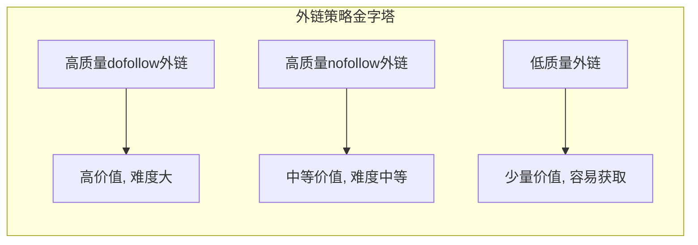
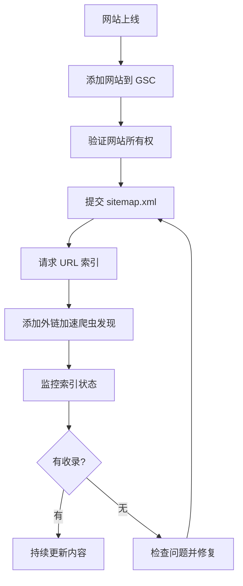

# 第11课：站外推广与外链建设

## 外链的两个核心作用

外链（Backlink）是谷歌排名算法中最重要的因素之一。它的作用可以归纳为两个层面：

### 作用一：传递权重

当其他网站链接到你的页面时，它们就在向你的页面"投票"。这种投票传递的是链接来源页面的权重。

> [!TIP]
> 一个高权重网站的外链，价值远高于十个低权重网站的外链。质量永远优于数量。

### 作用二：锚文本定义页面主题

这是外链容易被忽视的**关键作用**。别人用什么词汇链接你的网站，谷歌就会认为你在那个词汇对应的领域表现优秀。

> [!EXAMPLE]
> 案例：某域名查询工具网站，别人用"双拼域名扫描工具"这个锚文本链接他。谷歌据此推断：这个网站在"双拼域名扫描工具"方面做得好。当用户搜索"双拼域名扫描工具"时，这个网站的排名就会提升。

**实操启示**：在争取外链时，可以主动建议对方使用什么锚文本。这是引导搜索引擎理解你网站主题的有效手段。

---

## nofollow vs dofollow

### 基本概念

| 属性 | 含义 | 对权重的影响 |
|------|------|------------|
| `dofollow`（默认） | 链接页面明确传递权重 | 直接传递权重 |
| `nofollow` | 标记告诉谷歌不传递权重 | 间接仍有价值 |

### 新认知：nofollow 也有用

传统 SEO 观点认为 nofollow 链接没有价值。但哥飞指出，**谷歌现在不完全听从你的标记**——谷歌的算法会自行判断一个链接是否应该传递权重。

> [!WARNING]
> 即使加了 `rel="nofollow"`，这个链接仍然能：
> - 带来真实的用户流量
> - 被谷歌爬虫发现并跟踪
> - 在谷歌的"链接图谱"中留下记录
>
> 有 nofollow 链接比没有任何链接好得多。

### 链接建设策略

| 链接类型 | 获取难度 | 推荐策略 |
|---------|---------|---------|
| 高权重站点 dofollow | 高 | 内容营销 + 人脉 |
| 行业相关站点 dofollow | 中 | 客座博客 + 资源互换 |
| 社交媒体 nofollow | 低 | 日常运营，保持活跃 |
| 目录/论坛 nofollow | 低 | 适量参与，不过度 |

---

## GSC 提交新站

### 为什么要提交 GSC

新网站上线后，搜索引擎并不知道它的存在。通过 [[../reference/glossary#常用工具|Google Search Console]]（GSC）提交，可以加速爬虫发现你的网站。

### 标准提交流程

### 加速爬虫发现的关键技巧

提交 GSC 只是第一步。**真正加速爬虫发现的是外链**。

> [!ABSTRACT]
> 爬虫的工作方式是沿着链接从一个页面爬到另一个页面。当你的新站没有任何外部链接时，爬虫发现你的唯一途径就是通过 GSC 提交的 sitemap。但如果你在其他网站上放了一个指向你新站的链接，爬虫会顺着这个链接更快地发现你。

**实操建议**：
1. 在已有的社交账号中加上新站链接
2. 在相关论坛、社区的签名档放上链接
3. 在已有的其他网站上加一个友情链接
4. 提交到相关的行业目录

---

## 外链建设的常见误区

| 误区 | 正解 |
|------|------|
| 外链越多越好 | 质量和相关性比数量重要 |
| nofollow 没用 | nofollow 也有间接价值 |
| 只用精确匹配锚文本 | 锚文本需要多样性 |
| 只关注外链数量 | 外链来源域名的多样性同样重要 |

---

## 本课总结

- 外链的两大作用：**传递权重**和**锚文本定义主题**
- nofollow 链接同样有价值，**有胜于无**
- 提交 GSC 后配合**外链**加速爬虫发现
- 锚文本是引导谷歌理解你网站主题的重要工具
- 外链建设追求**质量、相关性、多样性**

## 下一步

学习如何将流量转化为收入，进入 [[0012-monetize|第12课：流量变现与案例分析]]。

## 自测题

点击展开自测题

1. 外链的两个核心作用是什么？
2. nofollow 链接还有价值吗？为什么？
3. 新站上线后，除了提交 GSC，还需要做什么来加速爬虫发现？
4. 锚文本对外链有什么特殊意义？

**答案**
1. 传递权重 和 锚文本定义页面主题
2. 有价值。谷歌不完全听从 nofollow 标记，而且 nofollow 链接能带来真实流量并帮爬虫发现网站
3. 在其他网站添加指向新站的外链，让爬虫顺着链接发现新站
4. 别人用什么词链接你，谷歌就认为你擅长什么，锚文本影响搜索引擎对你网站主题的判断

