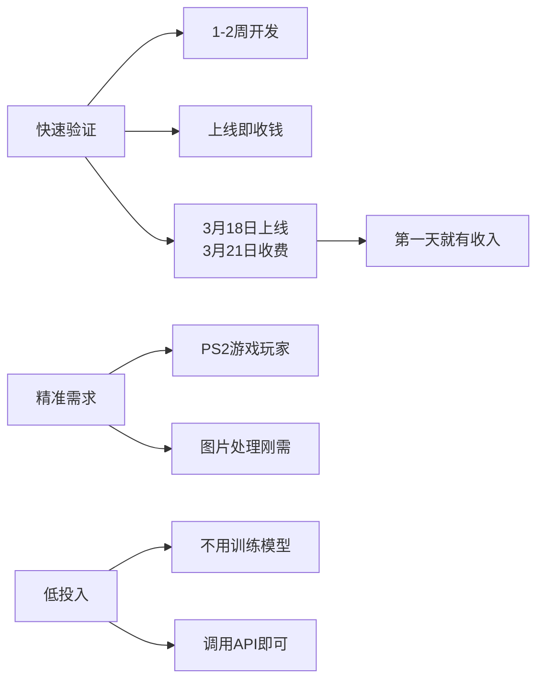
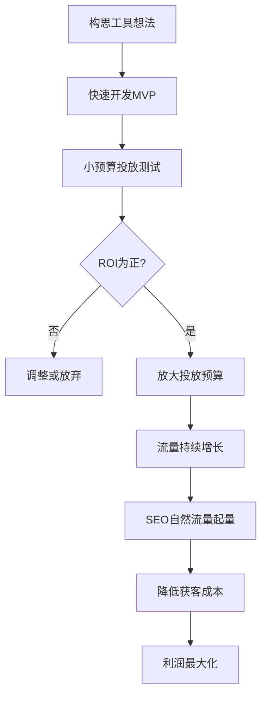
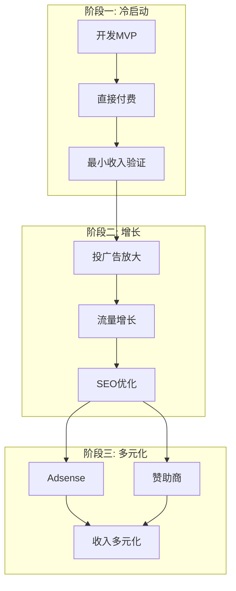

# 第12课：流量变现与案例分析

## 三种变现方式

AI工具站的变现路径可以归纳为三种模式，按从易到难排列：

### 模式一：赞助商

如果你的网站能证明自己有稳定的流量和用户群体，赞助商就会主动找上门。

> [!EXAMPLE]
> Monica.ai 作为 AI 浏览器助手，曾赞助过多个新工具站。他们的逻辑很简单：你证明能搞来流量，他们就付费在你的网站上展示产品。对站长来说，这是零成本的变现方式。

**关键条件**：需要有数据证明流量能力（UV、PV、用户停留时长等）。

### 模式二：Adsense 广告

Google Adsense 是最经典的流量变现方式。哥飞社群有多篇专题文章详细讲解。

#### 申请条件与技巧

Adsense 需要网站有一定流量基础后才能申请通过。新站建议先用其他方式积累流量，达到门槛后再申请。

> [!TIP] 新站申请小技巧
> - 确保网站有**足够内容**（至少10-20篇高质量文章）
> - 页面单词数**不少于600个**
> - 添加**隐私政策、关于我们、联系方式**等页面
> - 网站设计**专业美观**，不要像垃圾站
> - 申请被拒后可以**30天后再次申请**，不断优化

#### 账号注册与审核流程

1. 提交申请 → 等待审核（通常1-2周）
2. 审核通过后，需要**验证地址**（Google会寄送Pin码明信片）
3. 收到Pin码后在线输入，完成地址验证
4. 开始展示广告，等待收入累积
5. 收入达到 $100 后可提现

> [!WARNING] Pin码收取要点
> - Pin码通过**平邮**寄送，需要2-4周
> - 地址要用**拼音或英文**填写，确保邮局能看懂
> - 如果没收到，可以**申请重发**（最多3次）
> - 3次都没收到，可以**上传身份证**进行在线验证

#### 收入估算

判断一个网站Adsense收入的大致方法：

| 指标 | 公式 |
|------|------|
| 页面浏览量 | 统计工具查看 |
| RPM（千次展示收入） | 行业平均 $5-15 |
| 预估日收入 | (PV / 1000) × RPM |

> [!EXAMPLE] RPM 估算示例
> 假设日PV为10,000，RPM为$8，则日收入 = (10,000/1,000) × $8 = **$80/天**，约 $2,400/月。

#### 提高收入的核心技巧

| 技巧 | 说明 |
|------|------|
| **开启Adsense实验** | 每个新站都应开启，测试不同广告样式效果 |
| **广告位优化** | 首屏、内容中间、文章结尾等位置测试 |
| **响应式广告** | 自动适应桌面和移动端 |
| **自动广告** | 让谷歌自动优化广告位置 |
| **关注ECPM** | ECPM（千次展示收入）是核心指标，不同国家差异很大 |
| **高价值国家流量** | 美/英/加/澳等国家ECPM远高于发展中国家 |

#### Adsense 生态理解

> [!ABSTRACT] 谷歌的广告分成
> 谷歌把广告费的**60%以上**分给站长，自己留不到40%。这是谷歌生态的核心机制——通过利益共享激励站长持续生产和优化内容。正因为有这个分成机制，才会有无数站长愿意为谷歌生态贡献内容。

| 变现模式 | 门槛 | 收入稳定性 |
|---------|------|-----------|
| 赞助商 | 有流量数据即可 | 依赖合作方 |
| Adsense | 需流量达标后申请 | 相对稳定 |
| 直接付费 | 无门槛，需产品力 | 最高 |

### 模式三：直接付费

这是**最高效**的变现方式——直接让用户为你的工具付费。不需要等待流量达到某个阈值，只要产品能解决用户问题，就可以收费。

> [!WARNING]
> 很多新手站长陷入一个误区：非要等到 500 UV 甚至更多才开始考虑收费。实际上，如果你的工具提供了明确的价值，从第一天就应该考虑收费。

---

## PS2 Filter 案例

PS2 Filter 是哥飞课程中最具代表性的变现案例，完整展示了从想法到收入的闭环。

### 时间线

```
3月16日 ── 开始开发
3月18日 ── 上线
3月21日 ── 晚上23:30 上线付费功能
           ── 第一单立马进来
3月22日 ── 第二天收入 $200+
3月23日 ── 第三天收入 $700+
3月24日 ── 第四天收入 $1000+
后续     ── 最高达到 $1700/天
```

### 关键数据

- **开发时间**：仅 1-2 周
- **AI 模型**：不是自己训练的，调用现有 API
- **单日最高收入**：$1700
- **投入产出比**：极高

### 成功要素分析



> [!ABSTRACT]
> PS2 Filter 案例的核心启示：**不要追求完美再上线，先上线再迭代。** 从开发到上线仅 2 天，从上线到收费仅 3 天。速度比完美更重要。

---

## 投广告验证需求

### 为什么要投广告验证

在没有 SEO 流量之前，投广告是验证需求真实性和商业价值的有效手段。

> [!QUESTION]
> **在投入大量时间做 SEO 之前，是否应该先确认这确实是一个能赚钱的需求？**

答案是肯定的。投广告可以快速回答三个关键问题：

1. **有需求** — 用户会不会点击广告？
2. **需求刚性** — 用户愿不愿意付费？
3. **经济模型** — 流量成本是否低于收入？

### 投放测试数据

哥飞验证某工具需求时的投放数据：

| 指标 | 数据 |
|------|------|
| 单次点击单价 | 几毛钱人民币 |
| ROI | 150% |
| 回本周期 | 当天回本 |

### 从验证到放大



### 投放验证的操作要点

| 步骤 | 操作 | 预算建议 |
|------|------|---------|
| 1. 设计测试 | 选择 3-5 个精准关键词 | — |
| 2. 制作落地页 | 页面直接展示价值和付费入口 | — |
| 3. 小预算投放 | 日预算 $10-20 | $10-20/天 |
| 4. 分析数据 | CTR、转化率、客单价 | — |
| 5. 决策 | ROI > 100% 则放大 | 放大至 $50-200/天 |

> [!TIP]
> 当点击单价只有几毛钱人民币时，获取流量的成本极低。即便转化率不高，只要产品价值明确，ROI 很容易做到正向。低成本投放+高 ROI = 可放大的商业模式。

---

## 变现的综合策略



---

## 本课总结

- 三种变现方式：**赞助商 / Adsense / 直接付费**，其中直接付费效率最高
- PS2 Filter 案例证明：**快速开发 + 快速收费 = 快速验证**，2 天开发上线，3 天后收费即盈利
- 投广告验证需求是低成本试错手段，点击单价低时 ROI 容易为正
- 验证通过后**放大投放**，同时做 SEO 积累自然流量
- 不要等流量够了才变现，**从第一天就考虑收费**

## 下一步

回顾 [[0009-seo-fundamentals|第09课：谷歌SEO基础与生态]] 到本课的变现逻辑，形成从流量获取到收入转化的完整认知闭环。

## 自测题

<details>
<summary>点击展开自测题</summary>

1. AI 工具站的三种变现方式是什么？哪种效率最高？
2. PS2 Filter 从开发到上线用了多久？从上线到收费用了多久？
3. PS2 Filter 最高单日收入是多少？
4. 投广告验证需求主要回答哪三个问题？
5. 投放测试中 ROI 多少以上应该考虑放大？

**答案**
1. 赞助商、Adsense、直接付费。直接付费效率最高
2. 开发到上线 2 天，上线到收费 3 天
3. $1700/天
4. 有没有需求？需求刚不刚性？经济模型是否成立？（流量成本是否低于收入）
5. ROI > 100%（当天回本）就可以考虑放大
</details>