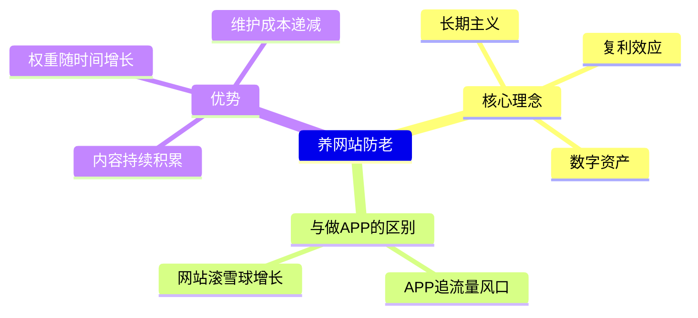
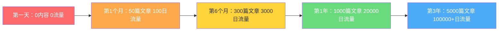

# 补充课01：养网站防老 — 网站是一生的事业

> 种一棵树最好的时间是十年前，其次是现在。养一个网站也是如此。

## 核心理念：网站不是快消品

大多数人对做网站的理解停留在"做个站赚快钱"的层面。但哥飞提出的 **养网站防老** 理念完全不同——**网站不是快消品，而是可以经营一生的数字资产**。

### 做APP vs 做网站

| 维度 | 做APP | 做网站 |
|------|-------|--------|
| 流量获取 | 需不断追新风口 | 可积累自然搜索流量 |
| 内容积累 | 每次重来 | 持续叠加价值 |
| 用户获取成本 | 高（需推广） | 低（SEO自然流量） |
| 生命周期 | 短（几个月到一两年） | 长（持续多年甚至一生） |
| 资产属性 | 消耗品 | 增值资产 |

> [!TIP]
> 做APP像是捕鱼——每次出海都要看天气、找鱼群；做网站像是种树——选对地方种下去，浇水施肥，它自己会越长越大。

## 养网站防老 vs 养儿防老

传统观念里，"养儿防老"是为晚年做打算。但在数字时代，**一个精心经营的网站比人更可靠**：

- 网站不会累，7x24小时在线工作
- 网站不会抱怨，默默为你创造价值
- 网站的"记忆力"只会越来越强（内容积累、权重提升）
- 网站可以同时服务成千上万人

> [!WARNING]
> 养网站防老不是让你放弃现实生活，而是**多一份保障**。当你的网站每月带来稳定收入时，你才真正有了"睡后收入"。

## 网站的复利效应

网站价值的增长不是线性的，而是指数的。

**复利的三个引擎：**

1. **内容复利** —— 每新增一篇文章都在增加你的内容资产
2. **权重复利** —— 搜索引擎信任度随时间积累，新内容排名越来越快
3. **流量复利** —— 旧内容持续带来流量，新内容叠加增量

> [!EXAMPLE]
> **真实案例：** 哥飞社群中有成员从零开始做一个工具站，前三个月几乎零收入。坚持更新到第8个月时，突然有一个关键词冲上Google第一页，单日UV从200暴涨到8000，当月AdSense收入突破$3,000。到第15个月，该站已经稳定月入$10,000+。

## 为什么是"一生的事业"？

很多人在做网站这件事上犯的错误是**太着急**：

- 做了两周没流量就放弃
- 写了10篇文章看不到效果就停止
- 看到别人赚钱就换方向

> [!ABSTRACT]
> **长期主义的本质：** 你不需要一开始就做得很好，你只需要做得比昨天好一点。每天进步1%，一年后你是原来的37倍。

### 正确的心态

1. **接受慢启动** —— 前3-6个月可能看不到明显回报，这是正常的
2. **关注过程指标** —— 不要只盯着收入，关注文章数、收录数、关键词排名
3. **相信时间的力量** —— 一个坚持更新2年的网站，价值远超10个做了2个月就放弃的站

## 与主课的关联

本补充课是 [[s01-yangwangzhan-intro|主课01：养网站防老]] 的延伸。在理解"网站是一生的事业"这个理念后，你将更坚定地踏上这条道路。

后续补充课：
- [[s02-code-foundation|补充课02：编程基础与学习路径]] —— 没有编程基础怎么开始
- [[s03-first-need|补充课03：挖掘第一个需求]] —— 找到你的第一个关键词
- [[s04-keyword-formula|补充课04：关键词价值公式]] —— KDRoi公式实战

## 总结

- 网站是数字资产，不是快消品，值得一生经营
- 与做APP相比，做网站有复利效应，越做越轻松
- 养网站防老理念的核心是长期主义和复利思维
- 不要着急，接受慢启动，坚持更新

## 下一步

在继续学习之前，先问自己三个问题：

1. 你是否愿意为一个网站持续投入至少6个月？
2. 你是否能接受前三个月几乎没有收入？
3. 你是否相信时间的力量？

如果你的答案都是"是"，那么恭喜你，你已经具备了养网站防老最重要的心态基础。

## 自测题

点击展开自测题

**题目1：** 以下哪个是"养网站防老"理念的核心观点？

A) 做一个网站快速赚一笔钱
B) 网站是值得长期经营的数字资产
C) 只有大公司才能做网站
D) 做网站比做APP简单10倍

查看答案

**答案：B**
解释：养网站防老的核心是长期主义——网站不是快消品，而是可以经营一生的数字资产。

**题目2：** 网站价值的"复利效应"主要来自哪三个方面？

查看答案

**答案：** 内容复利、权重复利、流量复利。
解释：每篇文章都是资产，搜索信任度持续积累，旧内容和新内容叠加带来流量增长。

**题目3：** 做APP和做网站最大的区别是什么？

查看答案

**答案：** 做APP需要不断追新流量风口，每次重来；做网站是滚雪球，内容和权重持续积累，随时间增值。

