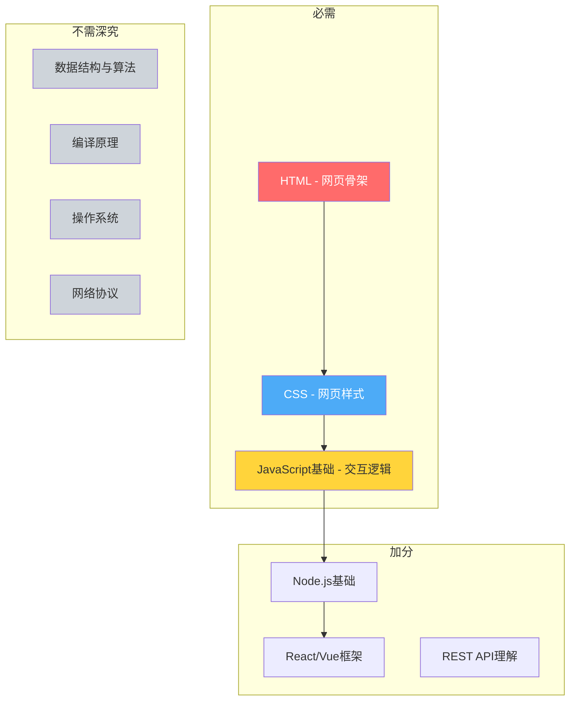
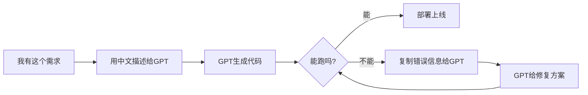

# 补充课02：编程基础与学习路径

> 不会编程也能做网站——但你得愿意学一点点。

## 你需要多少编程知识？

很多新手最大的顾虑是："我不会编程，能做网站吗？"

答案是：**能，但你得学点基础。**

好消息是，你不需要成为高级程序员。养网站防老所需的编程技能**门槛很低**：

> [!TIP]
> 做网站需要的编程知识 ≈ 会骑自行车，而不是会造汽车。你不需要理解编译原理、数据结构、算法，你只需要能让网页跑起来。



## 推荐学习路径

### 第一阶段：HTML + CSS（1-2周）

目标：能写一个静态页面

**免费资源：**

| 资源 | 链接 | 说明 |
|------|------|------|
| MDN Web Docs | developer.mozilla.org | 最权威的Web文档，遇到问题首选 |
| freeCodeCamp | freecodecamp.org | 交互式学习，边学边练 |
| W3Schools | w3schools.com | 入门友好，例子丰富 |

**学习要点：**
- HTML常用标签：`div`, `p`, `h1-h6`, `a`, `img`, `ul/li`, `input`, `button`
- CSS基础：盒模型、flex布局、颜色字体、边距
- **不需要**记住所有标签和属性，查文档就行

> [!WARNING]
> 不要试图背下所有HTML标签和CSS属性。**学会查文档比记住更重要**。专业前端开发也在天天查MDN。

### 第二阶段：JavaScript基础（2-4周）

目标：能写简单的交互逻辑

**学习内容：**
- 变量与数据类型
- 函数
- 条件语句与循环
- DOM操作（最重要！）
- fetch/axios（请求API）
- 数组与对象操作

**推荐的免费教程：**
- freeCodeCamp JavaScript课程
- YouTube: Traversy Media 的 JavaScript 速成课
- 现代 JavaScript 教程 (zh.javascript.info)

> [!QUESTION]
> 为什么要学JavaScript？因为现在的网站没有JS几乎无法工作——表单验证、数据请求、动态内容、用户交互，全都要JS。

### 第三阶段：会用GPT辅助写代码（持续）

这是**最重要的能力**。

你不会需要自己手写所有代码——你要学会的是：
1. **看懂代码** —— 知道自己想要什么
2. **用GPT生成** —— 把需求描述清楚，让AI写
3. **调试修改** —— 跑不通时知道怎么问



> [!EXAMPLE]
> **GPT辅助编码实战：**
> 你想做一个"图片压缩工具"页面，不需要自己从零写。
> 
> **好的Prompt：**
> ```
> 请写一个HTML页面，功能是在线图片压缩。
> 要求：
> 1. 用户上传图片后显示原图大小
> 2. 拖动滑块选择压缩质量
> 3. 实时预览压缩后的图片
> 4. 可以下载压缩后的图片
> 5. 用Tailwind CSS美化
> 6. 所有处理在浏览器端完成，不上传服务器
> ```
> 
> GPT会直接生成一个完整可用的HTML文件。你只需要看懂、微调、部署。

## 进阶：Node.js和框架

当你用纯HTML/CSS/JS做出几个小工具站后，可以考虑学习：

- **Node.js** —— 让你用JavaScript写后端逻辑
- **Express.js** —— 快速搭建Web服务器
- **React/Next.js** —— 现代前端框架，适合复杂项目

> [!ABSTRACT]
> **学习的"够用原则"：**
> - 第一阶段：能做一个静态落地页 → 够了
> - 第二阶段：能写一个带交互的工具 → 很够
> - 第三阶段：会用GPT辅助写出完整站点 → 非常够
> - 只有做复杂的SaaS产品时，才需要深入学习框架

## 与主课的关联

本补充课是 [[s02-code-foundation|主课02：编程基础与学习路径]] 的延伸。主课侧重"为什么要学"，本课侧重"具体怎么学"。

在掌握编程基础后，推荐继续学习：
- [[s03-first-need|补充课03：挖掘第一个需求]] —— 找到你做网站的方向
- [[s04-keyword-formula|补充课04：关键词价值公式]] —— 判断关键词是否值得做

## 总结

- 养网站防老不需要成为高级程序员，只需要基础的HTML/CSS/JS
- 推荐免费资源：MDN、freeCodeCamp、W3Schools
- **会用GPT辅助写代码比会手写更重要**
- 坚持"够用原则"，不要陷入过度学习的陷阱

## 下一步

打开 freeCodeCamp，完成 HTML 和 CSS 部分的前三个项目。不需要全部学完，学到能看懂基本标签和布局就行。

然后找一个你最想做的工具站，让GPT帮你生成第一个页面。

## 自测题

<details>
<summary>点击展开自测题</summary>

**题目1：** 养网站防老的最低编程门槛是什么？

A) 精通C++和数据结构
B) 掌握HTML + CSS + JavaScript基础
C) 会写汇编语言
D) 拿到计算机学位

<details>
<summary>查看答案</summary>
**答案：B**
解释：你只需要HTML（骨架）、CSS（样式）和JavaScript基础（交互逻辑）就能开始做网站。
</details>

**题目2：** 学习编程时最重要的能力是什么？

A) 背下所有语法
B) 会用GPT辅助写代码
C) 精通所有框架
D) 能手写编译器

<details>
<summary>查看答案</summary>
**答案：B**
解释：在AI时代，描述需求、看懂代码、调试修改的能力远比手写代码更重要。
</details>

**题目3：** 以下哪个资源最适合零基础学习Web开发？

A) 《算法导论》
B) freeCodeCamp
C) Linux内核源码
D) TCP/IP详解

<details>
<summary>查看答案</summary>
**答案：B**
解释：freeCodeCamp提供交互式学习体验，边学边练，对零基础最友好。
</details>

</details>