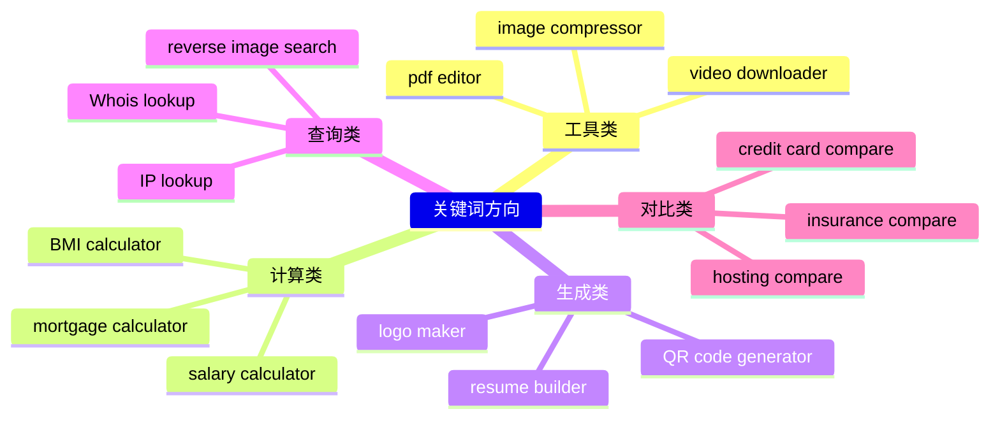
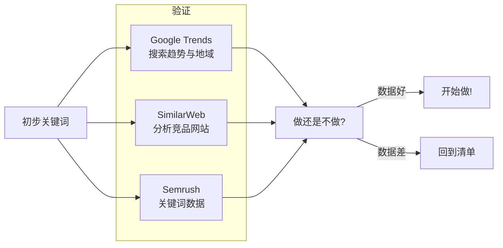
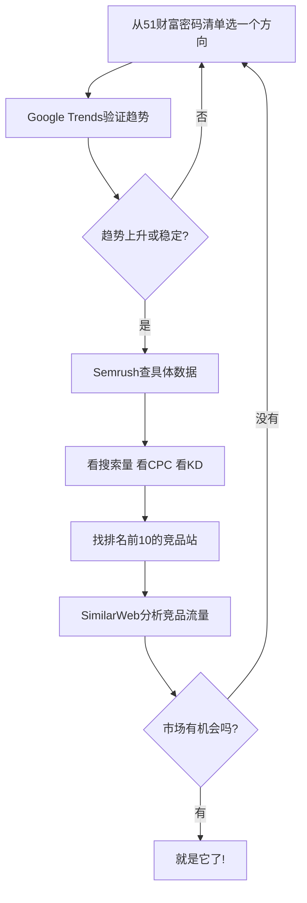

# 补充课03：挖掘第一个需求

> 选对方向，成功一半。

## 从51个财富密码关键词开始

哥飞社群整理了一份 **"51个财富密码关键词"** 清单 —— 这些是经过验证、有商业价值的出海关键词方向。

> [!TIP]
> 如果你还没有这份清单，可以先从以下几个经典方向入手：
> 
> - **工具类：** online image compressor, pdf editor, video downloader, file converter
> - **计算类：** mortgage calculator, bmi calculator, salary calculator, loan calculator
> - **生成类：** qr code generator, resume builder, logo maker, invoice generator
> - **查询类：** ip address lookup, whois lookup, reverse image search
> - **对比类：** credit card compare, insurance compare, hosting compare

## 不要想太多，先选一个

新手最大的问题不是选错方向，而是**一直在选方向**。

> [!WARNING]
> **分析瘫痪（Analysis Paralysis）：** 花太多时间研究哪个词最好，结果一个站都没做。与其花一周研究十个关键词，不如花一周把一个站做出来。

### 第一轮筛选很简单

从清单中挑出你**最有感觉**的那个：

1. 看到这个词，你脑子里能浮现出网站长什么样？
2. 你能不能想出这个工具的核心功能？
3. 你能不能想象用户为什么会搜这个词？

如果三个回答都是"是"——就选它。

## 关键词来源工具

选定方向后，用工具验证和扩展你的选择。

### Google Trends

- 查看关键词的搜索趋势是上涨还是下跌
- 对比多个相关词的搜索热度
- 查看地域分布（确认目标市场）

### SimilarWeb

- 分析排名前10的竞品网站
- 查看竞品的流量来源和流量量级
- 判断这个市场有没有"肉"吃

### Semrush

- 获取精准的关键词搜索量、CPC、KD数据
- 发现相关关键词（拓展方向）
- 分析竞品的关键词策略

> [!QUESTION]
> **免费工具能用吗？**
> 
> 可以。初期可以用 Google Trends + 谷歌搜索自身的关键词规划师（免费版）。但到后期建议投资 Semrush 或 Ahrefs，数据质量差异很大。

## 品牌词 vs 非品牌词

理解这个区别至关重要。

| 类型 | 特点 | 例子 | 适合谁？ |
|------|------|------|----------|
| **品牌词** | 搜索特定品牌 | "nike shoes" | 已有品牌知名度 |
| **非品牌词** | 搜索通用需求 | "running shoes for men" | **新手首选** |

> [!TIP]
> **新手只做非品牌词。** 品牌词需要品牌积累，而搜非品牌词的用户是带着需求来的——他们不在乎你的网站是新是旧，只要能解决问题就行。

### 好的非品牌词特征

1. **意图明确** —— 用户搜这个词就是要做某件事
   - "compress pdf" → 要压缩PDF
   - "resume builder" → 要做简历
   - "image resizer" → 要改图片尺寸
2. **中文环境也有对标** —— 如果是中国市场，这个词对应的中文需求你熟悉吗？
3. **可以做工具** —— 不是纯信息类，而是可以通过一个工具页面解决问题

## 优先选择有商业价值的关键词

什么样的词有商业价值？

- 用户愿意为这个功能付费（哪怕只是看广告）
- 这个词对应的市场有成熟的变现模式
- CPC（每次点击成本）较高说明广告主愿意为该词的用户付费

> [!EXAMPLE]
> **好词 vs 差词对比：**
> 
> | 好词 | 搜索量 | CPC | 说明 |
> |------|--------|-----|------|
> | "invoice generator" | 22,000 | $1.50 | 用户需要开票工具，广告价值高 |
> | "what is invoice" | 8,000 | $0.10 | 用户只想了解概念，难变现 |
> 
> 同样是 "invoice" 相关，前者可以做工具，后者只是信息查询。

## 实操流程总结

## 与主课的关联

本补充课是 [[s03-first-need|主课03：挖掘第一个需求]] 的延伸，提供了更细的操作指南。

接下来深入学习如何评估关键词价值：
- [[s04-keyword-formula|补充课04：关键词价值公式]] —— KDRoi公式帮你做数据决策

## 总结

- 从哥飞的51个财富密码关键词清单开始，不要自己瞎想
- 选一个你"有感觉"的，先做起来，不要分析瘫痪
- 用 Google Trends、SimilarWeb、Semrush 验证和扩展选词
- 新手只做非品牌词，选有明确商业价值的词
- **行动 > 分析**

## 下一步

打开你的关键词清单，选出3个你觉得最有潜力的词。对每个词做：
1. Google Trends 查趋势
2. Google 搜索前10结果看竞品
3. 用 [[s04-keyword-formula|KDRoi公式]] 算分

选分数最高的那个，开始做站。

## 自测题

点击展开自测题

**题目1：** 新手选关键词的首选方向是什么？

A) 品牌词
B) 非品牌词
C) 自己造的词
D) 搜索量为零的词

查看答案

**答案：B**
解释：非品牌词代表用户的通用需求，不需要品牌积累，适合新手切入。

**题目2：** 以下哪个词最有商业价值？

A) "what is pdf"
B) "pdf compressor online free"
C) "history of pdf"
D) "pdf file extension"

查看答案

**答案：B**
解释：用户搜索"pdf compressor online free"有明确的使用意图——要在线压缩PDF，可以做成工具站变现。

**题目3：** 分析瘫痪（Analysis Paralysis）指的是什么？

A) 网站被攻击瘫痪
B) 花太多时间分析却不行动
C) 关键词排名下降
D) 服务器负载过高

查看答案

**答案：B**
解释：很多新手花大量时间研究选哪个词最好，结果一个站都没做出来。正确做法是快速筛选后立刻行动。

