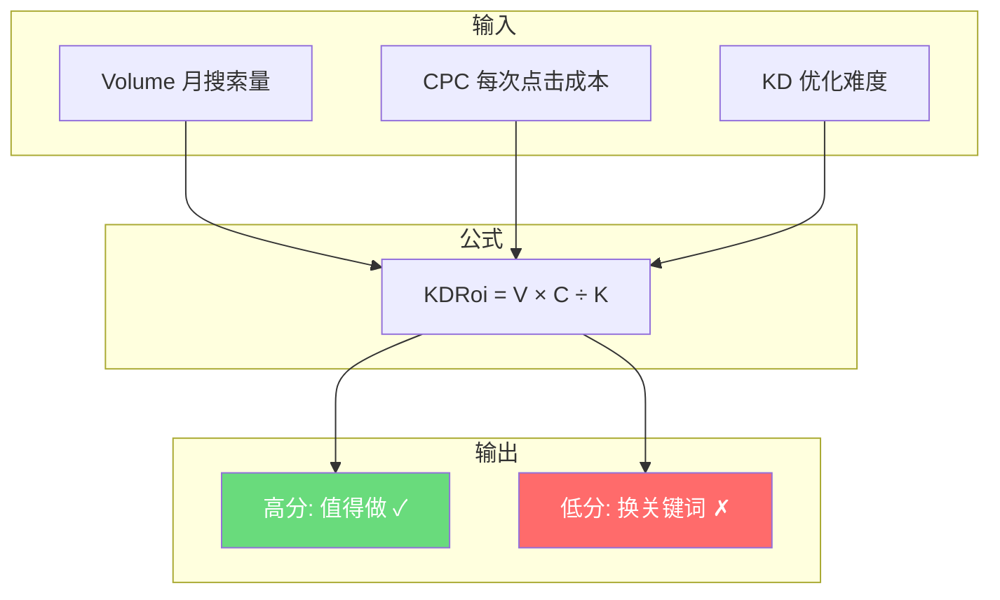
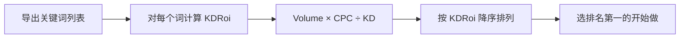

# 补充课04：关键词价值公式

> 做好一个网站，不如算好一个公式。

## KDRoi 公式

哥飞自创的 **KDRoi** 公式是评估关键词价值的核心工具：

```
KDRoi = Volume × CPC ÷ KD
```

| 变量 | 含义 | 来源 | 说明 |
|------|------|------|------|
| **Volume** | 月搜索量 | Semrush / Ahrefs | 每月有多少人搜索这个词 |
| **CPC** | 点击成本 | Semrush / Google Ads | 广告主愿意为一次点击付多少钱 |
| **KD** | 优化难度 | Semrush (0-100) | 这个词竞争有多激烈 |
| **KDRoi** | 关键词价值分 | 计算得出 | 越高越值得做 |

> [!ABSTRACT]
> **公式背后的直觉：**
> - Volume 越高 → 潜在流量越大
> - CPC 越高 → 每个访客越值钱
> - KD 越低 → 你越容易排上去
> 
> **KDRoi 衡量的就是：用最小的努力，获得最大的价值。**

## KDRoi 的核心逻辑



### 为什么是这三个指标？

1. **Volume 搜索量** —— 没有搜索量就没有流量，没有流量就没有收入
2. **CPC 点击成本** —— 反映商业价值。即使你不投广告，CPC高的词也意味着用户价值高（广告主愿意付费）
3. **KD 优化难度** —— 难度太高你排不上去，再好的词也没用。KD越低，你的新站越有机会

## 实操：Semrush 筛选流程

### 第一步：输入核心词

在 Semrush 的 **Keyword Overview** 中输入你的核心词。

比如输入 "pdf compressor"，Semrush 会返回：

| 关键词 | Volume | KD | CPC |
|--------|--------|----|-----|
| pdf compressor | 33,000 | 62 | $0.80 |
| compress pdf | 22,000 | 55 | $0.75 |
| pdf compressor online | 8,100 | 38 | $0.90 |
| compress pdf online free | 4,400 | 22 | $1.20 |
| free pdf compressor | 6,600 | 18 | $0.95 |

> [!TIP]
> 注意看：核心词 "pdf compressor" 的 KD=62 对新站来说太高了。但长尾词 "compress pdf online free" 的 KD=22 就友好得多。

### 第二步：设置筛选条件

在 Semrush 的 **Keyword Magic Tool** 中设置筛选条件：

```
Volume ≥ 600
KD   0 - 29
CPC  > 0.1
排除 "near me"
```

> [!WARNING]
> 为什么排除 "near me"？因为这类词（如 "plumber near me"）需要本地实体业务支持，不适合做纯工具站。

### 第三步：计算每个词的 KDRoi

导出符合条件的词，用公式计算：



**示例计算：**

| 关键词 | Volume | KD | CPC | KDRoi | 排名 |
|--------|--------|----|-----|-------|------|
| compress pdf online free | 4,400 | 22 | $1.20 | **240** | 1 |
| free pdf compressor | 6,600 | 28 | $0.95 | **224** | 2 |
| how to compress pdf | 3,200 | 15 | $0.30 | **64** | 3 |
| pdf compressor online | 8,100 | 38 | $0.90 | 排除(KD>29) | - |

> [!EXAMPLE]
> 看排名第一的 "compress pdf online free"：KDRoi=240
> - 月搜索量 4,400 → 稳定流量来源
> - KD=22 → 新站有机会排上去
> - CPC=$1.20 → 用户价值高
> 
> 相比之下，"how to compress pdf" 虽然 KD 更低，但 CPC 只有 $0.30，商业价值低很多。

## KDRoi 解读指南

| KDRoi 范围 | 建议 | 说明 |
|-----------|------|------|
| ≥ 200 | **立即做** | 黄金关键词，低难度高价值 |
| 100 - 199 | **值得做** | 不错的词，可以排入规划 |
| 50 - 99 | **可考虑** | 如果资源充裕可以做 |
| < 50 | **跳过** | 价值太低，不值得投入 |

> [!TIP]
> KDRoi 是一个**相对指标**，而不是绝对真理。在不同 niche 中，KDRoi 的标准会不同。关键是**在同一个 niche 内用 KDRoi 排序，选最高的做**。

## KDRoi 的局限性

任何公式都有局限性，KDRoi 也不例外：

- **KD 是近似值** —— Semrush 的 KD 只是估算，不一定完全准确
- **不反映SERP类型** —— 搜索结果页是广告多还是自然结果多？有没有 featured snippet？
- **不反映用户意图** —— "buy pdf compressor" 和 "free pdf compressor" 意图完全不同
- **不反映季节性** —— 有些词旺季淡季差异巨大

> [!WARNING]
> KDRoi 是**筛选工具**，不是**决策替代**。算完分之后，还是要人工判断：这个词的搜索结果长什么样？能不能做一个比现有结果更好的页面？

## 与主课的关联

本补充课是 [[s04-keyword-formula|主课04：关键词价值公式]] 的延伸，深入讲解公式的实操应用。

完成关键词评估后，继续学习后续主课：
- [[s05-search-intent|补充课05：分析搜索意图]] —— 理解搜索意图，匹配正确页面类型
- [[s06-gpt-webpage|补充课06：GPT生成网页]] —— 基于搜索意图快速生成页面

## 总结

- KDRoi = Volume × CPC ÷ KD，越高越值得做
- 在 Semrush 中筛选：volume ≥ 600, KD 0-29, CPC > 0.1，排除 "near me"
- 计算每个词的 KDRoi，排序后选最高的做
- KDRoi 是筛选工具，不是最终决策，需要人工验证

## 下一步

打开 Semrush（或免费的关键词规划师），找一个你感兴趣的 niche，按以下步骤实操：

1. 输入核心词
2. 导出至少 50 个相关词
3. 按筛选条件过滤
4. 计算每个词的 KDRoi
5. 选出前 3 名
6. 手动验证搜索结果页

## 自测题

<details>
<summary>点击展开自测题</summary>

**题目1：** KDRoi 公式的三个变量是什么？

A) 收入、利润、成本
B) Volume（搜索量）、CPC（点击成本）、KD（优化难度）
C) 流量、转化率、客单价
D) 页面数、外链数、域名年龄

<details>
<summary>查看答案</summary>
**答案：B**
解释：KDRoi = Volume × CPC ÷ KD，分别代表搜索量、商业价值和竞争难度。
</details>

**题目2：** 以下哪个关键词的 KDRoi 最高？

| 词 | Volume | KD | CPC |
|---|--------|----|-----|
| A | 5,000 | 10 | $0.50 |
| B | 3,000 | 5 | $0.80 |
| C | 8,000 | 40 | $1.00 |
| D | 2,000 | 25 | $1.50 |

<details>
<summary>查看答案</summary>
**答案：A（KDRoi=250）**
- A: 5000 × 0.5 ÷ 10 = 250
- B: 3000 × 0.8 ÷ 5 = 480 ← 这是最高的
- C: 8000 × 1.0 ÷ 40 = 200（KD>29，应排除）
- D: 2000 × 1.5 ÷ 25 = 120

更正：B的KDRoi=480，才是最高。但B的KD=5，说明难度很低，搜索量3000也不错，确实值得做。
</details>

**题目3：** 筛选条件中，为什么 KD 要控制在 0-29？

A) 因为 KD>29 的词搜索量都太小
B) 因为 KD>29 表示竞争激烈，新站很难排上去
C) 因为 KD>29 的词 CPC 都很低
D) 因为 Semrush 只能查 0-29 的数据

<details>
<summary>查看答案</summary>
**答案：B**
解释：KD(优化难度) 0-29 表示竞争较低，新站有机会通过优质内容排到前面。KD>29 意味着这个关键词已经有很多强力网站在竞争，新手很难突围。
</details>

</details>