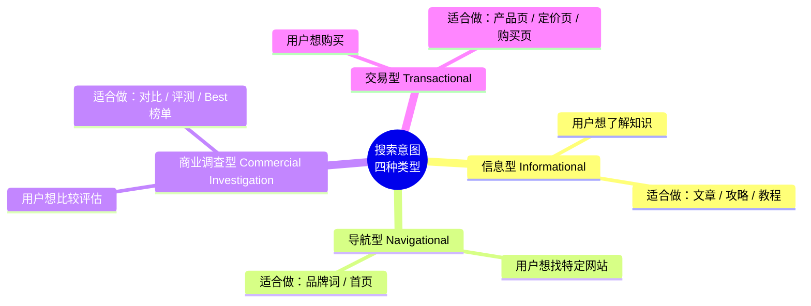
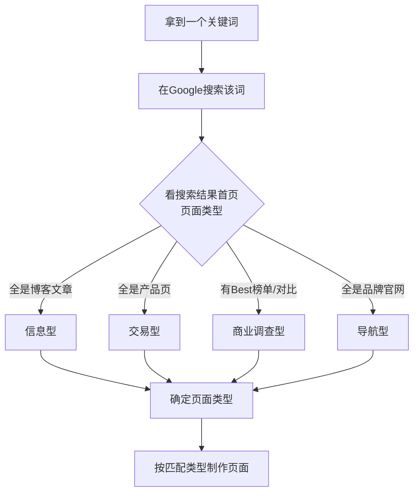

# 补充课05：养网站防老 — 分析搜索意图

做网站不是"写你想写的文章"，而是**做用户正在搜索的内容**。而用户搜索的每一个关键词背后，都隐藏着一种**意图**。匹配这种意图，是页面获得排名的前提。

> [!ABSTRACT]
> 搜索引擎的终极目标只有一个：**理解用户想要什么，然后把最匹配的结果呈现在最前面。** 你的页面能否排名，不取决于内容多好，而取决于它是否匹配了用户的搜索意图。

---

## 搜索意图的四种类型

所有搜索引擎的用户搜索行为，都可以归纳为四种意图类型。



### 1. 信息型 (Informational)

用户想了解某个知识、解决某个问题、学习某个技能。

| 特征 | 说明 |
|------|------|
| 搜索词示例 | `how to lose weight`, `什么是SEO`, `chinese names generator` |
| 搜索结果特点 | 博客文章、教程、百科、视频 |
| 你的打法 | 写深度文章、做攻略内容 |
| 变现方式 | 展示广告（AdSense）、关联推荐产品 |

> [!TIP]
> 信息型关键词是**养网站防老**最基础的内容来源。一个网站如果有一百篇高质量的信息型文章，每一篇都在帮你吸引搜索流量，这就是"防老"的根基。

### 2. 导航型 (Navigational)

用户已经知道某个品牌或网站，想直接导航过去。

| 特征 | 说明 |
|------|------|
| 搜索词示例 | `facebook login`, `notion ai`, `chatgpt` |
| 搜索结果特点 | 品牌官网、登录页面 |
| 你的打法 | 如果你的品牌本身没有知名度，导航型关键词对你**没有意义** |
| 注意 | 不要试图去抢大品牌的导航词，几乎不可能排上去 |

### 3. 交易型 (Transactional)

用户已经准备好购买了，搜索词带有明确的购买意图。

| 特征 | 说明 |
|------|------|
| 搜索词示例 | `buy iphone 15`, `chatgpt premium price`, `logo maker subscription` |
| 搜索结果特点 | 产品页、购买页、定价页 |
| 你的打法 | 做好产品页面，清晰展示价值和价格 |
| 变现方式 | 直接销售、联盟营销（affiliate） |

### 4. 商业调查型 (Commercial Investigation)

用户想购买但还在比较阶段，不是直接下单，而是先做调研。

| 特征 | 说明 |
|------|------|
| 搜索词示例 | `best ai writing tools`, `chatgpt vs claude`, `logo maker review` |
| 搜索结果特点 | Best榜单、对比文章、评测文章 |
| 你的打法 | 做"Best X"榜单、做"X vs Y"对比、做评测 |
| 变现方式 | 联盟营销链接（affiliate link） |

> [!WARNING]
> 商业调查型关键词的**转化率通常非常高**。用户通过你的对比文章决定买哪家，通过你的affiliate链接下单，这是最理想的流量变现模式。**这是养网站防老体系中最具商业价值的搜索意图类型。**

---

## 实战：如何分析一个关键词的搜索意图

### 三步法



### 详细操作步骤

**步骤1：打开无痕窗口**

使用浏览器的无痕/隐私模式搜索，避免Google根据你的历史记录个性化搜索结果。

**步骤2：搜索关键词**

在Google中输入你的目标关键词。

**步骤3：分析首页结果类型**

逐个查看搜索结果中排名前10的页面，问自己三个问题：

1. 这些页面是什么类型？（博客文章 / 产品页 / 榜单 / 品牌官网）
2. 它们的标题和描述有什么共同模式？
3. 它们的内容结构和格式是什么样的？

**步骤4：判断意图归属**

| 首页结果特征 | 意图判断 |
|-------------|---------|
| 多数是 `.com` 的博客文章 | 信息型 |
| 多数是 `.com` 的产品/购买页 | 交易型 |
| 半数以上有"Best"、"vs"、"Review"字样 | 商业调查型 |
| 全是品牌官网或登录页 | 导航型 |

**步骤5：按照对应的页面类型制作内容**

做完前面四步后，你就知道应该做什么类型的页面了。不要创新，**模仿排名前10的页面类型**。

> [!EXAMPLE]
> **实战案例：分析 "chinese name generator"**
>
> 搜索该词，Google首页结果是：
> 1. 各种在线中文名生成工具（工具页）
> 2. 博客文章介绍中文命名文化
> 3. 维基百科关于中文名的页面
>
> 判断：**混合型**（信息型 + 工具型）。这说明用户既想了解中文命名文化，也想直接使用工具。最佳策略是做**一个工具页面 + 附带介绍文章**。

---

## 为什么匹配搜索意图如此重要

### Google的核心目标

Google的使命是"组织全球信息，使其人人可访问和有用"。落实到搜索排名算法上，就是：**给每个搜索词找到最匹配的结果**。

如果你的页面类型不匹配搜索意图：
- Google不会给你好的排名
- 即使排上去了，用户也会很快离开（高跳出率）
- 用户不满足，Google会降权

### 匹配意图的常见错误

| 错误做法 | 后果 |
|---------|------|
| 给信息型关键词做产品页 | 不相关，不排名 |
| 给交易型关键词做博客文章 | 用户想买你给文章，转化率为零 |
| 给导航型关键词做信息页 | 浪费精力，做不过品牌官网 |
| 给商业调查型关键词做产品页 | 用户还在比较阶段，直接推产品会被跳过 |

> [!QUESTION]
> **为什么不能一个页面覆盖多种意图？**
>
> 因为搜索引擎会在第一秒判断页面的"类型"。一个页面如果既像文章又像产品页，搜索引擎会困惑，最终可能两个意图都不匹配。**保持聚焦，一个页面只服务一种搜索意图。**

---

## 与关键词价值公式的联动

在 [[s04-keyword-formula|补充课04：关键词价值公式]] 中，我们学习了 KDRoi 公式。搜索意图分析是公式的第一步：

```
KDRoi = (月搜索量 × 商业价值 × 排名概率) / 竞争难度
```

- **月搜索量** — 用关键词工具获取（如 Ahrefs、Semrush、Google Keyword Planner）
- **商业价值** — 由搜索意图决定（商业调查型 > 交易型 > 信息型）
- **竞争难度** — 分析首页竞争对手的域名权重
- **排名概率** — 评估你能否做出比对手更好的页面

> [!ABSTRACT]
> 搜索意图直接决定了关键词的**商业价值系数**。一般来说：
> - 商业调查型关键词：商业价值 10/10
> - 交易型关键词：商业价值 8/10
> - 信息型关键词：商业价值 4/10
> - 导航型关键词：对新手站几乎无价值

---

## 本课总结

- 搜索意图分为四种：**信息型、导航型、交易型、商业调查型**
- 匹配搜索意图是排名的**前提条件**
- 分析搜索意图的三步法：无痕窗口搜索 -> 分析结果类型 -> 判断意图归属
- 不要违反意图匹配规则：信息型=文章，交易型=产品页，商业调查型=Best榜单/对比
- 搜索意图直接影响了关键词的商业价值和你的变现策略

## 下一步

掌握了搜索意图分析后，下节课我们学习如何利用 GPT 基于搜索意图生成网页内容：[[s06-gpt-webpage|补充课06：GPT生成网页]]。

## 自测题

<details>
<summary>点击展开自测题</summary>

1. 搜索意图的四种类型分别是什么？各举一个搜索词例子。
2. 为什么给信息型关键词做产品页不会获得排名？
3. 分析搜索意图的三步法是什么？
4. 商业调查型关键词为什么有最高的商业价值？
5. 导航型关键词对新手网站来说是否值得做？为什么？

**答案**
1. 信息型（how to lose weight）、导航型（facebook login）、交易型（buy iphone）、商业调查型（best ai tools）
2. 用户想了解知识，搜索引擎需要匹配文章/教程类型的页面，产品页不满足用户的真实需求
3. 无痕窗口搜索 -> 分析结果页类型（文章/产品/榜单/品牌） -> 判断意图归属
4. 用户处于购买决策前的比较阶段，通过你的推荐链接下单，转化率高
5. 不值得，因为搜索引擎会优先展示品牌官网，小网站几乎无法竞争导航型关键词的排名
</details>