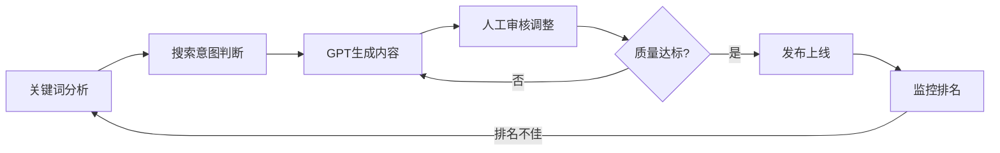

# 补充课06：养网站防老 — GPT生成网页

明确了搜索意图之后，下一步就是用 AI 生成符合该意图的页面内容。GPT 是养网站防老体系中**最高效的内容生产工具**，但前提是你会正确地使用它。

> [!WARNING]
> GPT 生成的内容不能直接发布。AI 内容需要**人工审核和调整**，这是谷歌对 AI 内容质量的基本要求。参考 [[s12-ai-content-quality|补充课12：AI生成内容质量]] 了解更多。

---

## 内容生产的完整流程



> [!TIP]
> GPT 负责"量"和"效率"，你负责"质"和"把关"。**AI是你的写手，你是主编。** 这个角色定位决定了内容质量的天花板。

---

## 步骤详解

### 步骤1：分析关键词搜索意图

在让 GPT 写内容之前，先确认关键词的意图类型。回顾上一课的内容：

| 搜索意图 | 页面类型 | GPT生成方向 |
|---------|---------|------------|
| 信息型 (Informational) | 文章/教程/攻略 | 深度长文、步骤指南 |
| 交易型 (Transactional) | 产品页/定价页 | 产品介绍、功能列表、CTA |
| 商业调查型 (Commercial Investigation) | 榜单/对比/评测 | Best列表、对比表格、评分 |

### 步骤2：明确页面目标和目标受众

GPT 生成内容的质量，很大程度上取决于你给的**上下文是否充分**。你需要明确的告知 GPT：

- **页面目标**：用户在这个页面上应该完成什么动作？
- **目标受众**：谁会读这个页面？他们的水平如何？
- **品牌调性**：用什么语气？（专业/友好/权威）

### 步骤3：编写 Prompt 驱动 GPT 生成

Prompt 模板如下：

```
我正在做一个关于[关键词]的页面。
搜索意图是[信息型/交易型/商业调查型]。
目标受众是[描述：如"完全没有编程基础的新手"]。
请帮我生成一个SEO友好的页面内容，包括：
1. H1 标题（包含主关键词）
2. 2-3个 H2 子标题及对应的正文（每段100-150词）
3. 相关的 H3 小标题（如有需要）
4. 行动号召（CTA）
5. 页面的 meta description（不超过160字符）
6. 3-5个相关的 LSI 关键词

要求：内容自然有深度，不要AI味太浓。
```

> [!EXAMPLE]
> **实战 Prompt 示例**
>
> 关键词：`best ai writing tools for bloggers`
> 搜索意图：商业调查型
>
> ```
> 我正在制作一个关于"best AI writing tools for bloggers"的页面。
> 搜索意图是商业调查型（用户想比较和选择AI写作工具）。
> 目标受众是个人博客作者和内容创作者，英语母语者。
>
> 请生成SEO友好的页面内容，包含：
> 1. 一个吸引眼球的H1标题
> 2. "Why Bloggers Need AI Writing Tools"板块（H2）
> 3. 逐个介绍5款工具，每款包含：工具名、核心功能、价格、适合人群（H3）
> 4. 对比表格总结
> 5. FAQ板块
> 6. 结尾CTA（引导用户免费试用其中推荐的工具）
> 7. Meta Description（≤155字符）
>
> 注意：语气要客观中立，避免过度营销感。
> ```

### 步骤4：人工审核和调整

这是**最关键的一步**。GPT 生成的内容需要你从以下几个方面审核：

#### 事实性审核

| 检查项 | 说明 |
|-------|------|
| 数据准确性 | 检查所有数字、日期、统计数据的真实性 |
| 信息来源 | 如果 GPT 引用了某些事实，确认这些事实是否存在 |
| 产品信息 | 功能描述是否准确，价格是否最新 |

> [!WARNING]
> GPT 可能会"幻觉"出不存在的事实或数据。特别是当你写产品对比或工具评测时，**一定要逐个验证** GPT 提到的每款工具是否存在、功能是否正确。

#### 内容质量审核

| 检查项 | 说明 |
|-------|------|
| 可读性 | 语句是否自然流畅，有没有明显的"AI腔" |
| 逻辑结构 | 段落前后是否连贯，逻辑是否自洽 |
| 信息密度 | 是否提供了真正的价值，还是泛泛而谈 |
| 原创性 | 内容是否和其他网站有明显雷同 |

#### SEO 细节调整

| 检查项 | 说明 |
|-------|------|
| H1-H3 结构 | 是否有且只有一个 H1，层级是否合理 |
| 关键词密度 | 主关键词是否自然出现，有没有堆砌 |
| 内部链接 | 是否需要加入指向站内其他页面的链接 |
| 图片/多媒体 | 是否缺少配图、截图或视频 |

---

## 三种意图类型的 Prompt 策略

### 信息型关键词 Prompt 示例

```
[关键词]：how to choose a Chinese name
[意图]：信息型 — 用户想了解中文命名规则和方法

请生成一篇完整的指南文章，内容包括：
- 中文名的结构（姓+名）
- 常见的命名规则和寓意
- 名和字的选择技巧
- 容易犯的错误
- 实用的在线工具推荐
- 让读者能按照步骤自己选一个中文名
```

### 交易型关键词 Prompt 示例

```
[关键词]：AI logo maker pricing
[意图]：交易型 — 用户想了解价格并购买

请生成一个产品定价页面内容：
- 清晰的三档定价方案对比
- 每个方案的核心功能列表
- 用户的常见问题（FAQ）
- 强有力的CTA按钮文案建议
- 强调"免费试用"或"无风险承诺"
```

### 商业调查型关键词 Prompt 示例

```
[关键词]：ChatGPT vs Claude vs Gemini
[意图]：商业调查型 — 用户想比较三大AI助手

请生成详细对比文章：
- 三大AI助手的背景介绍
- 功能对比表（价格、支持语言、上下文长度等维度）
- 各自的优势和劣势
- 不同使用场景的最佳选择建议
- 用户评价汇总
- 最终推荐
```

---

## 5个提升内容质量的技巧

### 技巧1：用"角色设定"提升专业性

```
你是一位有10年经验的SEO内容策略师和资深行业专家。
请以这个身份来撰写以下内容...
```

### 技巧2：一次生成，多次迭代

不要期望一次 Prompt 就得到完美结果。先让 GPT 生成框架，然后逐步补充和完善。

```
第1轮：生成文章大纲
第2轮：逐段展开
第3轮：优化表达和SEO
第4轮：补充案例和数据
```

### 技巧3：给予 GPT 参考页面

```
我在参考以下的排名前3的页面风格：
[URL1]
[URL2]
[URL3]
请分析它们的共同特点，然后生成一篇比它们更好的内容。
```

### 技巧4：明确定义"不要做什么"

```
注意事项：
- 不要使用"在当今世界"这类陈词滥调开头
- 不要出现任何未经确认的数据
- 不要超过800词
- 避免使用过度夸张的形容词
```

### 技巧5：统一输出格式

对于批量化生产页面，建议把 Prompt 固定为标准模板，然后只是替换关键词和意图。这样可以保持内容风格一致，提高生产效率。

> [!ABSTRACT]
> **批量生产的高效工作流**
>
> 1. 准备好关键词列表（从 [[s04-keyword-formula|补充课04：关键词价值公式]] 筛选出）
> 2. 批量用工具分析搜索意图
> 3. 编写一套标准 Prompt 模板
> 4. 用 GPT 批量生成初稿
> 5. 人工逐篇审核和微调
> 6. 发布上线
>
> 一个人一天可以完成 10-15 个页面的内容生产。

---

## 本课总结

- GPT 生成网页内容的四步流程：分析意图 -> 明确受众 -> 生成内容 -> 人工审核
- Prompt 质量决定了内容质量，提供充分的上下文比"请写一篇好文章"有效一百倍
- 三种搜索意图对应三种不同的 Prompt 策略
- **人工审核不可跳过**：事实审核、质量审核、SEO细节审核缺一不可
- 使用角色设定、迭代生成、参考页面等技巧提升内容质量
- 标准化 Prompt 模板实现批量化高效生产

## 下一步

内容完成后，下节课学习如何通过布局和样式提升页面的用户体验：[[s07-layout-style|补充课07：布局样式与用户体验]]。

## 自测题

<details>
<summary>点击展开自测题</summary>

1. GPT 生成网页内容的四步流程是什么？
2. 为什么人工审核是"最关键的一步"？
3. 给商业调查型页面写 Prompt 时，应该要求 GPT 生成什么类型的内容结构？
4. 提升 GPT 内容质量的五个技巧分别是什么？
5. 对于批量化生产，如何提高效率？

**答案**
1. 分析搜索意图 -> 明确目标和受众 -> 编写Prompt生成 -> 人工审核调整
2. GPT可能出现事实幻觉，AI内容需要人工把关才符合谷歌质量要求，SEO细节需要人工微调
3. Best榜单、对比表格、工具逐个介绍、评分、FAQ，语气客观中立
4. 角色设定、迭代生成、参考页面、负面约束、统一模板
5. 标准化Prompt模板，关键词列表批处理，逐篇审核发布
</details>