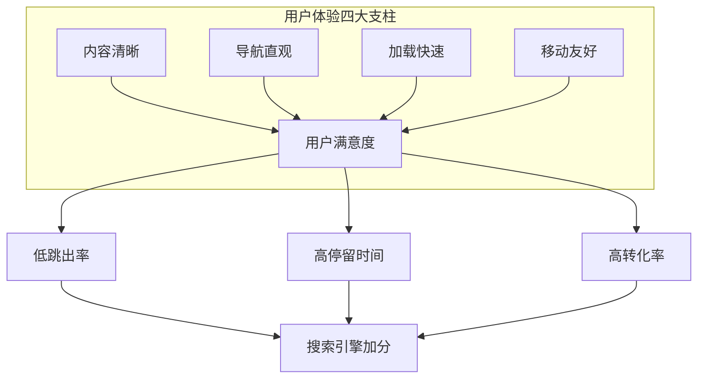
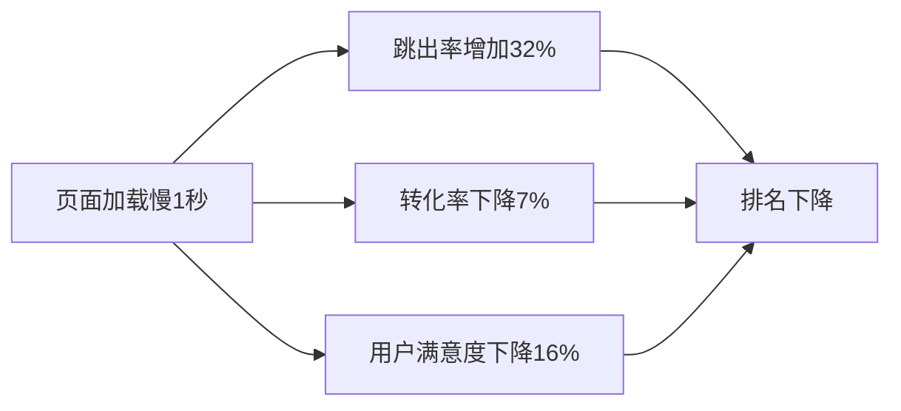
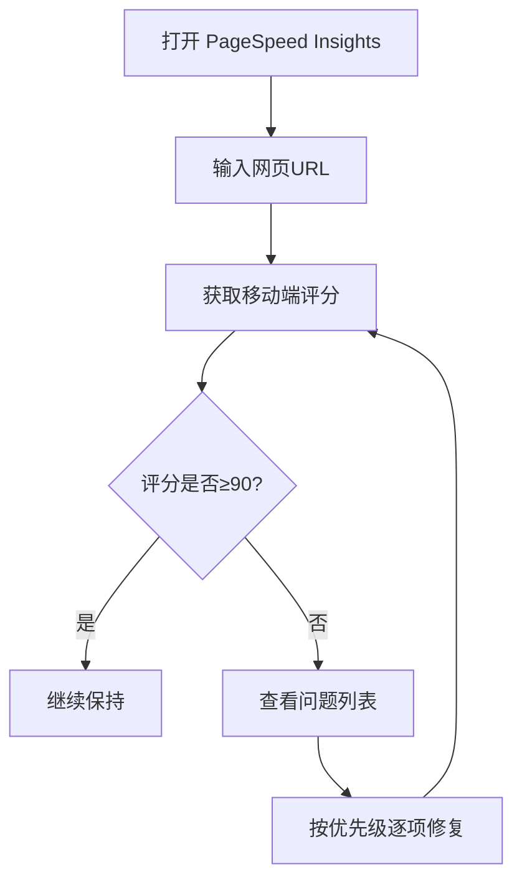

# 补充课07：养网站防老 — 布局样式与用户体验

内容为王，体验为皇。再好的内容，如果页面布局混乱、加载缓慢、移动端无法使用，用户会立刻离开。**用户体验是搜索引擎判断页面质量的重要指标。**

> [!ABSTRACT]
> Google 的排名算法中包含了多种用户体验信号：**Core Web Vitals**（核心网页指标）、**移动端适配性**、**页面加载速度**、**交互流畅度**。这四者共同决定了你的页面在用户体验维度上的评分。

---

## 用户体验的核心原则



> [!TIP]
> **用户体验的终极标准很简单**：用户打开你的页面后，能在 **3秒内** 理解这是什么网站、能找到他们要的东西、能流畅地完成操作。做到这三点，你的用户体验就已经超过了 80% 的网站。

---

## 页面布局：信息架构的视觉呈现

### 清晰的层级结构

每个页面都应该遵循"从宏观到微观"的信息架构：

```
Header（导航栏 + Logo）
 ├── Hero区域（核心价值一句话说清）
 │    ├── 标题（H1）
 │    ├── 副标题（简短说明）
 │    └── CTA按钮
 ├── 内容主体
 │    ├── 功能/服务介绍（H2）
 │    ├── 详细说明（H3）
 │    └── 图片/截图辅助理解
 ├── 证据/信任元素
 │    ├── 用户评价
 │    ├── 数据统计
 │    └── 合作品牌Logo
 └── Footer
      ├── 相关链接
      ├── 隐私政策
      └── 版权信息
```

### 表单/工具页布局

对于 AI 工具站，工具/表单页面的布局有更特殊的要求：

```
Header（极简，减少干扰）
 ├── 工具标题（H1 — 如 "AI Name Generator"）
 ├── 输入区域
 │    ├── 输入框（清晰标注）
 │    ├── 选项设置（如性别、风格选择）
 │    └── 生成按钮（醒目颜色）
 ├── 输出区域
 │    ├── 结果展示
 │    ├── 复制/下载按钮
 │    └── 再次生成按钮
 └── Footer（极简）
```

> [!WARNING]
> **工具页不要堆砌内容。** 很多新手站长在工具页上方放长篇介绍文章，用户需要滚动很久才能看到真正的工具。工具的入口应该**在首屏可见**，说明文字放在工具下方。

---

## 移动端适配：最重要的优先级

### 为什么移动端最重要

- 全球超过 **60%** 的搜索流量来自移动设备
- Google 使用 **移动优先索引**（Mobile-First Indexing）
- 移动端体验差的页面会被 Google 降权

> [!EXAMPLE]
> **哥飞的经验**
>
> 在养网站防老的实操中，很多工具站超过 70% 的流量来自手机用户。如果你的网站在手机上无法正常使用（输入框点不到、按钮太小、布局错乱），等于自动放弃了超过七成的潜在用户。

### 移动端适配检查清单

| 检查项 | 达标标准 |
|-------|---------|
| 响应式布局 | 页面在 320px - 1920px 宽度下正常显示 |
| 触控友好 | 按钮/链接至少 48x48px 的点击区域 |
| 字体大小 | 正文至少 16px，防止 iOS 自动缩放 |
| 行距间距 | 行高 1.5-1.8，段落间距舒适 |
| 表单适配 | 输入框自动放大，键盘弹出不遮挡 |
| 首屏加载 | 3秒内展示主要内容 |
| 滚动流畅 | 无卡顿、无布局偏移 |

### 移动端适配测试工具

```
1. Chrome DevTools 移动端模拟器 → 快速调试
2. Google Mobile-Friendly Test → 官方检测工具
3. PageSpeed Insights → 同时检测性能和移动端适配
4. 真实设备测试 → 用手机打开网站实际操作
```

---

## 加载速度优化

### 速度影响什么



> [!TIP]
> 根据 Google 的研究，页面加载时间从 1 秒增加到 3 秒，跳出率增加 32%。**在速度上的每一分投入，都会直接转化为更好的排名和更高的转化。**

### 速度优化的具体措施

#### 1. 图片优化

| 措施 | 效果 |
|-----|------|
| 使用 WebP/AVIF 格式替代 JPG/PNG | 减少 30%-50% 体积 |
| 压缩图片质量（85%-90% 肉眼无损） | 减少 20%-40% 体积 |
| 使用响应式图片（`srcset` 属性） | 按设备加载合适尺寸 |
| 懒加载技术（`loading="lazy"`） | 首屏加载速度提升 2-3 倍 |

#### 2. CDN 加速

选择合适的 CDN 服务商，将静态资源分发到全球节点：

- **Cloudflare**：免费方案即可覆盖全球，性价比最高
- **Amazon CloudFront**：AWS 生态，适合大流量站点
- **Vercel / Netlify**：静态站点自带 CDN，快速方便

#### 3. 代码优化

```
JavaScript: 异步加载 (async/defer)
CSS: 关键CSS内联，非关键CSS延迟加载
字体: 使用 font-display: swap 避免文字不可见
缓存: 设置合理的 Cache-Control 头部
```

### 使用 PageSpeed Insights 检测



> [!ABSTRACT]
> **PageSpeed Insights 的合理目标**
> - 移动端评分：**≥ 70**（及格）
> - 桌面端评分：**≥ 90**（优秀）
> - First Contentful Paint (FCP)：**< 1.8s**
> - Largest Contentful Paint (LCP)：**< 2.5s**
> - Cumulative Layout Shift (CLS)：**< 0.1**
>
> 不必追求满分，达到上述目标就可以获得 Google 的速度友好标记。

---

## 色彩搭配与字体选择

### 配色基本原则

| 原则 | 说明 |
|-----|------|
| 不超过3种主色 | 主色 + 辅助色 + 强调色 |
| 对比度充足 | 文字和背景的对比度 ≥ 4.5:1（WCAG AA标准） |
| 品牌一致性 | 全站使用统一的配色方案 |
| 颜色有含义 | 绿色=成功/继续，红色=错误/停止，蓝色=可点击 |

### 字体选择

- **优先使用系统字体**：`system-ui, -apple-system, sans-serif` — 加载最快、兼容最好
- 如果需要自定义字体，使用 Google Fonts 并只加载 **需要的字重**（一般 400 + 700 就够了）
- 标题和正文可以用同一种字体族，通过字重和字号区分层级

```css
/* 推荐的字体方案 */
body {
  font-family: -apple-system, BlinkMacSystemFont, "Segoe UI", Roboto,
    "Helvetica Neue", Arial, sans-serif;
  font-size: 16px;
  line-height: 1.6;
}

h1 {
  font-size: 2rem;
  font-weight: 700;
}

h2 {
  font-size: 1.5rem;
  font-weight: 600;
}
```

---

## 参考同类成功网站的设计模式

不要从零开始设计。**抄袭成功的模式，然后做得更好。**

### 观察分析框架

```
1. 找到你所在领域的 Top 10 成功网站
2. 分析它们的布局模式
   ─ 导航栏放在哪里？有几个导航项？
   ─ Hero区域展示什么信息？
   ─ 内容区块如何排列？
   ─ CTA按钮的颜色和位置？
3. 找出共性（大家都在用的模式）
4. 套用共性模式，加入你的差异化
```

### 常见的成熟设计模式

| 网站类型 | 推荐参考的布局模式 |
|---------|-----------------|
| AI 工具站 | 顶部工具入口 + 下方功能介绍 |
| 信息型博客 | 左侧文章 + 右侧边栏（分类/推荐） |
| 榜单/对比站 | 表格对比 + 逐个详细介绍 |
| 多语言站点 | 右上角语言切换 + hreflang 标签 |

> [!WARNING]
> 参考不是复制。**直接抄袭别人的设计和内容会被 Google 惩罚。** 学习的是"模式"和"结构"，不是复制"代码"和"文字"。

---

## 本课总结

- 用户体验的四大支柱：**内容清晰、导航直观、加载快速、移动友好**
- 页面布局遵循"从宏观到微观"的信息架构，工具页确保工具在首屏可见
- 移动端适配是**最高优先级**，全球超过 60% 的流量来自手机
- 加载速度影响跳出率和转化率，**每一秒的优化都直接提升排名**
- 配色不超过3种主色，字体优先使用系统字体
- 参考成功网站的设计模式，套用共性、做出差异

## 下一步

页面布局样式搞定了，下节课学习如何构建内页体系和内链网络：[[s08-inner-pages|补充课08：内页与内链建设]]。

## 自测题

<details>
<summary>点击展开自测题</summary>

1. 用户体验的四大支柱是什么？
2. 移动端适配中，按钮的最小触控区域应该是多大？
3. 页面加载时间从1秒增加到3秒，跳出率增加多少？
4. PageSpeed Insights 的移动端合理目标评分是多少？
5. 为什么工具页要确保工具入口在首屏可见？

**答案**
1. 内容清晰、导航直观、加载快速、移动友好
2. 48x48px
3. 32%
4. ≥ 70 分
5. 用户打开工具页的目的是直接使用工具，不是读文章。工具在首屏可见能显著降低跳出率。
</details>