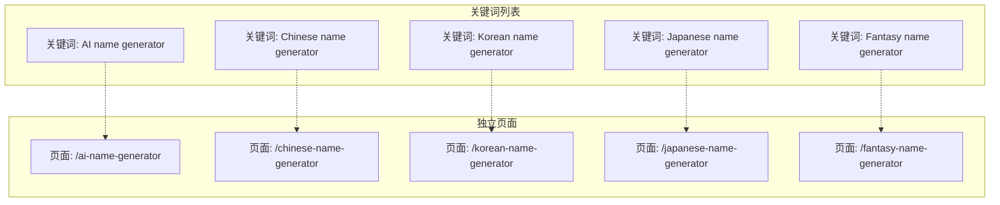
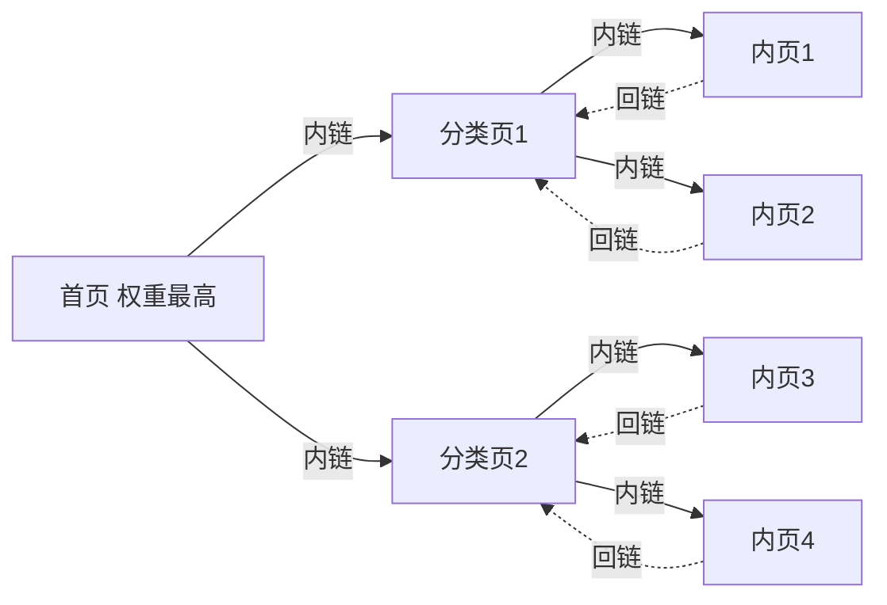
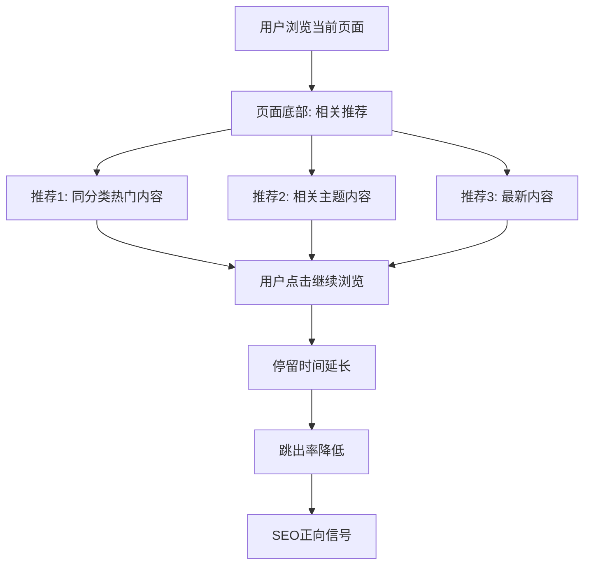
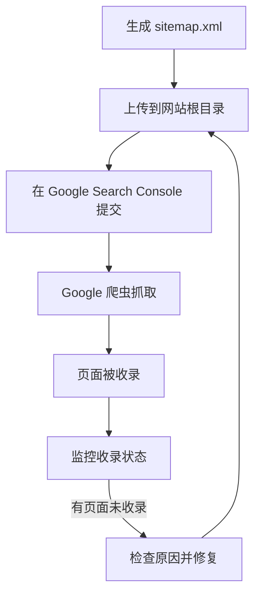
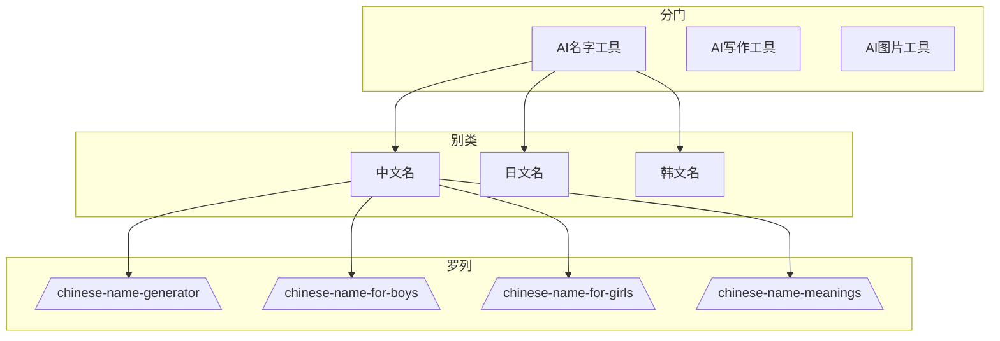

# 补充课08：养网站防老 — 内页与内链建设

网站不是一个个孤立的页面，而是一个**互相连接的有机体**。内页（inner pages）和内链（internal links）共同构成了网站的骨架与血管网络。骨架决定结构，血管决定权重流动。

> [!ABSTRACT]
> 哥飞在 [[0010-onpage-seo|第10课：站内优化]] 中提出的六字真言——**分门别类罗列**——是内页和内链建设的指导思想。养网站防老的核心就是把"分门别类罗列"落实到每一个页面和每一根链接上。

---

## 一个关键词一个独立内页

### 为什么要独立页面

每个关键词在搜索引擎眼中都是一个独立的"需求信号"。如果你用一个页面去覆盖多个关键词，结果往往是每个都做不好。

| 做法 | 效果 |
|------|------|
| 一个页面覆盖 1 个关键词 | 主题聚焦，排名概率高 |
| 一个页面覆盖 3-5 个关键词 | 主题分散，哪个都排不好 |
| 一个页面覆盖 10+ 个关键词 | 搜索引擎无法判断页面主题 |

> [!WARNING]
> **不要为了省事把多个相关关键词塞进一个页面。** 这样做看似高效，实际上浪费了每个关键词获得排名的机会。宁可花时间做 10 个独立页面，也不要做一个"大而全"的页面。

### 关键词与页面的映射关系



每一个关键词都对应到一个独立页面，每一个页面都围绕一个主关键词展开。这在养网站防老体系中是最基本的"基建"。

---

## 内页之间的合理链接

### 权重的流动性

网站的权重不是静止不动的。通过内部链接，权重可以像水流一样从高权重页面流向需要扶持的新页面。



### 内链建设的核心原则

| 原则 | 说明 |
|------|------|
| **层级清晰** | 首页→分类页→内页，不超过 3 次点击可达任何页面 |
| **上下互链** | 上级页面链接到下级，下级页面也链接回上级 |
| **相关优先** | 只链接内容相关的页面，不要无关硬链 |
| **锚文本自然** | 使用描述性的锚文本，不要用"点击这里" |
| **避免孤岛** | 每个页面至少有一个入站链接 |

### 常见的内链模式

#### 1. 分类聚合链接

在分类页面上列出该分类下的所有内页链接：

```
分类页: 中文名生成器
 ├──→ 男生中文名生成器
 ├──→ 女生中文名生成器
 ├──→ 诗意中文名生成器
 └──→ 现代中文名生成器
```

#### 2. 相关推荐链接

在每个内页底部展示同分类下的其他相关页面：

```
您可能还喜欢：
├── [男生中文名生成器]
├── [诗意中文名生成器]
└── [英文名翻译中文工具]
```

#### 3. 正文自然嵌入

在文章正文中自然地插入相关内页链接：

```
选择中文名字时，你可以先试用我们的[中文名生成器]，
然后看看[中文名寓意字典]了解每个字背后的含义。
如果需要给外国朋友取名，还可以试试[英文名转中文工具]。
```

> [!TIP]
> **正文链接的权重最高。** 在正文中嵌入的链接比底部"相关推荐"区域的链接传递的权重更高，因为它是"编辑推荐"而非"系统推荐"。

---

## 面包屑导航

面包屑导航（Breadcrumb Navigation）不仅是用户体验工具，更是重要的 SEO 信号。它告诉搜索引擎和用户："你在这个网站的什么位置。"

### 面包屑的标准格式

```
首页 > 分类 > 当前页面
```

### 实战示例

```
Home > AI Name Generators > Chinese Name Generator
```

### 面包屑的 SEO 价值

- 帮助搜索引擎理解网站层次结构
- 在搜索结果中展示面包屑路径（Google 支持）
- 降低跳出率（用户知道如何返回上级页面）
- 实现内链权重的向上传递

> [!EXAMPLE]
> **好的面包屑 vs 差的面包屑**
>
> ✅ 优秀的做法：
> ```
> Home > AI Writing Tools > Best AI Writing Tools for Bloggers
> ```
> 清晰、可点击、文字描述性强
>
> ❌ 糟糕的做法：
> ```
> Home > Page 1 > Page 2
> ```
> 层级名称无意义，用户看不懂自己在哪里

### 结构化数据标记

在 HTML 中添加 BreadcrumbList 结构化数据，让搜索引擎明确理解面包屑结构：

```html
<script type="application/ld+json">
{
  "@context": "https://schema.org",
  "@type": "BreadcrumbList",
  "itemListElement": [{
    "@type": "ListItem",
    "position": 1,
    "name": "Home",
    "item": "https://example.com/"
  },{
    "@type": "ListItem",
    "position": 2,
    "name": "AI Writing Tools",
    "item": "https://example.com/ai-writing-tools/"
  },{
    "@type": "ListItem",
    "position": 3,
    "name": "Best AI Writing Tools for Bloggers"
  }]
}
</script>
```

---

## 相关推荐

在每个内页底部添加"相关推荐"或"您可能还喜欢"区域：

### 相关推荐的选取规则

| 规则 | 说明 |
|------|------|
| **同分类** | 优先推荐同一分类下的其他页面 |
| **相关性** | 推荐内容和当前页面密切相关的 |
| **多样性** | 不要全是同一类型的页面 |
| **数量控制** | 3-6 个推荐链接为最佳 |

### 实现方式



> [!TIP]
> 相关推荐是**降低跳出率最有效的策略之一**。把用户留在你的网站上的每一步操作，都在向搜索引擎发送正面信号。

---

## 网站地图（Sitemap）

网站地图是告诉搜索引擎你网站有哪些页面的文件，帮助搜索引擎更快发现和收录你的页面。

### 两种 Sitemap

#### 1. XML Sitemap（给爬虫看）

面向搜索引擎爬虫，列出所有需要被收录的页面：

```
https://example.com/sitemap.xml

内容格式：
<url>
  <loc>https://example.com/</loc>
  <lastmod>2026-08-03</lastmod>
  <changefreq>weekly</changefreq>
  <priority>1.0</priority>
</url>
<url>
  <loc>https://example.com/chinese-name-generator</loc>
  <lastmod>2026-08-03</lastmod>
  <changefreq>monthly</changefreq>
  <priority>0.8</priority>
</url>
```

#### 2. HTML Sitemap（给人看）

面向用户，列出所有页面的目录结构：

```
网站地图
├── 名字生成工具
│   ├── 中文名生成器
│   ├── 日文名生成器
│   ├── 韩文名生成器
│   └── 英文名生成器
├── AI写作工具
│   ├── AI文章生成器
│   ├── AI改写工具
│   └── AI摘要生成器
└── 关于我们
```

### Sitemap 提交流程



> [!WARNING]
> Sitemap 不是万能的。提交 sitemap 不代表页面一定被收录。如果页面质量差、有重复内容、或者网站权重太低，Google 可能会跳过部分页面。**提升页面质量才是根本。**

---

## 避免 404 页面

404 错误：用户或爬虫访问到一个不存在的页面。每一个 404 错误都是用户体验和 SEO 的损失。

### 404 错误的来源

| 来源 | 说明 |
|------|------|
| 删除页面后未做 301 重定向 | 原有链接失效 |
| 链接地址写错 | 手打 URL 时的拼写错误 |
| 外部网站链接到你的旧页面 | 别人的网站链到了你已经删除的页面 |
| 参数变化 | URL 参数改变导致旧 URL 失效 |

### 404 错误的处理策略

1. **预防为主**：发布前检查所有链接是否正确
2. **301 重定向**：删除页面后 301 到最相关的替代页面
3. **自定义 404 页面**：提供一个有用的 404 页面，帮助用户找到他们想要的内容
4. **监控 404**：使用 Google Search Console > Pages > 404 监控所有 404 错误

### 好的自定义 404 页面

```
404 — 页面未找到

抱歉，您找的页面不存在。

您可以尝试：
- 返回 [首页]
- 搜索您要找的内容：[搜索框]
- 浏览我们的热门工具：[相关推荐]

或者直接点击下方的"联系我们"获取帮助。
```

> [!ABSTRACT]
> **404 处理的最佳实践**
>
> 当你删除一个页面时：
> 1. 找到与该页面内容最相关的另一个页面
> 2. 设置 301 重定向，从旧 URL 指向新 URL
> 3. 更新站内其他指向旧 URL 的链接
> 4. 提交新的 sitemap 到 Google Search Console
> 5. 通知外部链向你的网站更新链接（可选）

---

## 结合主课第10课的六字真言

[[0010-onpage-seo|第10课：站内优化]] 的六字真言 **分门别类罗列** 直接指导了内页和内链的建设：

### 分门

**分门** = 建立一级分类，作为网站的顶层架构

```
顶级分类:
- AI名称生成器
- AI写作工具
- AI图片工具
- AI音频工具
```

### 别类

**别类** = 在每个一级分类下细分二级分类

```
AI名称生成器
├── 中文名生成器
├── 日文名生成器
├── 韩文名生成器
└── 幻想名生成器
```

### 罗列

**罗列** = 每个细分项做一个独立内页

```
/chinese-name-generator
/chinese-name-meanings
/chinese-name-for-boys
/chinese-name-for-girls
/chinese-naming-cultural-guide
```



---

## 本课总结

- **一个关键词一个独立内页**是养网站防老体系的基础建设
- 内链让权重在站内流动，从首页流向分类页，再流向内页
- 面包屑导航帮助用户和搜索引擎理解网站层次，同时传递权重
- 相关推荐降低跳出率，延长停留时间
- XML Sitemap 帮助搜索引擎发现页面，HTML Sitemap 帮助用户导航
- 404 错误需及时通过 301 重定向处理
- 六字真言"分门别类罗列"是内页和内链建设的指导思想

## 下一步

内页体系建好之后，下节课学习向多语言市场拓展：[[s09-multilingual|补充课09：多语言支持]]。

## 自测题

<details>
<summary>点击展开自测题</summary>

1. 为什么每个关键词需要独立的页面？
2. 内链建设的五个核心原则是什么？
3. 面包屑导航的 SEO 价值有哪些？
4. 相关推荐区域的最佳推荐链接数量是多少？
5. 六字真言"分门别类罗列"如何指导内页建设？

**答案**
1. 每个关键词是一个独立的搜索信号，独立页面能保持主题聚焦，提高排名概率
2. 层级清晰、上下互链、相关优先、锚文本自然、避免孤岛
3. 帮助搜索引擎理解层次结构、在搜索结果展示路径、降低跳出率、传递权重
4. 3-6 个
5. 分门 = 建立一级分类，别类 = 细分二级分类，罗列 = 每个细分项做独立页面
</details>