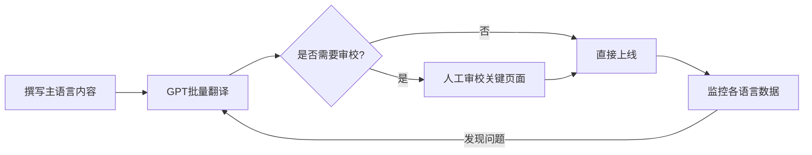
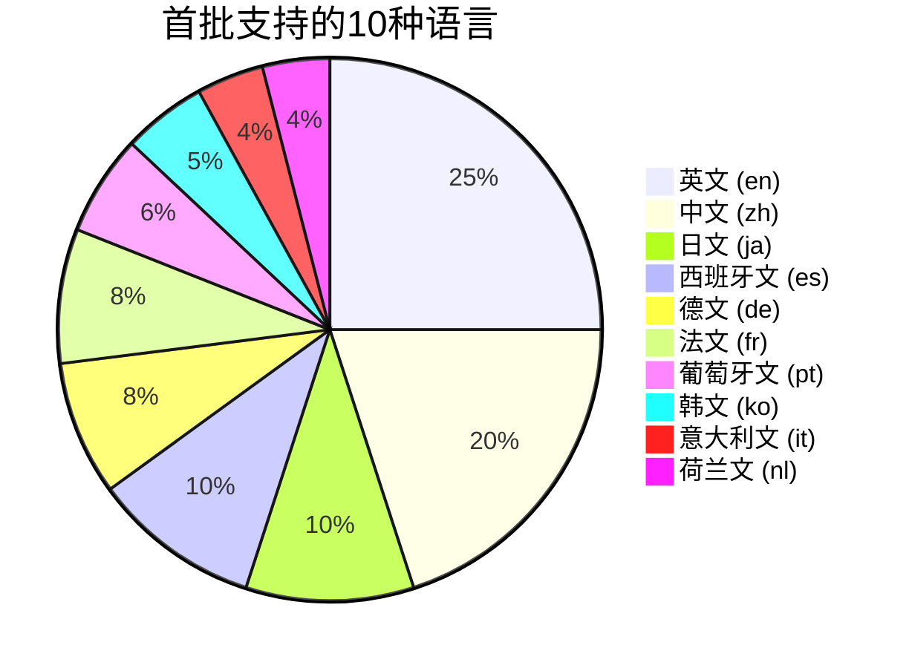
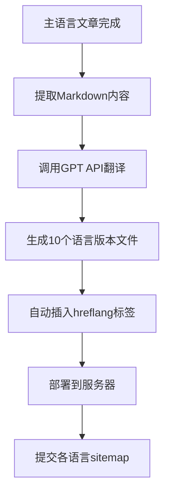

# 补充课09：养网站防老 — 多语言支持

> 你的网站只做英文，等于放弃了全球另外 60 亿人。多语言不是"加分项"，是"必选项"。

---

## 1. 为什么要做多语言

互联网面向的是**全球 70 亿人**，而非某一个单一语种用户群。数据说明一切：

| 维度 | 说明 |
|------|------|
| 全球网民 | 约 55 亿 |
| 英文母语者 | 约 15 亿（仅占 27%） |
| 非英文搜索量 | 已超过英文搜索量 |
| 多语言网站流量提升 | 平均 **+47%** |

> [!TIP]
> 即使你的网站主攻英文市场，增加其他语言版本也能通过 Google 的 `hreflang` 机制获得更多语种的长尾流量，且不会稀释主站权重。

### 多语言带来的三个核心好处

1. **流量倍增** —— 每种语言都是一个新的流量入口
2. **竞争降低** —— 很多细分领域只有英文站竞争激烈，小语种甚至没有竞争
3. **信任增强** —— 用户更愿意用母语阅读和购买

---

## 2. GPT 翻译 vs 人工翻译

### 行业现状

> [!ABSTRACT]
> 2024-2025 年 GPT-4o / Claude 3.5 等大语言模型的翻译质量在**通用领域**已经达到或接近专业译员水平，且成本仅为人工的 **1/50 ~ 1/100**。

| 对比项 | GPT 翻译 | 人工翻译 |
|--------|----------|----------|
| 成本 | 近乎免费（$0.01/千词） | $0.08-0.15/词 |
| 速度 | 分钟级完成全站 | 天级起 |
| 质量（通用领域） | 优秀 | 优秀 |
| 质量（专业领域） | 需人工审校 | 优秀 |
| 持续性（内容更新） | 随时可批量处理 | 需要持续付费 |

> [!WARNING]
> 专业领域（法律、医疗、金融）仍需人工审校。通用工具站、内容站、导航站完全可以用 GPT 翻译。

### 推荐工作流



---

## 3. hreflang 标签

### 什么是 hreflang

`hreflang` 告诉 Google "这个页面有 X 语言的版本，对应的 URL 是 Y"。没有它，Google 可能只索引一种语言版本，或是把不同语言当成重复内容惩罚。

```html
<link rel="alternate" hreflang="en" href="https://example.com/en/" />
<link rel="alternate" hreflang="ja" href="https://example.com/ja/" />
<link rel="alternate" hreflang="de" href="https://example.com/de/" />
<link rel="alternate" hreflang="x-default" href="https://example.com/en/" />
```

### x-default 的含义

`x-default` 是 fallback 版本，当用户语言不在已支持列表时返回。通常设为英文。

> [!EXAMPLE]
> 完整的 hreflang 实现需要**自引用**：每个语言版本的页面上都要列出**所有**语言版本。如果站上有 10 种语言，每个页面都需要 11 个 `link` 标签（10 语言 + 1 x-default）。

---

## 4. 优先支持的 10 种语言

按互联网用户数量和搜索流量排序，推荐首批支持的 10 种语言：



| 语言 | 代码 | 主要市场 | 推荐优先级 |
|------|------|----------|------------|
| 英文 | `en` | 全球 | ⭐⭐⭐⭐⭐ |
| 中文 | `zh` | 大中华区 | ⭐⭐⭐⭐⭐ |
| 日文 | `ja` | 日本 | ⭐⭐⭐⭐ |
| 西班牙文 | `es` | 拉美、西班牙 | ⭐⭐⭐⭐ |
| 德文 | `de` | 德国、奥地利、瑞士 | ⭐⭐⭐⭐ |
| 法文 | `fr` | 法国、加拿大、非洲 | ⭐⭐⭐ |
| 葡萄牙文 | `pt` | 巴西、葡萄牙 | ⭐⭐⭐ |
| 韩文 | `ko` | 韩国 | ⭐⭐⭐ |
| 意大利文 | `it` | 意大利 | ⭐⭐ |
| 荷兰文 | `nl` | 荷兰、比利时 | ⭐⭐ |

> [!TIP]
> 上线后先观察一周各语言的流量数据，优先加大表现好的语言的更新力度。不是所有语言都要平均用力。

---

## 5. URL 结构策略

### 三种主流方案对比

| 方案 | 示例 | 权重继承 | 维护成本 | 推荐 |
|------|------|----------|----------|------|
| **子目录** ✅ | `example.com/en/` | 共享主域名权重 | 低 | **强烈推荐** |
| 子域名 | `en.example.com` | 权重独立，不共享 | 中 | 不推荐 |
| 独立域名 | `example.de` | 完全独立 | 高 | 不推荐 |

### 为什么不要用子域名

> [!WARNING]
> Google 将子域名视为独立站点。`en.example.com` 的权重**不会**传递到主域 `example.com`，反之亦然。而子目录 `example.com/en/` 的所有权重都累积在主域名上。
>
> 这意味着：你用子域名做多语言，每种语言都要从零开始积累权重——这是巨大的浪费。

### 推荐的 Nginx 配置参考

```nginx
# 根据 Accept-Language 自动重定向
map $http_accept_language $lang {
    default en;
    ~ja ja;
    ~ko ko;
    ~de de;
    ~zh zh;
}
server {
    listen 80;
    return 302 https://example.com/$lang$request_uri;
}
```

---

## 6. 用 GPT 保持多语言同步更新

### 核心原则

> 主语言更新 -> GPT 批量翻译 -> 批量部署

### 自动化脚本架构



### GPT Prompt 模板

```
你是一个专业翻译。请将以下内容翻译成{目标语言}，并遵守：
1. 保持 Markdown 格式不变
2. 保留所有 HTML 标签
3. 不要翻译代码块内容
4. 术语表：{术语: 翻译}
5. 语气风格：{正式/友好/专业}

原文：
{content}
```

> [!QUESTION]
> 问：每次重新翻译全部页面会不会浪费 API 配额？
>
> 答：不需要全量重翻。使用缓存策略——只翻译新内容或变更内容。可以给每篇文章加一个 `last_translated` 字段，只处理超过 30 天未翻译的页面。

---

## 7. 各语言版本内容差异化

不同语言版本应该完全一致吗？**不是。**

> [!EXAMPLE]
> 英文用户可能关心定价，日文用户可能关心使用教程，德文用户可能关心数据隐私。
>
> 最佳实践：**核心内容一致，辅助内容本地化**。
> - 功能说明 → 统一翻译
> - 案例/证言 → 使用本地化案例
> - 营销文案 → 符合当地文化习惯

---

## 总结

| 项目 | 要点 |
|------|------|
| 为什么做 | 全球 70 亿人的流量红利 |
| 怎么做 | GPT 批量翻译 + hreflang 标签 |
| 哪些语言 | 首批 10 种，按数据调整 |
| URL 结构 | **子目录**优先，拒绝子域名 |
| 持续更新 | 主语言带动多语言，自动化翻译 |

## 下一步

1. 确认你的主语言内容已经足够丰富（至少 20-30 篇文章）
2. 选择 3-5 种目标语言开始测试
3. 配置 hreflang 标签并提交各语言 sitemap
4. 监控 GSC 中各语言的展示/点击数据（详见 [[s11-stats-gsc|补充课11：统计与GSC提交]]）
5. 2 周后评估，决定是否增加更多语言

## 自测题

<details>
<summary>点击展开</summary>

**Q1：hreflang 标签缺失会导致什么后果？**

A. 网站加载变慢
B. Google 可能把多语言版本误判为重复内容
C. 网站会被 Google 处罚降权
D. 仅影响移动端排名

<details>
<summary>查看答案</summary>
**B。** 没有 hreflang，Google 不知道页面的语言对应关系，可能只索引一种版本或判定为重复内容。不会直接"处罚"，但会损失流量。
</details>

---

**Q2：以下哪种 URL 结构最适合多语言网站？**

A. `en.example.com`
B. `example.com/en/`
C. `example.com?lang=en`
D. `example-en.com`

<details>
<summary>查看答案</summary>
**B。** 子目录方式共享主域名权重，且无需单独为每个语言版配置 SSL。
</details>

---

**Q3：现有 15 种语言的网站，要更新一篇核心文章的最佳流程是？**

A. 手动翻译 15 次
B. 只更新主语言，其他语言维持旧版
C. GPT API 批量翻译后部署
D. 删除旧文章重新发布

<details>
<summary>查看答案</summary>
**C。** 更新主语言内容 → 调用 GPT API 翻译 15 种语言 → 检查关键术语 → 批量部署。整个过程可在 30 分钟内完成。
</details>

</details>

---

- [[s05-search-intent|补充课05：分析搜索意图]] — 理解搜索意图