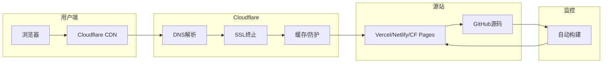

# 补充课10：养网站防老 — 域名部署与上线

> 域名是你在互联网上的"地皮"，部署是把房子盖起来。两者选对了，事半功倍。

---

## 1. 域名注册

### 推荐注册商对比

| 注册商 | 价格 | 续费价格 | WHOIS隐私保护 | 特点 |
|--------|------|----------|---------------|------|
| **Namesilo** | 低（$8-12/年） | 同注册价 | 免费 | 老牌稳定，无隐藏费用 |
| **Porkbun** | 极低（$7-10/年） | 略涨 | 免费 | 界面现代，性价比之王 |
| **Cloudflare** | 成本价 | 成本价 | 免费 | 不赚域名差价，但要求用CF DNS |
| Namecheap | 中等 | 较高 | 免费 | 生态好，带邮箱服务 |
| GoDaddy | 首年低 | **极高** | 收费 | **不推荐**，续费陷阱 |

> [!TIP]
> **最佳组合**：在 Porkbun 或 Namesilo 注册域名 → DNS 托管到 Cloudflare（免费 + 极速 + 防护）。
>
> 不要在注册商那里买附加服务（隐私保护、邮箱等），大部分都比第三方贵。

### 域名选择原则

| 原则 | 说明 | 示例 |
|------|------|------|
| **含关键词** | 域名包含核心关键词 | `aitools.com` > `mytools123.com` |
| **短小易记** | 越短越好，不超过 15 个字符 | `pix.ai` > `picturegeneratoronline.com` |
| **.com 优先** | .com 仍是用户最信任的 TLD | `.com` > `.io` > `.ai` > `.app` |
| **避免连字符** | 容易口述错误 | `ai-tools.com` ❌ → `aitools.com` ✅ |
| **避免数字** | 数字 0 和 o 混淆 | `tool4u.com` ❌ → `toolsforyou.com` ✅ |

> [!WARNING]
> 不要用 .xyz、.top 等廉价后缀做正规项目。Google 虽然没有官方歧视，但用户点击率显著低于 .com / .io / .ai。

---

## 2. DNS 解析

### DNS 记录类型速查

| 记录类型 | 用途 | 示例 |
|----------|------|------|
| A | 域名 → IPv4 地址 | `@` → `185.199.108.153` |
| AAAA | 域名 → IPv6 地址 | `@` → `2606:50c0:8000::153` |
| CNAME | 域名 → 另一个域名 | `www` → `your-site.netlify.app` |
| TXT | 文本记录（验证、SPF等） | Google 站点验证 |
| MX | 邮件服务器 | 指向邮箱服务商 |

### Cloudflare DNS 配置步骤

```mermaid
flowchart TD
    A[在注册商购买域名] --> B[在Cloudflare添加站点]
    B --> C[Cloudflare扫描现有DNS记录]
    C --> D[将域名NS指向Cloudflare]
    D --> E{NS生效?}
    E -->|是| F[在Cloudflare添加DNS记录]
    E -->|否| G[等待24-48小时]
    G --> E
    F --> H[开启Proxy(橙色云朵)]
    H --> I[配置SSL/TLS]
```

> [!ABSTRACT]
> Cloudflare 的 DNS 是全球最快的 anycast DNS 网络之一，解析速度约 **10-20ms**。同时自带 DDoS 防护、CDN 加速、SSL 证书三大功能，全是**免费**的。

---

## 3. 部署平台选择

### 主流平台对比

| 平台 | 免费额度 | 自定义域名 | HTTPS | 构建限制 | 推荐场景 |
|------|----------|-----------|-------|----------|----------|
| **Vercel** | 100GB 带宽/月 | ✅ | 自动 | 100分钟构建/月 | Next.js、静态站 |
| **Netlify** | 100GB 带宽/月 | ✅ | 自动 | 300分钟构建/月 | 静态站、SPA |
| **Cloudflare Pages** | 无限带宽 | ✅ | 自动 | 500次构建/月 | **静态站首选** |
| **GitHub Pages** | 1GB 存储/月 | ✅ | 自动 | 10次构建/小时 | 纯静态、项目文档 |

> [!TIP]
> **静态内容站推荐 Cloudflare Pages** —— 无限带宽 + 全球 CDN + 无服务器成本，和 Cloudflare DNS 同一生态，配置最简单。

### 各平台部署要点

#### Cloudflare Pages

```yaml
# cloudflare-pages 部署流程
1. 登录 Cloudflare Dashboard → Workers & Pages
2. 创建 Pages 项目 → 连接 GitHub 仓库
3. 配置构建命令（如：npm run build）
4. 设置自定义域名
5. 自动获得 SSL 证书
```

#### Vercel

```yaml
# Vercel 部署要点
- 自动检测框架（Next.js、Hugo、Jekyll 等）
- Preview Deployments 功能（每个 PR 自动生成预览 URL）
- Serverless Functions 支持
- 环境变量管理
```

#### Netlify

```yaml
# Netlify 部署要点
- 拖拽部署（最简单的方式）
- 表单处理（无需后端）
- 分步部署（Branch Deploy）
- 自动 HTTPS
```

---

## 4. 完整上线检查清单

> [!EXAMPLE]
> 上线前的**黄金检查清单**，每一项都要打勾 ✅

### 域名阶段

- [ ] 域名已注册且不过期时间 > 1 年
- [ ] WHOIS 隐私保护已开启
- [ ] 自动续费已开启
- [ ] NS 记录已指向 Cloudflare

### DNS 阶段

- [ ] A 记录 / CNAME 记录已添加
- [ ] TXT 记录（Google Search Console 验证）已添加
- [ ] Cloudflare Proxy（橙色云朵）已开启
- [ ] NS 变更已生效（使用 `dig` 命令验证）

### 部署阶段

- [ ] 代码已推送到 GitHub 仓库
- [ ] 部署平台已连接仓库 ✓
- [ ] 构建成功 ✓
- [ ] 自定义域名已绑定 ✓
- [ ] SSL 证书已签发（Let's Encrypt / Cloudflare）

### 测试阶段

- [ ] 通过 `https://` 访问正常
- [ ] 页面加载速度 < 3s（可用 PageSpeed Insights 测试）
- [ ] 移动端适配正常
- [ ] 所有链接无 404
- [ ] sitemap.xml 可访问
- [ ] robots.txt 配置正确

---

## 5. 部署架构全景



---

## 6. 常见问题排查

| 问题 | 原因 | 解决 |
|------|------|------|
| DNS 不生效 | NS 缓存未更新 | 等待 24-48h，使用 `dig +trace` 排查 |
| SSL 证书无效 | 域名未指向 Cloudflare | 确认 Proxy 已开启（橙色云朵） |
| 部署失败 | 构建命令错误 | 本地先测试 `npm run build` |
| 自定义域名 404 | 平台未绑定域名 | 检查平台上的域名配置 |
| 页面加载慢 | 图片未压缩 | 使用 WebP 格式 + CDN 缓存 |

> [!QUESTION]
> 问：已经在 Vercel 部署好了，想迁到 Cloudflare Pages 怎么做？
>
> 答：简单三步：① 在 CF Pages 创建新项目并连接仓库 ② 构建部署成功后在 CF 添加自定义域名 ③ 等 SSL 签发后删除 Vercel 上的域名绑定。期间两个平台并行，零停机迁移。

---

## 总结

| 阶段 | 要点 |
|------|------|
| 域名注册 | Namesilo / Porkbun 注册，含关键词，.com 优先 |
| DNS 解析 | 托管到 Cloudflare，开启 Proxy |
| 部署平台 | Cloudflare Pages / Vercel / Netlify 免费版足够 |
| SSL | Cloudflare 自动签发，无需手动操作 |
| 上线检查 | 逐项过黄金检查清单 |

## 下一步

1. 注册域名（如已有域名，确保续费 > 1 年）
2. 将域名 NS 切换到 Cloudflare
3. 选择部署平台，连接 GitHub 仓库，完成部署
4. 配置自定义域名 + 验证 HTTPS
5. 提交到 Google Search Console（详见 [[s11-stats-gsc|补充课11：统计与GSC提交]]）

## 自测题

<details>
<summary>点击展开</summary>

**Q1：以下哪家注册商最不推荐长期使用？**

A. Namesilo
B. Porkbun
C. GoDaddy
D. Cloudflare

<details>
<summary>查看答案</summary>
**C。** GoDaddy 首年价格低但续费极高，附加服务收费陷阱多，WHOIS 隐私保护还要额外付费。
</details>

---

**Q2：Cloudflare 的"橙色云朵"（Proxy）开启的作用是？**

A. 隐藏真实 IP
B. 开启 CDN 加速
C. 自动管理 SSL 证书
D. 以上都是

<details>
<summary>查看答案</summary>
**D。** 开启 Proxy 后，Cloudflare 会隐藏源站 IP、提供 CDN 缓存加速、自动管理 SSL 证书，并开启 DDoS 防护。
</details>

---

**Q3：静态内容站（纯 HTML/CSS/JS）推荐哪个部署平台？**

A. Vercel
B. Netlify
C. Cloudflare Pages
D. GitHub Pages

<details>
<summary>查看答案</summary>
**C。** Cloudflare Pages 提供无限带宽，全球 CDN 加速，和 Cloudflare DNS 同一生态，配置最简单。静态站不涉及 Serverless 函数时，CF Pages 性价比最高。
</details>

</details>

---

- [[s08-inner-pages|补充课08：内页与内链建设]] — 内页体系