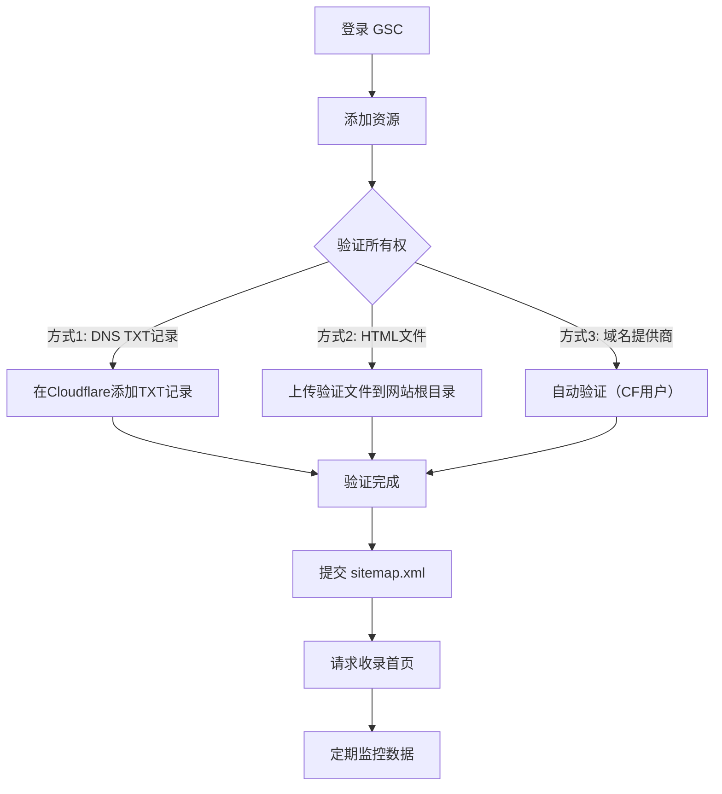
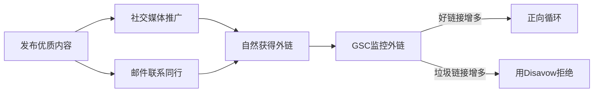
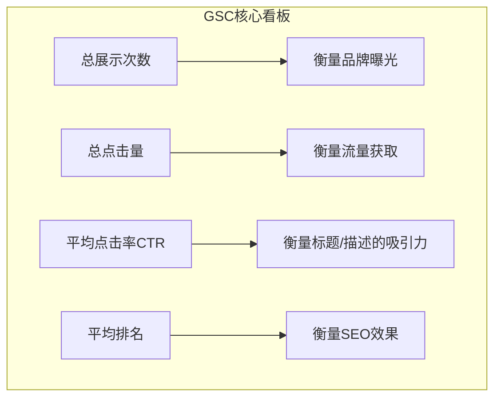
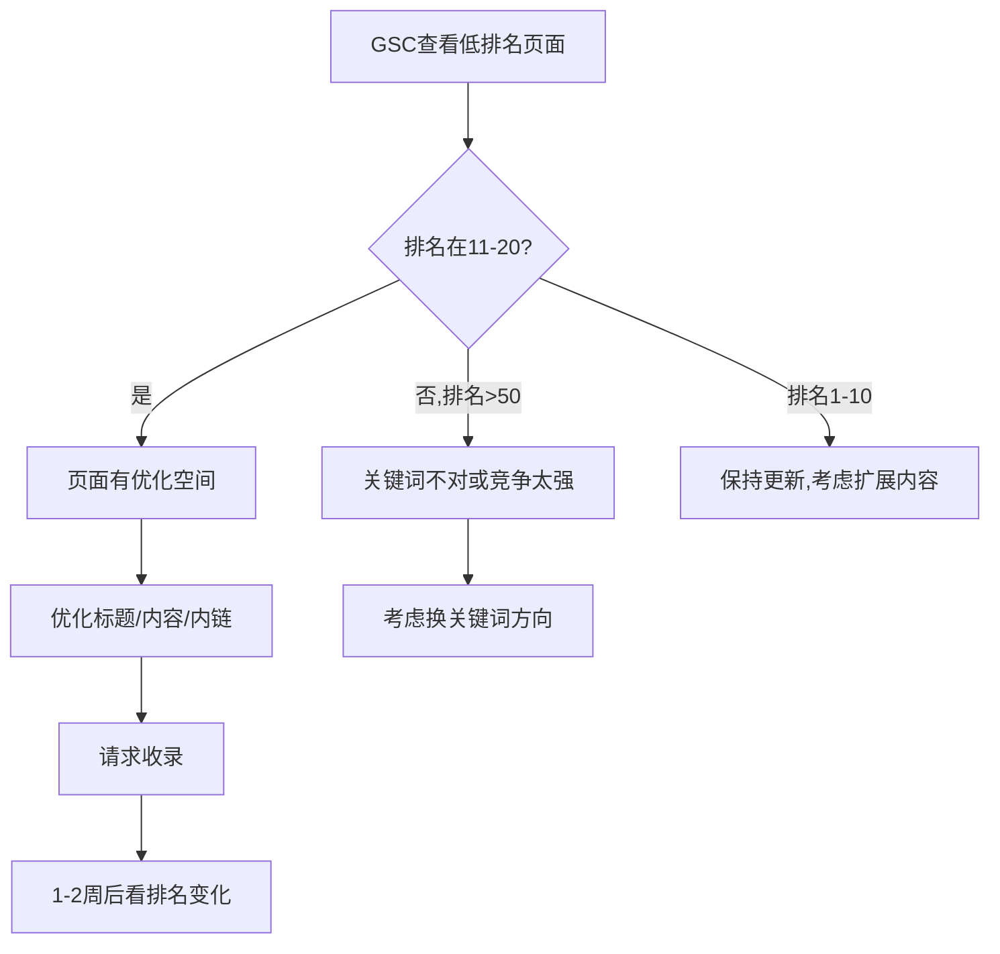

# 补充课11：养网站防老 — 统计与GSC提交

> 不上统计等于盲飞，不交 GSC 等于没告诉 Google 你的存在。这两件事上线当天就要做。

---

## 1. 添加统计代码

### 统计工具对比

| 工具 | 类型 | 价格 | 隐私合规 | 数据所有权 | 推荐场景 |
|------|------|------|----------|-----------|----------|
| **Google Analytics (GA4)** | 云端 | 免费 | ❌ GDPR 需额外配置 | Google 持有 | 通用分析 |
| **Plausible** | 自建/SaaS | €9/月起 | ✅ 完全合规 | 自己持有 | **轻量首选** |
| **Umami** | 自建 | 免费 | ✅ 完全合规 | 自己持有 | **自建首选** |
| **Matomo** | 自建/SaaS | 免费起 | ✅ 完全合规 | 自己持有 | 企业级 |
| **Cloudflare Web Analytics** | 云端 | 免费 | ✅ | Cloudflare 持有 | CF 用户首选 |

> [!TIP]
> **推荐组合**：GA4（了解用户画像）+ Umami/Plausible（隐私友好，轻量级）。两个不冲突，互补使用。

### GA4 部署步骤

1. 登录 Google Analytics → 创建账号 → 创建媒体资源
2. 获取 Measurement ID（格式：`G-XXXXXXXX`）
3. 将以下代码添加到 `<head>` 中：

```html
<!-- Google tag (gtag.js) - Google Analytics -->
<script async src="https://www.googletagmanager.com/gtag/js?id=G-XXXXXXXX"></script>
<script>
  window.dataLayer = window.dataLayer || [];
  function gtag(){dataLayer.push(arguments);}
  gtag('js', new Date());
  gtag('config', 'G-XXXXXXXX');
</script>
```

> [!WARNING]
> GA4 默认**不开启** Cookie 同意横幅，如果面向欧盟用户，需要配合 Cookie Consent 插件使用，否则违反 GDPR。

### Umami 自建快速部署（Vercel + Supabase）

```yaml
1. Fork umami 仓库到你的 GitHub
2. 创建 Supabase 项目（免费额度足够）
3. Vercel 部署 Umami（连接 Supabase 数据库）
4. 获取跟踪代码，添加到网站
5. 完成！
```

---

## 2. Google Search Console 提交

### 为什么要提交 GSC

GSC 是 Google 官方提供的免费工具，直接告诉你 Google 怎么看你的网站。不提交 GSC，你等于**闭着眼睛做 SEO**。

| 功能 | 说明 |
|------|------|
| 提交 sitemap | 告诉 Google 你有哪些页面 |
| 请求收录 | 新页面发布后主动通知 Google |
| 查看搜索数据 | 展示次数、点击量、平均排名、CTR |
| 发现问题 | 404、爬取错误、移动端问题 |
| 安全提醒 | 恶意软件、被黑通知 |

### 提交流程



### sitemap.xml 示例

```xml
<?xml version="1.0" encoding="UTF-8"?>
<urlset xmlns="http://www.sitemaps.org/schemas/sitemap/0.9">
  <url>
    <loc>https://example.com/</loc>
    <lastmod>2026-08-01</lastmod>
    <changefreq>daily</changefreq>
    <priority>1.0</priority>
  </url>
  <url>
    <loc>https://example.com/tools/</loc>
    <lastmod>2026-08-01</lastmod>
    <changefreq>weekly</changefreq>
    <priority>0.9</priority>
  </url>
  <url>
    <loc>https://example.com/blog/post-1</loc>
    <lastmod>2026-07-28</lastmod>
    <changefreq>monthly</changefreq>
    <priority>0.6</priority>
  </url>
</urlset>
```

> [!ABSTRACT]
> 如果你的网站是动态内容站（频繁更新），可以写一个自动生成 sitemap 的脚本，每次新增页面时自动更新并自动 Ping Google：`https://www.google.com/ping?sitemap=https://example.com/sitemap.xml`

---

## 3. 增加外链

外链（Backlinks）仍然是 Google 排名算法的**三大核心因素之一**（内容 + 外链 + 用户体验）。

### 新手友好的外链获取方式

| 方式 | 难度 | 效果 | 风险 |
|------|------|------|------|
| 老网站相互链接 | ⭐ | ⭐⭐⭐ | 无 |
| 社交媒体分享 | ⭐ | ⭐⭐ | 无 |
| 论坛/社区发帖 | ⭐⭐ | ⭐⭐ | 需注意 spam |
| 问答平台（Quora/知乎） | ⭐⭐ | ⭐⭐⭐ | 需要高质量回答 |
| 目录提交 | ⭐ | ⭐ | 低质量，少做 |
| **客座博客** | ⭐⭐⭐ | ⭐⭐⭐⭐ | 最佳方式 |
| 媒体曝光 | ⭐⭐⭐⭐ | ⭐⭐⭐⭐⭐ | 需要资源 |

> [!WARNING]
> **绝对不要做的外链操作：**
> - 购买链接（Google 严惩）
> - PBN（私有博客网络）
> - 站群链接
> - 自动评论/自动发帖工具
>
> 这些操作一旦被 Google 发现，轻则降权，重则**整站除名**。

### 外链策略建议



---

## 4. 等待收录

### 收录时间线

| 阶段 | 时间 | 说明 |
|------|------|------|
| 爬虫首次访问 | 1-3 天 | 提交 sitemap 后 Googlebot 开始爬取 |
| 首页收录 | 1-7 天 | 首页通常最快 |
| 内页收录 | 3-14 天 | 取决于内链结构和内容质量 |
| 首次获得展示 | 7-30 天 | 新站有"沙盒期" |
| 首次获得点击 | 14-60 天 | 取决于关键词竞争度 |

> [!TIP]
> **加速收录的技巧：**
> 1. 在已收录的老网站上加一个新站链接
> 2. 在社交媒体分享新站内容
> 3. 使用 GSC 的"网址检查"手动请求收录
> 4. 确保内链结构合理（每页至少有 2-3 个内链指向其他页面）
> 5. 保持稳定的内容更新频率

---

## 5. 监控 GSC 数据

### 核心指标解读



| 指标 | 好信号 | 预警信号 | 优化方向 |
|------|--------|----------|----------|
| 展示次数 ↑ | 关键词覆盖扩大 | 排名降低但展示不变 → 检查内容 | 增加内容量 |
| 点击量 ↑ | 流量增长 | 展示增但点击降 → 优化 Meta | 优化 Title/Description |
| CTR ↑ | 标题描述吸引人 | 排名高但 CTR 低 | 写更吸引人的标题 |
| 平均排名 ↓ | 排到更靠前的位置 | 新站的排名波动是正常的 | 持续优化内容 |

### 404 错误监控

> [!WARNING]
> **404 错误是用户体验杀手，也是权重杀手。**
>
> Google 预期看到的页面返回 404，会导致：
> 1. 用户点击后看到错误页 → 跳出 → 用户体验信号变差
> 2. Google 逐步降低对此类页面的爬取频率
> 3. 如果有外链指向 404 页面，权重完全浪费

### 404 处理流程

1. 在 GSC → 页面 → 404 错误中查看
2. 判断是否应该存在：
   - 应该存在 → 修复页面 → 301 重定向
   - 不应存在 → 继续保持 404（或自定义 404 页面）
3. 对于有外链的 404 页面，必须做 **301 重定向** 到最相关的页面

---

## 6. GSC 数据驱动的内容策略



> [!QUESTION]
> 问：网站的展示次数很高（每天 10 万+），但点击量很低（不到 100），怎么办？
>
> 答：这是典型的高曝光低 CTR 问题。先用 GSC 筛选「高展示+低 CTR」的查询，然后：① 优化 Title 使其更有吸引力 ② 优化 Meta Description 加入行动号召 ③ 检查排名位置——第 1 名 CTR ~30%，第 10 名 CTR ~2%，所以排名本身可能是根因。
>
> 需要更深入地做排名优化，参考关于"关键词"的相关课程。

---

## 总结

| 事项 | 要点 |
|------|------|
| 统计代码 | GA4 + Umami/Plausible 组合使用 |
| GSC 提交 | 验证所有权 → 提交 sitemap → 请求收录 |
| 外链建设 | 自然获取，远离黑帽操作 |
| 收录等待 | 首页 1-7 天，内页 3-14 天，耐心 + 持续更新 |
| 数据监控 | 关注展示/点击/CTR/排名，处理 404 错误 |

## 下一步

1. 网站上线后立刻添加 GA4 统计代码
2. 提交网站到 GSC 并验证所有权
3. 提交 sitemap 并请求收录
4. 在老网站/社交媒体分享新站链接
5. 一周后查看 GSC 数据，关注收录情况和搜索展示

## 自测题

<details>
<summary>点击展开</summary>

**Q1：提交 sitemap 到 GSC 后，Google 会立刻收录网站的所有页面吗？**

A. 是的，立刻全部收录
B. 不一定，Google 会根据页面质量和重要性决定
C. 需要付费才能快速收录
D. 只收录首页

<details>
<summary>查看答案</summary>
**B。** sitemap 只是建议，Google 会按照自己的算法和资源决定爬取哪些页面。新站的前几周收录较慢是正常的。
</details>

---

**Q2：以下哪个指标最能反映网站的 SEO 效果？**

A. 展示次数
B. 点击量
C. 平均排名
D. 以上三者需要综合看

<details>
<summary>查看答案</summary>
**D。** 单一指标有误导性。展示多但排名低说明关键词选择有问题，排名高但 CTR 低说明标题缺乏吸引力。需要综合看三者的变化趋势。
</details>

---

**Q3：发现网站有一批 404 错误，且这些页面有外部链接指向，应该怎么做？**

A. 不用管，Google 会自动处理
B. 把 404 页面恢复并继续使用
C. 将 404 页面 301 重定向到最相关的正常页面
D. 删除所有外链

<details>
<summary>查看答案</summary>
**C。** 有外链的 404 页面造成了权重浪费。最佳实践是 301 重定向到最相关的替代页面，把外链权重传递过来。
</details>

</details>

---

- [[s10-domain-deploy|补充课10：域名部署与上线]] — 域名与部署