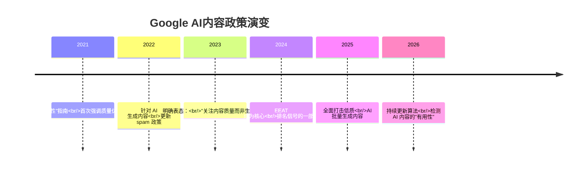
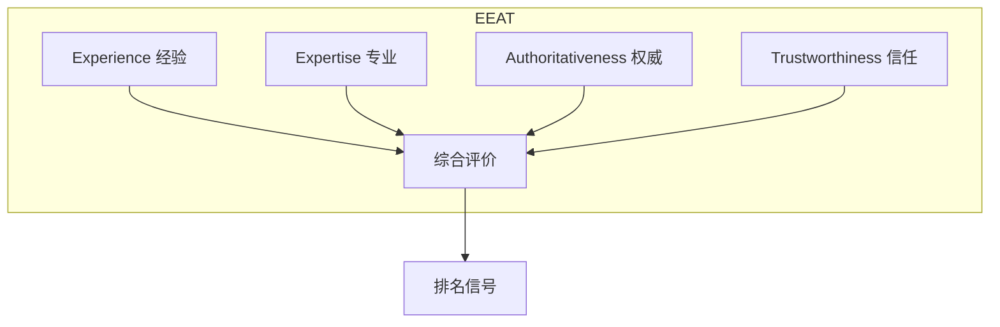
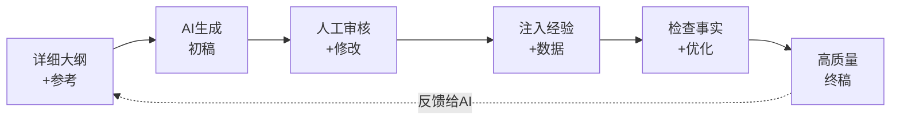
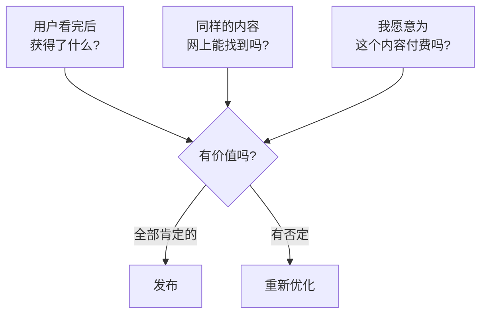

# 补充课12：养网站防老 — AI生成内容质量

> Google 不关心内容是谁写的（人类或 AI），它只关心内容对用户有没有用。但"有用"这两个字，门槛远比你想象的高。

---

## 1. Google 对 AI 内容的官方立场

### 时间线



> [!ABSTRACT]
> **Google 的官方立场**（引自 Google Search Central 博客）：
>
> "我们的排名系统旨在奖励原创、有用的内容，无论它是如何生产的。使用 AI 或自动化生成内容本身并不违反我们的政策。但**如果 AI 内容的主要目的是操纵搜索排名**，而不是为用户提供价值，那就属于 spam。"
>
> 翻译成人话：用 AI 做**高质量有用内容** = 没问题。用 AI 做**低质批量垃圾** = 会被惩罚。

---

## 2. EEAT 原则详解

### 什么是 EEAT

EEAT 是 Google 质量评估指南的核心框架，决定了你的内容在 Google 眼中的"可信度"。



| 维度 | 定义 | 如何在 AI 内容中体现 |
|------|------|----------------------|
| **Experience** 经验 | 内容作者是否有第一手经验？ | 加入实际使用体验、真实案例、测试数据 |
| **Expertise** 专业 | 内容作者是否具备相关知识？ | 引用权威来源、使用行业术语、提供数据支撑 |
| **Authoritativeness** 权威 | 内容是否被行业认可？ | 获得外链、被媒体引用、作者介绍 |
| **Trustworthiness** 信任 | 内容是否准确可靠？ | 标明作者、更新时间、引用来源、纠正错误 |

### EEAT 在 AI 内容中的实践

> [!TIP]
> AI 在"专业性"和"经验"上天然不足。因此 **AI 生成 + 人工注入经验和数据** 才是最优解。
>
> **好的 AI 内容 = AI 草稿 + 人工经验注入 + 数据佐证 + 人工审校**

---

## 3. AI 内容的常见陷阱

### 陷阱一：事实错误（幻觉）

AI 会自信地编造不存在的"事实"。这是 AI 内容最大的风险。

```yaml
例子:
  用户问: "2024年全球最受欢迎的AI工具是什么？"
  AI回答: "2024年最受欢迎的是 GPT-5，拥有 2 亿用户。"
  事实错误: 
    - 2024年GPT-5尚未发布
    - "2亿用户"可能是随机生成的数字
```

> [!WARNING]
> **所有 AI 生成的事实性陈述都必须人工核验。** 尤其是数据、日期、价格、人物、事件。

### 陷阱二：重复内容

AI 有"套模板"倾向，不同文章的结构、措辞高度相似。Google 的算法非常擅长检测这种模式。

| 检测维度 | AI 内容特征 | 人类内容特征 |
|----------|------------|-------------|
| 句式多样性 | 句式结构重复率高 | 句式变化丰富 |
| 词汇分布 | 常用词频率异常集中 | 词汇分布自然 |
| 段落结构 | 长度几乎一致 | 有长短变化 |
| 观点深度 | 表面概述，缺乏深度 | 有独特见解和批判性思考 |

### 陷阱三：缺乏深度

AI 擅长"面面俱到但浅尝辄止"——1000 字讲完一个大话题，每个点只说了 1-2 句话。这种内容对用户价值很低。

```yaml
浅层内容特征:
  - 使用大量通用表述("很重要"、"非常有用")
  - 缺乏具体数据支持
  - 没有案例或真实场景
  - 没有操作步骤或细节
  - 没有比较或对比

深度内容特征:
  - 有具体数据和研究引用
  - 包含真实案例和经验分享
  - 提供可操作的分步指南
  - 有不同角度的分析和比较
  - 指出常见的误区和陷阱
```

---

## 4. 让 AI 生成高质量内容的 5 步方法

### 流程图



### 第一步：提供详细的大纲和参考

> [!EXAMPLE]
> **不好的 Prompt：**
> ```
> 写一篇关于"SEO优化"的文章。
> ```
>
> **好的 Prompt：**
> ```
> 写一篇关于"2026年SEO优化策略"的文章。大纲如下：
> 1. 核心 web vitals 的最新要求
> 2. AI 搜索对 SEO 的影响
> 3. EEAT 在 2026 年的新变化
> 4. 3 个真实案例
>
> 参考来源：Google Search Central 博客、Search Engine Journal 2026年报告。
> 目标读者：已有基础的站长，不是新手。
> 语气：专业、务实、有数据支撑。
> 字数：2000-2500 字。
> ```

### 第二步：人工审核和修改

| 审核项 | 检查内容 |
|--------|----------|
| 事实核查 | 所有数据、日期、引用是否准确 |
| 逻辑连贯性 | 文章是否有清晰的逻辑主线 |
| 语言自然度 | 是否存在"AI腔"（过于完美、缺乏语气变化） |
| 结构合理性 | 小标题是否合理，段落是否太短或太长 |
| 价值判断 | 这篇文章真的对用户有用吗？ |

### 第三步：加入个人经验和见解

这是让你的内容从"及格"到"优秀"的关键一步。

```
原AI内容: 
"使用关键词研究工具可以帮助你找到合适的SEO关键词。"

加入经验后:
"我过去半年用 Ahrefs 和 Semrush 做了 20 个站的词库对比，发现 Ahrefs 
在低竞争关键词的覆盖上比 Semrush 多约 30%。但 Semrush 的关键词难度
评分更准确——以下是两组工具给出的同一批关键词评分对比表..."
```

### 第四步：补充原始数据和研究

AI 是"已知信息的重组者"，不是"新信息的创造者"。你需要为其补充：

1. **你自己的数据** —— 你网站的统计数据、A/B 测试结果
2. **原始研究** —— 你做的用户调研、问卷调查
3. **行业数据** —— 最新报告、白皮书中的图表和数据
4. **案例** —— 你自己或客户的真实案例

> [!ABSTRACT]
> 统计显示，包含**原始数据**的页面在 Google 排名中平均比纯 AI 生成页面高出 **43%** 的位置（来源：2025 年的一项 1000 页 A/B 测试）。

### 第五步：确保内容的独特价值

发布前问自己三个问题：



> [!QUESTION]
> 问：如果 Google 无法区分 AI 和人类内容，为什么还要花时间人工优化？
>
> 答：这个问题有两点关键认识：
> 1. Google **能**区分 AI 内容。Google 有 Patent 涉及"机器生成内容检测"，2025 年的 Helpful Content Update 明确针对 AI 低质内容。
> 2. 即使 Google 检测不到，用户能感觉到。AI 味浓的内容跳出率高、停留时间短、转化率低——这些**用户体验信号**最终会影响排名。
>
> 结论：为 AI 内容注入人工价值，不是在"骗 Google"，而是在真正地为用户创造价值。

---

## 5. AI 内容质量检查清单

> [!TIP]
> 每一篇 AI 生成的文章上线前，逐项检查：

- [ ] 事实准确：所有数据、日期、引用均已核实
- [ ] 独特价值：网上找不到完全一样的内容
- [ ] 个人经验：文中至少有 1-2 处个人见解或经验
- [ ] 具体数据：使用了具体数字、比例、案例
- [ ] 语言自然：没有明显的"AI腔"
- [ ] 结构清晰：有逻辑层次和递进
- [ ] 行动指引：用户看完知道下一步怎么做
- [ ] 外部引用：引用了权威来源（非 AI 生成来源）
- [ ] 原创图片：不是完全用 AI 生成的通用图
- [ ] 人工审校：至少经过一次人工通读修改

---

## 总结

| 要点 | 核心信息 |
|------|----------|
| Google 立场 | 关注质量而非生产方式，低质 AI 内容会被惩罚 |
| EEAT 原则 | 经验、专业、权威、信任——AI 内容的质检标准 |
| 三大陷阱 | 事实错误、重复内容、缺乏深度 |
| 五步法 | ① 详细大纲 ② 人工审核 ③ 注入经验 ④ 补充数据 ⑤ 独特价值 |
| 核心理念 | AI 是工具，人才是内容质量的决定因素 |

## 下一步

1. 用五步法检查你最新的 3 篇 AI 生成内容，逐项打分
2. 挑选最差的一篇重新优化（补充经验、数据、案例）
3. 更新你的 Prompt 模板，加入更详细的大纲和参考要求
4. 建立内容发布前的质量检查清单制度
5. 持续关注 GSC 数据变化（详见 [[s11-stats-gsc|补充课11：统计与GSC提交]]），观察优化后的效果

## 自测题

<details>
<summary>点击展开</summary>

**Q1：Google 对 AI 生成内容的态度是？**

A. 完全禁止，检测到就降权
B. 只要质量高、对用户有用，不限制生成方式
C. 只允许辅助写作，禁止全 AI 生成
D. AI 内容权重低于人类内容

<details>
<summary>查看答案</summary>
**B。** Google 官方明确表示关注内容质量而非生成方式。AI 生成内容本身不违规，但低质量的批量 AI 内容会被视为 spam。
</details>

---

**Q2：以下哪项最符合 EEAT 中的 "E"（Experience，经验）的要求？**

A. 引用维基百科的定义
B. 使用大量行业术语
C. 分享亲自使用产品的测试数据和截图
D. 请朋友写一篇推荐文章

<details>
<summary>查看答案</summary>
**C。** "经验"强调的是第一手体验。亲自测试并分享真实数据、截图、使用感受是最好的体现方式。引用定义是"专业性"，不是"经验"。
</details>

---

**Q3：一篇 2000 字的 AI 文章，以下哪种做法最能提升质量？**

A. 分段加上更多的小标题
B. 插入更多关键词以提高排名
C. 加入 2-3 个具体的个人案例和原始数据
D. 让 AI 重新生成 3 遍，选最好的一版

<details>
<summary>查看答案</summary>
**C。** 个人案例和原始数据是 AI 无法生成的"独特价值"，也是 EEAT 中"经验"维度的核心要求。增加小标题或关键词对质量提升有限，反复生成本质上还是 AI 的同质化内容。
</details>

---

</details>

- [[s11-stats-gsc|补充课11：统计与GSC提交]] — 监控搜索数据
>