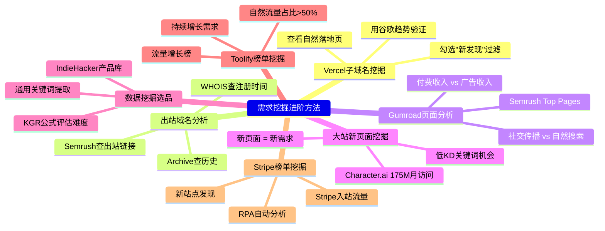
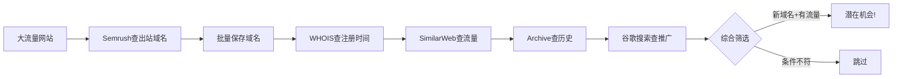
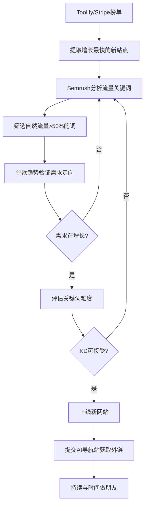

# 补充课13：需求挖掘进阶

> 别人已经验证的需求，就是你最好的切入点。

在 [[0006-find-needs|第06课：挖掘AI工具需求的六种方法]] 中，你已经掌握了谷歌趋势、科技媒体、AI大厂博客等基础的需求发现手段。在 [[s03-first-need|补充课03：挖掘第一个需求]] 中，你学会了从51个财富密码关键词中快速选词开干。

但真实的出海战场远比这些基础方法更丰富。本章将带你掌握7种进阶方法——利用 Vercel 子域名、出站域名分析、Gumroad 页面挖掘、大流量网站机会扫描、以及基于 Toolify/Stripe 榜单的数据驱动选品。



---

## 一、利用Vercel子域名发现新需求

Vercel 是全球最大的前端部署平台之一，无数开发者使用 `*.vercel.app` 部署他们的项目。这意味着 **vercel.app 的每个子域名背后都可能是一个新产品**。

### 1.1 操作方法

在 SimilarWeb 上查询 vercel.app，查看自然落地页，这是发现新子域名和新关键词的直接方法。

**操作路径：**

1. 打开 SimilarWeb Pro，输入 `vercel.app`
2. 导航到：关键词研究 → 网站浏览工具 → 着陆页 → 自然着陆页
3. 选择最近1~12个月的数据
4. 点击"变化量" → "新点击量"（即过滤出"新发现"的页面）

> [!TIP]
> 直接访问链接（需要 SimilarWeb Pro 权限）：
> ```
> https://pro.similarweb.com/#/digitalsuite/websiteanalysis/organic-landing-pages/*/999/12m?webSource=Desktop&IncludeNewPages=true&key=vercel.app
> ```

### 1.2 真实案例：check-your-khodam.vercel.app

2024年6月，SimilarWeb 发现了一个名为 `check-your-khodam.vercel.app` 的新子域名。它通过以下关键词获取了大量搜索流量：

| 关键词 | 流量占比 | 搜索规模 |
|--------|----------|----------|
| cek khodam | 79.03% | 149,133 |
| check your khodam | 5.40% | 75,491 |
| cek kodam | 3.70% | 16,067 |
| khodam vercel app | 1.37% | 37,993 |
| cek khodam online | 0.62% | 61,867 |

用谷歌趋势检查这些关键词，发现它们是 **2024年6月18日才开始出现的新词** —— 一个典型的新需求爆发信号。

> [!WARNING]
> 这个网站后来因为流量太大触发了 Vercel 的付费限制（402 Payment Required），网站已经无法访问。这告诉我们：**新需求爆发时流量来得很快，但要做好成本控制**。

### 1.3 真实案例：annair.vercel.app

继续往下翻，第三个子域名 `annair.vercel.app` 获取流量的关键词则完全不同：

| 关键词 | 流量占比 | 规模 |
|--------|----------|------|
| grammarly cookies | 7.22% | 32,162 |
| chatgpt premium cookies | 7.22% | 2,095 |
| calculate total marks from percentage | 4.48% | 113 |

这里的关键词同样在谷歌趋势上是**新出现的词**，说明这个网站也是踩中了新需求。

> [!QUESTION]
> 为什么 Vercel 子域名能成为需求挖掘的宝矿？
>
> 因为 Vercel 提供免费部署额度，大量独立开发者用它在短时间内上线 MVP（最小可行产品）来验证想法。如果你能监控到这些新上线的子域名，就等于在第一时间看到了全世界开发者正在验证的新需求。

### 1.4 操作流程总结

```mermaid
flowchart TD
    A[打开SimilarWeb] --> B[查询 vercel.app]
    B --> C[查看自然着陆页]
    C --> D[勾选"新发现"过滤条件]
    D --> E[获取新子域名列表]
    E --> F[查看每个子域名的关键词]
    F --> G[谷歌趋势验证是否为新词]
    G --> H{搜索量在增长?}
    H -->|是| I[评估竞争难度]
    H -->|否| F
    I --> J{值得做吗?}
    J -->|是| K[注册域名 上线网站]
    J -->|否| F
```

---

## 二、从Vercel.app到所有平台

同样的方法可以扩展到所有提供子域名服务的平台。

### 2.1 可扫描的平台清单

| 平台 | 域名 | 特点 |
|------|------|------|
| **Vercel** | `*.vercel.app` | 前端项目最多，更新最快 |
| **Netlify** | `*.netlify.app` | 静态站点多，Jamstack生态 |
| **GitHub Pages** | `*.github.io` | 开源项目主页，个人博客 |
| **Firebase** | `*.web.app` | Google生态，中小型Web应用 |
| **Railway** | `*.railway.app` | 后端项目，全栈应用 |
| **Render** | `*.onrender.com` | 全栈托管，API服务 |
| **Fly.io** | `*.fly.dev` | 容器化部署，边缘计算 |
| **Cloudflare Pages** | `*.pages.dev` | 边缘部署，速度快 |

### 2.2 操作步骤

以 GitHub Pages 为例：

1. 在 SimilarWeb 中输入 `github.io`
2. 查看自然着陆页（Organic Landing Pages）
3. 勾选"新发现"过滤条件
4. 查看每个子域名的流量来源关键词
5. 用谷歌趋势验证关键词是否为新出现的需求

> [!EXAMPLE]
> 一位社群成员在扫描 `web.app`（Firebase 子域名）时发现了一个高流量的 AI 图片工具页面，对应的关键词 "ai remove background" 搜索量正在快速增长。他迅速做了一个类似的网站，3个月后月访问量突破10万。

### 2.3 批量获取子域名的替代方案

除了 SimilarWeb，还可以使用以下工具获取子域名列表：

- **SecurityTrails** (`securitytrails.com`) —— 免费查询子域名
- **Subfinder**（开源工具）—— 命令行批量枚举子域名
- **crt.sh** —— 通过SSL证书透明度日志查询
- **Semrush** 的子域名列表功能

---

## 三、通过出站域名发现新需求

这里的思路与Vercel子域名类似，但视角不同：**不是看某个平台部署了什么项目，而是看某个大流量网站把流量导给了哪些外部网站。**

### 3.1 核心逻辑

新网站上线后，为了获取流量，一定会去各种地方宣传推广。这就留下了链接线索。通过分析大网站的出站域名，可以发现那些正在做推广的新产品——**甚至能发现 SimilarWeb 还没收录的网站**。

### 3.2 实操方法（使用Semrush）

1. 打开 Semrush
2. 输入目标网站（如 `vc.ru`、`pikabu.ru`、`v2ex.com` 等）
3. 查看流量分析 → 出站域名（Outbound Domains）
4. 获取出站域名列表
5. 对每个域名：
   - 查 **WHOIS** 获取注册时间
   - 查 **SimilarWeb** 获取流量数据
   - 查 **Archive.org** 获取历史页面
   - 用谷歌搜索API获取推广信息

### 3.3 高阶SOP

社群成员"宁神"总结出了完整的需求研究SOP：

> 通过挖掘 V2EX 等大站（产品推广初期经常去的网站），扫描出站链接。再去查询 WHOIS 信息，根据自己的需求筛选日期，最后再利用谷歌搜索API挖掘出对应的站点推广信息。这样一个完整的研究需求、分析竞对的流程就跑通了。

另一位社群成员"damo"进一步建议，这套方法甚至可以做成 SaaS 服务：每天免费看10个，付费看全部。

### 3.4 筛选条件

当你拿到大量出站域名后，使用以下条件筛选有价值的线索：

- **注册时间**：最近1个月内注册的新域名
- **流量大小**：月访问量大于某个阈值（如1000）
- **收录情况**：已被谷歌收录
- **历史页面**：Archive.org 有记录
- **推广痕迹**：在多个渠道留下过链接



---

## 四、分析Gumroad高流量页面

Gumroad 是一个海外虚拟产品销售平台，月访问量高达 **2445万**。卖家在 Gumroad 上销售数字产品，通过社交传播和搜索引擎获取流量。

### 4.1 为什么Gumroad值得分析

- Gumroad 上的每个产品页面都是一个"迷你网站"
- 产品页面有销量数据和评价，直接反映**付费意愿**
- 通过分析高流量页面，你能知道**什么需求正在被验证且赚钱**

### 4.2 实操步骤

**方法一：Semrush Top Pages**

1. 打开 Semrush，输入 `gumroad.com`
2. 点击流量分析（Traffic Analytics）
3. 点击主要页面（Top Pages）
4. 按流量排序查看结果
5. 排除Gumroad的功能页面，关注产品页面

**方法二：按流量来源排序**

- 按**总流量**排序 → 找到社交传播最火的产品
- 按**自然搜索**排序 → 找到SEO做得好的产品

### 4.3 真实案例：AI颜值打分产品

在 Gumroad 的 Top Pages 中，有一个 AI 颜值打分产品页面：

- 流量来源：主要来自社交网络分享
- 流量时间线：10月几乎零流量，11月~12月爆发到20多万访问量
- 总访问量：约67万

**收入对比：**

| 变现方式 | 估计收入 | 依据 |
|----------|----------|------|
| 用户付费 | ~10,550欧元（约8.2万人民币） | 1,055份 × 平均10欧元 |
| 纯广告 | ~2,680美元（约1.9万人民币） | 67万访问量 × 估算公式 |

> [!TIP]
> 同样的流量，做付费产品的收入是纯广告的 **4倍以上**。这就是为什么哥飞一直强调：**不要只靠广告赚钱，一定要接支付**。

### 4.4 如何将Gumroad发现转化为你自己的产品

1. 找到高流量的Gumroad产品页面
2. 分析这个产品解决了什么需求
3. 问自己：**我能否做一个独立的网站/工具来满足同样的需求？**
4. 如果答案是肯定的，立刻行动

以颜值打分为例，这个需求长期存在——从十多年前微博上的"留几手"人工打分，到现在的 AI 打分。你只需要一个开源项目 + 部署 + 改提示词，就能快速上线。

---

## 五、从Character.ai等大站发现新流量机会

Character.ai 月访问量高达 **1.75亿**，峰值甚至超过2亿。在这样的大流量网站中，新旧页面隐藏着不同的机会。

### 5.1 老页面 vs 新页面

**老页面**（已经稳定有流量的页面）：
- 排名靠前的大流量页面大多是品牌词
- 竞争激烈，不适合直接切入

**新页面**（最近才开始有流量的页面）：
- 代表**新出现**的需求
- 竞争还没那么激烈
- 把这些需求单独做成网站，更容易获取流量

### 5.2 实操方法

1. 打开 SimilarWeb，输入 `character.ai`
2. 查看自然落地页（Organic Landing Pages）
3. **勾选"新页面"**（New Pages）过滤条件 —— 这些是上个月才开始有流量的页面
4. 查看每个新页面的关键词

### 5.3 真实案例：关键词"ai hoshino"

在 Character.ai 的新页面中，有一个页面的核心关键词是 **"ai hoshino"**。

使用数据分析工具检查：

- **搜索量**：与"GPTs"差不多的水平
- **Keyword Difficulty（关键词难度）**：仅 **2分**（满分100）
- **所需外链网站数量**：**只需要3个**
- 这意味着只要能拿到3~5个外链，就能排到谷歌首页

> [!WARNING]
> 关键词难度低不意味着完全没竞争，但确实说明了这个需求的供给端还不够充分。这是典型的**需求旺盛但供给不足**的机会窗口。

### 5.4 大站分析清单

除了 Character.ai，类似的方法可以应用于其他大流量网站：

| 网站 | 月访问量 | 可挖掘方向 |
|------|----------|------------|
| Character.ai | 1.75亿 | AI角色扮演、虚拟角色关键词 |
| ChatGPT | 数十亿 | 各类AI使用场景的关键词 |
| Canva | 10亿+ | 设计模板、编辑工具关键词 |
| Notion | 数亿 | 生产力、笔记模板关键词 |
| Midjourney | 数千万 | AI绘画提示词、风格关键词 |
| Fandom | 数亿 | 娱乐、游戏角色关键词 |
| Reddit | 数十亿 | 各类细分社区需求 |

---

## 六、数据挖掘选品

前面五种方法偏向于"发现新需求"，而数据挖掘选品则更系统化——**用真实的产品数据反推需求**。

### 6.1 IndieHacker产品库关键词挖掘

IndieHacker 上有经过 Stripe 收入验证的产品数据库。社群的思路是这样：

1. 拉取 IndieHacker 产品库中提交了 Stripe 收入验证的产品
2. 获取这些产品在 SimilarWeb 上的流量关键词
3. 用 AI 筛选出通用需求关键词
4. 在 Google Trends 上与热门关键词（如 "GPTs"）对比，估算搜索量
5. 使用 KGR 公式评估关键词难度

> [!ABSTRACT]
> **KGR公式**（Keyword Golden Ratio）：
>
> ```
> KGR = 包含该关键词的谷歌搜索结果数量 / 月搜索量
> ```
>
> - KGR < 0.25：低竞争，值得做
> - KGR 0.25~1：中等竞争
> - KGR > 1：高竞争，谨慎进入

### 6.2 已验证的需求关键词示例

从 IndieHacker 产品库中提取的部分通用关键词：

| 关键词 | 对应产品 | 说明 |
|--------|----------|------|
| plant identifier | Pl@ntNet | 植物识别，已验证付费需求 |
| remove text from image | CleanupPictures | 图片去文字，有明显工具需求 |
| ai voice generator | LOVO AI | AI语音生成，竞争激烈但需求大 |
| pdf watermark remover | LightPDF | PDF去水印，刚需 |
| ai website builder | Durable | AI建站，新兴需求 |
| ai detector | Phrasly | AI内容检测，高增长 |
| ai music generator | Loudly | AI音乐生成 |
| image upscaler | Vance AI | 图片无损放大 |
| ai girlfriend | Romantic AI | AI虚拟伴侣，高付费意愿 |
| ai interior design | InteriorAI | AI室内设计 |
| ai trip planner | Trip Planner AI | AI旅行规划 |
| resume builder | Career.io | 简历生成，稳定需求 |

> [!TIP]
> 这些关键词**已经被验证有付费用户**。你可以从中选择一个竞争相对较小、你有能力实现的方向，做成独立工具站。

### 6.3 数据来源汇总

| 数据源 | 链接 | 用途 |
|--------|------|------|
| IndieHacker 产品库 | indiehackers.com/products | 有收入验证的产品列表 |
| Toolify 流量榜单 | toolify.ai | AI工具流量排名 |
| AppSumo 榜单 | appsumo.com | 数字产品销量排名 |
| Stripe 入站流量 | — | Stripe 支付流量数据 |
| TAAFT 需求榜 | theresanaiforthat.com/requests | 真实用户的AI需求 |

### 6.4 从真实需求表单挖掘

[TAAFT (TheresAnAIForThat)](https://theresanaiforthat.com/requests) 有一个专门的"AI需求请求"页面，月访问量505万。用户在这里提交他们想要但还没有的AI工具。

目前已收集的**381条真实需求**中，前20条包括：

- AI tool for drawing sequence diagram（绘制时序图）
- AI for mass citations（大规模引用）
- AI tools for file management（文件管理）
- Chat bot for google slides（谷歌幻灯片聊天机器人）
- AI tool to find the lowest airplane ticket fare（最低机票价格）
- Tool for creating advertisement（制作广告）
- An AI music critic（AI乐评人）

> [!QUESTION]
> 看到这些需求你的第一反应是什么？
>
> ✅ 正确反应：看看哪个我有能力做，马上动手
> ❌ 错误反应：这些需求太大/太小，都不适合我

---

## 七、基于Toolify/Stripe榜单挖掘

这是数据驱动选品的进阶操作，结合了榜单数据 + 流量分析 + 自动化的完整方法。

### 7.1 核心逻辑

从 Toolify 和 Stripe 的流量榜单中，可以用以下筛选条件发现新机会：

1. **找新站点**：找出最近6个月才开始起流量的网站
2. **看流量构成**：自然流量占比 > 50%（说明搜索需求旺盛）
3. **看增长趋势**：自然流量持续增长（说明需求越来越旺盛）

### 7.2 实际操作步骤

社群成员"高超"用一套RPA机器人自动化了这个流程：

1. 从 Toolify 获取月流量榜单
2. 从 Stripe 获取入站流量涨幅榜单
3. 通过 Semrush API 分析每个站点的流量数据
4. 筛选出符合以下条件的站点：
   - 新站点（最近6个月起流量）
   - 自然流量占比 > 50%
   - 流量持续增长

**已有数据量**：收集了948个站点，分析了121个。

### 7.3 真实筛选结果

从 Stripe 入站流量榜单中筛选出的高潜力站点：

| 域名 | 月流量 | 流量增幅 | 说明 |
|------|--------|----------|------|
| traderscasa.com | 50,641 | 6,502% | 交易员工具 |
| vidu.studio | 34,865 | 116,000% | AI视频处理 |
| nextline.ai | 20,267 | 11,700% | AI代码工具 |
| limiteless.ai | 6,817 | 15,700% | AI会议助手 |
| copainter.ai | 5,633 | 1,439% | AI绘画工具 |
| mistral.ai | 5,092 | 2,458% | AI模型平台 |
| exemplary.ai | 3,712 | 1,602% | AI写作 |

> [!EXAMPLE]
> 从这些数据中，你可以观察到：
>
> - **vidu.studio** 流量增长116,000%，说明AI视频处理是一个高速增长的需求
> - **traderscasa.com** 增长6,502%，交易工具类需求稳定但竞争可能不太激烈
> - 这些站点的低流量但高增长，意味着**需求正在爆发但供给还未跟上**

### 7.4 Toolify流量增长榜单分析

从 Toolify 的流量增长榜单中同样可以找到高增长站点：

| 域名 | 月流量 | 增长率 | 说明 |
|------|--------|--------|------|
| ahelp.com | 32,000 | 457,700% | AI写作与学术工具 |
| bannerify.co | 15,700 | 27,389% | 自动化图片生成 |
| trivoh.com | 8,100 | 21,713% | 通信协作工具 |
| cosine.sh | 162,200 | 6,084% | AI代码理解工具 |
| lamucal.com | 17,000 | 4,618% | AI音乐工具 |

### 7.5 从榜单到关键词再到新站

这就是完整链条：



---

## 实战案例汇编

### 案例1：单页网站 inches-to-cm.com —— 10年赚100万

这是一个极简的英寸转厘米换算工具站：
核心关键词"inches to cm"的搜索量比 Midjourney 和 Stable Diffion 还大

- **上线时间**：2013年2月
- **月访问量**：24万（峰值38万）
- **页面数**：谷歌只收录了3个页面，几乎是单页网站
- **收入来源**：4个 AdSense 广告位
- **10年累计收入**：估计超过 **100万人民币**
- **维护成本**：几乎为零，代码十年没怎么改过

> 这就是哥飞常说的**养网站防老**——网站可以做成一生的事业。

> [!WARNING]
> 这种词属于"陷阱词"——谷歌搜索结果页本身就自带换算功能卡片，竞争很大。但它的搜索量太大了，即使排名没进前三，也能吃到大把搜索流量。

### 案例2：Browserless.io —— 6万访问量赚130万美元

这个网站的月访问量只有6.3万（峰值9.8万），但年收入高达 **130万美元**。

**为什么？** 因为它提供的是无头浏览器API服务（主要用于爬虫绕过反爬），用户不需要每天访问网站，而是通过 API 调用。1.5万活跃用户贡献了130万美元年收入，人均贡献86美元。

> 网站流量小不代表不赚钱——关键是你卖的是**服务**还是**广告**。

### 案例3：社群成员的3天站 —— 月收入3000美元

社群成员在2023年11月初花了 **2天时间** 修修改改上线了一个网站：

- 上线后立刻接支付 + AdSense
- 11月广告费400多美元
- 12月广告费800多美元
- 次年1月广告费1,500多美元 + 付费收入1,500多美元 = **月收入3,000美元**
- 所有流量都来自搜索引擎

> 这个站在哥飞同一天也注册了同品类的域名但一直没上线。结果朋友做起来了，哥飞还在等"完美时机"。**行动比完美更重要。**

### 案例4：每天不到100UV的意外付费

哥飞自己做的 `stable-video-diffusion.com`，每天只有50~60个真实访客，结果一个以色列用户直接选择了最高档付了 **29.90美元**。

> 精准流量 + 明确需求 = 即使流量极小也有付费可能。

---

## 进阶方法对比

| 方法 | 难度 | 数据源 | 最适合 |
|------|------|--------|--------|
| vercel子域名扫描 | 中 | SimilarWeb | 发现最新上线的新工具 |
| 出站域名分析 | 高 | Semrush + WHOIS + Archive | 发现正在推广的新产品 |
| Gumroad页面分析 | 低 | Semrush | 发现已验证的付费需求 |
| 大站新页分析 | 低 | SimilarWeb | 发现新关键词 |
| 数据挖掘选品 | 高 | 多数据源 + API | 系统化选品 |
| oolify榜单 | 中 | Toolity + Semrush | 发现高增长AI需求 |
| Stripe榜单 | 中 | Strie数据 + Semrush | 发现已赚钱的新产品 |

---

## 补充信息：为什么是出海赚美元？

纯银产品经理曾提出疑问："人在中国，身边全是中国人，怎么洞察海外市场需求？难道每天刷 Reddit 和 X 就能找到创业机遇吗？"

哥飞的回答是：**可以。** 以上7种方法全部使用公开数据工具，不需要你身处海外。而且中国程序员的勤奋和聪明完全可以吊打很多国家的程序员。

> 十人左右小团队，年入千万人民币的出海公司真的很多。即使一两个人团队，年入千万的也有。退而求其次，年入三十万五十万也很香——这足够支撑你不再需要上班，有更多时间去继续挖掘机会。

此前在 [[s03-first-need|补充课03]] 中提到一个社群小伙伴一直在等待完美时机。哥飞回复他：**永远不会有完美的机会，不要期望第一个产品就暴富。**

---

## 总结

本补充课从7个维度深入介绍了需求挖掘的进阶方法：

1. **Vercel子域名扫描** —— 通过 SimilarWeb 查看 `vercel.app` 的自然落地页，过滤新出现的子域名，发现刚上线的新产品和新需求
2. **扩展到所有平台** —— 同样的方法可以应用到 GitHub Pages、Netlify、Firebase 等平台
3. **出站域名分析** —— 通过 Semrush 分析大网站的出站链接，发现正在推广的新产品，结合 WHOIS、Archive、谷歌搜索 API 做深度筛选
4. **Gumroad高流量页面** —— 月访问2445万的虚拟产品平台上藏着大量已验证的付费需求，用 Semrush Top Pages 挖掘
5. **大站新页面挖掘** —— Character.ai 等大网站的新页面 = 新需求 = 低竞争机会
6. **数据挖掘选品** —— IndieHacker 产品库关键词、KGR 公式、TAAFT 真实需求表单等系统化方法
7. **Toolify/Stripe榜单挖掘** —— 从榜单中找新站点，用自然流量占比和增长趋势筛选高潜力需求

> [!WARNING]
> **最后一句话：上站，上站，请上站！**
>
> 几个月前注册的域名可能还在吃灰，而别人已经靠类似的站每天有稳定订单了。域名放在那里不会自动赚钱，只有上站了才能跟时间交上朋友——时间会发挥魔力，让你的网站越来越有价值，排名越来越高，流量越来越大。

## 下一步

学完这么多挖掘需求的方法后，你应该做的是：

1. 选择**一个**你最有感觉的方法（推荐从 Vercel 子域名或 Gumroad 页面开始）
2. 花2小时跑一遍流程，**找到3个潜在需求**
3. 用 [[s04-keyword-formula|KDRoi公式]] 评估最佳选择
4. **在48小时内上线MVP**
5. 提交到AI导航站获取初始外链
6. 每周花1小时观察流量变化

> 行动 > 完美。现在就开始。

## 自测题

<details>
<summary>点击展开自测题</summary>

**题目1：** 在 SimilarWeb 中查看 vercel.app 的自然落地页时，为什么要勾选"新发现"（Newly Discovered）过滤条件？

A) 这是SimilarWeb的默认设置
B) 为了过滤出最近才开始有流量的新子域名和新关键词
C) 为了只看移动端数据
D) 为了让数据更准确

<details>
<summary>查看答案</summary>
**答案：B**
解释：新发现过滤条件会筛选出最近才开始有流量的页面，这些页面背后往往代表新出现的需求和机会，竞争还没那么激烈。
</details>

**题目2：** 通过出站域名发现新需求的核心思路是什么？

A) 分析竞品的反向链接
B) 新网站为了推广一定会去各个平台留下链接，通过扫描大网站的出站域名可以发现它们
C) 检查自己的网站有哪些外部链接
D) 分析社交媒体上的分享数据

<details>
<summary>查看答案</summary>
**答案：B**
解释：新产品上线后需要在各个渠道推广宣传，会在很多网站上留下链接。通过分析 V2EX、vc.ru 等大流量网站的出站域名，可以发现这些正在推广中的新产品。
</details>

**题目3：** 在 Gumroad 的 Top Pages 分析中，以下哪个说法是正确的？

A) Gumroad 的流量主要来自搜索引擎
B) 同样的流量，做付费产品的收入通常远高于纯广告收入
C) Gumroad 不适合分析B2B需求
D) Gumroad 的产品数据无法通过第三方工具查看

<details>
<summary>查看答案</summary>
**答案：B**
解释：在 Gumroad 案例中，67万访问量带来的付费收入（~10,550欧元）是广告收入（~2,680美元）的约4倍。
</details>

**题目4：** 在 Character.a 的新页面中发现了关键词 "ai hoshino"，它的KD（关键词难度）是多少？

A) 85分
B) 50分
C) 2分
D) 100分

<details>
<summary>查看答案</summary>
**答案：C**
解释：KD仅为2分，只需要3~5个外链网站就能排到谷歌首页。这是典型的需求旺盛但供给不足的窗口期。
</details>

**题目5：** KGR（Keyword Golden Ratio）的计算公式是什么？

A) 月搜索量 / CPC
B) 包含该词的谷歌搜索结果数量 / 月搜索量
C) 月搜索量 / 竞争网站数
D) CPC × 月搜索量

<details>
<summary>查看答案</summary>
**答案：B**
解释：KGR = 包含该关键词的谷歌搜索结果数量 / 月搜索量。KGR < 0.25 表示低竞争值得做。
</details>

**题目6：** 从 Toolify/Stripe 榜单中筛选潜力需求时，以下哪个条件不适用？

A) 最近6个月才开始起流量的站点
B) 自然流量占比高于50%
C) 付费流量占比高于80%
D) 自然流量持续增长

<details>
<summary>查看答案</summary>
**答案：C**
解释：筛选条件包括"新站点""自然流量占比>50%""自然流量持续增长"。付费流量占比高可能说明需求依赖广告而非真实搜索需求。
</details>

</details>