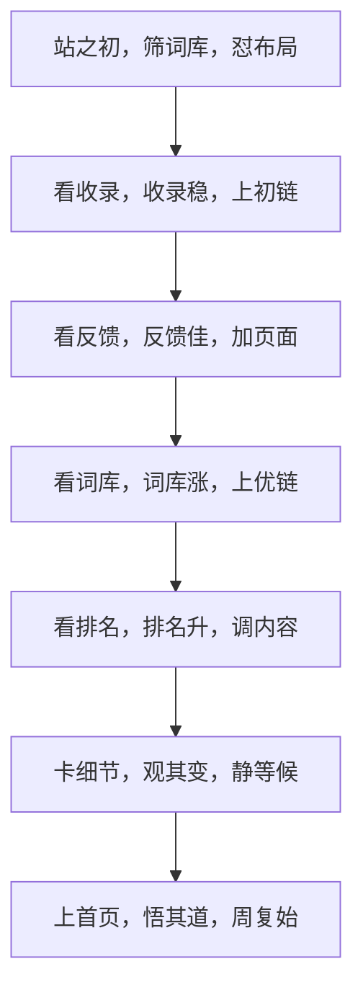
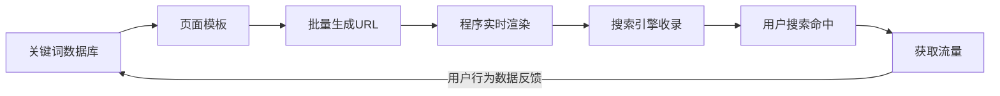
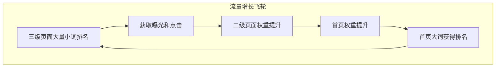
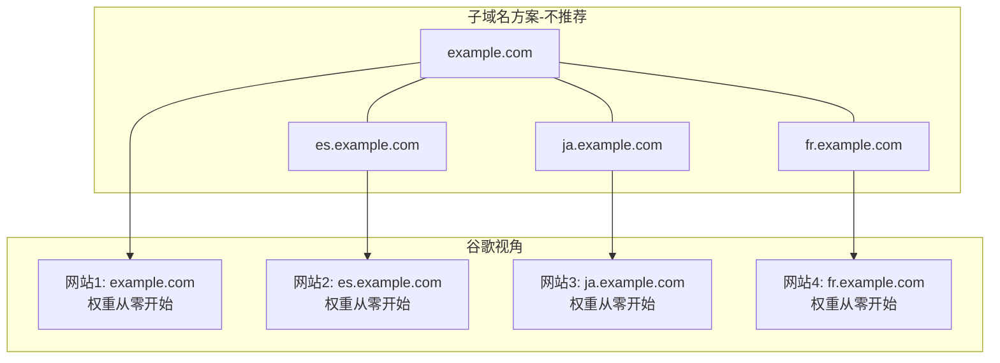
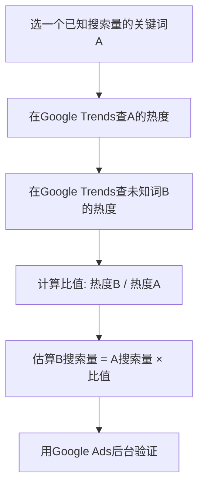
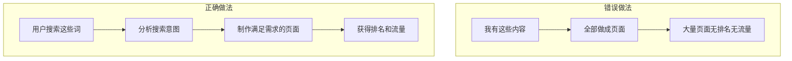
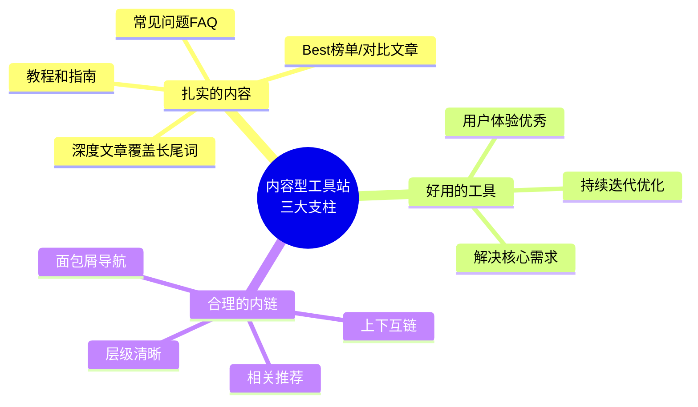

# 补充课14：SEO技巧深化

前几节课我们学习了站内优化（[[0010-onpage-seo|第10课：站内优化]]）、搜索意图（[[s05-search-intent|补充课05：搜索意图]]）和内页内链（[[s08-inner-pages|补充课08：内页与内链建设]]）等基础知识。这节课我们将在此基础上，深入到哥飞社群沉淀的**进阶SEO技巧**中，涵盖程序化SEO、多语言策略、谷歌趋势高级用法，以及从真实案例中提炼的SEO心法。

> [!ABSTRACT]
> 本节课的内容全部来自哥飞小课堂和进阶教程的实战精华。你将从七个维度深化你的SEO认知，每个维度都配有真实案例和可落地的方法。

---

## 1. 谷歌SEO三字经：核心SEO原则浓缩

哥飞将复杂的SEO流程浓缩为简洁的"三字经"，完整描述了从建站到稳定获流的生命周期。

### 全文解读



### 逐句注解

| 阶段 | 三字经 | 含义 |
|------|--------|------|
| **建站期** | 站之初，筛词库，怼布局 | 建站之初，先用 Semrush/Ahrefs 筛选词库，先做容易的词。把词库导出来归类，布局到全站各个页面上 |
| **冷启动** | 看收录，收录稳，上初链 | 网站上线后提交 Google Search Console，关注收录变化。稳定增长后开始加外链 |
| **增长期** | 看反馈，反馈佳，加页面 | 外链增长后正反馈好，继续加大页面量，布局更多长尾词 |
| **权重期** | 看词库，词库涨，上优链 | 词库持续增长时，加高质量外链到首页，提高首页权重 |
| **优化期** | 看排名，排名升，调内容 | 前20名词库量上升时，针对这些页面参考首页前5名进行 on-page SEO 优化 |
| **等待期** | 卡细节，观其变，静等候 | 调整完内容细节后不要天天改动，耐心等待1-2周测试结果 |
| **循环期** | 上首页，悟其道，周复始 | 有页面上首页后做总结，分析共性，继续优化下一批关键词 |

> [!TIP]
> 这套"三字经"的精髓在于**数据驱动、循序渐进**。不要跳步——在"收录稳"之前就大量加外链，往往事倍功半。

### 谷歌排名的三句总结

哥飞用三句话精辟总结了谷歌排名机制：

1. **Title 和 H1 等页面关键词确保你的网页能够进入关键词搜索的待排名范围里**
2. **外链帮助你进入谷歌搜索前10位置**
3. **网站体验帮助你确定最终的名次**

> [!WARNING]
> 很多新手只关注第1步和第2步，忽略了第3步。网站体验（页面速度、移动端适配、用户停留时间、跳出率）是决定你能留在前10还是被挤下去的关键因素。

---

## 2. 程序化SEO：生成海量页面获取流量

### 什么是程序化SEO

程序化SEO（Programmatic SEO）是指通过代码自动化生成大量页面的策略。每个页面针对一个特定的长尾关键词，通过模板+数据的方式批量产出，从而在搜索引擎中覆盖海量关键词。

### 核心原理



### 案例1：distance.to — 两地距离查询

distance.to 是一个典型程序化SEO案例。它的每个页面结构极其简单：

- **页面内容**：地图 + 两个地点的连线 + 上方浮层显示距离文字
- **URL模式**：`https://www.distance.to/Germany/Azerbaijan`
- **覆盖的关键词**：`distance from azerbaijan to germany`、`distance from germany to usa`、`distance from earth to moon`...

从 site 结果可以看到，这个网站覆盖了海量"distance from X to Y"类的长尾关键词。每个页面都是程序实时生成，并没有存储为静态 HTML 文件。

> [!QUESTION]
> **爬虫如何发现这些URL？**
>
> 哥飞答：通过内链。从首页到二级页面（国家/地区列表），二级到三级（具体两地距离），一层一层展开，让爬虫能够抓取到每一个页面。

**实现要点**：
- 每次请求实时生成 HTML，返回前端
- 设置缓存（如10分钟），减轻数据库压力
- 做好内链体系，让爬虫发现所有URL
- 不需要预先存储所有页面文件

### 案例2：程序化SEO vs 内容站

程序化SEO的典型特征：

| 维度 | 传统内容站 | 程序化SEO站 |
|------|----------|------------|
| 页面生成 | 人工撰写 | 代码自动生成 |
| 关键词覆盖 | 几十~几百个 | 几千~几百万个 |
| 页面结构 | 多样化 | 统一模板 |
| 更新方式 | 手动更新 | 数据驱动自动更新 |
| 典型代表 | 博客 | distance.to、Canva |

### 案例3：Kevin Indig 的增长策略

在程序化SEO的实践中，有一个经典策略——首页瞄准有一定优化难度的大搜索量关键词，然后通过二级页面和大量的三级页面，不断获取小词的排名、曝光、点击，进而带动上一级页面的权重，最后让首页拿到相关关键词的排名。



> [!EXAMPLE]
> **Henry 的案例**：Henry 去年12月上线了一个网站，选择了一个有一定难度的关键词，靠着扎实的内容，在4月份流量开始起飞，之后每个月都在增长。57%流量来自自然搜索，35%来自直接访问，没有投过任何付费广告。

### 程序化SEO的适用场景

- 数据查询类（距离查询、单位换算、汇率转换）
- 模板生成类（海报制作、简历生成、合同生成）
- 列表聚合类（产品对比、工具推荐、目录索引）
- 地理位置类（天气查询、周边商户、路线规划）

---

## 3. 从Canva学SEO：URL规划和大小关键词覆盖

### Canva的URL结构策略

Canva 是程序化SEO的顶级玩家。其核心策略是：**挖掘海量关键词，做海量页面，获取海量流量**。

来看 Canva 的 URL 规划，注意每一个页面的 URL 结构：

| 页面类型 | URL | 覆盖的关键词 |
|---------|-----|------------|
| 大分类 | `/create/posters/` | Poster Maker |
| 节日细分 | `/create/posters/diwali/` | Diwali Poster Maker |
| 国家节日 | `/create/posters/india-independence-day/` | India Independence Day Poster Maker |
| 主题细分 | `/create/posters/gender-equality/` | Promote Equality through Poster Design |
| 宗教节日 | `/create/posters/holi/` | Vibrant Holi Poster |

### 关键启示

Canva 的 URL 层级设计极其清晰：

```
/create/{category}/{subcategory}/
```

这样的结构带来的好处：
1. **关键词层级清晰** — 搜索引擎能明确理解每个页面的主题
2. **大词小词都不放过** — 只要有人搜索的词，就做个页面来拿排名
3. **权重自然传递** — 上级页面权重通过目录结构自然流向子页面
4. **无限扩展性** — 可以在任意层级下无限添加新的子页面

> [!TIP]
> 你在规划网站URL结构时，可以借鉴 Canva 的思路：**用一个统一的 URL 模式，覆盖不同颗粒度的关键词**。不要等到用户搜索了才做页面，而是预判所有可能被搜索的关键词。

### 实战应用

假设你做一个"AI图片工具"网站，可以这样规划URL：

```
/tools/photo-editor/           → Photo Editor（大词）
/tools/photo-editor/remove-bg/ → Background Remover（中词）
/tools/photo-editor/remove-bg/portrait/ → Portrait Background Remover（小词）
/tools/photo-editor/enhance/   → Image Enhancer（中词）
/tools/photo-editor/enhance/old-photos/ → Old Photo Restorer（小词）
```

---

## 4. metadata2go案例：首页匹配一千多个关键词

### 案例介绍

metadata2go.com 是一个神奇的网站 — 它的**首页**匹配到了一千多个关键词。这不是靠堆砌关键词，而是通过巧妙的页面设计和内容规划实现的。

### 背后的原理

要让一个首页匹配上千个关键词，核心逻辑是：

1. **首页承载多维度信息** — 首页不只是"品牌展示"，而是聚合了多种工具/功能的入口
2. **每个功能模块对应一个搜索需求** — 首页上的每个区块、每个按钮、每个输入框，都可能触发一个关键词匹配
3. **结构化数据辅助理解** — 通过 Schema 标记让搜索引擎理解首页的多个功能维度

### 核心启示

> [!ABSTRACT]
> **首页是一个网站最重要的页面。** 不要只把首页当作"门户"，而要把首页当作一个"多功能聚合器"。通过合理的信息架构，让首页一个页面就能覆盖成百上千个相关关键词。

### 实操方法

要让首页覆盖更多关键词，可以从以下几个维度入手：

| 维度 | 做法 | 示例 |
|------|------|------|
| **功能聚合** | 首页列出所有工具/功能的入口 | "在线预览所有元标签" + "OG图像预览" + "结构化数据检查" |
| **FAQ区块** | 在首页加入常见问题区域 | 每个问题和答案对应一个长尾关键词 |
| **分类导航** | 清晰的分类目录，覆盖大词 | "SEO工具"、"开发工具"、"设计工具" |
| **动态内容** | 首页展示热门/最新内容 | "本周最受欢迎的工具"等区块 |
| **多语言切换** | 通过 hreflang 覆盖多语言关键词 | 不同语言版本的首页通过标签关联 |

> [!WARNING]
> 首页覆盖多个关键词不等同于"关键词堆砌"。区别在于：前者是通过**满足多个真实需求**自然覆盖，后者是通过**在页面上重复无关关键词**试图欺骗搜索引擎。谷歌对后者的惩罚非常严厉。

---

## 5. 多语言策略深化：子域名 vs 子目录

### 核心问题

做多语言站时，应该用 `es.example.com`（子域名）还是 `example.com/es/`（子目录）？

### 哥飞的结论

**强烈建议使用子目录方式实现多语言。**

### 为什么子域名不行？

谷歌会把每一个域名当作一个独立的网站，同一个域名下的多个子域名也会被当成不同的网站。



> [!WARNING]
> 如果有10个语言需要支持，用子域名就相当于你需要从零开始冷启动10个网站。这意味着你的难度和工作量直接乘以10。

### 证据支撑

哥飞用三个例子证明子域名在谷歌眼中是独立网站：

**例1：Ahrefs 外链检测**
在 Ahrefs 的反向链接检测工具中输入 `abc.com` 时，`www.abc.com` 的链接不会出现在结果列表中。这说明工具本身就区分了子域名。

**例2：Github Pages**
Github 提供给开发者的免费域名 `github.io` 下有无数的子域名站点。如果所有子域名共享权重，那么任何人创建一个新站点就能立即获得高权重排名，这显然不可能。

**例3：权重隔离的必然性**
如果子域名共享权重，整个搜索生态系统会乱套。谷歌必然会隔离不同子域名的权重。

### 例外情况

对于一些**特别高权重的域名**的子域名，谷歌的确会给予初始权重，但不会太高。例如维基百科开了一个新的子域名，谷歌默认会对此网站比较信任。但这只适用于少数顶级域，不适用于普通出海网站。

### 子目录方案的优势

```
✅ 推荐：example.com/es/   （子目录）
   - 所有权重集中在同一个域名
   - 冷启动成本低
   - 管理维护简单
   - 外链权重全部计入主域名

❌ 不推荐：es.example.com  （子域名）
   - 每个子域名单独积累权重
   - 冷启动成本高（×语言数量）
   - 外链分散在不同"网站"
   - 管理复杂
```

### 关于 www 的处理

哥飞还特别强调：`abc.com` 和 `www.abc.com` 在谷歌眼里也是两个网站。必须选择一个作为主域名，将另一个 301 跳转到主域名。

**推荐选择 `abc.com`（不带 www）作为主域名**，原因：
- 大多数用户已习惯输入无 www 的域名
- 别人介绍你的产品时留下的链接通常是无 www 形式
- 反向链接权重直接加到你的主域名上

而如果选择 `www.abc.com` 作为主域名，即使通过 301 跳转传递权重，也无法完全传递，反向链接的效果打了折扣。

### 多语言标签的正确用法

使用子目录结构后，需要在每个页面头部添加 `hreflang` 标签：

```html
<link rel="alternate" hreflang="en" href="https://example.com/en/" />
<link rel="alternate" hreflang="es" href="https://example.com/es/" />
<link rel="alternate" hreflang="ja" href="https://example.com/ja/" />
<link rel="alternate" hreflang="x-default" href="https://example.com/" />
```

---

## 6. 谷歌趋势高级用法

### 6.1 用双引号区分关键词真实搜索量

谷歌趋势查出来的数据是**热度（相对值）**，不是搜索量的绝对值。为了估算真实搜索量，需要找一个已知搜索量的关键词做"锚点"来对比。

**操作方法**：



**实战案例**：

1. 已知 `ai image editor` 月搜索量约20万（来自 Google Ads 后台）
2. 在谷歌趋势中对比 `ai image editor` 和 `GPTs` 的热度
3. 发现 `ai image editor` 略高于 `GPTs`，推断 `GPTs` 每天搜索量约 5K+
4. 再对比 `AI Photo Editor` 和 `GPTs`，发现 `AI Photo Editor` 是 `GPTs` 的三倍
5. 估算 `AI Photo Editor` 每天搜索量约1.8万，一个月约56万
6. 去 Ads 后台验证：9月搜索量55万，与估算非常接近

> [!TIP]
> 找一个**可靠的关键词锚点**是关键。建议用 Google Ads 后台（需要花过广告费才能看到详细数据）或者用你已经知道搜索量的关键词作为基准。

### 6.2 判断一个关键词是新词

谷歌趋势还可以用来判断一个关键词是否是"新词"——即最近才出现的热门词汇。

**方法**：

1. 在谷歌趋势搜索目标关键词
2. 选择"过去5年"查看趋势曲线
3. 观察曲线从什么时候开始出现
4. 如果曲线从最近才开始出现，说明这是一个**新词**

**案例：ChatTTS**

在谷歌趋势中搜索 `TTS`，选择全球、最近7天，查看"相关查询"，就能发现 `ChatTTS` 和 `ChatTTS`（含 typo）等新词。`ChatTTS` 是最近几天才出现的新词，并且还发现了 Typo 词 `ChatTTS` — 多个T连在一起，有些人记不住就会少输入一个。

**案例：Udio 和 Suno**

输入 `AI Music`，选择90天范围，就能把 `Udio` 和 `Suno` 找出来。知道一个产品后，拿着这个产品名称去谷歌趋势搜索，就能找到更多相关的新词。

> [!ABSTRACT]
> **找新词的方法论**：不断在「网站 ↔ 词 ↔ 更多词 ↔ 更多网站」之间循环，就能打开一个全新的世界。找词、找需求不再是拍脑袋，而是有科学方法。

### 6.3 三步找到新词

| 步骤 | 操作 | 目的 |
|------|------|------|
| 1 | 输入已知品类词 | 找到相关新词 |
| 2 | 查看"相关查询"中的"搜索量上升" | 发现飙升词 |
| 3 | 将发现的新词重复步骤1-2 | 不断扩展 |

> [!QUESTION]
> **发现了一个新词，怎么判断是否值得做？**
>
> 看该词的搜索量趋势是否在上升，以及是否有竞争对手已经在做了。如果趋势陡峭上升且竞争对手少，这就是蓝海机会。

---

## 7. 内链内页深化：如何做好内容型工具站

### 7.1 哥飞网站权重公式

哥飞提出了一个评估网站内容策略是否有效的指标：

```
哥飞网站权重 = GSC后台里能够拿到曝光和点击的网页数量 / GSC发现了的网页数量 × 100%
```

> [!WARNING]
> 如果这个数值小于100%，说明你的网站生成了大量不被谷歌认可的页面，需要反思内容生成策略。如果大于100%，说明你的内容策略很健康。

### 7.2 不要"你有什么内容就做什么页面"

这是新手最常见的错误——不管用户需要什么，先把你有的内容做成页面。

正确的做法是：**用户会在谷歌搜索什么，你才去做满足搜索需求的页面。**



### 7.3 "举全站之力"优化一个关键词

当你想让网站针对某个关键词获得排名时，不能只靠一个页面，而是需要**举全站之力**：

| 策略 | 做法 |
|------|------|
| **首页引流** | 在首页给目标内页加链接入口 |
| **分类页背书** | 在相关分类页推荐目标页面 |
| **相关推荐** | 在多个内页底部推荐目标页面 |
| **正文嵌入** | 在相关文章正文中自然链接到目标页面 |
| **面包屑强化** | 确保面包屑路径清晰，权重传递顺畅 |
| **Sitemap优先** | 在XML Sitemap中标记目标页面为高优先级 |

### 7.4 内容型工具站的三大支柱

做好一个内容型工具站，需要三个支柱同时支撑：



> [!EXAMPLE]
> **aimsicpreneur.com 案例**：
>
> 这个网站定位为AI音乐创作者杂志，上线后通过扎实的内容在多个音乐相关关键词拿到谷歌首页排名。最高流量的页面是一篇"Best 4 AI stem separation tools in 024"推荐文章，这篇文章发布于3月1日，仅4个半月后，流量就占全站总流量的43%。
>
> 关键点：**这个网站并没有自己开发音轨分离工具**，而是体验了市面上的各个产品后写了一篇推荐文章。这就是"解决用户需求，并不一定要自己开发工具"的典型案例。

### 7.5 工具站+内容页的双轨策略

哥飞特别强调一个高效的策略：

1. **先上内容页** — 发现一个有搜索量且竞争不太高的词后，先上线一个内容推荐页面（如Best榜单），快速获取排名
2. **再做工具页** — 工具开发完成后，作为一个独立内页上线
3. **内容页导流到工具页** — 在内容页面增加按钮和链接，引导流量到工具页面
4. **两个页面同时参与排名** — 内容页和工具页都可以在谷歌获得排名

> [!TIP]
> 一定要快！在你发现词之后，就快速上线页面。很多时候谷歌排名，就是你早上线一天，你就更有优势。

### 7.6 内链的更高阶用法：用内页拿排名

在 [[s08-inner-pages|补充课08：内页与内链建设]] 中我们学习了内链的基础。这里再深化一层：

有些关键词（如 "youtube mp3 downloader"）搜量巨大，但是 Ahrfs 显示的 D 非常低。原因是什么？

**因为 Ahrefs 的算法计算 D 时，看的是搜索结果中首页出现的比例。而这类关键词的排名页面几乎都不是首页，而是内页。**

```mermaid
flowhart LR
    subgraph 传统策略
        A[首页] -->|拿排名| B[大搜量关键词]
    end
    
    subgraph 进阶策略
        C[首页] -->|权重传递给内页| D[内页A]
        D -->|拿排名| E[大搜索量关键词]
        C -->|如果内页A被惩罚| F[内页B]
        F -->|接替拿排名| G[同一关键词]
    end
```

**进阶策略的优劣**：

| 方面 | 说明 |
|------|------|
| **优势** | 即使一个内页被惩罚，可以快速用另一个内页替换，首页的权重可以持续传递给新内页 |
| **风险** | 如果首页被惩罚，整个网站就废了 |
| **结论** | 用内页拿排名是一种风险分散策略，适合高风险的竞争领域 |

### 7.7 快速度验思路：先做内容再开发工具

当你发现一个词有一定搜索量，竞争程度也不是特别高，但开发工具需要时间时：

1. **先上线内容推荐页面**（如Best榜单、对比文章、教程）
2. **测试能否拿到排名**
3. **等拿到排名后再开发工具**
4. **工具完成后，内容页导流到工具页**

> [!TIP]
> 这样做的最大好处是：**你不会在开发工具上浪费几个月时间，却发现这个关键词根本拿不到排名。**先用小成本验证，再大投入开发。

---

## 本课总结

- **谷歌SEO三字经**：站之初筛词库怼布局 → 看收录上初链 → 看反馈加页面 → 看词库上优链 → 看排名调内容 → 卡细节静等候 → 上首页悟其道周复始
- **程序化SEO**：通过代码批量生成页面覆盖海量关键词，典型案列包括 distance.to 的距离查询页和 Canva 的设计模板页
- **Canva 的 URL 规划**：用 `/create/{category}/{subcategory}/` 的层级结构，大词小词都不放过
- **metadata2go 首页策略**：通过功能聚合、FAQ块、分类导航让单个首页匹配上千个关键词
- **多语言用子目录**：不要用子域名，子目录冷启成本低，权重集中
- **谷歌趋势高级用法**：用已知搜索量的词做对比估算未知搜索量；查看趋势曲线判断新词
- **内链深化**：用"哥飞网站权重公式"评估内容策略健康度；用好"举全站之力"优化关键词；先做内容页验证再开发工具

## 下一步

继续深化 SEO 知识体系，进入 [[0011-offpage-seo|第11课：站外推广与外链建设]]。

## 自测题

<details>
<summary>点击展开自测题</summary>

1. 谷歌SEO三字经的完整流程是什么？每一阶段的核心动作是什么？
2. 什么是程序化SEO？它的核心原理是什么？
3. Canva的URL规划策略给了我们什么启示？
4. 做多语言时，为什么不建议使用子域名而推荐使用子目录？
5. 如何通过谷歌趋势估算一个关键词的真实搜索量？
6. 如何通过谷歌趋势判断一个关键词是新词？
7. "哥飞网站权重公式"是什么？公式值小于100%说明什么问题？
8. "先做内容页再做工具页"的策略有什么好处？
9. 为什么有些大搜索量关键词在Ahrefs中KD很低？背后的原因是什么？

**答案**
1. 站之初筛词库怼布局 → 看收录上初链 → 看反馈加页面 → 看词库上优链 → 看排名调内容 → 卡细节静等候 → 上首页悟其道周复始
2. 程序化SEO是通过代码自动化生成大量页面的策略，每个页面针对特定长尾关键词，通过模板+数据批量产出
3. 用统一的URL模式覆盖不同颗粒度的关键词，大词小词都不放过，权重通过目录结构自然传递
4. 谷歌把每个子域名当作独立网站，各自从零积累权重，10个语言就要冷启动10个网站；子目录方式则所有权重集中在同一域名
5. 找一个已知搜索量的词作为锚点，在谷歌趋势中对比热度比值，估算未知词的搜索量，再用Google Ads后台验证
6. 在谷歌趋势选择"过去5年"查看曲线，曲线从最近才开始出现的就是新词
7. 公式 = 能拿到曝光点击的网页数量 / GSC发现的网页数量 × 100%。小于100%意味着生成了大量不被谷歌认可的页面
8. 用小成本先验证关键词是否能拿到排名，避免在开发工具上浪费几个月却发现关键词根本不值得做
9. 因为Ahrefs的KD算法看的是搜索结果中首页出现的比例，而有些关键词排名靠前的都是内页非首页，导致KD被低估
</details>