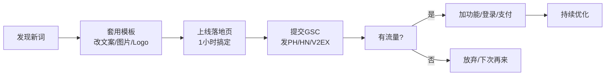
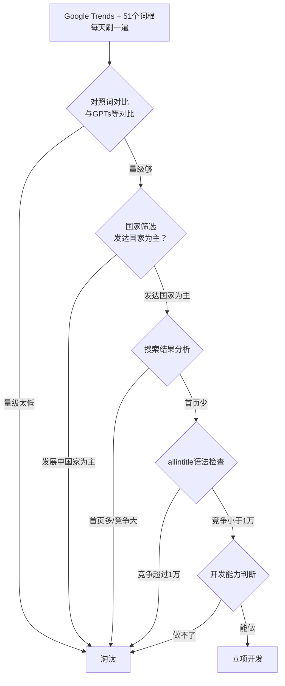
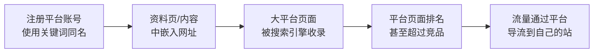
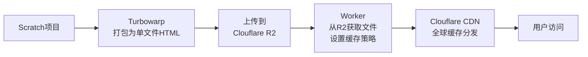
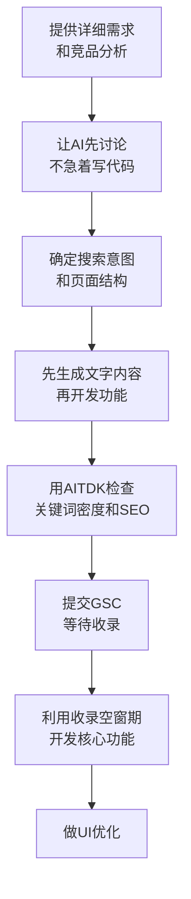

# 补充课15：经验分享与案例

> 从8月到10月，哥飞社群的成员们用真金白银和时间换来了大量可复用的实战经验。本课汇集了月度新词新站经验、广告变现策略、技术实操坑点、内容质量心法、高手分享和深度案例分析。

---

## 1. 月度新词新站经验

月度新词新站打榜是哥飞社群的特色活动——每月评选新注册域名新上线站点中流量增长最快的网站。以下按时间线整理了8月、9月、10月的精华经验。

### 1.1 八月经验

#### 找新词渠道

> [!TIP]
> **三大新词发现渠道：**

1. **Google Trends**：每天刷大类词和相关查询，关注"飙升"和涨幅百分之几千的词。用双引号语法（如 `"2025 calendar"`）可以区分同义词的真实热度，详见 [[s04-keyword-formula|补充课04：关键词价值公式]]。

2. **Twitter**：关注 AI 行业博主的一手信息，很多有意思的模型和新词先在 Twitter 上出现。推荐关注：
   - `x.com/DreamStarter_1`
   - `x.com/javilopen`
   - `x.com/fofrAI`
   - `x.com/op7418`
   - `x.com/_akhaliq`
   - `x.com/AIWarper`

3. **Replicate & Hugging Face**：每天刷一下有没有新模型上线，发现新模型对应新词机会。

#### 快速上站方法论



- **模板化是核心**：搞一套自己的模板（UI + 功能），不用追求完美，慢慢迭代
- **刚上线只需落地页**：一个页面就够了，有流量后再加功能、登录和支付
- **推广渠道**：Product Hunt、Hacker News、V2EX，发起来不麻烦

> [!WARNING]
> 上站过程中的最大挑战不是技术，而是**情绪管理**。上了一个两个三个站都没流量，很容易自我怀疑。不要有负面情绪，Ship Fast, Ship More 是唯一解。

---

### 1.2 九月经验

#### Lucas小杨的三大感悟

| 感悟 | 核心观点 |
|------|----------|
| 大流量不等于大钱 | 月UV 100k的站95%来自印度，总收入<300美元；流量来源国决定变现效率 |
| 独有找词通道是关键 | 当主流找词方式变卷时，多往前走一步会发现前方并不拥挤 |
| 打磨SOP解放时间 | 模板从1.5小时优化到20分钟上线，低价值工作自动化或外包 |

> [!EXAMPLE]
> **变现效率对比（来自Lucas小杨的真实案例）：**
>
> - A站（纯娱乐）：流量是B站的10倍 → 但变现效率极低
> - B站（生产工具）：流量只有A站的1/10 → 订单反而更多、有续订率和年费
>
> **结论：流量来源国够优质 + 需求场景够刚需，每天一千几百UV也能过得很滋润。**

#### Andy的完整工作流

Andy用12天筛选找到一个称心如意的新词，以下是他的完整操作流：

**新词筛选流程：**



**Cursor开发的关键步骤：**

1. **先讨论再写代码**：用 Cursor Composer，先让 AI 分析竞争对手和搜索意图
2. **30分钟 HTML 单页提交 GSC**：抢时间，先收录再完善
3. **关键词密度控制在 3% 左右**：用 AITDK 插件检查
4. **利用 Cloudflare Crawler Hints 加速收录**
5. **1-2 小时的空窗期开发核心功能**

**用户体验优化：**

- 简化用户输入（提供一键示范输入）
- 吸引用户输入（Hero区加输出截图）
- 输出卡片化（可视化表达，用户爱分享）
- 添加反馈邮箱（用 Cloudflare 注册域名邮箱）

> [!WARNING]
> **Andy 的血泪教训**：如果网站已有排名，**谨慎修改 H1/H2/Heading/TDK 文案**！Cursor 改动功能时不小心动了 H1，第二天流量直接雪崩。可以用 Ahrefs 免费 Site Audit 每天扫描监测 SEO 关键变动。

**外链竞争策略：**

- **开源代码**：不开源别人也能一比一复制，开源反而带来 GitHub 外链
- **渠道来源反查**：从统计工具找到流量来源页，放到 GitHub Readme 的 Related Articles 中
- **提交导航站**：优先提交流量大的导航站

---

### 1.3 十月经验

十月是新词游戏站的爆发月，多位群友分享了详细经验。

#### 结果的经验（第5名、第3名）

> [!TIP]
> **关键发现：早上8点是 Google Trends 数据更新窗口。** 结果在16号早上8点突然发现一个7天趋势很猛的新词，抢注 .com 域名后快速上线。

**外链策略：平台账号矩阵法**

观察到竞品以博客评论为主要外链方式后，结果选择在 **GitHub、Twitter（X）、YouTube 等大平台注册关键词同名账号**，在资料页和发布内容中留下网址。这些大平台页面本身权重高，反而成为网站的外链来源。



**广告过渡策略：**

1. 有流量后立即申请 AdSense，但审核可能延迟
2. 先用 **Monetag** 和 **Adsterra** 过渡（几分钟审核通过）
3. Adsterra 可自定义广告位，注意内容擦边问题可联系客服刷新
4. 等 GSC 有一周数据后重新申请 AdSense，当天通过

#### blank的经验（Similarweb挖词法）

> [!EXAMPLE]
> **Similarweb 新词挖掘法（以 CrazyGames 为例）：**
>
> 1. 打开 Similarweb > 关键词研究 > 着陆页
> 2. 输入 `www.crazygames.com`
> 3. 点击量变化过滤选 **"新点击量"**
> 4. 按访问量排序，获得一批新词
> 5. 逐一到 Google Trends 验证
>
> 举一反三，不限于游戏站，其他品类也可以用同样方法找新词。

**快速收录技巧：**
新站上线后，在 GSC 后台 "网址检查" 页面提交测试并请求编入索引，配合外链效果更好。

**数据驱动优化：**
GSC 有数据后，关注 **排名靠后但展示量不错的词**，针对性增加关键词密度或内页，投入产出比最高。

#### BBQ的经验（夫妻档程序员）

BBQ和老婆是双双失业的程序员，老婆负责前端、他负责后端。他们的核心策略：

- **严格执行"当天买域名、当天搭建、当天上线"**
- **老站带新站**：已有的站是最好的外链来源
- **抄作业法**：
  1. 每天用 Ahrefs Backlink Checker 刷竞品外链
  2. 每天用 Semrush 导出竞品 dofollow 外链的 Excel
  3. 用脚本去重合并多个竞品的外链，跟着做
- 十月共做了9个站，几乎一半都流量还行

#### Xi5h1r的经验（TrendsTab插件找词）

Xi5h1r开发了一个 **TrendsTab 浏览器插件**来批量打开 Trends 链接，借此发现新词。

> [!WARNING]
> **Xi5h1r 的5个坑：**
>
> 1. 挖到关键词后没挖掘更多强关联词体现在域名/页面上 → 导致后期这些词没有排名
> 2. 看错域名注册错了，亏10美元还浪费时间
> 3. **404页面不要插入广告** → Google AdSense 审核被打回3次
> 4. 刚开始做外链只需指向主页，不要分流给内页 → 分散权重
> 5. 第一个站功能无法短时间实现 → 只上落地页也行，新词无敌

#### 信奉的经验（TikTok发现新词）

> [!EXAMPLE]
> **信奉的完整流程：**
>
> 1. 刷 TikTok 发现一款游戏视频爆火，评论区大量问"哪里可以玩"
> 2. 查 Google Trends 确认是新词，搜索排名前面是 TikTok/YouTube 视频和大站内页
> 3. 还没有主站做这个词 → 马上注册域名
> 4. 设计长内容单页：大 H1/H2 + 游戏图片 + 详细介绍（重写不抄） + **YouTube 视频（对排名帮助极大）** + 老外游玩视频
> 5. 图片越清晰越好，不要直接复制别人的图片
> 6. 修改 TikTok 账号名称为关键词名，发同类视频，持续获取搜索流量

---

## 2. 广告与变现经验

### 2.1 日入百刀的实战经验

良晨美分享了他的 AdSense 收入数据（高峰期）：

| 日期 | 点击 | 展示 | CTR | 排名 |
|------|------|------|-----|------|
| Sep 22 | 10,658 | 57,979 | 18.4% | 3.5 |
| Sep 23 | **45,369** | 140,516 | 32.3% | 2.1 |
| Sep 24 | 23,972 | 128,157 | 18.7% | 4.3 |
| Sep 27 | 22,456 | 191,429 | 11.7% | 5.7 |

核心经验：
- 不会代码就用 Claude 写 HTML，反复调试
- 找新词：把哥飞给的所有关键词在 Trends 里挨个看
- **大量发高质量 dofollow 外链**传递权重
- 流量被抢了就去发外链多优化，继续做下一个站
- 新站不一定都有流量，没数据不用管接着上下一个

### 2.2 广告平台对比

| 平台 | 门槛 | 审核速度 | 特点 | 付款周期 |
|------|------|---------|------|---------|
| **Google AdSense** | 最高 | 1-2周 | 单价最高，效果好 | 月结 |
| **Monetag** | 低 | 几分钟 | 自动广告不可控，影响体验；支持俄罗斯流量 | 月初 |
| **Adsterra** | 低 | 几分钟 | 可自定义广告位；识别 VPN 就不展示；内容可能擦边 | 每月2次 |

> [!TIP]
> **推荐的广告策略（blank 的方案）：**
>
> 1. 有流量后先用 Monetag 和 Adsterra 过渡
> 2. 等 GSC 有一周数据后申请 AdSense
> 3. ​AdSense 通过后：**AdSense 自动广告 + Adsterra Native Banner**
> 4. ​AdSense 长期没通过可以**删除重新提交**再试
> 5. ​注意：全屏横幅会影响 AdSense 出对联广告

### 2.3 变现效率的核心认知

来自 Lucas 小杨的总结：
- 流量来源国 > 流量大小
- 场景刚需 > 娱乐需求
- 日UV 1K 的优质流量 > 日UV 100K 的印度流量

详见 [[0012-monetize|第12课：流量变现与案例分析]]。

---

## 3. 技术实操经验

### 3.1 Cloudflare Pages 部署坑点：404.html

> [!WARNING]
> **Cloudflare Pages 的隐藏行为：**
>
> 如果没有 404.html，Cloudflare 默认你的项目是单页应用（SPA），所有无效路径都会返回根路径的内容。这样会导致：
> 1. 谷歌爬虫访问错误路径却得到正常页面 → 继续抓取 → 产生大量无效抓取
> 2. 浪费用谷歌分配的抓取资源 + 产生无效流量
>
> **解决方案：** 在项目根目录放一个 404.html 文件。

### 3.2 Vercel 接入支付

Vercel 提供现成的支付接入模板：

| 支付方式 | 模板链接 |
|---------|---------|
| **Stripe** | `github.com/vercel/nextjs-subscription-payments` |
| **Paddle** | `github.com/PaddleHQ/paddle-nextjs-starter-kit` |

部署在 Vercel 上的项目直接 Clone 模板即可快速接入，省去自己对接支付网关的复杂工作。

详见 [[s10-domain-deploy|补充课10：域名部署与上线]]。

### 3.3 10分钟配置邮箱

用 **Cloudflare 邮件转发** 功能：
1. 进入 Cloudflare Dashboard > Email > Email Routing
2. 添加自定义邮箱地址（如 `support@yourdomain.com`）
3. 设置转发到你的个人邮箱（如 Gmail）
4. 搞定

> [!TIP]
> 群友补充：回复时可能显示真实 Gmail 地址。如果有顾虑，可以用 **Cloudflare + Gmail 自建域名邮箱**方案，具体参考水水写的配置教程。

### 3.4 一键生成 Favicon

工具：`https://favicon.io/favicon-converter/`

支持上传 SVG/PNG 自动生成所有尺寸图标并打包为 Zip：
- android-chrome-192x192.png
- android-chrome-512x512.png
- apple-touch-icon.png
- favicon-16x16.png
- favicon-32x32.png
- favicon.ico
- site.webmanifest

HTML 引用代码：
```html
<link rel="apple-touch-icon" sizes="180x180" href="/apple-touch-icon.png">
<link rel="icon" type="image/png" sizes="32x32" href="/favicon-32x32.png">
<link rel="icon" type="image/png" sizes="16x16" href="/favicon-16x16.png">
<link rel="manifest" href="/site.webmanifest">
```

### 3.5 导航站刚需：获取任意网站 ICON

使用 `favicon.im` 服务：
```
https://favicon.im/hey.com?larger=true
```
支持 Markdown 直接显示：
```

```

### 3.6 Scratch 游戏站带宽成本优化

Scratch 游戏站的 HTML 文件体积大，带宽成本高。优化方案：



**操作步骤：**

1. **打包**：用 `https://packager.turbowarp.org/` 打包 Scratch 项目为 HTML 单文件
2. **创建 R2 存储桶**：上传 HTML 文件
3. **创建 Worker**，代码如下：
```javascript
export default {
    async fetch(request, env) {
        const url = new URL(request.url);
        const key = url.pathname.slice(1);
        const object = await env.MY_BUCKET.get(key);
        if (object === null) {
            return new Response('Object Not Found', { status: 404 });
        }
        const headers = new Headers();
        object.writeHttpMetadata(headers);
        headers.set('etag', object.httpTag);
        headers.set('Cache-Control', 'public, max-age=31536000');
        return new Response(object.body, { headers });
    },
};
```

4. 将 R2 存储桶绑定到 Worker
5. 可选：设置自定义域名（如 `game.yourdomain.com`）

> [!TIP]
> **关键优化：** 在 Worker 中设置 `Cache-Control: public, max-age=31536000`，这样 CDN 会缓存一年，大幅减少对 R2 的请求次数。如果没有这个设置，一个人本地开发可能就产生 100+ 请求。

### 3.7 哥飞常用的 Bookmarklet

把以下链接拖到浏览器书签栏，点击即可自动在 Ahrefs 打开当前域名的反链分析页面：

**看反链 →** 自动打开 `https://ahrefs.com/backlink-checker` 并填入当前域名

### 3.8 Windsurf AI 编程技巧

使用 Windsurf/Cursor 等 AI 编程工具的核心经验：

**与 AI 的高效协作流程：**



---

## 4. 内容质量

### 4.1 去除文章的 AI 味

群友在游戏论坛留言推广时被指出"This is an AI generated post"，摸索出有效的解决方法：

**方法：让 AI 模仿英语初学者写作**

```
prompt:
task: 我打算在网络上留言, 主题是【xxxxxxx】, 我希望你模仿
初学英语的中国人的风格来写， 他们通常一板一眼, 没有很高的
词汇量, 不了解口语化但语和缩写
```

> [!TIP]
> 其他群友补充：
> - 加一句话"用10岁小孩常用的词汇和用语习惯"效果也不错
> - 还可以使用"初中生风格"、"小学生风格"等不同的年龄段设定

详见 [[s12-ai-content-quality|补充课12：AI生成内容质量]] 了解更多 AI 内容优化方法。

### 4.2 SEO 友好的页面单词数

> [!WARNING]
> 哥飞明确要求：**一个页面单词数量不小于600个，800以上更好。**

页面单词数不发的后果：
- 谷歌无法正确判断页面内容主题
- 期望用户搜 A 词时网站有排名，结果谷歌放进 B 词排名
- B 词的用户搜索意图跟网站完全不匹配

核心关键词密度应控制在大约 **3%**。

### 4.3 On-Page SEO 检查清单

新站上线前，用 **AITDK 插件**逐项检查：

- [ ] Title 标签是否包含核心关键词
- [ ] H1 标签是否包含核心关键词
- [ ] 页面单词数 >= 600（最好 >= 800）
- [ ] 核心关键词密度约 3%
- [ ] TDK 中没有无人搜索的 Slogan

> [!WARNING]
> On-Page SEO 是整个 SEO 工作的基石。**On-Page 没做好，外链就浪费了。**
>
> 常见错误：在 Title 和 H1 里写压根没人搜索的 Slogan。你不是大品牌，不需要写 Slogan 标榜品牌。TDH 寸土寸金的地方，**别写没人会搜索的词**。

详见 [[0010-onpage-seo|第10课：站内优化]]。

---

## 5. 高手分享

### 5.1 Morse Code 工具站经验（奥赛）

> [!EXAMPLE]
> **成果（半年时间）：**
> - 从 0 增长到每天 4,000+ UV，8,000-9,000 PV
> - 做了 1-20 个站，只有这一个起来了（成功率不高，要多尝试）
> - 实现了从 0 到 1 的突破，证实这是一条可长期投入的道路

**验证需求的方法：**
- 用 KGR（关键词黄金比例）判断主词和长尾词的竞争度
- 信源主要来自维基百科和竞品网站
- 用 Semrush 下载关键词列表，整理成思维导图规划内页

**开发历程：**
1. 用墨刀绘制原型（参考哥飞的 morsecodeai.com 结构）
2. 4月底开始开发，5月底上线
3. 每天几十个点击 → 8月底每天 500+
4. 申请 AdSense 挂广告，每天零点几美元
5. 10月中旬每天 1,000+ 用户
6. 用 ChatGPT 重新生成内容（原内容粗糙、关键词密度高达 10-20%）
7. 更新所有页面内容后，流量涨到每天 4,000-5,000 用户

> [!TIP]
> **关键转折点：用 AI 重新生成高质量内容。** 之前的内容粗糙、关键词堆砌、密度过高（10-20%）。用 ChatGPT 辅助重写后，流量从每天 1K 涨到 4-5K。

### 5.2 价值 $199 的导航站提交合集

群友购买的自动化导航站提交服务报告，以下是部分高质量导航站：

| 导航站 | DR | 月访问量 | 提交方式 |
|--------|----|---------|---------|
| G2 | 98 | 3.2M | 免费 |
| Source Forge | 92 | 2.5M | 免费 |
| AI Tools Neil Patal | 91 | 6K | 免费 |
| FinancesOnline | 87 | 1.5M | 免费 |
| F6S | 86 | 1.6M | 免费 |
| Your Story | 86 | 8.5M | 免费 |
| AlternativeTo | 80 | 1.3M | 免费 |
| Crunchbase | 80 | 10M | 免费 |
| Stackshare | 79 | 1.6M | 免费 |
| Product Hunt | 75 | 6.0M | 免费 |

### 5.3 Windsurf 创建 Sprunki 游戏落地页

使用 Windsurf 工具可以快速创建游戏落地页（HTML），配合 Claude 编写代码、Windsurf 可视化调试，极大缩短从需求到上线的时间。

### 5.4 SaaS 产品页面灵感库

两个收集产品页面灵感的网站：

- **落地页灵感库**：`https://saaslandingpage.com/`
- **功能页灵感库**：`https://saasinterface.com/`

---

## 6. 案例分析

### 6.1 月访问量 40 万的 SEO 游戏站分析

> [!ABSTRACT]
> 游戏站是哥飞社群重点关注的品类。从多个成功案例看，游戏站的优势在于：
>
> - **高搜索量**：游戏类关键词常有大流量
> - **长尾词丰富**：每个游戏名就是一个独立关键词
> - **低开发成本**：HTML 单页 + iframe 嵌入即可上线
> - **用户停留时间长**：游戏本身带来高停留时间，降低跳出率
> - **多语言容易**：游戏界面本身语言依赖性低

**关键成功要素：**

| 要素 | 操作方法 |
|------|---------|
| 找词 | Similarweb 分析大游戏站的新着陆页、Google Trends 发现新游戏趋势 |
| 快速上线 | 模板化，域名注册到上线 1-2 小时 |
| 收录加速 | GSC 提交 + Cloudflare Crawler Hints |
| 外链 | 大平台账号矩阵、竞品外链抄作业、开源代码 |
| 变现 | Monetag/Adsterra 过渡 → AdSense，单站月收入可达$1,000+ |
| 带宽优化 | R2 + Worker + CDN（`Cache-Control: max-age=31536000`） |

### 6.2 AI SaaS 出海页面策略

> [!TIP]
> **最有效的 AI SaaS 页面策略总结（来自陈攀 Span 的分享）：**
>
> 1. **解决问题导向**：页面第一屏直接告诉用户"这个工具解决什么问题"
> 2. **社交证明**：放用户评价、使用数据、合作 Logo
> 3. **视频演示**：比截图更有效，让用户快速理解产品价值
> 4. **清晰的 CTA**：每个页面都有一个明确的行动员
> 5. **FAQ 区块**：覆盖长尾关键词，同时解答用户疑虑
> 6. **定价透明**：让用户快速判断是否适合自己的需求

---

## 总结

| 模块 | 核心要点 |
|------|----------|
| **月度新词新站** | 早上8点是趋势数据更新窗口；Similarweb 新点击量过滤是高效挖词法；用模板把上站时间压缩到20分钟；新词网站先上线落地页就够了 |
| **广告变现** | Monetag/Adsterra 过渡 → AdSense；流量来源国比流量大小更重要；日入百刀的核心是找到持续的新词 |
| **技术实操** | Cloudflare Pages 必须有 404.html；Vercel 提供现成支付模板；用 R2+Worker+CDN 优化游戏站带宽；Cloudflare 邮件转发10分钟搞定 |
| **内容质量** | 单词数 >= 600、关键词密度 ~3%；模仿英语初学者去除 AI 味；On-Page SEO 是基石 |
| **高手分享** | Morse Code 站半年从0到4K UV/天；导航站提交合集可免费提交高 DR 网站 |
| **核心理念** | Ship Fast, Ship More；先赚到第一美元建立正反馈；持续迭代而不是追求完美 |

## 下一步

1. 选择一个你感兴趣的品类（工具站/游戏站/内容站），用本课学习的方法找3-5个潜在新词
2. 准备一个上站模板，尝试在 **2小时内** 完成从域名注册到提交 GSC 的全流程
3. 用 AITDK 检查你现有页面的 On-Page SEO，看单词数和关键词密度是否达标
4. 部署 Cloudflare Pages 的话，检查根目录是否有 404.html
5. 评估你的流量来源国分布，思考变现效率是否需要优化
6. 回顾 [[0012-monetize|第12课：流量变现与案例分析]]，设计你的变现路线

## 自测题

<details>
<summary>点击展开自测题</summary>

**Q1：blank 使用 Similarweb 找新词的核心操作是什么？**

A. 查看竞品的流量来源
B. 在着陆页分析中用"新点击量"过滤
C. 比较不同国家的流量分布
D. 导出所有关键词列表

<details>
<summary>查看答案</summary>
**B。** 在 Similarweb > 关键词研究 > 着陆页中，输入目标网站，在点击量变化过滤项里选"新点击量"，就能找到最近流量上涨的页面，也就是新词的机会。
</details>

---

**Q2：以下哪个不是结果在10月新词经验中总结的要点？**

A. 早上8点是 Google Trends 数据更新窗口
B. 用大平台关键词同名账号做外链
C. ​AdSense 不通过就一直等着，不要挂其他广告
D. 广告可先用 Monetag 和 Adsterra 过渡

<details>
<summary>查看答案</summary>
**C。** 结果的经验是先用 Monetag 和 Adsterra 过渡（审核几分钟通过），等 GSC 有一周数据后再申请 AdSense，当天就通过了。
</ details>

---

**Q3：Lucas 小杨说的"大流量不等于大钱"是什么意思？**

A. 流量越大越不值钱
B. 流量来源国和需求场景比流量大小更重要
C. 一定要做付费产品不能做广告
D. 月UV 100K 的站最多赚 300 美元

<details>
<summary>查看答案</summary>
**B。** Lucas 的案例中，月UV 100K 的站 95% 来自印度，总收入不到 300 美元。而另一个站点流量小但来源国优质、场景刚需，变现效率反而高几十倍。关键在于流量质量而非数量。
</details>

---

**Q4：Cloudflare Pages 如果没有 404.html 会有什么问题？**

A. 网站无法部署
B. 所有无效路径都返回首页内容，导致爬虫无效抓取
C. 图片无法显示
D. 域名解析失败

<details>
<summary>查看答案</summary>
**B。** Cloudflare Pages 默认将无 404.html 的项目视为 SPA，所有无效路径返回根路径内容。这会导致爬虫访问错误路径也得到正常页面，产生大量无效抓取，浪费用谷歌分配的抓取资源和产生无效流量。
</details>

---

**Q5：哥飞要求的 SEO 友好页面单词数最低是多少？**

A. 300 个
B. 600 个
C. 1000 个
D. 1500 个

<details>
<summary>查看答案</summary>
**B。** 哥飞要求一个页面单词数量不小于 600 个，800 个以上更好。低于这个标准，谷歌可能无法正确判断页面主题。
</details>

---

**Q6：Morse Code 工具站的流量从每天 1K 涨到 4-5K 的关键操作是什么？**

A. 增加了更多外链
B. 用 ChatGPT 重新生成了所有页面的高质量内容
C. 改了域名
D. 投了 Google Ads

<details>
<summary>查看答案</summary>
**B。** 奥赛分享的关键转折点是用 ChatGPT 重新生成内容。之前的页面内容粗糙、关键词堆砌（密度高达 10-20%），更新内容后流量从每天 1K 涨到 4-5K。
</details>

---

**Q7：根据多个群友的经验，新站上线后广告策略的最佳路径是？**

A. 直接等 AdSense 审核，不用其他广告
B. 先挂 Monetag/Adsterra 过渡，有 GSC 数据后再申请 AdSense
C. 只用 Monetag 自动广告
D. 不挂广告先积累流量

<details>
<summary>查看答案</summary>
**B。** Monetag 和 Adsterra 审核快（几分钟），适合作为过渡方案。等 GSC 有一周数据后再申请 AdSense，通过率更高。
</details>

---

</details>

- [[0012-monetize|第12课：流量变现与案例分析]] — 变现策略
- [[0010-onpage-seo|第10课：站内优化]] — On-Page SEO
- [[s12-ai-content-quality|补充课12：AI生成内容质量]] — AI内容优化
- [[s04-keyword-formula|补充课04：关键词价值公式]] — 关键词分析
- [[s10-domain-deploy|补充课10：域名部署与上线]] — 部署上线
- [[s11-stats-gsc|补充课11：统计与GSC提交]] — 搜索数据监控