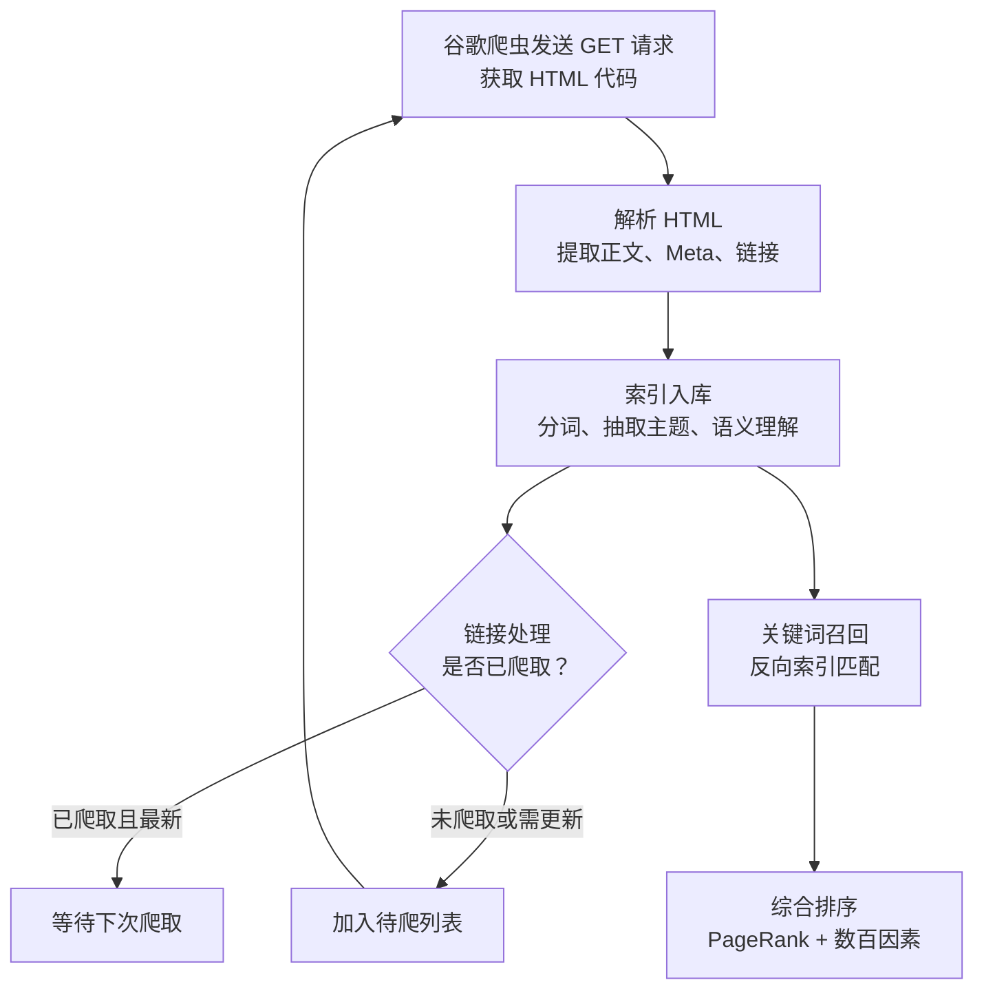
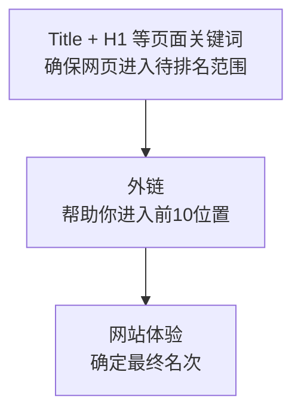
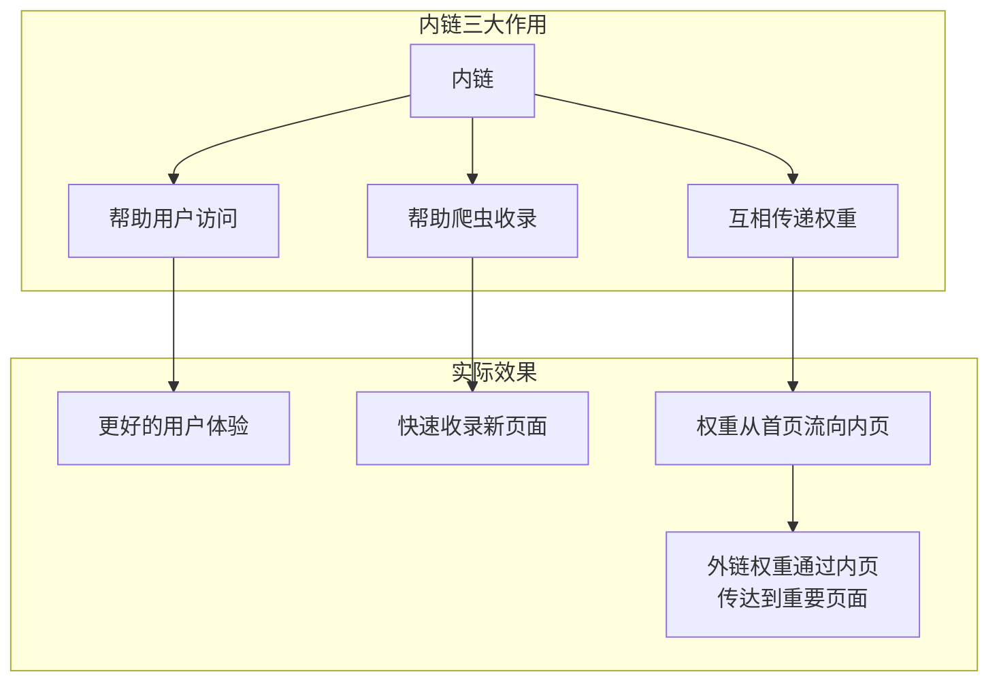

# 补充课16：哥飞SEO方法论

> [!ABSTRACT]
> 本课是哥飞SEO方法论的精华汇总。哥飞公众号中数十篇SEO相关文章，涵盖了从基础概念到高阶策略的完整体系。本课将这些分散的知识系统化，提炼为九大核心主题，帮助你构建完整的SEO认知框架。

---

## 一、从TDK到TDH：SEO元标签的进化

### 历史演变

SEO界曾经有一个广为人知的概念——**TDK**：

| 字母 | 含义 | 当前状态 |
|------|------|---------|
| T | Title（页面标题） | **仍然重要**，排名因素之一 |
| D | Description（页面描述） | **仍然重要**，影响点击率 |
| K | Keywords（关键词标签） | **已淘汰**，谷歌不再信任 |

> [!WARNING]
> **K 为什么被淘汰？**
> 1. SEOer 滥用 keywords 标签去蹭排名，谷歌不再信任站长写在 keywords 里的关键词
> 2. 谷歌的分词技术、语义分析技术、智能抽取技术越来越成熟，不再需要依赖 keywords

### TDH 新三要素

哥飞提出，应当将 **TDK** 升级为 **TDH**：

| 字母 | 含义 | 说明 |
|------|------|------|
| T | Title | 页面标题，重要性依旧 |
| D | Description | 页面描述，影响CTR |
| H | Headings（H1-H6） | **新加入**，网页骨架 |

H 就是 Headings（H1 到 H6），但通常主要指 **H1**。不过 H2-H6 同样重要——网页的 Headings 结构相当于网页的骨架，支撑整个内容结构。

> [!TIP]
> Title 和 H1 是否可以重复？谷歌的建议是：可以一样，也可以不一样。如果写不出不一样的 H1，保持一致也没问题。

### 写好Headings的最佳实践

1. 确保标题与描述的文本段相关
2. 让标题反映所覆盖文本的情感/主题
3. **不要过度使用**标题标签和关键词堆砌
4. 每个页面 **有且只有一个 H1**
5. H2-H3 组织内容层次，让搜索引擎理解页面结构

具体参见 [[0010-onpage-seo|第10课：站内优化 — 分门别类罗列]] 中关于元标签的详细讲解。

---

## 二、Canonical 标签详解

### 为什么需要 Canonical

同一个网页，可能因为以下原因产生**多个网址**（重复网址，非重复网页）：

```mermaid
flowchart LR
    A[重复网址原因] --> B[www 与裸域名同时可访问]
    A --> C[目录多种访问方式<br>/abc/ 与 /abc/index.html]
    A --> D[URL 跟踪参数<br>?ref=zs 与 ?via=ls]
    A --> E[其它参数变体]
    B --> F[搜索引擎眼中<br>出现大量"重复网页"]
    C --> F
    D --> F
    E --> F
```

哥飞举例：假设域名 `gefei.vip` 同时解析了 `www.gefei.vip` 和 `gefei.vip`，那么同一个页面可能产生以下多个网址：

```
https://gefei.vip/shequn/
https://www.gefei.vip/shequn/
https://gefei.vip/shequn/index.php
https://www.gefei.vip/shequn/index.php
https://gefei.vip/shequn/index.php?ref=zs
https://www.gefei.vip/shequn/?via=ls
```

### 正确用法

在网页 `<head>` 中加入：

```html
<link rel="canonical" href="https://gefei.vip/shequn/">
```

这样不管别人用哪个网址访问，Canonical 都不变，搜索引擎就能把**所有外链的权重都汇聚到规范网址**。

### 多语言站点的 Canonical

> [!WARNING]
> **常见错误**：不管什么语言都把 Canonical 写死成同一个网址。
> **另一个错误**：全站任何页面的 Canonical 都写成了首页。

正确的做法是——**Canonical 必须如实反映当前网页的真实网址**：

```html
<!-- 中文页面 -->
<link rel="canonical" href="https://gefei.vip/shequn/">

<!-- 英文页面 -->
<link rel="canonical" href="https://gefei.vip/en/shequn/">
```

### Canonical 的好处

当张三和李四都给你外链，但链接地址不同时，正确的 Canonical 能让搜索引擎把这些不同网址的权重**汇聚**到规范网址，避免权重分散。

---

## 三、robots.txt 指南：多语言网站的正确配置

### 常见问题

哥飞在 GSC 中发现，一个多语言网站有大量未编入索引的页面。原因是 `robots.txt` 只禁用了默认语言的目录：

```txt
User-Agent: *
Allow: /
Disallow: /people/
```

> [!QUESTION]
> 上面的写法能禁止 `/ja/people/`、`/ko/people/` 被抓取吗？
> **不能。** 只会禁止默认语言下的 `/people/` 目录。

### 正确配置

对于子目录形式的多语言网站，需要**列出每一种语言**：

```txt
User-Agent: *
Allow: /
Disallow: /people/
Disallow: /ja/people/
Disallow: /fr/people/
Disallow: /ko/people/
Disallow: /zh/people/
```

> [!WARNING]
> **不要偷懒**写成 `Disallow: /*/people/`，这会意外禁止 `/abc/def/people/` 这类你本想让爬虫抓取的页面。

### 最佳实践

1. 手动列出每一种语言
2. 增加新语言时同步更新 robots.txt
3. 使用 Next.js 可以用 `robots.ts` 动态生成
4. 一般规则：**所有不是拿来获取流量的页面，都不应该被抓取**

---

## 四、谷歌如何理解网页

### 从爬取到排名的完整流程



> [!TIP]
> 爬虫只是发出 GET 请求获取 HTML 代码，**不会执行 JavaScript**。如果你的网页是前端渲染的，爬虫拿到的只是空模板，无法参与排名。

### 页面深度

从首页开始，不断点击链接到达某个页面的**最短路径**，就是页面深度。

- 通常建议：不要超过 **5层**
- 哥飞建议：最好在 **3层以内**
- 保证任何一个页面点击三次就能到达

### 权重传递

每一个网页都是权重传递的最小单元：

- 出去的链接和进入的链接，都在传递权重
- 站内链接通常是 `dofollow`（完全传递权重）
- 外链通常设置为 `nofollow`（避免传递太多权重出去）

### 对工具站的启示

哥飞回答三个常见问题：

| 问题 | 答案 |
|------|------|
| 工具站要不要做内容？ | **必须做**。谷歌无法运行你的工具来了解用途，只能靠内容 |
| 为什么不要前端渲染？ | 谷歌不会为小网站执行 JS，拿不到内容 |
| 为什么多语言不能用 JS 切换？ | JS 切换不改变网址，爬虫只能抓取一种语言 |

---

## 五、谷歌喜欢的页面特征

哥飞总结了 **15个特征**，分为四大类：

### 用户体验好

| 特征 | 说明 |
|------|------|
| 1. 加载速度快 | 用户喜欢，谷歌也喜欢；慢还会拖慢爬虫抓取进度 |
| 2. 移动端友好 | 一半以上访问来自移动端，谷歌强制要求 |
| 3. 内链结构好 | 导航、面包屑、新内容在首页列出，帮助爬虫和用户 |

### 互动性高

| 特征 | 说明 |
|------|------|
| 4. 用户停留时间长 | 证明网页满足用户需求 |
| 5. 跳出率低 | 用户愿意多点点，不是打开就关闭 |
| 6. 平均访问页面次数多 | 用户在你的网站探索更多内容 |

> [!EXAMPLE]
> **提升停留时间的最简单方法**：提供免费试用，甚至不登录就能开始试用。用户试用满意后自然停留更久。这是哥飞社群多个网站实践验证有效的排名提升策略。

### 内容质量高

| 特征 | 说明 |
|------|------|
| 7. 原创度高 | 不要搬运、抄袭、复制。用 GPT 按指定格式重新组织内容 |
| 8. 内容权威 | 把一件事掰开揉碎讲清楚，你的网站就有了权威性 |
| 9. 内容实用 | 不做东拼西凑的狗屁不通内容 |
| 10. 内容相关 | 所有页面都和核心关键词相关 |
| 11. 定期更新 | 保持网站活跃，谷歌喜欢更新频繁的网站 |

### 做好 On-Page SEO

| 特征 | 说明 |
|------|------|
| 12. 工具页面也要有文字 | 用文字描述工具功能 |
| 13. 合理书写 TD | 不乱写、不省略、不重复 |
| 14. 合理的 Headings | H1 主题，H2 二级主题，H3 三级主题 |
| 15. 图片 Alt 属性 | 帮助图片出现在谷歌图片搜索中 |

---

## 六、小词图谋大词：保小图大策略

### 核心理念

哥飞总结为四个字：**保小图大**。

```mermaid
flowchart LR
    subgraph 新手村阶段
        A1[搜索量 ＜10K<br>KD ＜ 29] --> A2[注册域名<br>举全站之力]
        A2 --> A3[分门别类罗列<br>做深做透]
        A3 --> A4[拿到排名<br>站稳脚跟]
    end
    subgraph 扩展阶段
        A4 -> B1[增加兄弟词汇]
        B1 -> B2[父词汇<br>自然有排名]
        B2 -> B3[继续扩展边界]
    end
```

> [!WARNING]
> 注意：上述流程图仅为示意。正确的流程是：
> 1. 先用小词注册域名，举全站之力做深做透
> 2. 在小词站稳后，增加兄弟词汇
> 3. 父词汇自然会有排名
> 4. 不断扩展边界

### 什么是"举全站之力"

不是只做一个页面放几百字就完事。而是：

1. 分析小词相关的所有用户可能关心的问题
2. 在首页把每个问题**解释清楚**
3. 为每个问题增加**独立内页**
4. 必要时增加二级目录页面

### 保小图大的操作步骤

**第一步：新手村积累经验**

- 找几个搜索量 10K 左右、KD（优化难度）小于 29 的关键词
- 一个关键词注册一个域名
- 举全站之力优化这个词

**第二步：保小**

在小词上拿到排名、稳定流量后，你已经有了权重基础。

**第三步：图大**

1. 找兄弟词汇，在标题和首页增加兄弟词汇的解释
2. 对兄弟词汇也**分门别类罗列**
3. 搜索引擎因为你的域名已有权重，会给兄弟词汇更快排名
4. 父词汇自然也会有排名
5. 首页标题增加父词汇，首页增加父词汇解释

> [!TIP]
> 再聊小词：判断小词能不能做，**不能只看搜索量**，还要看 **CPC**（广告点击单价）。
> 在 Semrush 中，把 KD 设为小于 29，按 CPC 倒序排序，可以找到搜索量不大但价值很高的词。
> 做离钱近的关键词，小词也能带来不错的收入。

### 案例：Henry 的树状内容策略

Henry 加入哥飞社群后，采用**树状结构**做内容：

```
首页（主关键词）
 ├── 二级词子目录
 │    ├── 三级词内页 1（一页一词，做扎实内容）
 │    ├── 三级词内页 2
 │    └── 三级词内页3
 │── 二级词子目录 2
      ├── 三级词内页 4
      └── ...```

效果：每上线一个新的三级词页面，就能从谷歌获取对应关键词的搜索量。等三级词都做好，二级词开始有排名。二级词都做完了，首页核心关键词也有了排名。

---

## 七、Nofollow 外链的价值

### 哥飞的三句话总结谷歌排名



### Nofollow 的新认知

传统观点认为 nofollow 链接没有价值。但哥飞指出：

> [!WARNING]
> 最初 nofollow 是用来告诉搜索引擎不要传递权重。后来谷歌发现：**交易的链接都是 dofollow 的**，用户自发传播的链接反倒是 nofollow 的。于是谷歌修改了算法——**nofollow 链接对于权重提升也有作用了**。

所以现在搞外链：

- 不要只追求 dofollow 外链
- **nofollow 外链也别嫌弃，有就要**
- 有链接总比没有链接好

### 实操建议

| 外链类型 | 价值 | 获取方式 |
|---------|------|---------|
| 高权重 dofollow | 最高 | 内容营销 + 人脉 |
| 行业相关 dofollow | 高 | 客座博客 |
| 高质量 nofollow | 中等 | 社交媒体、论坛 |
| 普通 nofollow | 有总比没有好 | 目录提交、评论 |

更多外链相关内容参见 [[0011-offpage-seo|第11课：站外推广与外链建设]]。

---

## 八、谷歌搜索高级语法

哥飞在分析竞品和做市场调研时频繁使用以下语法：

### 1. 精确匹配（双引号）

搜索词用双引号括住，告诉谷歌你想要**完全匹配**的结果。

```
"iPhone 15 Pro"
```

### 2. site：查询域名收录

最常用的站长语法，查看指定域名的被收录页面。

```
site:vercel.com
```

排序方式一般是：首页 > 子域名 > 子目录 > 内页。

### 3. 减号排除

排除不想要的搜索结果。

```
Vercel -site:vercel.com
```

要排除多个词组成的短语，需要用双引号括起来：

```
iPhone 15 Pro -"iPhone 15 Plus"
```

### 4. intitle：限定标题

查询网页标题中含有指定关键词的页面。

```
intitle:"iPhone 15 Pro"
intitle:"iPhone 15 Pro" -site:apple.com
```

### 5. inurl：限定 URL

限定只搜索 URL 中携带指定关键词的网页。

```
inurl:login
```

### 6. filetype：限定文件类型

限定搜索结果为特定文件格式。

```
filetype:pdf Travel
```

支持的文件类型：pdf、ppt、doc、xls、txt、csv、xml 等数十种。

> [!TIP]
> 这些语法可以**组合使用**，例如：
> `intitle:"SEO tools" site:example.com filetype:pdf`

---

## 九、内链建设深化

### 内链为什么重要

内链的重要性**不亚于外链**。原因有三：

1. **帮助用户访问**：让用户更方便地浏览网站
2. **帮助爬虫收录**：让搜索引擎爬虫爬取所有页面
3. **传递权重**：页面之间互相传递权重



### 关键场景：外链 + 内链的联动

假设 B 网站有个链接指向 A 网站的某个内页，而 A 网站的内页有指向 A 网站重要页面的内链——这样就能把 B 网站的权重**传递给 A 网站的重要页面**。

### 内链最佳实践

| 实践 | 说明 |
|------|------|
| 文本链接优先 | 用描述性文字指明目标页面主要内容，不要用图片 |
| 多点链接 | 仅靠导航不够，在多个相关位置给出链接 |
| 新页面首页展示 | 新页面至少在首页保持**5天** | 
| 互链 | 新页面链接到旧页面，旧页面也链接到新页面 |
| 层级清晰 | 遵循「分门别类罗列」六字真言 |

> [!EXAMPLE]
> 哥飞最新的一个网站不到一个月收录十几万，压根没有 Sitemap。方法就是在首页不断列出最新的内容，同时有一个页面能够一页一页列出网站所有页面。这就吸引谷歌爬虫不断来爬。

详细内链策略参见 [[0010-onpage-seo|第10课：站内优化]] 中的内链权重传递部分，以及 [[s14-seo-advanced|补充课14：SEO 进阶技术]]（如果已上线）。

---

## 本课总结

哥飞SEO方法论九大核心主题：

1. **TDK → TDH**：Keywords 已被淘汰，Headings（特别是 H1）成为新三要素
2. **Canonical 标签**：解决重复网址问题，多语言时务必按语言分别设置
3. **robot.txt**：多语言站要逐一列出每种语言的禁止目录
4. **谷歌理解网页**：爬取→解析→索引→链接处理→深度控制→权重传递
5. **谷歌喜欢的页面特征**：用户体验好、互动性高、内容质量高、On-Page SEO 到位
6. **保小图大**：从小词做起，站稳后扩展兄弟词和父词
7. **Nofollow 外链**：谷歌已修改算法，nofollow 也有权重价值
8. **谷歌搜索高级语法**：site:、intitle:、inurl:、filetype:、精确匹配、排除
9. **内链建设**：重要性不亚于外链，与外链联动可放大权重传递效果

## 下一步

回顾 [[0009-seo-fundamentals|第09课：谷歌SEO基础与生态]] 了解谷歌生态视角，然后进入 [[0010-onpage-seo|第10课：站内优化]] 和 [[0011-offpage-seo|第11课：站外推广与外链建设]] 巩固基础。如已掌握这些内容，可进入 [[s14-seo-advanced|补充课14：SEO进阶技术]] 继续深造。

## 自测题

<details>
<summary>点击展开自测题</summary>

1. TDK 中的 K 为什么被淘汰？现在用什么替代？
2. Canonical 标签在多语言网站中应该怎么写？常见的错误写法是什么？
3. 对于子目录形式的多语言网站，robots.txt 应该怎么配置？
4. 谷歌爬虫爬取网页时，会不会执行 JavaScript 代码？
5. 哥飞总结的谷歌喜欢的页面特征分为哪四大类？每类列出2个特征。
6. "保小图大"策略的"保小"和"图大"分别指什么？
7. Nofollow 外链还有价值吗？为什么？
8. 请写出谷歌搜索语法：查询指定域名被收录页面的语法；查询标题中含有关键词的页面的语法；排除某个结果的语法。
9. 内链有哪三大作用？
10. 哥飞用三句话总结谷歌排名到底怎么回事，是哪三句话？

**答案**
1. K（Keywords）因为 SEOer 滥用蹭排名，谷歌不再信任；加上谷歌分词和语义技术成熟。现在用 H（Headings/H1）替代，形成 TDH。
2. Canonical 必须如实反映当前网页的真实网址。中文页面写中文版 URL，英文页面写英文版 URL。常见错误：全站写死成同一个网址，或者全都写成首页。
3. 需要逐一列出每种语言的禁止目录，如 `Disallow: /people/`、`Disallow: /ja/people/`、`Disallow: /fr/peple/`。不要用 `/people/` 通配符。
4. 不会。爬虫只发送 GET 请求获取 HTML 代码，不会执行 JS。前端渲染的网页爬虫拿到的是空模板。
5. 四大类：用户体验好（加载速度快、移动端友好）、互动性高（停留时间长、跳出率低）、内容质量高（原创度高、内容权威）、On-Page SEO（工具页面有文字、合理书写 TD）。
6. "保小"：先做小词（搜索量 10K 左右，KD < 29），举全站之力做深做透；"图大"：在小词站稳后，增加兄弟词汇和父词汇，逐步扩展。
7. 有价值。谷歌发现交易链接都是 dofollow，用户自发传播的反倒是 nofollow，所以修改了算法，nofollow 对权重提升也有作用。
8. site:域名（如 site:example.com）；intitle:关键词；用减号排除，多个词用双引号括住。
9. 帮助用户访问、帮助爬虫收录、传递权重。
10. (1) Title 和 H1 等确保网页进入待排名范围；(2) 外链帮助进入前10位置；(3) 网站体验确定最终名次。

</details>