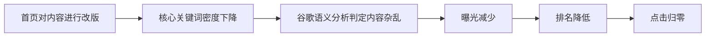
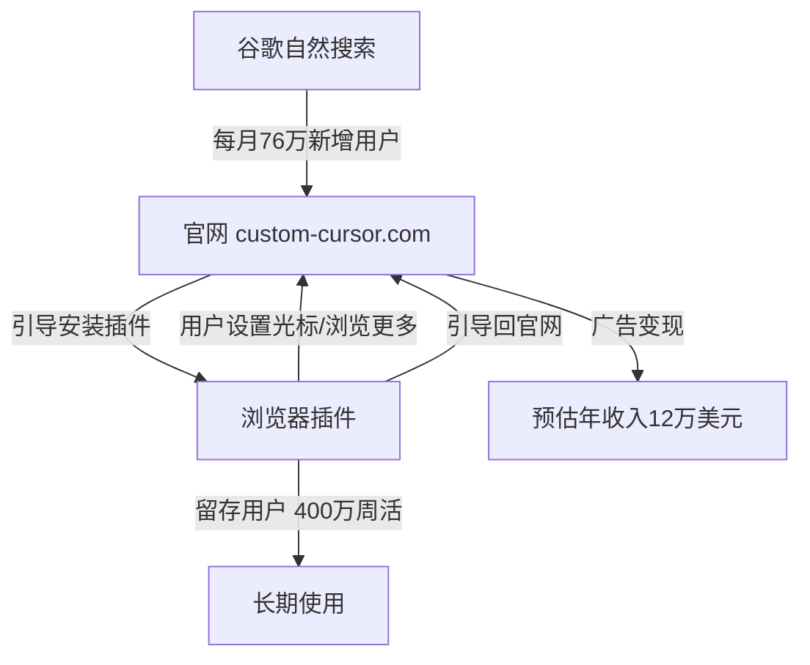
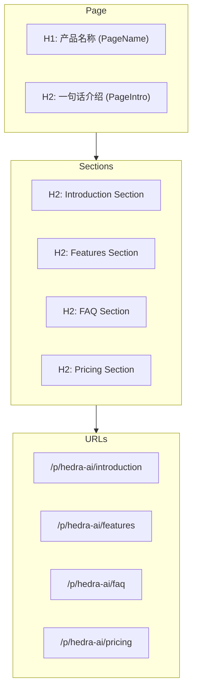
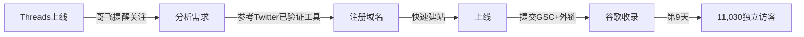
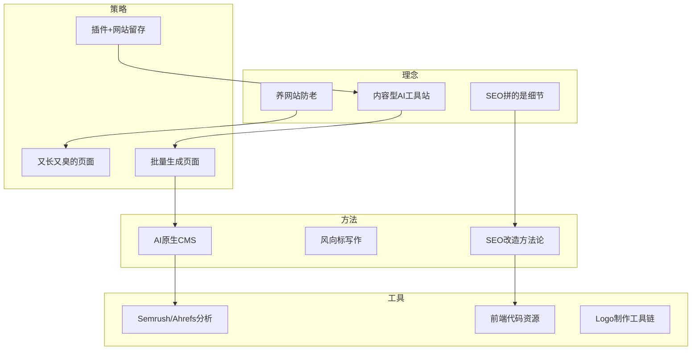

# 补充课17：哥飞实战案例与运营

## 概述

本补充课汇集了哥飞博客中关于实战案例与运营的核心文章精华。从内容型AI工具站的新形式，到StickerBaker的详细SEO评测报告；从真实的SEO失败案例到又长又臭页面的成功策略；从AI原生CMS的架构设计到新站9天破万访客的奇迹——每一篇文章都蕴含了哥飞在一线实战中总结出的宝贵经验。

通过这些案例，你将学会如何分析网站的SEO问题、如何写出能中标的风向标、如何给已上线网站做SEO改造、以及如何利用前端资源快速搭建网站。

---

## 1. 内容型AI工具站 — AI工具站的新形式

> 来源：*哥飞详解AI工具站的新形式，内容型AI工具站*

### 1.1 什么是内容型AI工具站

哥飞原创提出了"内容型AI工具站"这一概念。其核心模式是：

> **网站提供工具给用户使用，用户使用过程中产生的内容自动出现在广场上被更多人看到，同时被谷歌抓取和索引。**

当用户在谷歌搜索某些相关关键词时，网站的内容（如图片、文本）就可能出现在搜索结果里，吸引用户点击打开网站。用户用得越多，产生的内容越多，这些内容又通过搜索引擎带来更多的用户——形成**内容飞轮效应**。

### 1.2 商业模式

- **工具免费，增值服务收费**
- 用户不想被公开的内容 → 付费订阅
- 用户想要下载高清大图 → 付费订阅

### 1.3 可复制的模板化模式

哥飞强调这个模式是**模板化**的。同一套程序可以快速部署不同类型的站：

```
AI贴纸站 → AI头像站 → AI视频站 → AI文章站 → AI Web App站

输入：文字、图片、视频、网址
输出：文章、图片、视频、Web App
```

> [!TIP]
> 核心思路是：**基于用户的输入，调用AI处理后，输出内容**。各种需求都可以用这个模式做一遍。

### 1.4 内容型工具站 vs 传统工具站

| 维度 | 传统工具站 | 内容型AI工具站 |
|------|-----------|--------------|
| 内容来源 | 站长手动创建 | 用户使用自动生成 |
| 页面数量 | 有限 | 可无限扩展 |
| SEO优势 | 依赖关键词布局 | 真实用户产生真实内容，天然SEO友好 |
| 用户参与 | 用完即走 | 使用即贡献内容 |
| 留存机制 | 弱 | 内容浏览可带来回访 |

---

## 2. StickerBaker SEO评测 — 4000字详细评测报告

> 来源：*哥飞评站AI贴纸生成网站StickerBaker的SEO评测报告和改进建议*

这是哥飞"评站"栏目的第一期，对AI贴纸生成网站 StickerBaker.com 进行了全面SEO评测。

### 2.1 网站页面结构

```
StickerBaker.com
├── / (首页)
├── /sticker/{id} (贴纸详情页)
├── /stickers (用户生成贴纸列表)
├── /search (贴纸搜索入口)
└── /search?query={input} (搜索结果页)
```

### 2.2 首页SEO问题

**Title 和 Description 过短**
- Title 仅12个字符（推荐60字符），浪费了展示关键词的机会
- Description 仅21个字符（推荐160字符）

> [!WARNING]
> Title 和 Description 是搜索结果中直接展示给用户的内容，务必充分利用字符空间，嵌入核心关键词和行动召唤（CTA）文案。

**H标签混乱**
- 页面使用了两个H1，这是SEO大忌
- H1应体现核心关键词，如"Sticker Maker"或"AI Sticker Maker"

哥飞建议的H标签结构：

```
H1: AI Sticker Maker - Create Custom Stickers Online
H2: Convert Face Photo to Sticker
H3: Upload Face Photo
H2: Latest Generated Stickers
```

**Canonical 缺失**
Canonical 标签虽然不是强制要求的，但建议配置。它可以帮助搜索引擎理解哪个是页面的标准版本，避免重复内容问题。

**首页亮点**
- 核心区域直接放置工具入口 → 提高页面停留时间
- 最新作品列表持续更新 → 爬虫每次来都有新内容可抓
- 实时冒出新贴纸 → 给用户"网站很火"的感觉

### 2.3 贴纸详情页分析

**URL 问题**
- 直接使用数字ID（如 `/sticker/29961`），容易被爬虫遍历
- 建议改为 `/sticker/29961-fairy-unicorn` 形式，包含关键词

**Title 优化**
- 当前："I made an AI sticker of fairy unicorn"
- 建议："AI Sticker of fairy unicorn"（去掉"I made an"，更聚焦关键词）

**相似贴纸模块**
这是"神来之笔"——可以有效提升关键词密度。但当前使用的是前端渲染，需要改为**后端渲染**才能被搜索引擎抓取。

### 2.4 搜索功能SEO

- 搜索首页主打"Sticker Search"关键词，思路正确
- 但Title用了"StickerSearch"（无空格），应同时兼容带空格的写法
- 搜索结果页是**前端渲染**，所有不同URL的页面HTML内容重复——这是SEO大忌！
- 建议改为**后端渲染**，每个搜索结果生成独立的内容页面

> [!EXAMPLE]
> 以 `/search?query=unicorn` 为例，H1和Title应改为 `"160 Best Unicorn Stickers"`，其中160是对应的搜索结果数量。

### 2.5 建议增加的新页面

1. **发现页面（Discover）**：分页展示所有贴纸，让爬虫能够爬取到全部内容
2. **专题页面**：人工或向量搜索组合多种贴纸为一个专题，获取特定关键词流量
3. **搜索结果列表页面**：展示所有搜索关键词，让爬虫有入口爬取所有搜索结果页

### 2.6 总结：SEO拼的是细节

> 很多时候，SEO拼的就是细节，谁愿意花更多时间去死磕细节，谁就有可能拿到更高的排名，获取更多的流量。

---

## 3. SEO失败案例 — 一个真实的教训

> 来源：*哥飞实操分享一个真实的SEO失败案例帮助大家吸取教训*

### 3.1 案例背景

哥飞注册了 **ChatGPT4o.ai** 域名，快速上线了一个GPT 4o套壳问答站。与普通套壳站不同的是：**免费用户的问题和GPT 4o的回答会自动生成可被公开访问的问答页面**。

这意味着只要有用户源源不断地提问，网站就能源源不断地生成内容页面。这些真实用户的真实问题，在谷歌看来是有价值的内容。

网站上线后数据不错，排名不断前进，曝光和点击都在增长。

### 3.2 失败原因

在一次发版后，首页的"最新问答"列表模块把**问题和回答的全文**都在首页输出了。

原本首页约400个单词，发版后直接变成了**两三千个单词**。

后果：
- **核心关键词密度下降** —— 首页内容被大量无关问答稀释
- **谷歌语义分析发现内容杂乱** —— 首页内容与"GPT 4o"核心主题关联度降低
- **谷歌惩罚** —— 曝光减少，排名降低，点击归零

### 3.3 教训与启发



> [!WARNING]
> **关键词密度不是玄学，而是实实在在的SEO因素。** 谷歌会做语义分析，首页内容偏离核心主题，排名就会下降。每次改版后都要检查首页内容是否仍然聚焦于核心关键词。

### 3.4 让爬虫频繁来访的正确方法

哥飞指出，想让谷歌爬虫频繁来访，正确做法是：**在首页增加一个模块，显示最新的几个内页的链接**（而不是全文输出）。

以V2EX为例，谷歌爬虫1小时内就能抓取很多新帖子，就是因为V2EX首页时刻在更新帖子列表，爬虫为了不错过新内容，就会频繁来访。

---

## 4. 留存问题解决方案 — 插件+网站的双向循环

> 来源：*哥飞分享如何解决网站留存差问题也许这个网站找到了最佳答案*

### 4.1 案例：Custom Cursor 浏览器插件

哥飞发现了一个做用户留存的典范网站：**custom-cursor.com**，这是一个自定义鼠标光标图案的网站，配套浏览器插件周活达到 **400万**。

### 4.2 流量数据分析

| 指标 | 数值 |
|------|------|
| 最近12月访问量 | 2028万 |
| 直接访问占比 | 52.18% |
| 自然搜索占比 | 45.55% |
| 自然搜索总访问量 | 920万 |
| 直接访问总量 | 1060万 |
| 插件周活 | 400万 |

> 自然搜索≈新增用户。每月76万新增用户，通过插件沉淀下来，日积月累达到400万周活。

### 4.3 留存飞轮模型



### 4.4 变现估算

按照哥飞之前教的估算方法：
- 2028万访问量
- 每页面约2个广告位
- 总广告曝光：4056万次
- 按千次曝光3美元估算
- **年广告收入约12万美元（约87万人民币）**

加上开发者其他5款产品，**年收入200万人民币以上**是有可能的。

### 4.5 核心启示

> 这个案例的绝妙之处在于：**通过网站引导安装浏览器插件，把流量沉淀到了插件里；用户在使用插件时，又有机会打开网站，给网站带来流量。流量就这样循环起来了。**

对于AI工具站，可以借鉴的思路：
- 让用户在使用工具后，产生的内容留在网站上 → 吸引更多用户
- 考虑用浏览器插件、邮件订阅、社交媒体关注等方式沉淀用户
- 工具免费 + 增值服务收费 + 广告变现的组合模式

---

## 5. 又长又臭的页面策略 — 年获取62万点击

> 来源：*哥飞分享每年从谷歌获取62万点击一个很受谷歌欢迎的又长又臭的网页例子*

### 5.1 核心观点

哥飞在直播中提出：**谷歌喜欢又长又臭的页面**。这里的"臭"是夸张表达，既然谷歌欢迎，说明用户也欢迎，能够拿到谷歌搜索第一的页面肯定是有价值的。

### 5.2 案例：Kayak 的长页面

以 kayak.com 的一个租车页面为例（核心关键词：`car rental nyc`）：

整个页面包含以下模块：

```
1. 租车表单输入框
2. 为什么选择用Kayak
3. 不同价格车型列表
4. Tips for renting a car in New York
5. FAQs about renting a car in New York
6. New York car rental reviews and directory
7. Car rental locations in or near New York
8. 纽约租车教程文章列表
9. When to book a rental car in New York
10. 机场服务、交通
11. 纽约租车热门车型品牌
12. 纽约租车热门类型（货车、SUV、皮卡等）
13. New York car rental information
```

这个页面过去12个月的访问量占了网站总自然流量的0.32%，**每年从谷歌获取约62万点击**。

### 5.3 长页面的构建原则

> [!TIP]
> 不要怕页面太长，只要是围绕着关键词去做页面，就可以这样做。通过拆分成为多个不同的模块，每一个模块都有自己的数据和文字，最终组合成为一个特别长的页面。虽然长，但跟关键词高度相关，且能解决用户需求。

构建步骤：
1. 确定核心关键词
2. 围绕关键词拆分出多个子话题
3. 每个子话题作为一个独立模块
4. 每个模块有自己的数据和文字
5. 模块之间有机组合，形成完整的长页面

---

## 6. AI原生CMS — SEO友好的思考和实现

> 来源：*哥飞SEO友好的AI原生CMS思考和实践Part1 & Part2*

### 6.1 什么是AI原生CMS

哥飞定义的AI原生CMS是：**从设计之初就充分利用AI技术，实现内容自动生成、优化和管理的CMS系统。** 不是给旧系统增加AI能力，而是基于AI的能力重新规划网站。

三大特征：
1. **基于AI能力规划建设网站**：从生成内容、多语言翻译到自动内链、外链，尽量减少人工参与
2. **所有内容由AI生成**：通过提示词和参考资料生成高质量内容
3. **自动化串联网站各环节**：通过AI自动完成从内容生成到发布的各个步骤

### 6.2 为什么要从零开始而非改造WordPress

哥飞强调不基于WordPress改造，因为WordPress的设计初衷是**为人服务**的，所有信息都依赖人工输入和操作。如果要改造为工作流程驱动，会非常复杂。因此**从零开始构建**是最佳选择。

### 6.3 数据库表结构设计

哥飞以 **Woy.ai**（AI工具导航站 → AI百科大全网站）为例，详细讲解了表结构：

#### Page表

| 字段 | 说明 |
|------|------|
| ID | 内部数据关联ID，不对外显示（避免网页可遍历） |
| PageURL | 用于SEO，生成静态化URL（如 `hedra-ai`） |
| PageName | 产品名称（如 `ChatGPT`） |
| PageTitle | 简短介绍（如 `ChatGPT is OpenAI's large model`） |
| PageIntro | 一句话介绍，用于列表页 |
| Language | 多语言支持（每种语言一条记录） |
| BaseID | 关联到英文原版页面的ID |

#### Section表

- 每个Section有独立的ID、Language和BaseID
- 每个Section有独立的SectionURL，可生成单独的页面
- Section的目的是做**关键词细分页面**（如"产品名 + Pricing"、"产品名 + FAQ"）

#### Content表

- 内容属于特定Section
- 支持多语言
- AI直接生成Markdown格式内容，再转为HTML

### 6.4 页面结构



每个Section都对应一个关键词，如有人搜索"Hebbia AI FAQ Frequently Asked Questions"，专门的FAQ页面就可获取该关键词的流量。

### 6.5 外链获取策略

哥飞在 Woy.ai 上使用了一个巧妙的外链策略：

1. 提供付费提交服务（9.9美元/月，不限提交数量）
2. 也支持**免费提交**——需要在用户自己的网站上添加Woy.ai的外链
3. 后台程序自动检查是否真的添加了外链
4. 确认后免费收录

这形成了良性循环：更多网站添加外链 → DR值提升 → 吸引更多网站提交 → DR进一步提升。

> [!EXAMPLE]
> Woy.ai 上线两个月，获得138个网站的外链，总计95,000条外链，DR达到58。

### 6.6 标签系统

- 标签基于有搜索量的关键词生成
- 标签分两大类：**产品形态**和**功能点**
- 每个标签生成独立的T页面（如 `/t/text-to-image`）
- 标签支持层级关系（如 `Text to Image > Text to Logo`）
- 使用标签替代传统分类，因为一个产品可以有多个标签

### 6.7 多语言内容生成

哥飞的做法是：**不是先写英文再翻译，而是直接用不同语言的提示词，基于相同的参考资料，分别生成不同语言的内容。**

他做了十种语言的提示词，每次都是独立生成，这样效果比翻译好得多。

### 6.8 参考资料表的重要性

> [!QUESTION]
> 为什么需要参考资料表？
> 1. 增加权威性——提供参考来源
> 2. 防止AI产生幻觉——AI基于参考资料生成，而不是凭空编造
> 3. 覆盖新AI产品——新产品不在GPT训练数据中，必须靠参考资料补充

参考资料来源：产品官网、海外科技媒体、官方博客、About页面、团队介绍页、FAQ页面等。

---

## 7. 风向标写作方法 — 写出能中标的风向标

> 来源：*以四条中标的风向标为例告诉你如何写出能够中标的风向标*

### 7.1 核心原则

> **要有信息量，且最好是新信息。**

### 7.2 四条中标风向标分析

#### 风向标1：朋友圈置顶玩法

不是简单报告"朋友圈置顶全量放开了"这个旧消息，而是实际测试后发现：
- 可以置顶多条（测试了23条）
- 可以设置分组可见
- 设计了"给每个好友写个性化欢迎语"的玩法

**关键**：去实际测试，发现新玩法，描述出可执行的方案。

#### 风向标2：百度SEO经验

观察现象：搜索"成语"，百度首页有两篇公众号文章（2014年和2022年发布）。

哥飞总结出两点精髓：
1. **分门别类**——按不同类型（数字、动物、植物等）分类
2. **罗列成语**——大量罗列具体成语

> [!IMPORTANT]
> **精髓不是描述现象，而是分析背后的规律。** 这个规律要真实有效，而且可验证——你可以搜索其他词来验证。

#### 风向标3：给携程卖游记赚钱

这条信息看似平常，但包含两个"很多人不知道"的信息点：
1. 携程写游记可以赚钱
2. 可以用ChatGPT来写游记

**关键**：找到人们不知道的信息差，并给出具体操作路径。

#### 风向标4：Whois信息免费查询

这一条的信息量特别大：
1. 先说明常规做法（收费接口）
2. 指出Whois信息是公开可查询的（打破认知）
3. 具体说明查询方法（socket连43端口）
4. 指出潜在问题（小国后缀限制）
5. 提供解决方案（CloudFlare Worker多IP）
6. 告诉读者用ChatGPT写代码就行

### 7.3 延伸思考

基于一条风向标还可以衍生出更多可中标的风向标：
1. 整理出所有域名后缀的Whois服务器信息
2. 将可用代码开源到Github
3. 部署免费Whois查询服务

---

## 8. 新站9天11030访客案例 — 快速成功的秘诀

> 来源：*群友新站上线9天拿到11030个独立访客他是怎么做到的*

### 8.1 事件背景

Threads（Instagram推出的社交平台）上线当天，哥飞在社群提醒成员关注机会。群友 @赖嘉伟Gray 迅速行动，基于之前在Twitter验证过的成功模式，判断Threads也会产生类似的周边工具需求。

### 8.2 操作步骤



### 8.3 数据增长记录

| 天数 | 曝光 | 点击 | 平均排名 | 点击率 |
|------|------|------|---------|-------|
| 第1天（7/6） | 15 | 6 | 6.8 | 40% |
| 第2天（7/7） | 593 | 235 | 5.7 | ~40% |
| 第3天（7/8） | ~5000 | 1604 | 前进 | 33.7% |
| 第4天（7/9） | ~5000 | 1864 | 前进 | 上升 |
| 第5天（7/10） | ~4000 | 1226 | 6.2 | 下降 |
| 第6天（7/11） | ~3000 | ~900 | 不变 | >30% |
| 第7天 | ~2000 | ~600 | 5.5 | 稳定 |
| 第8天 | ~2000 | ~600 | 7.0 | 稳定 |
| 第9天 | ~2000 | ~600 | 5.3 | 上升 |

### 8.4 成功秘诀总结

1. **抓住新鲜事物的机会**：Threads上线立刻分析可能产生的用户需求
2. **快速建站**：即使功能还没完全开发，先把网站上线让谷歌收录
3. **快速让谷歌收录**：提交到Google Search Console + 在高权重网站留外链
4. **真实满足用户需求**：用户搜索进来后，要能真正解决问题，避免跳出
5. **增加外链提升权重**：真实用户推荐的外链比任何技巧都有效

> [!TIP]
> **外链就是背书。** 对于谷歌的PageRank算法来说，外链可以给网站增加权重。最好的外链是自然外链——用户觉得你的网站有用，发自内心地在其他网站分享推荐。

---

## 9. SEO改造方法论 — 给已上线网站出改造建议

> 来源：*如何给一个已经上线的网站出SEO改造建议*

### 9.1 第一大原则

> **已经存在的URL不要做任何改动。**

原因：
- 已被搜索引擎收录的URL不能改
- 已有外链指向这些页面，外链不能丢

### 9.2 改造方向一：挖需求加新页面

分析网站的潜在用户群体，针对他们的需求制作新页面。新页面可以是小工具，也可以是内容页面。

原则：**围绕潜在用户群体，尽量满足他们的潜在需求。**

> 这相当于做一个新网站，只不过新网站不使用新域名，而是放在老域名的子目录下。

### 9.3 改造方向二：找问题改老页面

#### 9.3.1 看TDK书写是否规范

**首页Title结构：** `网站名称 - Slogan - 关键词1 - 关键词2 - 关键词3……`

**目录首页Title结构：** `子栏目名称 - 子关键词1 - 子关键词2 - 子关键词3…… - 网站名`

**内页Title结构：** `内页主要功能 - 子栏目名称 - 网站名`

#### 9.3.2 看内链是否合理

正确的内链应该是**树形结构**：

```
首页（主干）
├── 子目录A（大枝干）
│   ├── 内页A1（小枝条）
│   ├── 内页A2
│   └── 内页A3
├── 子目录B
│   ├── 内页B1
│   └── 内页B2
```

从首页到内页，不要超过**4次点击**。

#### 9.3.3 检查其他SEO要素

- **Sitemap**：是否有sitemap，让爬虫更容易发现所有页面
- **Canonical**：是否设置了标准链接，避免重复内容问题
- **H标签**：是否只有一个H1，H2/H3层级是否合理

#### 9.3.4 H标签规范

```
H1（唯一）：核心关键词
H2：主要话题
H3：H2下的细分内容
P：正文段落
```

> 通过合理设置H1、H2、H3和段落P，我们可以让搜索引擎更容易理解每一个网页的重点是什么。

---

## 10. 前端资源汇总 — SVG Logo制作与可复制代码网站

### 10.1 SVG Logo制作流程

> 来源：*哥飞教你如何利用各种工具制作一个SVG格式的Logo*

为什么要用SVG？因为**矢量图形**不管如何放大缩小都能保持清晰度，适合在网站各个位置显示。

**四步制作流程：**

| 步骤 | 工具 | 作用 |
|------|------|------|
| 1 | ideogram.ai | 用提示词生成带文字的Logo图片 |
| 2 | clipdrop.co/cleanup | 去除不需要的元素 |
| 3 | vectorizer.ai | 将图片转为SVG格式 |
| 4 | 代码编辑器 | 调整SVG颜色等属性 |

> 提示词示例：`"a website logo with the words:'GeFei'"`

### 10.2 七个可直接复制代码的网站

> 来源：*哥飞推荐七个可以直接复制代码拿来就用的前端代码网站*

| 序号 | 网站 | 功能 | 推荐理由 |
|------|------|------|---------|
| 1 | uiverse.io | UI元素代码 | 每个元素提供HTML+CSS代码 |
| 2 | getcssscan.com | CSS盒子阴影 | 几十种阴影效果，点击复制 |
| 3 | csspro.com | CSS 3D按钮 | 3D按钮样式合集 |
| 4 | neumorphism.io | 新拟态生成器 | 实时调整参数预览效果和代码 |
| 5 | cssgrid-generator.netlify.app | CSS Grid代码生成 | 月访问量曾达50万 |
| 6 | cssarrowplease.com | CSS箭头生成 | 简单小工具 |
| 7 | hyperui.dev | Tailwind组件库 | 多种样式，一键复制 |

> [!TIP]
> 哥飞观察到，类似 `getcssscan.com` 和 `csspro.com` 这样的网站是"同一套UI做了不同的内容，用了不同的域名"——这正是哥飞之前讲的"一个站优化一个关键词"策略的实际应用。

### 10.3 两个SEO友好的开源网站

> 来源：*分享两个SEO友好的开源网站一个内容站一个工具站*

| 网站 | 类型 | 月访问量 | 学习要点 |
|------|------|---------|---------|
| morsedecoder.com | 工具站 | 约100万 | 典型工具站UI布局，Title/Description恰到好处 |
| astro-paper | 博客站 | 开源模板 | 可一键部署到Vercel，SEO友好，支持Markdown |

对于MorseDecoder，其成功要素包括：
- Title和Description写得恰到好处
- 网页关键词结构合理
- 典型工具站的UI布局，该有的都有

对于AstroPaper，这是一款非常适合快速上线的博客模板。看中了某个关键词，注册了域名，就可以立即用这个模板上线第一版网站。

---

## 总结

### 核心知识体系



### 关键认知

1. **内容型AI工具站**是AI工具站的新形式，工具免费+内容驱动SEO+增值服务收费，可以模板化批量复制
2. **SEO细节决定成败**：Title、Description、H标签、Canonical、内链结构，每一项都值得花时间死磕
3. **数量是SEO的引爆点**：生成几十万个页面给搜索引擎收录，让长尾关键词汇聚成巨大流量
4. **页面要又长又全**：围绕一个关键词，从各个角度拆解模块，覆盖用户所有可能的搜索意图
5. **AI原生CMS是未来**：从零开始构建，让AI自动生成内容、翻译、内链、外链，大幅提升效率
6. **留存靠沉淀而非消耗**：用浏览器插件、社区等方式将流量沉淀下来形成循环
7. **风向标要有信息量**：不能只描述现象，要分析规律、提供操作路径、打破认知盲区
8. **快速抓住新机会**：新平台上线24小时内是最佳入场时机
9. **已上线网站的SEO改造**：URL不能改，但TDK、内链、H标签、Sitemap、Canonical都可以优化
10. **工具链成熟可用**：Logo制作、前端代码、开源模板让建站门槛极大降低

---

## 下一步行动

1. **自我审查**：按照StickerBaker的评测方法，对自己现有网站进行全面的SEO自查
2. **构建内容飞轮**：如果你的AI工具站还没有内容展示区，立即增加"最新作品"或"用户案例"板块
3. **设计长页面**：选择一个核心关键词，按Kayak的模式拆分为10+个模块，制作"又长又全"的页面
4. **学习AI原生CMS**：参考Woy.ai的架构，思考如何用AI自动化你的内容生产流程
5. **紧跟新机会**：关注新平台发布，快速域名+快速建站+快速让谷歌收录
6. **建立外链网络**：像Woy.ai一样设计双向利他的外链策略
7. **写出好风向标**：记住"信息量"原则，每次分享都要有分析、有规律、有操作路径

---

## 自测题

<details>
<summary>点击展开自测题</summary>

**选择题**

**1. 什么是"内容型AI工具站"的核心模式？**
A. 人工撰写大量文章发布到网站
B. 用户使用工具过程中产生的内容自动成为网站内容，被搜索引擎收录
C. 从其他网站复制内容填充自己的网站
D. 只提供工具，不产生任何内容

**2. StickerBaker的搜索结果页最大的SEO问题是什么？**
A. Title写得太长
B. 使用前端渲染导致所有不同URL的HTML内容重复
C. 没有搜索功能
D. 关键词密度太高

**3. 哥飞的SEO失败案例中，导致排名骤降的直接原因是什么？**
A. 服务器宕机
B. 网站被黑客攻击
C. 首页输出了问答全文导致关键词密度下降和内容杂乱
D. 外链被删除

**4. 关于"又长又臭的页面"，以下说法正确的是？**
A. 页面越长越好，内容可以无关
B. 围绕核心关键词拆分多个模块，每个模块都有独立的文字和数据
C. 只有大站才能这样做
D. 谷歌不喜欢长页面

**5. AI原生CMS相比改造WordPress的优势是什么？**
A. WordPress无法改造
B. 从零构建更贵
C. WordPress的设计初衷是为人操作，难以实现自动化流程
D. 不需要考虑SEO

**6. 写出能中标的风向标的"核心原则"是什么？**
A. 字数越多越好
B. 要有信息量，且最好是新信息
C. 必须有截图
D. 只描述现象即可

**7. 群友9天获得11030访客的成功要素中，不包括以下哪项？**
A. 抓住Threads上线的机会
B. 快速注册域名并建站
C. 投入大量广告费做推广
D. 让谷歌快速收录

**8. 给已上线网站做SEO改造时，第一大原则是什么？**
A. 重新设计所有页面
B. 修改所有URL使之变短
C. 已经存在的URL不要做任何改动
D. 删除所有旧页面

**简答题**

**9.** 请简述Custom Cursor网站解决留存问题的核心机制。

**10.** 请列出Woy.ai用来获取外链的具体策略，并解释为什么这个策略能形成良性循环。

</details>

<details>
<summary>点击查看答案</summary>

1. B
2. B
3. C
4. B
5. C
6. B
7. C
8. C
9. 通过网站引导安装浏览器插件，把新增流量沉淀到插件（400万周活）；用户在插件中浏览更多光标时又会打开网站，形成流量循环。
10. 提供付费提交（9.9美元/月）和免费提交（在用户自己网站上添加Woy.ai的外链）两种方式。免费提交吸引大量网站添加外链，提升了Woy.ai的DR值；更高的DR值又吸引更多网站愿意提交外链，形成良性循环。这是一种双向利他的策略。

</details>

---

## 参考链接

- [[0009-seo-fundamentals|主课09：SEO基础]]
- [[0010-onpage-seo|主课10：页面内SEO]]
- [[0011-offpage-seo|主课11：站外SEO]]
- [[0012-monetize|主课12：流量变现]]
- [[s06-gpt-webpage|补充课06：GPT生成网页]]
- [[s08-inner-pages|补充课08：内页与内链]]
- [[s09-multilingual|补充课09：多语言支持]]
- [[s11-stats-gsc|补充课11：统计与GSC]]
- [[s12-ai-content-quality|补充课12：AI内容质量]]