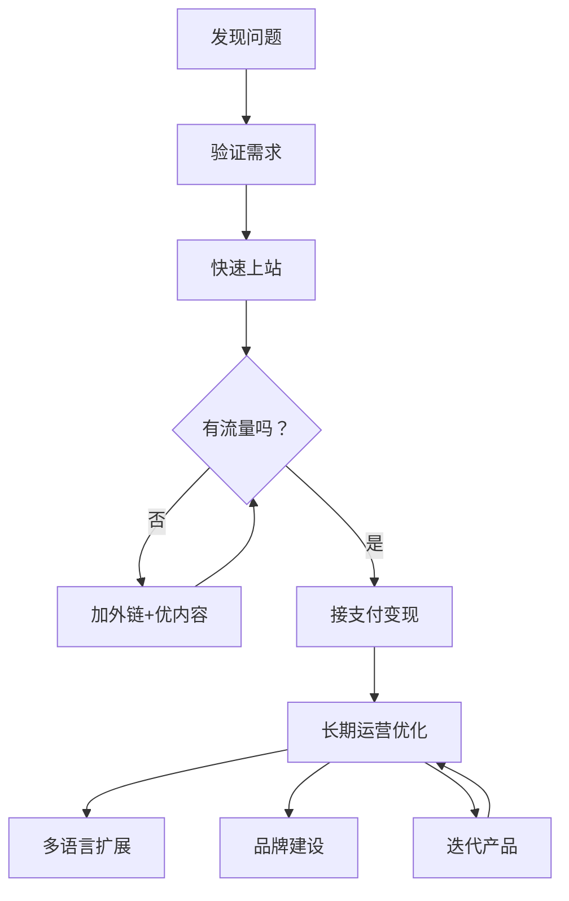

# 补充课20：线下聚会精华

> 本课整理了哥飞社群在北京、上海、深圳三地线下聚会的演讲精华，从21场演讲中提取最具教学价值和可操作性的知识点。

[[0002-what-is-ai-tool-site|第02课：什么是出海AI工具站]]
[[0009-seo-fundamentals|第09课：谷歌SEO基础与生态]]
[[0012-monetize|第12课：流量变现与案例分析]]

---

## 北京聚会

### 1. 开场介绍 —— 哥飞

**演讲者：** 哥飞

**核心观点：** 谷歌生态是出海做工具站的根本基础，理解了谷歌的流量分发逻辑，就能理解为什么出海比做国内站更容易成功。

**具体做法与洞察：**
1. **谷歌 vs 百度：** 谷歌通过算法保证搜索结果与用户意图匹配，形成搜索引擎-站长-用户的三方共赢生态。最快48小时内新站即可获得流量，而百度因自建产品矩阵（百度知道、百科、贴吧等）占据了搜索结果页，个人站长难以获得流量。
2. **内容农场警示：** 用AI滥发低质内容也许短期能骗过谷歌算法，但长期一定会被K掉。要提供真正的用户价值。
3. **个人经历：** 哥飞从2007年开始做SEO，经历过影视站、图片站、iOS代码库网站（code4app.com）等不同阶段，最终聚焦出海AI工具站。

> [!TIP] 谷歌的慷慨在于：你帮它满足了搜索用户，它就免费给你流量。这是国内搜索引擎无法比拟的。

---

### 2. Clara —— 出海一年：小白如何升级打怪

**演讲者：** Clara（大厂程序员，业余做AI工具站，一年后副业收入超月薪）

**核心观点：** 听话照做 + 快速上站 + 持续学习 = 从零到一的破局路径。作为非前端程序员，通过GPT辅助写了十个网站，跑通了从建站到变现的全流程。

**具体做法与洞察：**
1. **听话照做：** 不胡思乱想，直接按照哥飞社群的方法论执行——不做单页、加How to Use页面、引导用户评价、加Product Hunt等导航站外链。
2. **心词选择：** 每天都有新词出现，做法是加快上站速度（从5小时缩减到40分钟），多上站增加成功概率。优先选有技术性、利于社交传播、真正帮某群体解决问题的词。
3. **变现验证：** MVP比完美更重要。先用iframe套壳快速验证用户付费意愿，等用户付费了再逐步优化功能。不需要等产品完善再上线付费功能。
4. **定价策略：** 成本定价 vs 价值定价。如果是"first one"或"only one"，应使用价值定价——用户愿意为功能和效果付费，而不是为好看的样式付费。
5. **外链策略：** 坚持提交Product Hunt，因为很多AI导航站会从PH抓取内容，自动增加外链。在PH的review页面写关键词密度高的评论，也能获得谷歌排名。

> [!WARNING] 不要幻想"产品够好就会自动获得流量"。外链建设是必须做的功课，初期即使再麻烦也要坚持。

---

### 3. Henry —— AI工具站：从潜水到听懂

**演讲者：** Henry（AI工具出海创业者）

**核心观点：** SEO是一个"简单系统"——你按规律认真干活，就能获得相应回报。核心是找到关键词的"树状结构"，从三级词开始打。

**具体做法与洞察：**
1. **简单系统 vs 复杂系统：** SEO是内容运营的活，只要找到规律、认真执行，就能得到线性回报。这是跟着哥飞方法论做事的底层信心来源。
2. **关键词树状结构：** 从三级词开始打——足够小到你用单个页面就能拿下，又足够大到有可观的搜索量。三级词打下来后，横向扩展更多三级词，再向上打二级词。
3. **内容即价值：** 谷歌的核心原则是"helpful, reliable, people first"。你的内容必须对访问者有用，最大化用户的"信息获得感"——让用户在看完你的内容后觉得自己懂得更多了。
4. **每天30分钟外链：** 即使不知道因果关系，也坚持每天做30分钟外链提交。量变引起质变。
5. **学习官方文档：** 谷歌官方的SEO文档比任何二手资料都重要，反复看两三遍，结合实践才能真正理解。

> [!EXAMPLE] Toolify.ai 和 HIX.AI 是两个值得反复研究的标杆网站。它们不仅在内容上做得好，还提供了增量信息（如流量排行榜、收入估算），这就是"信息获得感"的体现。

---

### 4. Ask嘉宾Anything —— 哥飞问答

**演讲者：** 哥飞

**核心观点：** 从免费到付费的转化、多语言策略、品牌词占领、产品形态选择。

**具体做法与洞察：**
1. **免费到付费：** 提供免费试用次数来增加用户停留时间（有利于SEO排名），次数用完后引导付费。不要激进地把原本免费的核心功能加上水印，这会导致排名下降。
2. **多语言策略：** 用子目录（/zh/, /ja/）而非子域名做多语言。子域名在谷歌眼里是新网站，需要重新做"冷启动"，而子目录共享父域名的权重。
3. **品牌词占领：** 在所有社媒平台（Twitter、Facebook、LinkedIn、Instagram等）注册账号，链接回官网。搜索品牌词时，前五六个位置都是你自己的平台页面，防止竞争对手抢走品牌流量。
4. **产品形态进化：** 先用网站快速验证需求获取流量，之后可以做浏览器插件、手机APP等用户"不太会卸载"的产品形态来沉淀用户，同时APP的变现能力更强。

> [!QUESTION] 工具站页面比较少也能排到前面吗？
> 可以，但必须有文字内容让搜索引擎理解页面在做什么。SEO爬虫不会替你运行工具——它依赖你通过文字告诉它这个页面是关于什么的。如果你宣称的功能确实做到了，谷歌会逐步扩大给你的流量。

**自测题：**

点击展开

1. 为什么做多语言要用子目录而不是子域名？
2. 品牌词占领为什么重要？具体如何操作？
3. 免费策略和付费策略之间如何平衡才不会伤害SEO排名？

---

## 上海聚会

### 5. AJ —— AI创作者经济

**演讲者：** AJ（V2AGI社区创始人）

**核心观点：** AI时代最好的学习方式是开源共创。通过社区共学、挑战赛、共创项目等形式，让人人都能动手实践AI。

**具体做法与洞察：**
1. **社区共学机制：** 每周一次AI视频挑战赛、Prompt擂台赛、线下黑客松，让参与者通过实战快速成长。
2. **共创项目落地：** 如"离谱村"项目让小学生用AI创作、AI机器戏剧等，把AI创作与线下表演结合。
3. **商业化探索：** 用Midjourney给央视做海报、AI视频接各地文旅的单子——AI创作做优质了，作品自己会说话，容易被看见。

> [!TIP] 热爱是最好的驱动力。AI降低了创作门槛，有想法就能动手做，不需要先学会乐器才能做音乐、不需要先学画画才能做设计。

---

### 6. Andy —— 不写一行代码如何2小时快速上站

**演讲者：** Andy（前产品经理，三个月上30个站）

**核心观点：** WordPress + 正确插件组合 = 无代码快速上站。关键是找到每个环节最优秀的插件，而不需要自己写代码。

**具体做法与洞察：**
1. **WordPress建站公式：** 找对主题（Kadence/Astra/GeneratePress）+ 找对页面构建器（Elementor）+ 找对SEO插件（RankMath）+ 找对缓存插件 = 2小时上线一个专业站。
2. **iframe大法做工具站：** 通过Elementor的HTML组件嵌入Hugging Face Space或Dify的iframe，无需代码即可做出AI工具交互页面。
3. **多语言插件（TranslatePress）：** 用DeepL API自动翻译，支持前15大人口国家的语言，瞬间把流量放大几倍。
4. **速度优化：** WordPress被诟病慢，但通过图片WebP格式转换、Litespeed Cache/WP Rocket缓存插件、CDN配置，可以达到Google PageSpeed 100分。
5. **防坑指南：** 关闭插件自动更新，兼容性问题可能导致网站打不开。稳定后的网站一年内不要轻易升级插件版本。

> [!WARNING] 如果你的网站突然打不开了，先检查是不是插件自动更新导致的兼容性问题。插件自动更新一定要关闭。

**自测题：**

点击展开

1. WordPress上站最推荐的三款主题分别适合什么类型的用户？
2. 为什么选择Elementor Pro作为页面构建器？它的核心优势是什么？
3. 做多语言时为什么推荐TranslatePress + DeepL的组合？

---

### 7. Banbri —— 出海小白赚到第一个$1000的故事

**演讲者：** Banbri（前前端开发工程师，半年副业收入超主业）

**核心观点：** 当不知道做什么的时候，做一些对他人有价值的事情，会有意外的幸运。通过跟踪Hugging Face热门Space，用iframe套壳快速追热点。

**具体做法与洞察：**
1. **发现热点的公式：** 关注Hugging Face的热门Space榜单 + Google Trends验证搜索热度 = 发现下一个赚钱机会。Banbri在2023年9月发现了Illusion Diffusion这个Space在一天内登上榜首。
2. **假期即是战机：** 国庆假期别人出去玩，他在家上站。热点不等人，假期的空档期是追热点的黄金时间。
3. **竞争壁垒：** 即使遇到强大的竞争对手（如Jaggar AI的网站作者），只要你的网站能提供实际工具交互（iframe嵌入），而对手只能做内容介绍页，你就有优势。
4. **尽早接支付：** 登录和支付要尽早跑通，因为你无法预测网站哪天突然爆发。如果爆发了才去接支付，会损失大量收入。
5. **按国家差异化定价：** 土耳其等发展中国家用户购买力较低，通过IP判断用户所在国家并给予不同定价，显著提升了转化率和总收入。

> [!EXAMPLE] Banbri在流量爆发那天站在东方明珠上感慨"会当凌绝顶"——这是每个出海人都值得体验的时刻。关键是，你要先开始。

---

### 8. BingNi —— 一个日入两千美金网站的完整复盘 （重点）

**演讲者：** BingNi（前大厂程序员）

**核心观点：** 发现热点词 → 快速上线 → 接支付 → 赚钱，四步可以在一周内完成。热词的生命周期虽短（约半个月），但对新人来说这是积累信心和经验的最佳路径。

**具体做法与洞察：**
1. **发现词的来源：** 关注Hugging Face和Replicate上的热门模型 + Google Trends看趋势。BingNi通过关注Replicate官方人员FOFR的Twitter发现了FaceToMany这个模型。
2. **Google Trends技巧：** 用已知搜索量的词（如GPTS）与目标词对比，快速估算目标词的搜索量级。Google Trends下方的"相关搜索"中，选择最近7天可以看到大量飙升词汇。
3. **UI模板+拼装代码：** 用Preline UI模板 + 从开源项目复制登录支付代码拼装，当天上线，第五天才上线登录支付。MVP精神——先上线再完善。
4. **敢定高价：** FaceToMany这类用户目的明确、付费意愿强的工具，定价可以高一些。测试表明从$7.9降到$5.9后，流量不变但收益反而下降。
5. **支付防封：** Stripe需要注意开启3DS验证、设置反欺诈规则防止黑卡盗刷。大量中文名用户付款可能会触发风控，需要开通微信/支付宝收款渠道。

> [!IMPORTANT] 对新人来说，追热点词有两个核心价值：一是增强信心（获得流量和第一笔付费的正反馈），二是积累经验（实操和想象完全不同）。先上车，再谈长期稳定。

---

### 9. Heaven —— 如何用AI做SEO

**演讲者：** Heaven（阿里国际AI产品海外推广负责人）

**核心观点：** AI做SEO是work的，前提是内容要对用户有帮助。谷歌关注内容的新鲜度和可信度，AI应辅助而非替代人工质量把控。

**具体做法与洞察：**
1. **AI辅助SEO的可行场景：** 关键词调研、博客内容生成（输入关键词和类目）、Meta参数优化、图片优化命名、内链建设等。
2. **SEO的长期价值：** 对于任何网站，自然搜索流量的占比都不容忽视。SEO是一项长期内容战略。
3. **关键词策略：** 关键词的语义相关性、搜索意图匹配、内容质量是排名提升的核心要素。

---

### 10. Light —— flomo的PMF实践和思考

**演讲者：** Light（flomo/幕布联合创始人）

**核心观点：** 找到Product Market Fit之前，先找到Passion Market Fit。不要先造锤子再找钉子——先思考市场，再思考产品。做减法是一种被低估的创新方法。

**具体做法与洞察：**
1. **选择市场的两个标准：** 群雄割据（没有一家独大，新进入者有机会）+ 千年需求（需求会长期存在，可以持续收租）。即使单位回报不高，乘以超长的时间维度，总回报也非常可观。
2. **减法的力量：** flomo主动砍掉了大部分格式支持，只做"编辑器最弱的笔记软件"。正因为足够简单，才能在微信里直接记录、才能在桌面上快速回顾——这是印象笔记等复杂笔记软件做不到的。
3. **极致的快：** 上付费会员计划时，大部分付费功能还是"期货"（还没开发），先验证用户付费意愿。用现成的支付模块（如maccms），不自己开发。
4. **增长飞轮：** flomo APP + 微信公众号互相促进。APP的特色功能绑定微信，用户会关注公众号；公众号推送优质内容，用户更高频使用APP并分享给朋友。
5. **社会价值与商业回报：** 为社会创造10块钱价值，拿1-5块钱回报——这样的产品会被社会接受，可持续存在。

> [!TIP] "如果你不为你的第一个版本感到羞愧，一定是发布得太晚了。" —— Reid Hoffman（LinkedIn创始人）

**自测题：**

点击展开

1. PMF的顺序为什么应该是Market → Product → Fit，而不是反过来？
2. flomo做"减法"砍掉格式支持，为什么反而成了核心竞争力？
3. 如何设计一个"为社会创造价值大于你收取回报"的商业机制？

---

### 11. idoubi —— 独立出海，如何提升单兵作战能力

**演讲者：** idoubi（前腾讯开发，独立开发者）

**核心观点：** 单兵作战需要六边形能力模型——产品设计、界面美化、开发、运营增长、推广、商业化变现。核心SOP：确定做什么 → 取名 → 快速开发 → 上线 → 推广 → 数据分析 → 迭代优化。

**具体做法与洞察：**
1. **取名策略：** 用独立品牌词而非SEO友好词。品牌词在谷歌和社交媒体上更容易建立认知，虽然自然搜索难度大一些，但靠主动推广（Product Hunt、Twitter）同样能启动。
2. **技术去魅：** 80%的AI应用产品没有技术门槛。不要被别人的炫酷展示吓到，了解底层逻辑（如RAG）后你会发现都能做。
3. **个人IP建设：** 打造一个鲜明的个人标签（如"写代码最快的独立开发者"），通过持续的分享（技术文章、播客、公开分享）建立行业影响力，有利于产品增长。
4. **长期主义：** 追热点的流量三四个月后会下降，如果做的是持续需求，坚持长期主义才能持续增长。致敬（对标成功产品）+ 创新（差异化）+ 突破（技术难关）+ 坚持。

> [!WARNING] idoubi坦诚分享：独立出海前8个月，每月收入只有800多美元，但成本每月3000-4000美元。他相信长期主义——"800多块，10个站就8000多块"。

---

### 12. 哥飞 —— 出海赚美元，养网站防老

**演讲者：** 哥飞

**核心观点：** 做网站能超越周期，最老的网站从2012年运营至今。每做一个网站就是种一棵果树，果园里的树越来越多，收入就越来越稳定。

**具体做法与洞察：**
1. **为什么做AI工具站：** 工具站直接提供功能价值，用户付费用包月/按次，变现效率远高于内容站。AI每天产生新词，竞争少，市场已被ChatGPT教育好（用户知道AI工具需要付费）。
2. **找需求的方法：**
   - 抄作业：看Toolify的流量/收入排行榜，分析每个工具的关键词，专门做一个站优化这个关键词。
   - 用Indie Hackers验证收入榜单，分析域名流量和关键词。
   - 跟踪Stripe的导入流量——从网站跳到Stripe收银台的流量意味着订单产生。
   - 用Google Keyword Planner的"关键词商机"功能，选择210个行业中的某一个，筛选"新发现"关键词，可以看到当月暴增的新词。
3. **老词 vs 新词策略：** 老词需要2-3个月做扎实内容；新词快就是优势——第一个上线的站做到60分就能排到前面，后面进来的要做到80分才行。

> [!TIP] 工具站 vs 内容站：同样的流量，用户付费变现可能是广告变现的10倍。核心是要让用户愿意为功能付费。

---

### 13. 郭晓东 —— 利用Amplify三分钟开发AWS全栈应用

**演讲者：** 郭晓东（AWS解决方案架构师）

**核心观点：** AWS Amplify帮助前端开发者快速构建满足生产环境要求的全栈应用，无需关心底层基础设施配置。

**具体做法与洞察：**
1. **全栈开发的痛点：** 云上的全栈开发涉及安全、性能、弹性扩缩容等非功能性需求，这些与业务代码无关但必须处理。Amplify把这些复杂性封装起来。
2. **Amplify三大支柱：**
   - **托管（Hosting）：** CDN部署，全球访问快速。
   - **后端（Backend）：** 通过GraphQL或REST API快速连接数据库、存储、Lambda函数。
   - **DevOps：** CI/CD自动部署，从Figma设计稿直接生成代码。
3. **对独立开发者的价值：** 一键配置认证（Auth）、API、存储，无需手动配置IAM角色、安全组等基础设施。

---

## 深圳聚会

### 14. Blank —— 以AITDK为例聊如何基于需求开发产品

**演讲者：** Blank（前腾讯，独立开发者，AITDK作者）

**核心观点：** 哪里让你难受、让你痛，哪里就是产品机会。不要花半年一年做一个完美产品，先解决自己的痛点，如果别人也有同样痛点，产品就不缺用户。

**具体做法与洞察：**
1. **从痛点出发：** 分析竞争对手网站时需要在SimilarWeb、WooRank、Ahrefs等多个工具之间切换，效率极低。Blank把这些功能聚合到AITDK一个浏览器插件中，解决了自己的痛点。
2. **MVP精神：** 前期不要在设计、开发上花太多时间。先上线一个能用的版本，验证需求。最可怕的不是收到负面反馈，而是产品上线后没有任何反馈。
3. **复利思维：** 去社区和周刊发帖推广 → 直接触达用户 + 获得高权重外链。在GitHub上持续分享，每天发几条，坚持一个月、一年，量变引起质变。
4. **上站速度迭代：** 从最初几周上一个站 → 用现成模板几天一个 → 花钱买付费模板一天一个 → 用AI生成半天一个 → 最终目标是10分钟一个站。

> [!TIP] 当完成一件事需要很多步时，效率一定很低。如果有人能帮你把断点接上，一定不缺用户。痛点越痛，市场空间越大。

---

### 15. Iris —— 一个搜索引擎出海人的观察和思考

**演讲者：** Iris（阿里国际SEO专家，12年搜索引擎从业经验）

**核心观点：** SEO与SEM（付费搜索）结合能带来1+1>2的效果。关键词的选取要经过"有没有人搜、搜了会不会点、点了有没有转化"三层筛选。

**具体做法与洞察：**
1. **SEO+SEM协同效应：** 网站排名第一时，能为PPC广告带来额外50%以上的点击率。排名2-4位能为PPC带来额外82%点击率。SEO和SEM共同占据搜索结果页，品牌印象分大幅提升。
2. **关键词三层筛选：**
   - 启动阶段：用语义相关性、搜索难度、月搜索量做默认质量评分。
   - 优化阶段：加入用户互动数据——跳出率、停留时长、点击率、历史转化率。
3. **内容质量评估：** 启动阶段参考EEAT（经验、专业、权威、信任）标准 + Google已收录且有排名的内容 + 可读性评估。优化阶段通过GA和GSC追踪每个URL的用户互动数据。
4. **案例参考：** Definer每月自然搜索流量160万次，相当于PPC媒体价值370万美元。Grammarly 90.7%流量来自11.2%的页面（主要是博客页和免费工具页）。

> [!WARNING] 高跳出率意味着关键词带来的流量与网站内容不匹配。如果是SEO还好，如果是付费广告，每一个点击都在烧钱。

---

### 16. Memory —— 出海业务合规建设与支付经验总结

**演讲者：** Memory（微信支付合规专家，微信官方授权专家）

**核心观点：** 合规不是制造焦虑，而是防范未来的风险。花较少的成本避免未来较大的损失。

**具体做法与洞察：**
1. **出海面临的主要风险：** 当地宗教习俗、海外知识产权、海外税务、当地法律法规。建议阅读商务部《对外投资合作国别（地区）指南》（每年更新）。
2. **常见误区：**
   - "别人都这么做"——你没有看到别人背后做的合规工作。
   - "我业务量小没事"——侥幸心理是最危险的。
   - 不要做多级分销，中国法律对三级以上分销有严格限制。
3. **支付接入经验：**
   - 单一地区优先考虑本地支付机构，手续费更低。
   - 不要在测试环境用小额测试卡，会被风控系统处罚且很难申诉。
   - 不同项目用不同商户号收款，品类不对也会触发风控。
   - 在网站增加自动回复客服功能，降低chargeback投诉率。
   - 接入3DS验证（Visa/Mastercard联合推出的在线验证能力）降低盗刷风险。
4. **维权/被诉：** 遇到支付账号被封，要积极申诉。不要只依赖单一支付渠道——准备"备用"支付通道。
5. **跨境网络接入：** 建议使用合法的跨境专线（如SD-WAN加速器），不要使用未经审批的VPS搭建方式接入国际互联网。

> [!WARNING] 准备一个备用支付通道。你不知道Stripe哪一天会封掉你的账号——它可能提前通知，也可能不会。

---

### 17. 刘博 —— RPA+AI如何赋能海外百万用户

**演讲人：** 刘博（Octalus创始人，RPA+AI产品服务200万海外用户）

**核心观点：** RPA（机器人流程自动化）+ AI = 帮助海外中小企业和个人开发者实现业务自动化。海外用户喜欢"小而美"的工具，一个简单的自动化模板月入2万美金很常见。

**具体做法与洞察：**
1. **RPA的核心价值：** 模拟人操作电脑UI，实现跨系统数据流转的自动化。比传统API接口方式更灵活——很多网站没有标准化API。
2. **AI＋RPA的组合拳：** RPA获取数据 → AI分析数据 → RPA把分析结果写入Google Sheets → 再触发下一步动作。各个环节都可以接入AI能。
3. **模板市场机会：** 一个简单的"采集Google商家信息"的模板，月收入可以达到2万美金。海外用户喜欢这类价格低、即插即用的自动化工具。
4. **生态平台模式：** 平台提供200万用户，开发者上传自动化工具到市场，平台抽取30%分成，开发者获得70%稳定被动收入。

> [!TIP] 中小企业不会提出复杂需求。一个简单的自动化工具解决一个具体问题，对这个人有用，对另一个人也有用——可复制的产品化思路。

---

### 18. 哥飞 —— SEO友好的AI原生CMS的思考和实践

**演讲者：** 哥飞

**核心观点：** AI原生CMS不是给老系统加AI能，而是完全基于AI能重新设计网站架构——所有内容由AI生成、所有环节自动化串联、一键发布。

**具体做法与洞察：**
1. **四层架构：**
   - **Page层：** 每个人工智能产品/模型/名词都有一个独立的主页。
   - **Section层：** 每个Page由多个Section组成（简介、功能、价格、FAQ、使用步骤等）结构化内容。
   - **Content层：** AI基于参考资料生成Markdown格式内容，预渲染为HTML。
   - **Tag层：** 标签串联所有Page和Section，自动生成聚合页面。
2. **AI原生7个要点：**
   - 爬虫自动发现新名词并入库。
   - 自动抓取参考资料（解决AI幻觉问题）。
   - 每个Section有独立提示词。
   - 天然支持多语言（用不同语言的提示词 + 参考资料）。
   - 自动提取有搜索量的关键词作为标签。
   - 基于标签自动生聚合页面。
   - 一键生成、一键发布。
3. **实践结果：** WOY.AI上线两个月，每天约1K访问量，50%来自谷歌有机搜索。DR达到58（对新站来说已不错）。在多个关键词上排名谷歌前二。

> [!QUESTION] 什么是真正的AI原生CMS？
> 不是给旧CMS加上AI写文章的功能，而是从数据库设计到内容生成到多语言发布，所有环节都围绕AI能力来设计。

---

### 19. 壹树 —— 垂直平台下的"小"产品如何起步

**演讲者：** 壹树（全职独立出海5年，专注垂直平台生态的小产品）

**核心观点：** 在大平台的生态里做小产品，找问题比找创意更重要。把大产品拆成小功能、把A平台的好产品迁移到B平台，是两条被验证过的成功路径。

**具体做法与洞察：**
1. **发现机会的方法：** 平台生态里的应用市场（如Figma插件市场、Google Workspace市场、Shopify应用市场等）会有分类排行榜。把排名靠前的产品都看一遍，就知道用户的问题在哪里。
2. **两种成功模式：**
   - **迁移：** 把Google Workspace里的一个成功产品迁移到同类型的另一平台上。
   - **拆分：** 把一个大产品拆成解决单一问题的小产品，更聚焦、更易起步。
3. **低门槛起步：** 起步阶段只需要做好三件事：平台内部搜索优化、平台内部推荐位、平台论坛/群组发帖推广。做到这些，月入1万美金并不难。
4. **成功案例：** Depesion从Google Workspace迁移到Atlassian市场，每月收入23K美金。Figma上一个小翻译插件月收15美金/人（比Figma自带的15美金还贵）。

> [!TIP] 垂直平台的天花板：对个人来说，做到一年50-100万美金是有机会的。关键在于——先找到用户真正的问题，而不是先想"我有一个绝妙的创意"。

---

### 20. 袁仕林 —— 如何用AI做内容营销

**演讲者：** 袁仕林（乐规科技，AI+内容营销实践者）

**核心观点：** AI进行SEO内容营销的核心流程：行业数据调研 → 关键词调研 → 多国关键词优化 → AI辅助写作 → AI智能客服 → 邮件自动营销。

**具体做法与洞察：**
1. **关键词调研先行：** 用Semrus等工具分析关键词是否有搜索量、竞争激烈程度。做多国市场时，每个国家/语言独立调研关键词。
2. **AI内容生成三要素：** 输入关键词 → 选择目标市场（国家/语言） → 系统分析竞争对手URL → AI生成包含H1-H4结构的内容。标题和Meta Description必须包含核心关键词。
3. **避免被谷歌惩罚：** Google在2024年4月更新中清洗了大量纯AI生成的内容。关键是要让AI内容有"人工把控"——检查内容架构、关键词分布、加入人工编辑修改。
4. **自动化营销闭环：** 博文中的AI客服引导用户留下邮箱 → 邮件自动化追踪 → 转化。两个多月邮件挽回损失约1万多（数据）。

> [!WARNING] AI生成内容被谷歌惩罚的边界在于：是否有人工质量把控环节。全自动批量的AI内容农场一定会被惩罚。

---

### 21. 阿彪 —— 谈谈海量SEO页面以及最近的一些收获

**演讲者：** 阿彪（GPSAI创始人，5年以上出海经验，做过千万级页面的大型SEO网站）

**核心观点：** 做海量SEO页面，先别自己想，先看行业竞争对手的结构。网站结构的规划就像盖房子——先想清楚哪里放卧室、哪里放客厅。

**具体做法与洞察：**
1. **学习竞争对手结构的工具：** Ahrefs的Site Explorer + Screaming Frog爬虫。分析竞争对手的URL结构、文件夹命名规则、分类方法。
2. **页面角色分工：**
   - **海量页面：** 不刻意做外链，用大量高质量内容覆盖长尾关键词。
   - **中间页面：** 方便谷歌爬虫顺着链接爬取，本身不做排名。
   - **排名页面：** 重点做外链和内链优化。
3. **内链原则：**
   - 同层级聚合页面互给内链。
   - 向上的父级页面给子页面内链，向下的子页面给父页面内链。
   - 重要页面要给更多内链（二八法则——80%流量集中在20%的页面上）。
4. **"炒豆子"机制：** 让有限的推荐位不断轮换曝光不同的内容页面，让每个页面都有被"炒"到的机会。
5. **多路线径：** 重要的内容要通过多条路径让谷歌发现（如A-Z索引 + 分类导航 + 热门搜索 + 相关推荐）。
6. **GSC监控：** 定期检查Google Search Console的错误报告。用Screning Frog在测试环境和正式环境都扫一遍，避免上线后出现HTTPS错误、404等影响爬取的问题。
7. **创业者忠告：**
   - 减少单站点依赖，最少做5个站。
   - 减少单一流量渠道依赖，SEO之外也要布局广告和社交媒体。
   - 少学"以后要用"的东西，优先学现在就要用的。
   - 减少花在省钱上的时间——钱是赚出来的，不是省出来的。

> [!IMPORTANT] "你要相信你已经长大了，不再是那个被小木桩拴住的小象。你可以挣脱只做小生意的思想，挑战更大的事情。"

---

## 总结

这次三城线下聚会的21场演讲，精华可以归纳为一条清晰的出海工具站从0到1的路径：

### 核心公式

**出海工具站成功 = 发现需求 × 快速执行 × SEO获客 × 付费变×

其中：
- **发现需求** = 盯Hugging Face/Replicate热点 + Google Trends验证 + Stripe流量跟踪
- **快速执行** = 10分钟-2小时上站（Wordpress/iframe/模板/AI生成）
- **SEO获客** = 内容价值 + 外链建设 + 用户体验（停留时长）
- **付费变现** = MVP定价 + 尽早接支付 + 多语言扩展收入

### 下一步行动方向

1. **新手期（0-3个月）：** 注册域名，用Wordpress+iframe套壳，追1-2个热点词，跑通建站到变现的全流程，目标是赚到第一美金。
2. **成长期（3-12个月）：** 保持每月3-5个站的上站节奏。开始做外链矩阵（导航站+社媒+客座博客），优化网站内容质量。目标是月收入1000美金。
3. **成熟期（12个月+）：** 筛选表现好的站持续投入，开始做多语言版本，建立品牌阵。减少对单一站点/单一流量渠道的依赖，目标是月收入10000美金以上。

### 自测题

点击展开所有自测题

**基础题：**
1. 为什么说谷歌生态比百度更适合个人站长做网站？
2. 什么是"心词"策略？心词和老词的上站策略有什么不同？
4. 做多语言为什么推荐子目录（/zh/）而不是子域名（h.website.com）？

**进阶题：**
4. 如何用Stripe的导入流量来发现正在赚钱的产品？
5. 什么是"关键词树状结构"？为什么建议从三级词开始打？
6. SEO和SEM（付费搜索）为什么能产生协同效应？

**实战题：**
7. 假设你在Hugging Face上发现了一个很有潜力的AI模型Space，请写出从发现到变现的完整行动步骤。
8. 你的网站日UV从100涨到了1000，但付费转化率很低。你会从哪几个维度分析问题并优化？
9. 支付账号突然被Stripe封了，你会怎么做？（请列出至少3个应急步骤）

**开放题：**
10. 你在哪个细分领域有独特的知识或经验？这个领域有什么"让用户痛苦"的问题？如果把这个问题变成一个小工具，你觉得会有人付费吗？

