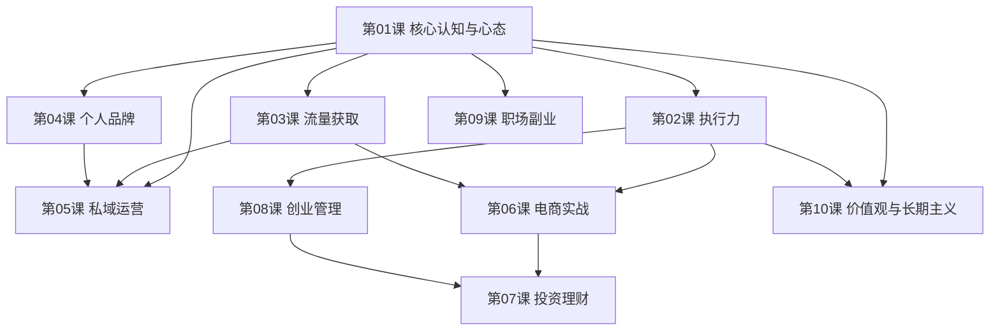

# 课程地图

## 学习路径建议

### 路径A：快速上手（适合新手）
第01课 → 第02课 → 第09课 → 第10课

### 路径B：创业方向（适合创业者）
第01课 → 第03课 → 第05课 → 第06课 → 第08课

### 路径C：投资方向（适合有资金者）
第01课 → 第07课 → 第10课

### 路径D：个人品牌方向（适合内容创作者）
第01课 → 第04课 → 第03课 → 第05课 → 第02课

## 各课概要

| 课号 | 主题 | 核心问题 | 来源人数 |
|------|------|----------|----------|
| 01 | 核心认知与心态 | 赚钱的本质是什么？ | 30+ |
| 02 | 执行力 | 如何从想到做到？ | 25+ |
| 03 | 流量获取与变现 | 用户从哪里来？ | 20+ |
| 04 | 个人品牌与内容创业 | 如何打造个人IP？ | 20+ |
| 05 | 私域运营与社群经济 | 如何经营用户关系？ | 15+ |
| 06 | 电商与跨境电商 | 如何线上卖货？ | 15+ |
| 07 | 投资理财 | 如何让钱生钱？ | 10+ |
| 08 | 创业实战与管理 | 如何从0到1？ | 20+ |
| 09 | 职场与副业 | 如何两条腿走路？ | 10+ |
| 10 | 价值观与长期主义 | 如何走得更远？ | 25+ |