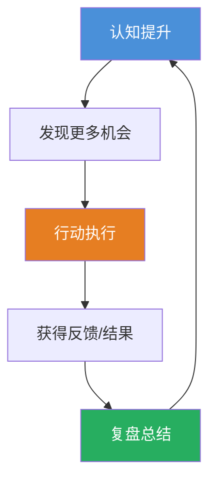
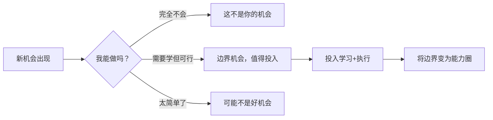
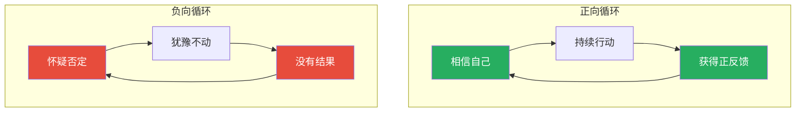

# 第01课：核心认知与心态

## 学习目标

完成本课后，你将能够：

- 理解赚钱的本质是认知变现这一核心原理
- 建立属于自己的机会观，学会辨别真伪机会
- 掌握打破信息差、提升认知的具体方法
- 培养耐心与信心并重的赚钱心态
- 明确开始赚钱的第一步应该做什么

---

## 一、赚钱的本质：认知的变现

### 1.1 认知决定收入上限

「赚钱是认知的变现，也是人品的变现。」——charlie

这句话是整门课程的基石。你的收入永远不会超过你的认知水平，即使靠运气赚到了超出认知的钱，市场也会有无数种方式把它收回去。

「每个人只能赚到认知之内的钱。」——boyzcl

这解释了为什么同样一个机会摆在面前，有的人看到了金山，有的人却视而不见。认知决定了你能"看见"什么机会，而执行力决定了你是否能"抓住"它。

> [!QUOTE] 光合的观点
> 创业的目的是解决社会问题，赚钱是解决问题的正反馈。在足够细分的领域进行压倒性的时间投入。

光合将赚钱从一个"索取"行为重新定义为"解决问题获得的正反馈"。这个视角转换极为重要——当你不再盯着钱，而是盯着用户的问题时，钱反而会作为副产品自然到来。

### 1.2 交易是赚钱的唯一途径

「只有通过交易才能赚钱。」——boyzcl

仔细想想，所有的商业模式最终都归结为一个动作：交易。你提供价值，对方支付报酬。无论是打工（用时间交易工资）、创业（用产品交易收入）还是投资（用资本交易收益），本质都是交易。

> [!TIP]
> 问自己一个问题：**我的技能、产品或者服务，能解决谁的什么问题？** 如果你能清晰回答这个问题，你就找到了交易的入口。

### 1.3 认知+执行力的乘数效应

「认知和执行力是鸡和蛋的关系。」——西琳君

认知和执行力不是先有谁的问题，它们是共生关系：

认知指导行动，行动反馈又反过来提升认知。打破这个循环的任何一环，都会让赚钱变成小概率事件。

---

## 二、机会观：只抓属于自己的机会

### 2.1 到处都是机会，但属于你的才是真的

「每个阶段都有很多机会，但只有属于你的机会才叫机会。」——亦仁

这是最容易被忽视的教训。每天都有新风口、新赛道、新红利，但如果你不具备抓住它的资源、能力和认知，它对你来说就不是机会，甚至可能是陷阱。

「处处都是机会，抓住一两个就够了。」——晓群

> [!WARNING]
> **机会焦虑是最贵的情绪税。** 看到别人赚钱就焦虑，一焦虑就乱动，乱动就会亏钱。专注做好一两件事，比追逐十个风口更有效。

### 2.2 独立思考：警惕主流观点

「对主流观点保持警惕，独立思考。」——亦仁

当所有人都告诉你某件事"必须做"或者"是机会"的时候，恰恰需要你停下来想一想。群体的共识往往是风险最大的地方。

「回归行业本质，所有人都劝你做的事就别干了。」——黯灭

> [!QUESTION] 如何判断一个机会是否属于你？
> 问自己三个问题：① 我是否有相关经验或能力？② 我是否愿意在这个方向上投入至少6个月？③ 如果所有人都不知道我在做这件事，我还会做吗？
>
> 

> 
点击查看解析

>
> 这三个问题分别对应：能力匹配度、投入意愿度和内在动机。如果三个答案都是"是"，那这个机会大概率是值得你投入的真机会。如果第三个答案是"否"（你做这件事只是为了炫耀），那这个动机很难支撑你走过困难期。
> 

### 2.3 学会放弃：缺乏积累的"红利"不属于你

「永远也不缺乏红利，你也一直在错过。」——梁文斌

听起来很扎心，但这是事实。每个时代都有红利，但红利只属于有准备的人。与其焦虑"又错过了"，不如问问自己：下一个红利来临时，我准备好接住了吗？

「信心满满时往往不是真正的大机会。」——张五哥

真正的大机会往往在你能力边界附近，你会感到有些不安和不确定。而那些让你"信心爆棚"的机会，通常是因为你根本不了解其中的风险。

---

## 三、认知提升：打破信息差

### 3.1 信息差的本质

「圈子太小就不知道别人怎么赚钱。」——高智豪

赚钱的玩法有很多，但你不知道。这不是因为你笨，只是因为你在自己的信息茧房里。打破信息差最有效的方式就是——**破圈**。

「想要突破就必须破圈。」——家永

### 3.2 破圈的具体方法

- **付费进入高质量社群**：家永特别强调这一点。免费的圈子通常价值有限，付费社群天然筛选出了愿意投入的人。
- **找会赚钱的人做朋友**：李晨的建议朴实但有效。多和那些已经在赚钱的人交流，观察他们思考问题的方式。
- **找到对标范本**：「找到对标的范本缩短探索进程」——天枢。不要从零开始发明轮子，找到已经成功的人，研究他们的路径。

> [!TIP]
> **破圈行动清单：**
> 1. 列出你所在领域最优秀的5个人，关注他们的所有公开内容
> 2. 付费加入至少1个高质量社群（年费1000元以上）
> 3. 每月至少与1位比你收入高的人进行一次深度交流

### 3.3 认知的边界即赚钱的边界

「尽快跑到自己的认知边界。」——壹树

这意味着你要主动寻找那些让你感到"不太舒服"但可以够到的知识领域。你的认知边界每扩大一寸，赚钱的可能性就增加一分。

「认知不到位就不能发现赚钱的机会。」——天枢

这句话的另一种理解是：你看到的所有"别人的赚钱机会"，都是别人认知到位后的结果。提升认知，就是在给自己安装"机会探测器"。

> [!QUESTION] 如何知道自己当前的认知边界在哪里？
>
> 

> 
点击查看自测方法

>
> 列出三个你听说过但完全不知道如何操作的赚钱方式（比如跨境电商、知识付费、AI工具变现等）。这三种方式对应的领域，就是你当前认知边界之外的地方。选其中一个，花一个月时间从入门到初步实践，你的认知边界就拓宽了。
> 

>

---

## 四、必备心态：耐心与信心

### 4.1 勤则百弊皆除

「勤则百弊皆除。」——明白

这是最朴素的真理。很多问题看起来复杂，归根结底是"不够勤奋"。懒惰会放大一切问题，勤奋能解决大部分问题。

「立志——人若有志就会表现出乐观毅力勇气。」——明白

"志"是长期的方向感。没有志向的人，遇到困难就换方向，最后哪个方向都没走远。

### 4.2 算账思维：直面事实

「商业的本质是价值交换。」——大树

大树特别强调：要"去除自嗨直面事实"，并且"学会算账"。很多人做项目失败，不是因为不努力，而是因为从来不认真算账：

- 你的时间成本是多少？
- 你的获客成本是多少？
- 你的客单价和利润率是多少？

如果不算账，你就是在"假装创业"。

> [!WARNING]
> 赚钱的节奏很重要。——张五哥
>
> 不要因为一时没赚到钱就焦虑，也不要因为短期赚到钱就以为找到了永动机。每个行业都有自己的节奏，踏准节奏比盲目努力更重要。

### 4.3 周期与心态

「赚钱往往有周期性，心态特别重要。」——夜息

没有哪个行业能永远上涨。周期下行时，心态好的人能活下来并积累资源，等下一波周期来临时爆发；心态不好的人会在最低点割肉离场。

「相信是一种很强的能力。」——紫菜

相信自己能解决遇到的问题，相信持续行动会有结果，相信时间的力量——这种"相信"不是盲目的，而是基于对规律的认知。

「及时止损定期处理垃圾信息。」——紫菜

心态管理也包括信息管理。定期清理那些让你焦虑、让你分心的信息源，保持专注。

---

## 五、开始赚钱的第一步

### 5.1 先找到500个刚需用户

「500个刚需用户即可带来可观收入。」——壹树

不要一开始就想做几百万人的大生意。找到500个真正需要你产品\服务的人，服务好他们，收入就已经很可观了。

### 5.2 行动胜于规划

「行动胜于规划。」——壹树

> 先活下来是第一位。——洪坤

完美规划不如一次试错。快速验证你的想法是否可行，比花三个月写商业计划书更有价值。

### 5.3 快速试错，不要看不起小钱

「快速试错快速总结。」——小梅

「不要看不起小钱。」——小梅

很多人的问题是：小钱看不上，大钱赚不到。正确的姿态是：从小钱开始验证模式，跑通后放大量。

「没钱时尽量用时间换钱。」——小梅

用自己的时间去换取第一桶金，积累资本和经验，这是最稳妥的起步方式。

> [!TIP] **起步三步法**
> 1. **找需求**：你身边有没有人抱怨某个问题？那可能就是商机
> 2. **小测试**：不要投入太多，先用最小的成本验证解决方案
> 3. **快迭代**：根据反馈快速调整，不要等"完美版本"再推出

> [!QUESTION] 如果你现在一分钱都没有，第一步应该做什么？
>
> 

> 
点击查看答案

>
> 梳理你现有的技能和资源，找到一项你可以立即为他人提供的价值。比如你会做PPT、会剪辑视频、英语好、擅长整理信息等。把它变成一个"产品"（哪怕只是帮人做一份PPT收50元），先赚到第一笔钱。**赚钱的第一步不是"找到一个好项目"，而是"完成第一笔交易"。**
> 

>

---

## 要点回顾

1. **赚钱是认知的变现**：提升认知是提升收入上限的根本途径。认知+执行力形成正向循环。
2. **机会不在多，在于合适**：只有你能抓住的机会才是真的机会。专注比跟风更重要。
3. **破圈是提升认知的捷径**：付费进高质量社群，找对标范本，和赚钱的人做朋友。
4. **心态决定生死**：勤奋、算账、把握周期、保持信心。心态稳了，动作才不会变形。
5. **从小处着手**：服务好500个用户，快速试错，不要看不起小钱。完成第一笔交易比什么都重要。

---

## 下一步行动清单

- [ ] 写下你当前认知边界外的3个赚钱方式，选一个开始了解
- [ ] 找一个对标对象，分析他\她的赚钱路径
- [ ] 检查你当前的"信息源"，删除3个让你焦虑的无用信息源
- [ ] 算一笔账：你目前的时间价值是多少？你的核心业务毛利率多少？
- [ ] 开始第一笔小交易（不管金额大小），完成"从0到1"的第一步