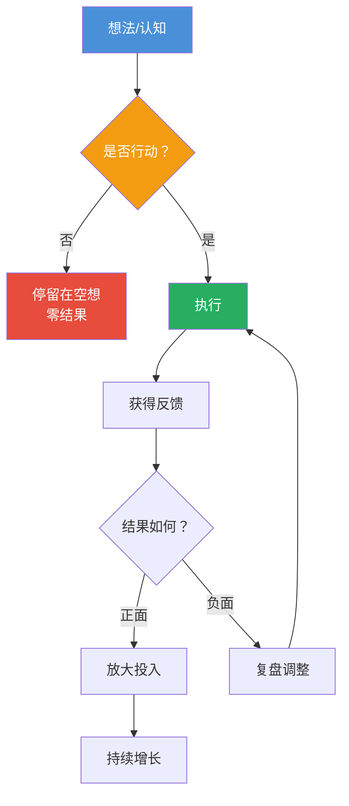
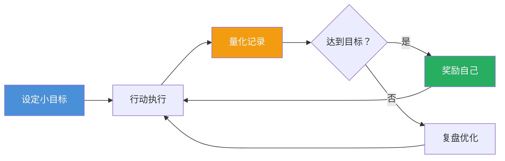

# 第02课：执行力——从想到到做到

## 学习目标

完成本课后，你将能够：

- 理解为什么执行力是人与人之间最大的差距
- 掌握快速试错、SOP化、MVP等行动方法论
- 学会做减法，在专注中提高效率
- 建立持续行动的正反馈机制
- 识别并避开常见的行动陷阱

---

## 一、为什么执行力是最大的差距

### 1.1 知道不等于做到

「看了什么内容要说自己会去做哪几件事。」——光合

这是光合对自己提出的要求。他把每一条输入都转化为具体的行动项。大多数人看完一篇文章、听完一门课，最大的收获是"感觉学到了"，然后就没有然后了。而执行力强的人会问自己：**我接下来要做什么？**

「知行合一是根本差距。」——光合

同一个项目，认知到位的人都能看懂。但最终赚到钱的是那个在别人还在犹豫时就动手的人。知和行之间的距离，是世界上最遥远的距离。

### 1.2 勤奋是最底层的能力

「勤奋是最重要的能力。」——明白

在赚钱这件事上，勤奋不是可选项，是入场券。你可以没有背景、没有资源、没有天赋，但只要够勤奋，你就能超过90%的人。因为大部分人连"每天稳定输出"都做不到。

> [!QUOTE]
> 「少看多想多做，躬身入局脚踏实地。」——北风
>
> 少看——减少无效信息的摄入；多想——深度思考而不是空想；多做——用行动验证想法。北风的六个字朴素但深刻。

### 1.3 没有行动，一切都是空谈

「没有行动一切都是空谈。」——Sin

「收入只是工作的副产品。」——Sin

这句话的意思是：不要把赚钱本身当做目标，而是把"做好事"当做目标。当你把注意力放在创造价值上，收入自然会来敲门。盯着钱做事情，往往反而赚不到钱。



---

## 二、行动的方法论

### 2.1 快速试错

「快速试错快速总结快速把握机会放大。」——小梅

小梅的"三快"方法论非常实用：

1. **快速试错**：用最小的成本测试想法是否可行
2. **快速总结**：不论成败，提取可复用的经验
3. **快速放大**：验证可行后，迅速加大投入

> 发现商机一边测试一边优化，不必等条件完备再开始。——路爷

路爷认为，完美条件永远不会到来。你等待的时间越长，竞争对手越多，窗口期越短。边测试边优化，比等到"条件成熟"再行动要有效的多。

### 2.2 SOP化：让成功可复制

「没有SOP的业务都是耍流氓。」——沐文

SOP（标准操作流程）是放大业务的杠杆。当你靠个人能力一天赚1000元时，你累死了也只有1000元。但如果你把这个流程SOP化，一个新手培训2小时也能做到同样效果，你就可以把这个业务放大10倍、100倍。

「形成SOP就可以无限放大。」——沐文

```mermaid
flowchart LR
    subgraph 阶段一【摸索期】
        A1[摸索尝试] --> A2[记录每一步]
        A2 --> A3[提炼可复制步骤]
    end
    
    subgraph 阶段二【SOP化】
        B1[撰写操作手册] --> B2[培训他人]
        B2 --> B3[标准化执行]
    end
    
    subgraph 阶段三【放大期】
        C1[批量复制] --> C2[规模效应]
        C2 --> C3[收入倍增]
    end
    
    A3 --> B1
    B3 --> C1
    
    style A2 fill:#F39C12,color:#fff
    style B1 fill:#4A90D9,color:#fff
    style C1 fill:#27AE60,color:#fff
```

### 2.3 MVP思维：小步快跑

「先跑通模式再谈投入。」——梁文斌

MVP（最小可行产品）思维的关键是：用最快的速度做出一个"能用但不完美"的产品，放到市场上测试。用户说"好"，证明方向对了；用户说"不好"，损失很小，换个方向继续试。

「尽快跑到自己的认知边界。」——壹树

结合MVP思维来看，这句话还有一层意思：不要等到"全部想明白"再行动。你的认知只有在行动中才能被验证和提升。跑起来，边界自然清楚。

### 2.4 先干再说

「先干再说。」——家蒙

家蒙的态度很简洁：不要花太多时间讨论和计划。很多问题只有干起来才会暴露，也只有干起来才能找到解决方法。

「看到项目大胆尝试，不管怎样都是赚的。」——汉勤

哪怕是失败，也赚到了经验和教训。正确的视角是：**从0到1不是零和博弈，做就有收获。**

> [!TIP]
> **五秒法则**：当你有一个想法时，在心里倒数5-4-3-2-1，然后立刻做第一个动作。不要给大脑找借口的时间。比如想学习新技能，立刻打开教程而不是先收藏；想联系潜在客户，立刻发消息而不是先纠结措辞。

> [!QUESTION] 你有一个项目想法，但不确定是否可行。应该先做什么？
>
> <details>
> <summary>点击查看MPV启动方案</summary>
>
> 不需要写BP（商业计划书），不需要做完整的APP，不需要备货。你需要做的是：① 找到3-5个潜在用户，描述你的方案并问他们是否愿意付费；② 如果有人说"愿意"，收钱并手工交付，验证商业模式；③ 验证通过后，再考虑产品化和放大。整个过程应该在一周内完成。
> </details>
>

---

## 三、专注：做减法比做加法难

### 3.1 少即是多

「尽可能专注做一件事情。」——孙策

「保持专注不要多线作战。」——戴宏民

这几乎是所有赚钱高手的共识：专注是稀缺能力。每个项目从启动到盈利都需要时间，同时做三个项目意味着你永远处于"启动"阶段，没有一个能走到"盈利"。

「用执行力干三个月再去想有的没的。」——晓群

给自己设定一个明确的专注期：3个月内只做一件事。不看新项目，不换方向，天塌下来也把这一个事情做到底。

### 3.2 项目本身没有高低等

「项目本身没有高低等。」——洪坤

很多人的不专注源于一种心态：总觉得"还有更好的项目"。这种心态让你永远在寻找，永远在错过。项目本身没有高低之分，能把一个项目做深做透的人才是高手。

### 3.3 如何做减法

> [!WARNING]
> **当手头有项目时不要再看新项目。** ——旺小哥
>
> 这会分散你的注意力和资源。规定自己只在完成当前项目目标后，才允许评估新机会。把手机上的新项目信息都收藏到一个文件夹里，定期再看。

> 每天起床先定当天的计划。——家蒙

专注不是靠意志力硬扛，而是靠系统。每天早上花5分钟确定当天最重要的三件事，优先完成它们。

---

## 四、如何保持持续行动

### 4.1 计划与复盘

「不断复盘不断推翻自己。」——晓群

复盘是持续行动的核心动力。每天晚上问自己三个问题：
- 今天做了什么？
- 效果如何？
- 明天怎么改进？

「慢就是快。」——家蒙

听起来矛盾，但这是真正的高手共识。当你追求"快"的时候，你会跳过必要的积累步骤，最后反而更慢。稳扎稳打地做好每一件小事，复利会带给你意想不到的加速度。

### 4.2 建立正反馈机制

保持行动需要正反馈，但早期的正反馈往往很微弱。这时你需要：

1. **设定小目标**：不要只盯着"月入10万"，设一个"今天加了10个好友"的小目标
2. **记录进展**：用数字记录你的行动量——发了多少条内容，联系了多少个客户
3. **奖励自己**：完成阶段性目标后给自己一个奖励



> 每天提醒自己要开放。——金马

开放意味着：接受新信息、接受反馈、接受自己可能错了。封闭的心态是持续行动的天敌。

---

## 五、常见行动陷阱

### 5.1 完美主义陷阱

「对自己有容错率，边做边修修补补。」——盗坤

完美主义者最大的问题不是标准高，而是**不动手**。盗坤的建议很务实：先做出来，再优化。没有人第一版就完美，所有优秀的产品都是迭代出来的。

### 5.2 多线作战陷阱

「世界上没有那么多快钱可挣。」——戴宏民

同时做多个项目的心态本质是"想赚快钱"。但快钱往往是陷阱。真正赚钱的事情需要时间积累，慢就是快。

> [!WARNING]
> **副业陷阱：就算副业机会再好也不要轻易辞职。** ——旺小哥
>
> 很多人做副业一有起色就辞职，结果辞职后压力陡增，反而做不好。旺小哥的建议是：保持主业，用业余时间测试，直到副业收入稳定超过主业2倍以上再考虑转型。

### 5.3 眼高手低陷阱

「小钱看不上大钱赚不到。」——老胡

这是一个死循环。打破它的方式是：**从小事做起，把小钱赚了**。通过赚小钱积累经验和信心，才有机会赚大钱。

### 5.4 信息过载陷阱

「尝试一切可以赚到钱的方式。」——黄巧玲

这句话容易让人误解。黄巧玲的意思是"保持尝试的心态"，而不是"同时尝试所有方式"。正确的做法是：保持开放的心态去"了解"，但选择性地"执行"。

> 守好主线抓好主要矛盾。——Scalers

不管市面上有多少诱惑，守好你的主线业务。新机会可以用来学习了解，但不要在主线稳定之前转移重心。

> [!QUESTION] 如果你已经同时在做3个项目，该怎么办？
>
> <details>
> <summary>点击查看减法方案</summary>
>
> 立刻评估这三个项目：① 哪个项目最接近盈利？② 哪个项目投入产出比最高？③ 哪个项目最有积累效应？
>
> 保留排名第一的项目（最多保留两个），其他项目暂停或放弃。把全部的精力投入到这一个项目上，给自己3个月时间，目标是把它做到稳定盈利。做不到？再评估是换方向还是调整策略，但决不回到多线作战。
> </details>
>

---

## 要点回顾

1. **执行力是认知和结果之间的桥梁**：知道不等于做到，知行合一是根本差距。
2. **行动方法论**：快速试错验证方向，SOP化放大规模，MVP思想降低试错成本，先干再说拒绝空等。
3. **专注是做减法**：一次只做一件事，给自己3个月的专注期。项目没有高低之分，做深做透才是王道。
4. **持续行动靠系统**：日计划、日复盘、小目标、量化记录，建立正反馈机制让自己停不下来。
5. **避坑指南**：完美主义害死人，多线作战赚不到钱，辞职需谨慎，守住主线不动摇。

---

## 行动清单

- [ ] 写下你当前最重要的一个项目，承诺3个月内不做新项目
- [ ] 制定一个"快速测试"方案：用一周时间验证一个想法
- [ ] 选择一个可重复的业务环节，开始SOP化（写成操作文档）
- [ ] 每天晚上花10分钟做复盘：今天做了什么？效果如何？明天怎么改进？
- [ ] 识别你当前的一个完美主义行为，立刻用"不完美版本"代替它