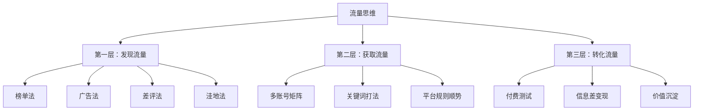
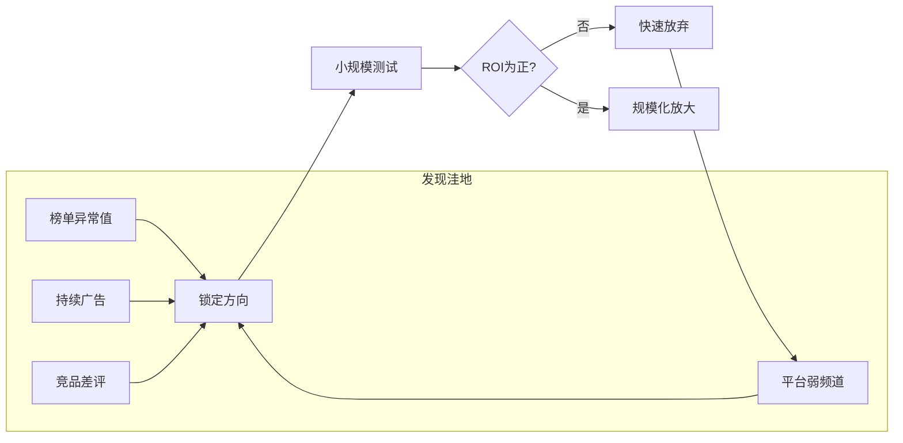
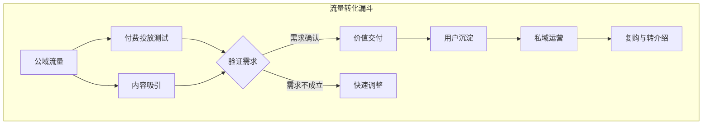

# 第03课：流量获取与变现

## 学习目标

- 理解流量的本质是流动性，掌握流量思维而非追逐具体渠道
- 学会四种发现流量洼地的方法：榜单法、广告法、差评法、洼地法
- 了解主要平台（抖音、视频号、B站、知乎）的当前机遇与打法
- 掌握流量转化的核心逻辑，避免陷入免费流量的陷阱
- 建立可复用的流量获取与变现框架

---

## 一、流量的本质

### 流量是流动的，思维才是永恒的

梁文斌在分享中提出了一个核心观点：**流量总是流动的，拥有流量思维才是永恒的。** 这句话看似简单，却是整个流量获客的底层逻辑。很多人追着某个平台的红利跑，但红利总有消失的一天。蓝海总会变成红海，真正重要的是不断找到蓝海的能力。

> [!QUOTE]
> 流量总是流动的，有流量思维才是永恒的；蓝海总会变红，拥有不断找到蓝海的能力才是永恒的。——梁文斌

吴大白则从另一个角度补充了这个观点：**流量没有产出利润时只是流量**。这句话点醒了很多人——我们常常沉迷于数据的增长，粉丝数、阅读量、播放量，但如果这些数字不能转化为利润，它们就只是数字而已。

> [!WARNING]
> 不要沉迷流量数据本身。流量如果没有转化为利润，就只是虚耗精力的数字游戏。

### 流量思维的三个层次

---

## 二、发现流量洼地

### 1. 榜单法——陈建青

陈建青的经验非常实用：**榜单是发现新机会的绝佳方法。** 无论是 App Store 的榜单、抖音的热榜、还是各类第三方数据平台的排行榜，榜单背后反映的是用户的真实行为趋势。

他的操作方法是：
- 关注各类榜单的**异常值**——突然上升的关键词或产品往往意味着需求爆发
- 追踪异常值的**背后原因**，理解为什么这个需求突然出现
- 将精华帖和关键信息**保存到自己的文档中**，逐步建立个人知识图谱

> [!TIP]
> 罗玲也补充了一个类似的方法：多看 App Store 等榜单新冒头的 app 类型。新 app 的快速增长往往代表一个新的需求品类正在形成。

### 2. 广告法——郭耀天

郭耀天有一个非常犀利的观点：**每一个持续广告背后都藏着一座赚钱宝藏。** 如果有人愿意长期付费投广告，说明这个生意的 ROI（投资回报率）是正的，而且利润足够丰厚。

从这个角度出发，研究竞争对手的广告就是在研究已经被验证过的商业模式。

> [!QUOTE]
> 竞争对手是最好的老师。慢就是快，快就是慢。——郭耀天

### 3. 差评法——梁文斌

梁文斌提出了一种非常接地气的方法：从客户差评中发现真需求。

街头送礼物做调研的方式不靠谱，因为用户在免费场景下给的信息往往不真实。真正的需求藏在三个地方：

1. **生意参谋**——电商平台的后台数据，反映真实搜索行为
2. **搜索关键词猛增**——某个关键词短期内搜索量暴增，意味着需求爆发
3. **客户差评**——竞品评论区里的差评，是未被满足的需求的直接表达

### 4. 流量洼地法——张集慧

张集慧的方法论讲究**轻量化快速迭代**。每个平台都有相对较弱的频道，这些就是流量洼地。比如某个平台的视频频道竞争激烈，但图文频道还有机会；或者某个平台的某个类目竞争小，但相关类目竞争大。

找到这些洼地，用最小的成本快速测试，验证可行后再加大投入。

---

## 三、各平台机遇

### 抖音

**铭则**分享了一个关键的认知：顺势而为，顺应平台规则。抖音在 2018-2019 年搬运内容可行，但到 2021 年这条路就走不通了。平台规则在变，玩法也要跟着变。

**赵鑫**则给出了一个周期性的视角：**红利来的时候野蛮生长拼执行力，红利消失时谁更细致谁更赚钱。** 抖音的红利期确实在收窄，但精细化运营的空间依然巨大。

### 视频号

**铭则**认为视频号是 2021 年出现的新机会，而且这个窗口期还在持续。

**Allen 泽**发现了一个非常实用的裂变方法：**视频号转发朋友圈是新款裂变。** 微信生态的社交关系链是视频号的独特优势，将内容转发到朋友圈，利用朋友间的信任关系完成传播，转化率远高于纯公域流量。

**艾乐**则提出了一个完整的矩阵模型：视频号 + 社群 + 直播 + 电商 + 个人微信 + 小程序，才能发挥最大价值。单一渠道的流量难以持续，但多端联动可以形成闭环。

### B 站

**梁勇**提到：内容视频化是大趋势，人人皆媒介。B 站作为中长视频的代表平台，虽然变现路径比抖音长，但用户粘性和粉丝价值更高。对于需要深度展示的产品或服务，B 站仍然是优质的流量源。

### 知乎

**杨超**明确指出：**知乎是个好的流量源。** 知乎的搜索权重高，一篇高质量的回答可以在百度等搜索引擎中获得长期的免费流量。MVP（最小可行产品）走通后，尽量实现自动化和规模化。

---

## 四、流量转化

### 免费流量最贵

**西撒**提出了一个反直觉的观点：**不要执着免费流量，免费流量投产比最贵。** 这句话的意思是，免费流量虽然不花钱，但需要投入大量的时间和精力，而且不可控。相比之下，付费流量虽然花钱，但可以规模化，投产比往往更高。

他的方法是：**基于需求找产品，快速付费测试。** 先确定用户需求，再找到对应的产品，然后通过付费投放快速验证市场需求。如果测试结果为正，再考虑放大。

> [!WARNING]
> 免费流量的隐性成本——时间、精力、机会成本——往往被严重低估。有时候付费才是最便宜的方式。

### 流量忠于价值

**Aladdin** 的观点与西撒形成互补：大部分流量之术的本质是信息差，真正可持续的流量来自价值。他建议去付费学习如何挖掘信息差，但同时要明白——**流量忠于价值**。

也就是说，你可以用各种技巧获取流量，但如果你的产品和服务没有价值，流量终究会流失。技巧是放大器，价值才是底座。

### 付费投放才是永远的神

**痴海** 对这个话题做了总结性发言：**三流公司做流量，二流做产品，一流做用户；付费投放才是永远的神。**

这句话值得反复品味。一流的公司不是追流量，而是经营用户关系。但与此同时，付费投放是最可控、最可规模化的流量获取方式。

---

## 五、流量思维的核心

### 多账号矩阵

**梁文斌**强调多账号 + 关键词打法无处不在。同一个内容方向，可以建立多个账号同时运营，测试不同的内容风格和变现路径。这不仅是增加曝光量，更是做 A/B 测试，找到最优解。

### SEO 思维

**梁勇**提到 SEO（搜索引擎优化）思维的重要性。无论是知乎、B 站还是微信公众号，搜索流量都是长期且免费的流量来源。在做内容时就要考虑用户会搜索什么关键词，把这些关键词自然地融入内容中。

### 信息差

**吴大白**认为：善于利用信息差产生价值。同一个信息在 A 平台是常识，在 B 平台可能就是稀缺知识。把信息从高密度平台搬运到低密度平台，就是信息差生意。

**罗玲**则提醒：**所有变现模式都可以公式化。** 这意味着你可以把一个成功的流量变现模式拆解成步骤，然后复制到其他品类或平台。

### 其他关键观点

| 人物 | 核心观点 |
|------|---------|
| 王煜 | 看好一个产业入局前先买一部分龙头股票 |
| 高智豪 | 很多人觉得钱难挣是因为圈子太小 |
| 杨涛 | 用计时器记录工作时间，每天超过5小时你会发财 |
| 周森 | 执行力就是一切 |
| 萧遥 | AI写作能力会被释放，低价值内容增加，高质量内容价值大 |
| 森淼 | 一米之内就能找到赚钱机会 |
| 雨亭之东 | 打造优势领域，多看少做海量吸收信息，小规模试错，适当杠杆 |

> [!QUOTE]
> 想到就立马行动跑通 SOP。——吴大白

---

## 六、要点回顾

1. **流量的本质是流动的**，不要追逐具体渠道，要培养流量思维和发现蓝海的能力
2. **发现流量洼地有四种方法**：榜单法看趋势、广告法看验证、差评法看需求、洼地法看缝隙
3. **不同平台有不同机遇**：抖音做精细化、视频号做社交裂变、B站做深度内容、知乎做搜索流量
4. **免费流量不一定便宜**，付费投放是可控、可规模化的流量获取方式
5. **流量忠于价值**，技巧是放大器，价值才是底座
6. **信息差是流量的底层逻辑**，多账号矩阵和 SEO 思维是核心打法
7. **执行力是一切的基础**，想到就去做，跑通 SOP 后再优化

> [!QUESTION]
> 如果你现在要为一个新产品获取第一批1000个用户，你会优先使用哪种流量获取方法？为什么？
>
> 

> 
查看思路提示

>
> 没有一个标准答案，关键是要思考：你的产品是高频还是低频？是高价还是低价？目标用户聚集在哪个平台？建议优先选择目标用户密度最高的平台，用付费投放快速验证，同时用内容积累长期流量。
> 

> [!QUESTION]
> "免费流量最贵"这个观点你认同吗？什么情况下免费流量更划算？
>
> 

> 
查看思路提示

>
> 当你的时间成本极低、且需要大量测试内容方向时，免费流量是合理的起步方式。但一旦验证了商业模式，付费流量的性价比往往更高，因为时间可以花在更有价值的事情上。
> 

> [!QUESTION]
> 如何判断一个流量渠道是否值得长期投入？
>
> 

> 
查看思路提示

>
> 可以从三个维度判断：1）ROI是否为正且稳定；2）是否有规模化空间；3）用户是否能在你的私域中沉淀下来。如果三个答案都是肯定的，就值得长期投入。
> 

## 下一步行动清单

- [ ] 选择一个你最熟悉的平台，用榜单法分析当前的热门品类
- [ ] 找到三个竞争对手，研究他们的广告投放策略
- [ ] 在竞品评论区收集10条真实差评，提炼未被满足的需求
- [ ] 选一个流量洼地，用最低成本进行一周的测试
- [ ] 建立自己的知识图谱文档，持续收集和整理信息
- [ ] 如果还没有付费投放经验，用小预算（100-500元）做一次测试
- [ ] 记录一周的工作时间，看看每天有效工作时间是否超过5小时