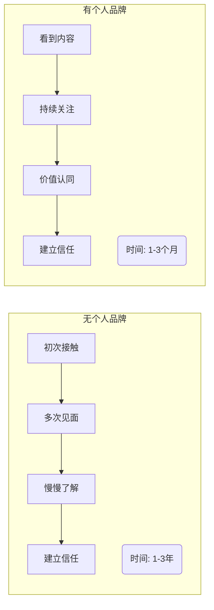
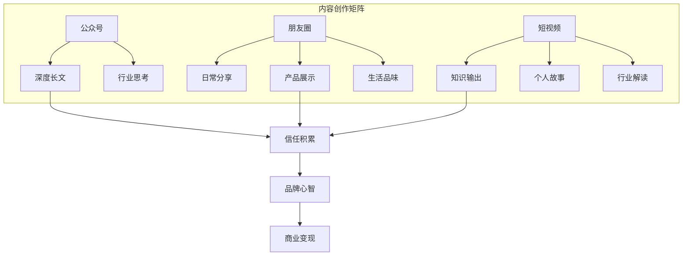
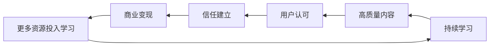

# 第04课：个人品牌与内容创业

## 学习目标

- 理解个人品牌在当今时代的战略价值
- 掌握公众号、朋友圈、短视频三大内容创作起点
- 学会模仿、守破离、高产持续高产三种内容创业方法论
- 建立从内容到信任再到变现的完整路径
- 避开个人品牌打造中的常见误区

---

## 一、为什么每个人都需要个人品牌

### 你就是最好的产品

**沐文**提出了一个根本性的认知转变：**重视个人品牌打造，你就是最好的产品。** 在传统的商业世界里，我们卖的是别人的产品、公司的服务，但在内容创业的时代，你自己就是最独特、最不可替代的产品。

这个观点的核心在于：无论你做什么生意，最终成交的背后都是人与人之间的信任。而个人品牌，就是建立这种信任的最短路径。

> [!QUOTE]
> 分享不止，赚钱不止。——沐文

### 品牌资产是创业者的护城河

**大树**从资产的角度理解品牌：**创业就要做品牌资产。** 品牌不是你注册了一个商标，而是当用户想到某个领域时，第一个想到的是你。这种心智占领就是品牌资产，它会随着时间的推移而增值。

### 三年与三个月

**孙策**给了一个非常有冲击力的对比：**信任了解一个人需要三年，但通过公众号只需三个月。** 在没有个人品牌的场景下，建立信任是一个非常漫长的过程。但当你持续通过内容输出你的专业能力和价值观时，这个信任建立过程可以被大幅压缩。

> [!TIP]
> 公众号是最基础、最值得投入的内容平台。它不仅是内容载体，更是你的数字名片和信任加速器。——孙策

---

## 二、内容创作的起点

### 公众号——孙策

孙策强调一定要写公众号，理由不仅仅是流量，更是信任的建立。公众号的文章是长内容，相比于短视频和朋友圈，长内容天然具备更强的说服力。一篇 2000 字的深度文章，展现的是你的思考深度和行业积累。

**公众号的核心价值：**
- 搜索权重高，内容可以长期被找到
- 粉丝粘性强，打开率虽然下降但质量上升
- 沉淀的是真正对你感兴趣的用户

### 朋友圈——小王子和颖杰

**小王子**的观点直击要害：**坚持不懈在朋友圈打广告。** 很多人在朋友圈发广告觉得不好意思，但如果你提供的产品真的有价值，大大方方地宣传就是利他。他还提出了一个具体标准：**不写到 500 条原创朋友圈不算合格微商。**

> [!WARNING]
> 不要觉得在朋友圈发广告low。如果你对自己的产品都没有信心，用户怎么会有信心？大方报价，大方谈钱。——小王子

**颖杰**则从心态层面给出了建议：**放下偶像包袱经营朋友圈。** 很多人不敢在朋友圈展示自己，怕被人议论、怕显得功利。但换个角度想，朋友圈就是你的个人媒体，你发的内容就是你的品牌广告。

他的另一个重要观点是：**短期看产品，长期看文化。** 发广告卖产品是短期的，但如果你能通过朋友圈传递一种生活方式、一种价值观，那才是长期品牌资产的积累。

### 短视频——周森和旭教练

**周森**认为：**做个人 IP 是这个时代的机会。** 持续输出对他人有价值的内容，主动做那些不舒服但重要的事。做内容初期会很难，会没有反馈，会想放弃，但这些都是成长的一部分。

**旭教练**提出了一个关键问题：**视频号变现要考虑是产品找流量还是流量找产品。** 这两个方向是完全不同的打法：
- **产品找流量**：先有成熟产品，再找需要这个产品的人——适合传统电商思维
- **流量找产品**：先积累粉丝和影响力，再根据粉丝需求开发产品——适合个人品牌思维

---

## 三、内容创业的方法论

### 模仿是最好的捷径

**痴海**和**梁文斌**都强调了模仿的价值：**模仿是最高效的捷径。**

这不是鼓励抄袭，而是说在刚开始做内容的时候，不需要一切从零开始创新。找到行业里做得好的账号，分析他们的选题方向、内容结构、表达方式、互动方式，然后去模仿和学习。

> [!QUOTE]
> 模仿是最高效的捷径。——痴海

模仿的四个步骤：
1. **找对标的账号**——找到比你高一个量级的账号（不要找太高，差距太大没法学）
2. **拆解**——拆解他们的选题、标题、开头、结构、结尾
3. **模仿创作**——用类似的结构，输出自己的内容
4. **迭代优化**——在模仿的基础上加入自己的特色

### 守破离学习法

**旭教练**分享了守破离学习法，这是一个来自日本的学习方法论，适用于内容创业：
- **守**：严格模仿，完全照做，不加入自己的想法
- **破**：在熟练掌握基础后，开始加入自己的理解和创新
- **离**：形成自己的风格，脱离原来的框架，自成一家

大多数人的问题是：在"守"的阶段待的时间不够长，还没学会走就想跑。

### 高产 + 持续高产

**乔里奥**的观点非常直接：**无论任何短视频平台，高产和持续高产就能做起来。**

内容创业没有太多玄学。很多做不起来的人，不是因为方向不对，而是因为产量不够。一周发一条，发了一个月没效果就放弃了。但真正做起来的人，一天发三五条，坚持半年以上。

> [!TIP]
> 如果你的内容质量不错但没流量，先检查一下自己的发布频率。高产是内容创业最基础的门槛。

---

## 四、建立信任的路径

### 取法乎上，得乎中

**范米索**说：**取法乎上，得乎中。** 这句话的意思是，你以最高标准要求自己，最终可能只能达到中等水平。所以从一开始就要以行业最高标准来要求自己的内容质量。

她的另一重要观点是：**把个人当成一家公司来经营。** 个人品牌不是兴趣爱好，而是一个商业实体，需要战略规划、产品设计、市场营销、客户服务。

而所有这一切的背后，**成交离不开信任**。没有信任，再好的营销技巧都没有用。

### 做时间的朋友

**Lissa**强调：**打磨个人 IP，做时间的朋友。** 个人品牌不是一夜之间做出来的，而是通过日复一日的积累逐步建立起来的。

她的具体建议是：**个人 IP 从专业相关入手**。不要试图做一个全能型博主，先从自己最专业、最有积累的领域开始，建立专业认知后，再逐步拓展。

她还提到了一个心态上的建议：**练剑不耽误拜师。** 做自己的内容不影响向更优秀的人学习，一边输出一边输入，形成正向循环。

### 持续输出价值

**沐文**把这件事总结得非常精炼：**分享不止，赚钱不止。** 当你持续分享有价值的内容，你的影响力就在持续扩大，商业机会也会随之而来。这是一个正循环：

> [!QUOTE]
> 做个人IP是这个时代的机会。持续输出对他人有价值的内容，主动做那些不舒服但重要的事。——周森

---

## 五、个人品牌的变现

### 一切影响目标的事，赚钱也不要做

**高智豪**提出了一个非常重要的原则：**想做个人品牌，一切影响目标的事就算赚钱也不要做。**

个人品牌的核心是**定位**。一旦你确定了自己的定位和方向，所有与之冲突的事情，即使是短期能赚钱的，也要拒绝。因为每一次偏离定位的行为，都在稀释你的品牌价值。

> [!WARNING]
> 短期赚钱的诱惑是个人品牌最大的敌人。一次与定位不符的商业合作，可能毁掉你花三个月建立的专业认知。

### 打磨一段 200 字的自我介绍

**白一喵**的建议看似简单实则深刻：**打磨一段 200 字的自我介绍。** 个人品牌的传播起点是你如何介绍自己。一段好的自我介绍应该清晰传达：你是谁、你帮什么人解决什么问题、你有什么独特之处。

他还提到：**持续内观，探索自我。** 个人品牌的核心不是包装，而是真实地认识自己，然后把自己最好的一面展现出来。

### 每月更新自我介绍

**金马**给出了一个非常具体的行动建议：**每月更新自我介绍，包含能提供什么服务和能卖什么产品。**

每个月花 30 分钟更新自我介绍，看似小事，但坚持下来，你会发现自己的服务能力在逐步完善，产品体系在逐步成熟。这个过程本身就是个人品牌进化的记录。

### 其他关键观点

| 人物 | 核心观点 |
|------|---------|
| 夏夏 | 最低成本打造个人 IP 就是成为朋友圈内容输出者；做有复利和深远影响的事 |
| 一生荣禄 | 写作是个人 IP 最好的护城河；研究几个流量产品 |
| 颖杰 | 放下偶像包袱经营朋友圈；短期看产品长期看文化 |
| 芷蓝 | 坚持没有错但要时刻寻找踏板；线上玩法复制到线下 |
| 王家威 | 微信是最有效的 CRM 系统，一定要重视微信运营 |
| 梁勇 | 内容视频化是大趋势；人人皆媒介；00 后存在巨大机会 |

> [!QUESTION]
> 如果你现在要开始做个人品牌，你的第一个内容方向是什么？你的 200 字自我介绍怎么写？
>
> 

> 
查看思路提示

>
> 选择内容方向时，可以从三个维度交叉：你擅长的、你热爱的、市场有需求的。自我介绍则需要包含：你的专业标签、你服务的对象、你能提供的价值、你的独特之处。
> 

> [!QUESTION]
> "一切影响目标的事就算赚钱也不要做"——这个原则在实际中如何应用？如果有一个能赚快钱但与定位不符的合作机会，你会怎么选？
>
> 

> 
查看思路提示

>
> 建议用三个问题来决策：1）这个合作会改变用户对我的认知吗？2）这个改变对长期定位是加分还是减分？3）为了这个短期收益，我需要花多少时间来修复品牌认知？如果答案都是负面的，坚决拒绝。
> 

> [!QUESTION]
> 在刷朋友圈或短视频时，注意观察那些你觉得做得好的个人 IP。他们做对了什么？你可以从他们身上学到什么？
>
> 

> 
查看思路提示

>
> 可以从这几个维度分析：1）定位是否清晰（看他/她的自我介绍）2）内容是否持续（发布频率）3）价值是否明确（读者能获得什么）4）互动是否活跃（评论区回复）5）变现是否自然（广告或产品的植入方式）。
> 

## 要点回顾

1. **个人品牌是数字时代的战略资产**，你能成为别人心中的首选，就拥有了最强的护城河
2. **内容创作的三个起点**：公众号建立深度信任、朋友圈保持日常曝光、短视频放大影响力
3. **内容创业的三步方法论**：模仿起步、守破离进阶、高产持续高产是基本功
4. **信任是个人品牌的核心**，成交的底层逻辑就是信任的积累
5. **定位清晰比什么都重要**，与定位冲突的短期利益要学会拒绝
6. **分享不止，赚钱不止**——输出价值是个人品牌持续增长的原动力

## 下一步行动清单

- [ ] 写一段 200 字的自我介绍，清晰说明你是谁、提供什么价值
- [ ] 确定个人品牌的内容方向（专业 + 热爱 + 市场需求）
- [ ] 找到 3-5 个对标账号，拆解他们的内容策略
- [ ] 选择一个平台（公众号/朋友圈/短视频），制订每周发布计划
- [ ] 完成第一篇内容创作并发布
- [ ] 用守破离框架评估自己当前处于哪个阶段
- [ ] 检查是否有与定位冲突的短期行为，坚决调整
- [ ] 设置每月提醒，更新自我介绍和服务清单