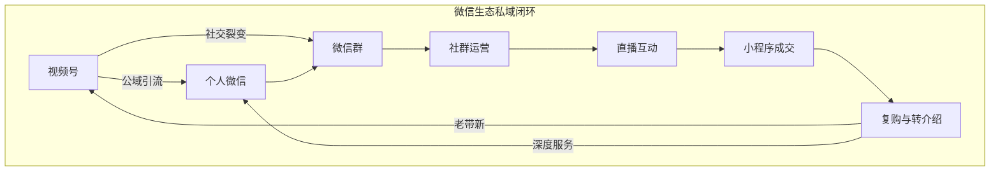
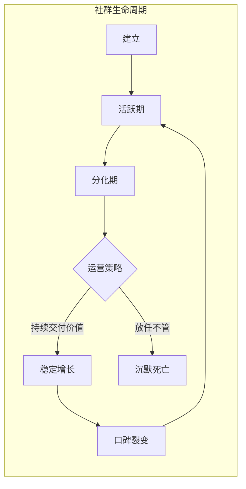

# 第05课：私域运营与社群经济

## 学习目标

- 理解私域运营的战略价值及其与公域流量的本质区别
- 掌握微信生态（朋友圈、个人号、微信群、视频号）的完整运营方法
- 学习社群建设的三大核心要素与长效运营机制
- 理解私域信任的建立路径和长期主义思维
- 掌握微商转型为品牌化运营的正确姿势

---

## 一、私域为什么重要

### 尽早建立私域

**盗坤**的观点非常明确：**尽早建立私域，把平台作为流量导入口。** 为什么私域如此重要？因为平台流量是租赁关系——你今天花钱买流量就有生意，明天不花钱就没有。但私域是你自己的资产，一旦建立，可以反复触达，不需要每次付费。

他的另一个重要建议是：**电商做私域尽量用个人微信。** 企业微信虽然功能更强大，但在建立个人信任方面，个人微信有天然优势。用户更愿意和一个真人交流，而不是一个企业账号。

> [!QUOTE]
> 尽早建立私域，把平台作为流量导入口。——盗坤

### 做社群就是做时间的朋友

**亦仁**的这句话可以看作是私域运营的座右铭：**做社群就是做时间的朋友。** 社群不是一锤子买卖，而是一个长期积累的过程。社群的真正价值不在于短期内有多少人付费加入，而在于长期积累下来的信任关系和社区氛围。

他还提出了一个非常实用的活动原则：**做活动要么交付要么拉新。** 每次活动都要有明确的目的——要么是为了给现有成员提供价值（交付），要么是为了吸引新成员（拉新）。如果一件事两个目的都不满足，就不要做。

> [!TIP]
> 线上聊千遍不如线下见一面。——亦仁

私域与公域的对比：

| 维度 | 公域流量 | 私域流量 |
|------|---------|---------|
| 所有权 | 平台拥有 | 自己拥有 |
| 触达成本 | 每次付费 | 几乎免费 |
| 用户关系 | 一次性 | 长期 |
| 复购率 | 低 | 高 |
| 稳定性 | 受平台规则影响 | 自主可控 |
| 信任深度 | 浅 | 深 |

---

## 二、微信生态运营

### 朋友圈——小王子和颖杰

**小王子**把朋友圈运营提到了战略高度：**不写到 500 条原创朋友圈不算合格微商。** 这个标准听起来很高，但细想很有道理。500 条原创内容意味着你至少持续输出了几个月，这个过程本身就是信任积累的过程。

他的客户关系原则也很值得借鉴：
- **与客户先做朋友再谈产品**——不要一上来就推销，先建立关系
- **不要认为别人不做你的项目就是傻X**——尊重每个人的选择
- **遇到高手请付费学习**——付费是最快的成长方式

**颖杰**同样强调放下偶像包袱：很多人不好意思发朋友圈，怕显得 low。但真正的个人品牌不是端着，而是真实地展示自己。他的朋友圈运营哲学是：**短期看产品，长期看文化。** 初期发产品信息是正常的，但长期来看，你需要传递的是一种生活方式和价值观。

> [!WARNING]
> 朋友圈不是广告牌，是你的个人媒体。如果每条都是硬广，你很快就会被拉黑或屏蔽。好内容 + 适度产品 = 可持续的朋友圈运营。

### 个人号——盗坤

盗坤强调用个人微信做私域的核心原因是：**信任建立需要人格化的载体。** 用户加你的个人微信，看到的是一个真实的人——有生活、有观点、有温度。这种人格化的连接是企业微信无法替代的。

他还提醒了一个很多人忽略的点：**学会拒绝诱惑。** 私域运营中会有各种合作邀约和变现机会，但不是每一个都适合你的用户群体。什么都卖，最终什么都卖不好。

### 微信群——西琳君

**西琳君**对好社群的定义非常清晰：**好的社群核心是成长、链接、坚持。**
- **成长**：群成员能在社群中获得知识、技能或资源的提升
- **链接**：社群能帮助成员之间建立有价值的连接
- **坚持**：社群运营需要持续投入，不能三天打鱼两天晒网

这三个要素缺一不可。很多社群死掉，不是因为收费太高或人数太少，而是因为没有持续提供价值。

### 视频号 + 直播 + 社群矩阵

**艾乐**提出了一个完整的微信生态打法：**视频号 + 社群 + 直播 + 电商 + 个人微信 + 小程序才能发挥价值。**

这些要素不是孤立的，而是相互配合的：
1. **视频号**：获取公域流量和社交裂变
2. **社群**：沉淀核心用户
3. **直播**：实时互动和转化
4. **电商/小程序**：成交载体
5. **个人微信**：日常触达和关系维护

---

## 三、社群建设的核心要素

### 成长、链接、坚持

**西琳君**的三个要素是社群的骨架，我们在这里深入展开：

**关于成长**：社群不是聊天群，而是一个学习型组织。你可以通过以下方式为成员提供成长价值：
- 定期分享行业干货
- 邀请嘉宾做内部分享
- 组织共读、打卡等活动
- 解答成员的具体问题

**关于链接**：社群最大的价值之一是人脉链接。很多社群成员不仅是为了学习，更是为了认识志同道合的人。你可以主动为成员之间牵线搭桥，组织线下见面会，促进深度连接。

**关于坚持**：社群的衰亡往往不是因为运营策略错误，而是因为运营者先放弃了。亦仁说做社群就是做时间的朋友，三年才能看到真正的效果。

> [!QUOTE]
> 做社群就是做时间的朋友。线上聊千遍不如线下见一面。——亦仁

### 交付或拉新

亦仁的活动原则值得反复运用。在做社群活动时，问自己两个问题：
1. 这个活动是否在为现有成员提供价值（交付）？
2. 这个活动是否能吸引新成员（拉新）？

如果两个答案都是否定的，果断取消这个活动。

### 组团的成长速度决定上限

**紫菜**分享了一个有趣的观点：**组团的成长速度决定个人上限。** 你所在的圈子决定了你的信息质量和认知水平。如果圈子里的每个人都在进步，你也会被推着前进。反之，如果你的圈子停滞不前，你很难独自突破。

她还有一个重要的认知：**相信是一种很强的能力。** 很多人习惯性地质疑一切，但真正成长快的人有一个特点——他们愿意相信，愿意尝试，愿意先行动再判断。

> [!TIP]
> 破圈最快的方法——付费进高质量社群。——家永

---

## 四、私域信任的建立

### 信任一旦建立，持续交易就顺其自然

**凡不易**的一句话概括了私域运营的本质：**信任一旦建立，持续交易就是顺其自然。**

私域运营的核心目标不是成交一单，而是建立长期信任。当用户信任你之后，你的推荐对他们来说就是有价值的建议，而不是推销。

### 微信是最有效的 CRM 系统

**王家威**强调：**微信是最有效的 CRM 系统，一定要重视微信运营。**

很多公司花大价钱买 CRM 软件，却忽略了微信这个最强大的客户关系管理工具。微信天然具备标签分组、朋友圈互动、一对一沟通、群聊管理等 CRM 核心功能，而且是免费的。

### 付费是最快的成长方式

**小王子**和**尹基跃**都强调了付费学习的重要性：
- **小王子**：遇到高手请付费学习
- **尹基跃**：做某件事最好有个师傅

付费学习的价值不在于获取知识（很多知识免费也能找到），而在于进入高手的圈子、获得个性化的指导、以及倒逼自己认真对待。

> [!QUOTE]
> 弱国无外交，弱逼无社交。——盛添财

这句话虽然直白，但揭示了一个现实：在私域和社群中，你的价值和能力决定了你能触达到什么样的资源和人脉。

---

## 五、微商的正确姿势

### 500 条原创朋友圈的标准

**小王子**提出的 500 条原创朋友圈标准，表面上是一个数量指标，但背后的逻辑是：**持续输出是建立信任的基础条件。**

很多人做微商失败，不是因为产品不好，而是因为坚持不下去。发了 50 条没出单就放弃了，但出单往往发生在第 200 条、第 300 条之后。

### 长期主义精神

**66** 的观点非常直接：**没有长期主义精神就别想在微商行业呼风唤雨。**

微商（或者说私域电商）不是赚快钱的生意，而是一个需要长期积累的行业。前半年可能看不到什么收入，但如果能坚持三年，你的私域资产会越来越值钱。

### 放下偶像包袱

**颖杰**再次强调放下偶像包袱。很多人做微商最大的障碍不是能力问题，而是心态问题——怕被熟人看到、怕被议论、怕被拉黑。

但换个角度想：**你提供的产品如果真的有价值，不让朋友知道反而是对他们的不负责任。**

> [!WARNING]
> 如果你自己都看不起微商这个身份，别人更不可能看得起。尊重自己的职业，才能赢得客户的尊重。

### 其他关键观点

| 人物 | 核心观点 |
|------|---------|
| 潘多拉的书单 | 以终为始，定下目标拆解它 |
| 旺小哥 | 有两三个比自己有经验的朋友；越分享越成长；花钱找人完成重复性工作 |
| 黑小喵 | 人若无名专心练剑；修炼说真话的勇气和听真话的能力 |
| 晓群 | 选择做一份事业不要今天张三明天李四；专注做好一件事 |
| 芷蓝 | 在喜欢的圈子待久了会困住思维；多关注内部用户成长和裂变；警惕单位时间价值 |
| C | 利他——与牛人产生连接的首要方式；朋友圈晒生活品味和努力 |
| 三笙 | 别痴迷混圈子，后端有承接能力才能变现 |
| 喵一布 | 离开小城市到大城市去 |

> [!QUESTION]
> 你现在有多少微信好友？其中有多少人知道你是做什么的？如果这个比例低于 50%，你打算怎么做？
>
> 

> 
查看思路提示

>
> 可以检查自己的朋友圈标签分组是否完善，是否定期更新朋友圈内容。如果好友不知道你是做什么的，说明你的朋友圈展现不够清晰。建议从今天开始，每天至少发一条与你的专业或产品相关的朋友圈。
> 

> [!QUESTION]
> 如果你要建一个付费社群，你会围绕什么主题？你的社群能为成员提供什么独特价值？
>
> 

> 
查看思路提示

>
> 好的社群主题应该满足三个条件：1）你在这个领域有积累 2）有足够多的人对这个主题感兴趣 3）这个主题能持续产生可分享的内容。独特价值可以是你的专业经验、你的人脉资源、或者你的持续输出能力。
> 

> [!QUESTION]
> 私域运营中，如何平衡"持续触达"和"不打扰"？
>
> 

> 
查看思路提示

>
> 关键在于：触达的频率和内容质量。每天发 10 条纯广告是骚扰，但每天发 1-2 条有价值的内容 + 1 条产品信息，大多数用户是可以接受的。核心原则是：每条内容都在提供价值，而不是消耗用户的好感。
> 

## 要点回顾

1. **私域是数字时代最核心的资产**，尽早建立才能获得长期回报
2. **微信生态是一个完整的商业闭环**——视频号引流、社群沉淀、直播互动、小程序成交、个人号维护
3. **社群成功的三大要素**：成长（提供价值）、链接（建立人脉）、坚持（持续运营）
4. **信任是私域运营的基石**，信任一旦建立，持续成交就是顺其自然
5. **微商不是赚快钱的生意**，没有长期主义精神不可能做好
6. **放下偶像包袱**，你提供的产品有价值就应该大方展示
7. **付费学习是破圈最快的方式**，找到一个好师傅可以少走很多弯路

## 下一步行动清单

- [ ] 检查微信好友标签分组是否完善
- [ ] 制定朋友圈发布计划，每天至少 1 条专业内容 + 1 条生活内容
- [ ] 清理朋友圈中的无效广告，优化个人主页展示
- [ ] 如果还没有私域社群，考虑创建一个 100 人以内的小群开始练习
- [ ] 找到 1-2 个高质量的付费社群加入学习
- [ ] 梳理自己的产品体系，明确能提供什么服务
- [ ] 制定三个月的私域运营计划，设定关键里程碑
- [ ] 每月更新一次自我介绍和服务清单
- [ ] 如果条件允许，组织一次线下见面会