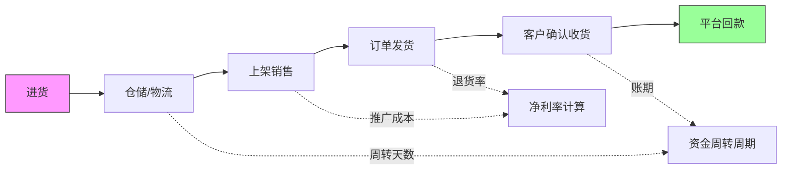
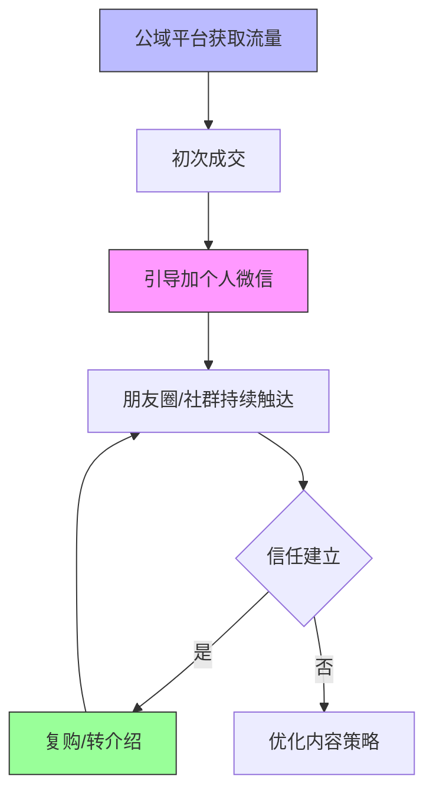
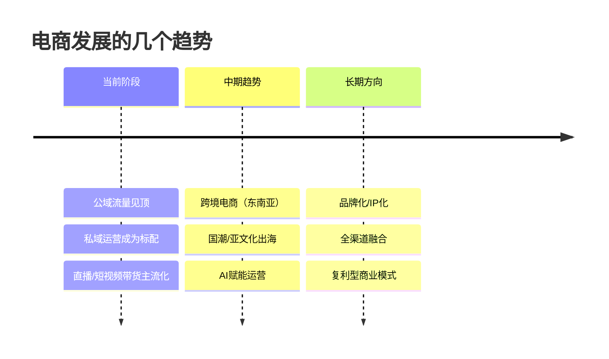

# 第06课：电商与跨境电商实战

## 学习目标

- 理解电商选品与定位的核心策略
- 掌握电商运营的关键环节：算账、私域、平台规则、SOP化
- 了解跨境电商的机遇与落地路径
- 建立正确的电商创业心态

---

## 一、选品与定位

选品决定上限，定位决定方向。在电商领域，选错品类可能让所有努力付诸东流，而清晰的定位则能让你在竞争中脱颖而出。

### 1.1 放弃标品，拥抱差异化

> [!QUOTE]
> 放弃标品；大胆拥抱快钱但占比不要太大；用低成本人海战术。 —— 陈俊强

陈俊强提出一个关键判断：**标品（标准化产品）竞争极度激烈**，价格透明、利润微薄，新手入局几乎没有胜算。他的策略是：

- **放弃标品**：避开与头部大卖的正面竞争
- **拥抱快钱但控制比例**：追逐热点产品可以快速获得现金流，但快钱业务的占比不宜过高，否则容易陷入"永远在追风口"的陷阱
- **低成本人海战术**：用多个小团队、小店铺去试错，跑通一个就放大

### 1.2 算清楚两笔账

> [!QUOTE]
> 赚钱只有靠运气或靠积累两条路；算清楚利润率和资金周转周期。 —— 乔里奥

乔里奥强调电商创业者必须算清两笔账：

1. **利润率**：不仅是毛利率，还要扣除物流、推广、退货、平台佣金等所有隐性成本后的净利率
2. **资金周转周期**：从进货到回款需要多少天？周转越快的生意，同样的资金量能撬动更大的规模



### 1.3 赚快钱还是赚慢钱

> [!QUOTE]
> 赚短期快钱和长期慢钱没有对错；看别人投放广告顺藤摸瓜；小钱看不上就赚不到大钱。 —— 老胡

老胡的观点非常务实：**快钱和慢钱没有对错之分**，关键是你所处的阶段和目标。他还分享了一个非常实用的技巧——**看对手的广告顺藤摸瓜**：通过监测竞争对手投放了什么广告、主推什么产品，可以快速了解市场风向和爆款逻辑。

> [!WARNING]
> "小钱看不上就赚不到大钱"——很多人一开始眼高手低，看不上小利润的产品，结果连第一桶金都没赚到。**先跑通一个小闭环**，哪怕一单只赚10块钱，也比空想月入十万更有价值。

---

## 二、电商运营核心

### 2.1 算账能力是基本功

乔里奥提出的利润率和周转周期计算，是电商运营的基本功。具体来说，你需要建立一个简单的财务模型：

```
单品净利 = 售价 - 进货成本 - 物流费 - 推广费 - 平台佣金 - 退货损耗
资金周转次数 = 365天 ÷ 从进货到回款的天数
年化收益率 = 单品净利 × 销量 × 周转次数 ÷ 本金
```

### 2.2 私域沉淀：从流量到留量

> [!QUOTE]
> 尽早建立私域；使用个人微信打造真人IP；学会拒绝诱惑。 —— 盗坤

盗坤强调**私域是电商的护城河**。在公域流量越来越贵的今天，把客户沉淀到私域（个人微信）是降低成本、提高复购的关键。

他的方法：
- **个人微信打造真人IP**：不是冷冰冰的客服号，而是一个有温度、有专业度的真人形象
- **学会拒绝诱惑**：私域不是用来发广告轰炸的，过度营销反而会让客户流失



### 2.3 尊重平台规则

> [!QUOTE]
> 靠平台吃饭就多尊重平台规则。 —— 家蒙
>
> 顺势而为不要与平台规则做斗争；视频号是2021新机会。 —— 铭则

家蒙和铭则的观点高度一致：**平台是生态规则的制定者，对抗规则无异于以卵击石**。与其研究如何钻空子，不如研究平台鼓励什么、扶持什么，顺势而为。

铭则特别提到要关注新平台的早期红利——他以视频号为例，每个新平台在崛起期都会有一波流量红利，抓住这波机会可以事半功倍。

### 2.4 SOP化：把成功复制放大

> [!QUOTE]
> 善于利用信息差；想到就立马行动跑通第一个SOP；生意不分大小。 —— 吴大白

吴大白的方法论非常实用：

1. **利用信息差**：你知道别人不知道的，这就是利润来源
2. **立即行动**：不要等完美的方案，先跑通第一个SOP（标准操作流程）
3. **生意不分大小**：不要看不起小生意，能持续盈利的小生意胜过昙花一现的大项目

> [!TIP]
> SOP化的核心是：**把赚钱的过程变成可复制、可培训、可放大的标准化流程**。一旦跑通一个SOP，就等于拥有了一个自动运转的印钞机。

---

## 三、跨境电商机遇

### 3.1 RCEP时代的国际贸易机会

> [!QUOTE]
> RCEP标志国际化贸易机会；跨境电商、国际微商是普通人可落地的；东南亚电商生态还在初期。 —— 天堂地狱

天堂地狱指出RCEP（区域全面经济伙伴关系协定）为普通人打开了国际贸易的大门。特别值得关注的是：

- **东南亚电商生态尚在初期**：类似于5-10年前的中国电商市场，基础设施在快速完善，竞争格局尚未定型
- **国际微商**：利用微信等社交工具做跨境生意，门槛低、可操作性强

### 3.2 跨境商业的深化方向

> [!QUOTE]
> 跨境商业会继续深入不只是卖货；亚文化消费浪潮和国潮是热点。 —— 萧遥

萧遥认为跨境电商的下一波机会**不只是卖货**，而是更深层次的文化输出和品牌建设。亚文化消费（如汉服、二次元周边、国潮文创）在海外有巨大的市场空间。

### 3.3 沉淀与深耕

> [!QUOTE]
> 与其到处赚小钱不如沉淀在一条路上赚大的；混圈子基于价值交换；以利他之心待人。 —— Lissa

Lissa的观点补充了一个重要层面：跨境电商不是短线投机，**选择一条赛道深耕**往往比到处撒网更有效。同时，跨境贸易涉及多方协作，**利他思维**（让上下游都能赚钱）是维持长期合作关系的基础。

---

## 四、电商创业心态

### 4.1 手段与目的

> [!QUOTE]
> 做事前确定好目的；不要混淆手段和目的；模仿有钱人赚钱的思路而不是消费行为。 —— 阿发Alpha

阿发Alpha的提醒非常深刻：很多人做电商，**把"开店"本身当成了目的**，而忽略了赚钱才是目的。如果你开了一个店但一直在亏钱，那不如关掉换一种方式。同时，他建议**模仿有钱人赚钱的思路，而不是他们的消费行为**——看成功者怎么选品、怎么算账、怎么运营，而不是看他们买了什么包、开了什么车。

### 4.2 跨越愚昧之巅

> [!QUOTE]
> 对人性没有洞察时不用太焦虑；红利期赚到钱不要自满因为可能站在愚昧之巅；追逐复利一劳永逸。 —— 云帆

云帆提到的"愚昧之巅"是每个电商人都可能踩的坑——**在红利期赚到钱，误以为是自己能力强**，于是盲目扩张、增加成本，等到红利消退才发现自己在裸泳。保持谦逊、持续学习、追求可复利的积累，才是长久之计。

### 4.3 利他背后是反哺

> [!QUOTE]
> 万物皆有CPS；多看看行业头部玩家在做什么；利他主义后面对应的是反哺之私。 —— 三笙

三笙点出了一个商业本质：**利他最终是为了利己**。电商领域中，你帮达人带货（CPS模式）、帮工厂清库存、帮客户解决问题，表面上是利他，但最终都会以佣金、口碑、复购等形式反哺回你自己。

---

## 五、电商的未来方向



基于各位专家的观点，我们可以梳理出电商的未来方向：

1. **私域化**：从公域流量转向私域沉淀，建立自己的客户资产
2. **品牌化**：从卖货思维转向品牌思维，建立长期品牌价值
3. **跨境化**：利用RCEP等政策红利，拓展海外市场，尤其是东南亚
4. **内容化**：短视频、直播等内容形式将成为电商的标配能力
5. **智能化**：利用AI工具优化选品、投放、客服等环节

---

## 六、要点回顾与行动清单

### 要点回顾

| 主题 | 核心观点 | 提出者 |
|------|---------|--------|
| 选品定位 | 放弃标品，拥抱差异化 | 陈俊强 |
| 财务算账 | 算利润率和周转周期 | 乔里奥 |
| 快钱慢钱 | 看不上小钱就赚不到大钱 | 老胡 |
| 私域沉淀 | 用个人微信打造真人IP | 盗坤 |
| 平台规则 | 顺势而为，尊重规则 | 家蒙、铭则 |
| SOP化 | 跑通第一个标准流程 | 吴大白 |
| 跨境电商 | RCEP带来普通人机会 | 天堂地狱 |
| 心态 | 不要混淆手段和目的 | 阿发Alpha |

### 行动清单

> [!QUESTION]
> **自测问题 1**：如果你现在要做电商，你会选择标品还是非标品？为什么陈俊强建议放弃标品？
>
> <details>
> <summary>点击查看答案</summary>
> 陈俊强建议放弃标品是因为标品价格透明、竞争极度激烈，新手入局很难盈利。而非标品（如创意产品、细分品类、定制化产品）有更大的利润空间和差异化机会。
> </details>

> [!QUESTION]
> **自测问题 2**：乔里奥说电商要算清两笔账，是哪两笔？为什么资金周转周期这么重要？
>
> <details>
> <summary>点击查看答案</summary>
> 两笔账是：**利润率**和**资金周转周期**。资金周转周期决定了同样的本金在一年内能周转多少次——周转越快，年化收益率越高。举例：同样10万元本金，一个月周转一次和三个月周转一次，年化收益可以相差3倍。
> </details>

> [!QUESTION]
> **自测问题 3**：盗坤说的"建立私域"具体是什么意思？为什么不能只靠公域平台？
>
> <details>
> <summary>点击查看答案</summary>
> 私域是指将客户沉淀到个人微信、社群等自己可控的渠道。公域平台的流量越来越贵，且规则多变、流量分配权在平台手中。私域可以让你直接触达客户，降低获客成本，提高复购率。盗坤建议用个人微信打造真人IP，让客户信任"这个人"而不是"这家店"。
> </details>

### 下一步行动清单

1. **选品调研**：列出3个你感兴趣的细分品类，分析其竞争程度和利润空间
2. **算一笔账**：针对你选定的品类，计算毛利率、净利率和资金周转周期
3. **建立私域**：注册一个专用的微信号，开始积累第一批种子用户
4. **关注跨境**：研究RCEP相关政策和东南亚电商平台（Shopee、Lazada）
5. **跑通SOP**：用最小成本跑通一单完整的交易流程，记录下来形成SOP文档